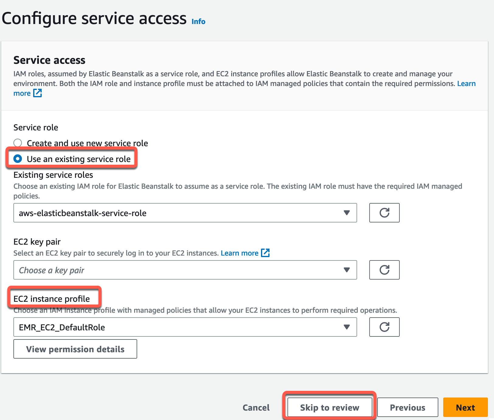
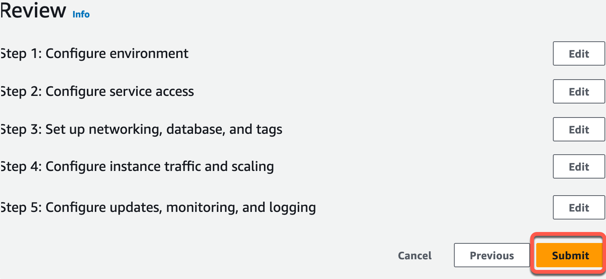
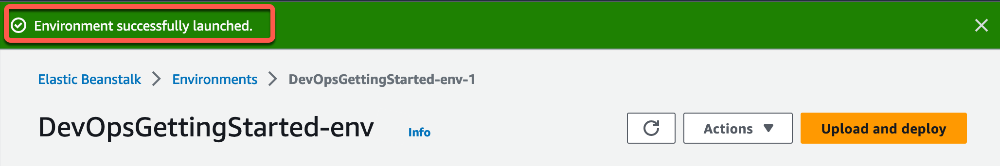
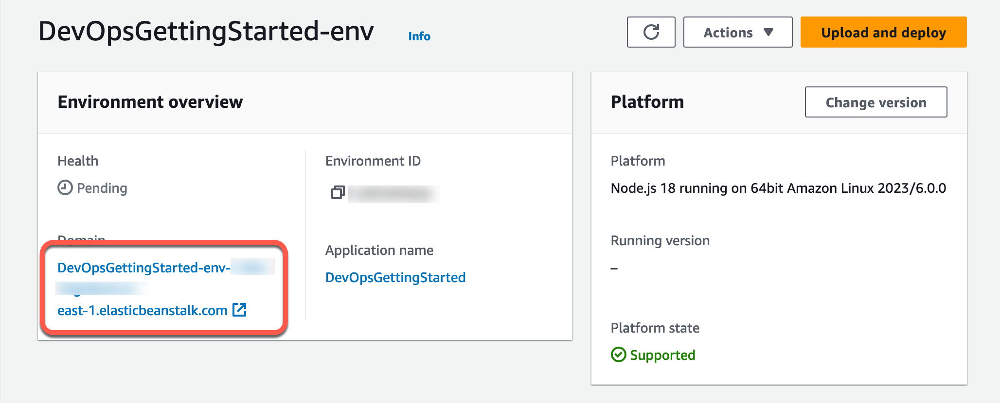

# Module 2: Deploy Web App

|                      |                                                                                |
| -------------------- | ------------------------------------------------------------------------------ |
| **Time to complete** | 10 minutes                                                                     |
| **Services used**    | [AWS Elastic Beanstalk](https://elasticbeanstalk/ "https://elasticbeanstalk/") |

## Overview

In this module, you will use the AWS Elastic Beanstalk console to
create and deploy a web application.
[AWS Elastic Beanstalk](https://aws.amazon.com/elasticbeanstalk/ "https://aws.amazon.com/elasticbeanstalk/") is a compute service that makes it easy
to deploy and manage applications on AWS without having to worry
about the infrastructure that runs them. You will use the
**Create web app** wizard to create
an application and launch an environment with the AWS resources
needed to run your application. In subsequent modules, you will be
using this environment and your continuous delivery pipeline to
deploy the Hello World! web app created in Module 1.

## What you will accomplish

In this module, you will:

- Configure and create an AWS Elastic Beanstalk environment
- Deploy a sample web app to AWS Elastic Beanstalk
- Test the sample web app

## Key concepts

**AWS Elastic Beanstalk—**A service that makes it easy to deploy your
application on AWS. You simply upload your code and Elastic Beanstalk deploys, manages, and scales your
application.

**Environment—**Collection of resources provisioned by Elastic Beanstalk
that are used to run your application.

**EC2 instance—**Virtual server in the cloud. Elastic Beanstalk will
provision one or more Amazon EC2 instances when creating an environment.

**Web server—**Software that uses the HTTP protocol to serve
content over the Internet. It is used to store, process, and deliver web pages.

**Platform—**Combination of operating system, programming
language runtime, web server, application server, and Elastic Beanstalk components. Your application runs
using the components provided by a platform.

## Implementation

1. Configure the app

In a new browser tab, open the [AWS Elastic Beanstalk console](https://console.aws.amazon.com/elasticbeanstalk/home#/welcome "https://console.aws.amazon.com/elasticbeanstalk/home#/welcome").

Choose **Create Application**.

Choose **Web server environment** under the Configure
environment heading.

In the text box under the heading Application name, enter **DevOpsGettingStarted\*\***.\*\*

In the **Platform** dropdown menu, under the Platform
heading, select **Node.js** . **Platform branch** and **Platform version**
will automatically populate with default selections.

Confirm that the radio button next to **Sample
application** under the Application code headingis selected.

Confirm that the radio button next to **Single instance (free
tier eligible)** under the Presets heading is selected.

Select **Next.**

 2. Configure service access

On the Configure service access screen, choose **Use an
existing service role** for Service Role.

For **EC2 instance profile** dropdown list, the
values displayed in this dropdown list may vary, depending on whether you account has
previously created a new environment.

Choose one of the following, based on the values displayed in your list.

    * If **aws-elasticbeanstalk-ec2-role** displays in
     the dropdown list, select it from the EC2 instance profile dropdown list.
    * If another value displays in the list, and it’s the **default EC2 instance profile** intended for your environments, select
     it from the EC2 instance profile dropdown list.
    * If the EC2 instance profile dropdown list doesn't list any values to choose
     from, expand the procedure that follows, **Create IAM Role
     for EC2 instance profile**.

    	+ Complete the steps in [Create IAM Role for EC2 instance profile](../../../codedeploy/latest/userguide/getting-started-create-iam-instance-profile.md "../../../codedeploy/latest/userguide/getting-started-create-iam-instance-profile.md") to create an IAM Role
    	 that you can subsequently select for the EC2 instance profile. Then, return
    	 back to this step.
    	+ Now that you've created an IAM Role, and refreshed the list, it displays
    	 as a choice in the dropdown list. Select the **IAM
    	 Role** you just created from the EC2 instance profile dropdown
    	 list.

Choose **Skip to Review** on the Configure service
access page.

This will select the default values for this step and skip the optional steps.

 3. Create the app

The Review page displays a summary of all your choices.

Choose **Submit** at the bottom of the page to
initialize the creation of your new environment.

 4. Verify successful creation

While waiting for deployment, you should see:

    * A screen that will display status messages for your environment.
    * After a few minutes have passed, you will see a green banner with a checkmark
     at the top of the environment screen.

Once you see the banner, you have successfully created an AWS Elastic Beanstalk application
and deployed it to an environment.

1. Select your app

To test your sample web app, select the link under the name of your environment.

 2. View the webpage

Once the test has completed, a new browser tab should open with a webpage
congratulating you!

#### Application architecture

Now that we are done with this module, our architecture will look like this:

We have created an AWS Elastic Beanstalk environment and sample application. We will be using
this environment and our continuous delivery pipeline to deploy the Hello World! web app
we created in the previous module.

