# Create and Connect to a Microsoft SQL Server Database with

Amazon RDS

|                      |                                                                                                                                                                                                          |
| -------------------- | -------------------------------------------------------------------------------------------------------------------------------------------------------------------------------------------------------- | -------------------------------------------------------------------------------------------------------------------------------------------------------------------------------------------------------------------------------------------------------------------------------------------------------------------------------------------------------------------------------------------------------------------------------------------------------------------------------------------------------------------------------------------------------------------------------------------------------------------------------------------------------------------------------------------------------------------------------------------------------------------------------------------------------------------------------------------------------------------------------------------------------------------------------------------------------------------------------------------------------------------------------------------------------------------------------------------------------------------------------------------------------------------------------------------------------------------------------------------------------------------------------------------------------------------------------------------------------------------------------------------------------------------------------------------------------------------------------------------------------------------------------------------------------------------------------------------------------------------------------------------------------------------------------------------------------------------------------------------------------------------------------------------------------------------------------------------------------------------------------------------------------------------------------------------------------------------------------------------------------------------------------------------------------------------------------------------------------------------------------------------------------------------------------------------------------------------------------------------------------------------------------------------------------------------------------------------------------------------------------------------------------------------------------------------------------------------------------------------------------------------------------------------------------------------------------------------------------------------------------------------------------------------------------------------------------------------------------------------------------------------------------------------------------------------------------------------------------------------------------------------------------------------------------------------------------------------------------------------------------------------------------------------------------------------------------------------------------------------------------------------------------------------------------------------------------------------------------------------------------------------------------------------------------------------------------------------------------------------------------------------------------------------------------------------------------------------------------------------------------------------------------------------------------------------------------------------------------------------------------------------------------------------------------------------------------------------------------------------------------------------------------------------------------------------------------------------------------------------------------------------------------------------------------------------------------------------------------------------------------------------------------------------------------------------------------------------------------------------------------------------------------------------------------------------------------------------------------------------------------------------------------------------------------------------------------------------------------------------------------------------------------------------------------------------------------------------------------------------------------------------------------------------------------------------------------------------------------------------------------------------------------------------------------------------------------------------------------------------------------------------------------------------------------------------------------------------------------------------------------------------------------------------------------------------------------------------------------------------------------------------------------------------------------------------------------------------------------------------------------------------------------------------------------------------------------------------------------------------------------------------------------------------------------------------------------------------------------------------------------------------------------------------------------------------------------------------------------------------------------------------------------------------------------------------------------------------------------------------------------------------------------------------------------------------------------------------------------------------------------------------------------------------------------------------------------------------------------------------------------------------------------------------------------------------------------------------------------------------------------------------------------------------------------------------------------------------------------------------------------------------------------------------------------------------------------------------------------------------------------------------------------------------------------------------------------------------------------------------------------------------------------------------------------------------------------------------------------------------------------------------------------------------------------------------------------------------------------------------------------------------------------------------------------------------------------------------------------------------------------------------------------------------------------------------------------------------------------------------------------------------------------------------------------------------------------------------------------------------------------------------------------------------------------------------------------------------------------------------------------------------------------------------------------------------------------------------------------------------------------------------------------------------------------------------------------------------------------------------------------------------------------------------------------------------------------------------------------------------------------------------------------------------------------------------------------------------------------------------------------------------------------------------------------------------------------------------------------------------------------------------------------------------------------------------------------------------------------------------------------------------------------------------------------------------------------------------------------------------------------------------------------------------------------------------------------------------------------------------------------------------------------------------------------------------------------------------------------------------------------------------------------------------------------------------------------------------------------------------------------------------------------------------------------------------------------------------------------------------------------------------------------------------------------------------------------------------------------------------------------------------------------------------------------------------------------------------------------------------------------------------------------------------------------------------------------------------------------------------------------------------------------------------------------------------------------------------------------------------------------------------------------------------------------------------------------------------------------------------------------------------------------------------------------------------------------------------------------------------------------------------------------------------------------------------------------------------------------------------------------------------------------------------------------------------------------------------------------------------------------------------------------------------------------------------------------------------------------------------------------------------------------------------------------------------------------------------------------------------------------------------------------------------------------------------------------------------------------------------------------------------------------------------------------------------------------------------------------------------------------------------------------------------------------------------------------------------------------------------------------------------------------------------------------------------------------------------------------------------------------------------------------------------------------------------------------------------------------------------------------------------------------------------------------------------------------------------------------------------------------------------------------------------------------------------------------------------------------------------------------------------------------------------------------------------------------------------------------------------------------------------------------------------------------------------------------------------------------------------------------------------------------------------------------------------------------------------------------------------------------------------------------------------------------------------------------------------------------------------------------------------------------------------------------------------------------------------------------------------------------------------------------------------------------------------------------------------------------------------------------------------------------------------------------------------------------------------------------------------------------------------------------------------------------------------------------------------------------------------------------------------------------------------------------------------------------------------------------------------------------------------------------------------------------------------------------------------------------------------------------------------------------------------------------------------------------------------------------------------------------------------------------------------------------------------------------------------------------------------------------------------------------------------------------------------------------------------------------------------------------------------------------------------------------------------------------------------------------------------------------------------------------------------------------------------------------------------------------------------------------------------------------------------------------------------------------------------------------------------------------------------------------------------------------------------------------------------------------------------------------------------------------------------------------------------------------------------------------------------------------------------------------------------------------------------------------------------------------------------------------------------------------------------------------------------------------------------------------------------------------------------------------------------------------------------------------------------------------------------------------------------------------------------------------------------------------------------------------------------------------------------------------------------------------------------------------------------------------------------------------------------------------------------------------------------------------------------------------------------------------------------------------------------------------------------------------------------------------------------------------------------------------------------------------------------------------------------------------------------------------------------------------------------------------------------------------------- |
| **AWS experience**   | Beginner                                                                                                                                                                                                 |
| **Time to complete** | 25 minutes                                                                                                                                                                                               |
| **Cost to complete** | $0.005 per hour\* \*You will only incur charges if you select In-use Public IPv4 Address.                                                                                                                |
| **Requires**         |  • AWS account NoteAccounts created within the past 24 hours might not yet have access to the services required for this tutorial.  • Recommended browser: The latest version of Chrome or Firefox |
| **Last updated**     | November 17, 2022                                                                                                                                                                                        | ## Overview In this tutorial, you will learn how to create a Microsoft SQL Server database instance, connect to the database, and delete the DB instance. We will do this using [Amazon Relational Database Service (Amazon RDS)](https://aws.amazon.com/rds/sqlserver/ "https://aws.amazon.com/rds/sqlserver/"). ## What you will accomplish In this tutorial, you will:  • Create a Microsoft SQL Server database instance  • Connect to the database  • Delete the database instance ## Prerequisites Before starting this tutorial, you will need:  • **An AWS account:** If you don't already have an account, follow the [Setting Up Your AWS Environment](../setup-environment.md "../setup-environment.md") tutorial for a quick overview. ## Implementation In this step, we will use Amazon RDS to create a Microsoft SQL Server DB instance with db.t3.small DB instance class, 20 GB of storage, and automated backups enabled with a retention period of one day. 1. Open the Amazon RDS console Open the [AWS Management Console](https://console.aws.amazon.com/console/ "https://console.aws.amazon.com/console/") in a new browser window, so you can keep this step-by-step guide open. In the console, enter **RDS** in the search bar and select **RDS** from the search results. 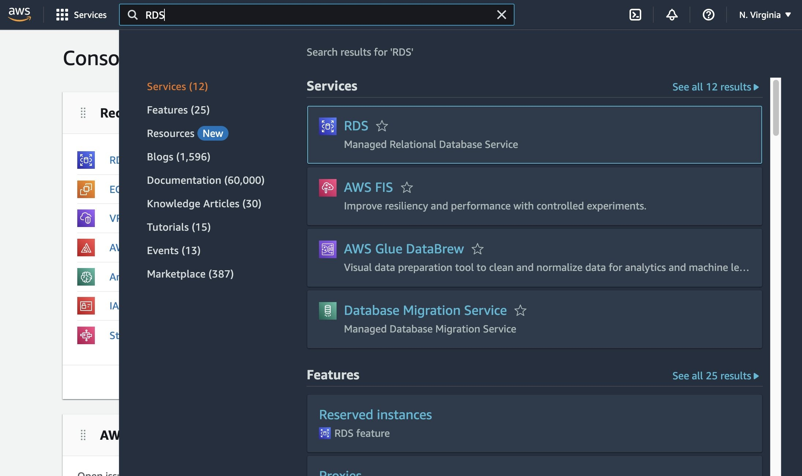 2. Choose a Region In the top right corner of the Amazon RDS console, select the Region in which you want to create the DB instance. ###### Note AWS Cloud resources are housed in highly available data center facilities in different areas of the world. Each Region contains multiple distinct locations called Availability Zones. You have the ability to choose which Region to host your Amazon RDS activity in. 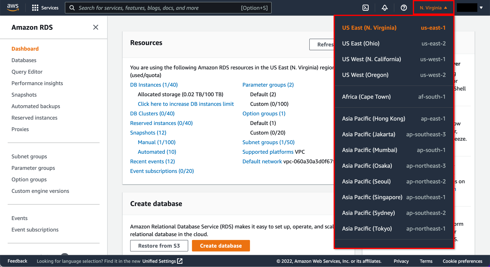 3. Create a database In the **Create database** section, choose **Create database**. 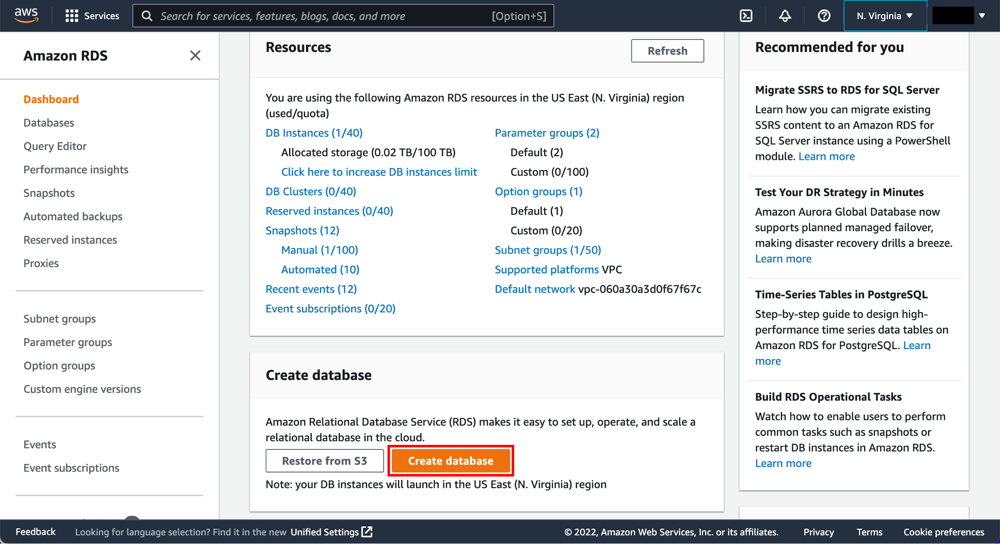 4. Choose engine options You now have options to select your engine. For this tutorial, choose the Microsoft SQL Server icon. In the Edition section, select SQL Server Express Edition. Leave the default values for License and Version. 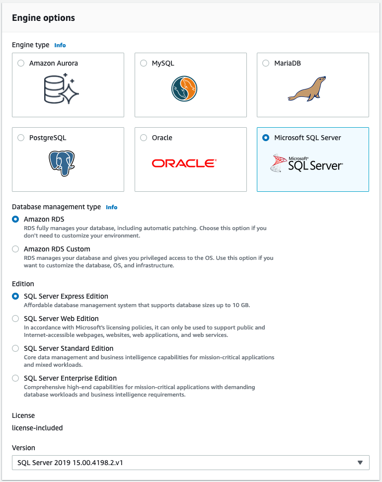 5. Configure basic settings You will now configure your DB instance. Enter the configuration settings listed below: **Settings:**  • **DB instance identifier:** Enter a name for the DB instance that is unique for your account in the Region that you selected. For this tutorial, enter \***\*myrdstest\*\***.  • **Master username:** Enter a username that you will use to log in to your DB instance. We will use **masterUsername** in this example.  • **Master password:** Enter a password that contains from 8 to 41 printable ASCII characters (excluding /,", and @) for your master user password.  • **Confirm password:** Re-enter your password. 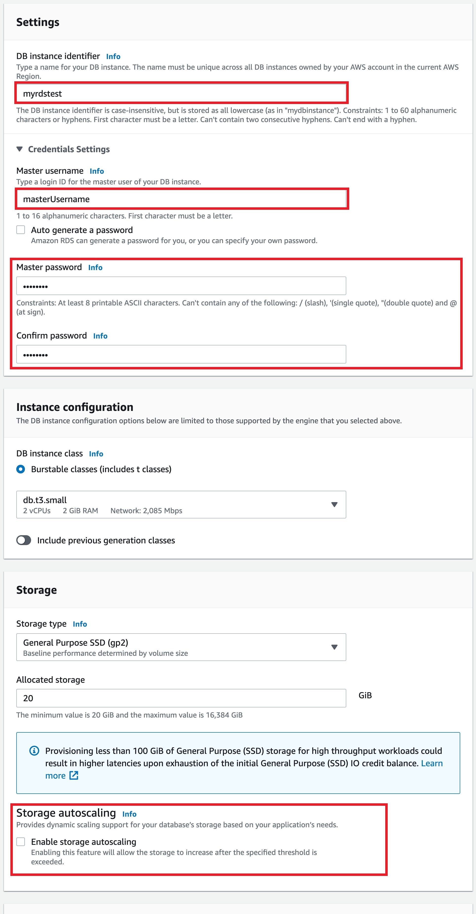 6. Configure instance specifications Now configure your instance specifications. **Instance specifications:**  • **DB instance class:** Select the default, **db.t3.small — 2 vCPUs, 2 GiB RAM**. This equates to 2 GB memory and 2 vCPUs. To see a list of supported instance classes, see [Amazon RDS Pricing](https://aws.amazon.com/rds/sqlserver/pricing/?pg=pr&loc=6 "https://aws.amazon.com/rds/sqlserver/pricing/?pg=pr&loc=6").  • **Storage type:** Select **General Purpose SSD (gp2)**. For more information about storage, see [Storage for Amazon RDS](../../../AmazonRDS/latest/UserGuide/CHAP_Storage.md "../../../AmazonRDS/latest/UserGuide/CHAP_Storage.md").  • **Allocated storage:** Select the default of 20 to allocate 20 GB of storage for your database. You can scale up to a maximum of 16 TB with Amazon RDS for SQL Server.  • **Option group:** Leave the default value. Amazon RDS uses option groups to enable and configure additional features. For more information, see [Working with Option Groups](../../../AmazonRDS/latest/UserGuide/Appendix.SQLServer.md "../../../AmazonRDS/latest/UserGuide/Appendix.SQLServer.md").  • **Enable storage autoscaling:** If your workload is cyclical or unpredictable, you would enable storage autoscaling to enable Amazon RDS to automatically scale up your storage when needed. This option does not apply to this tutorial. 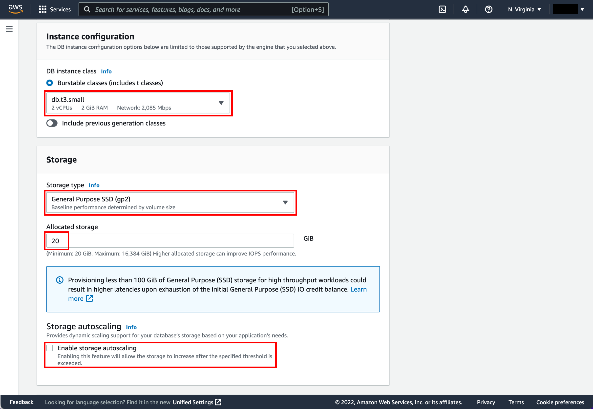 7. Configure network settings You are now on the **Connectivity** section, where you can provide information that Amazon RDS needs to launch the Microsoft SQL Server DB instance. See the following list for the example settings for your DB instance. **Connectivity**  • **Network type:** Keep the default **IPv4**.  • **Virtual Private Cloud (VPC):** Select **Default VPC**. For more information about VPC, see [Amazon RDS and Amazon Virtual Private Cloud (VPC)](../../../AmazonRDS/latest/UserGuide/Overview.md "../../../AmazonRDS/latest/UserGuide/Overview.md"). **Additional connectivity configurations**  • **Subnet group:** Choose the **default** subnet group. For more information about subnet groups, see [Working with DB Subnet Groups](../../../AmazonRDS/latest/UserGuide/USER_VPC.md#USER_VPC.Subnets "../../../AmazonRDS/latest/UserGuide/USER_VPC.md#USER_VPC.Subnets").  • **Public access:** Choose **Yes**. This will allocate an IP address for your database instance so that you can directly connect to the database from your own device. ###### Note You will incur charges of $0.005 per hour.  • **VPC security groups:** Select **Create new VPC security group**. This will create a security group that will allow connection from the IP address of the device that you are currently using to the database created.  • **New VPC security group name:** For this tutorial, enter **myrdstest**.  • **Availability zone:** Choose \***\*No preference\*\***. See [Regions and Availability Zones](../../../AmazonRDS/latest/UserGuide/Concepts.md "../../../AmazonRDS/latest/UserGuide/Concepts.md") for more details.  • **Port:** Leave the default value of 1433. **Microsoft SQL Server Windows Authentication**  • **Directory:** Leave this option disabled. 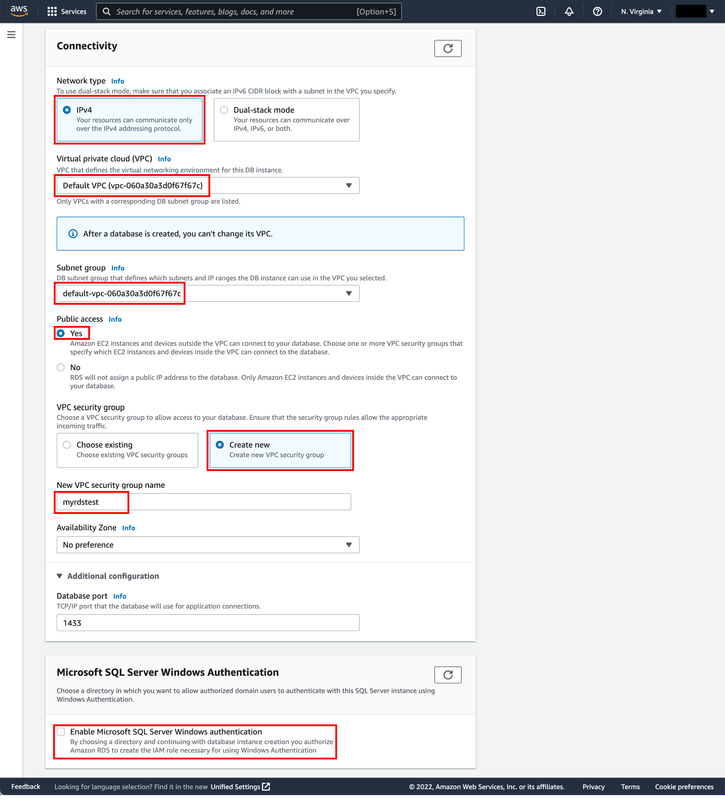 8. Configure additional options In the **Additional configurations** section: **Database options**  • **DB parameter group:** Leave the **default value**. For more information, see [Working with DB Parameter Groups](../../../AmazonRDS/latest/UserGuide/USER_WorkingWithParamGroups.md "../../../AmazonRDS/latest/UserGuide/USER_WorkingWithParamGroups.md").  • **Option group:** Leave the **default value**. Amazon RDS uses option groups to enable and configure additional features. For more information, see [Working with Option Groups](../../../AmazonRDS/latest/UserGuide/USER_WorkingWithOptionGroups.md "../../../AmazonRDS/latest/UserGuide/USER_WorkingWithOptionGroups.md"). **Backup**  • **Backup retention period:** You can choose the number of days to retain the backup you take. For this tutorial, set this value to **1 day**.  • **Backup window:** Use the default of **No preference**. **Performance Insights** For this tutorial, do not select **Turn on performance insights**. When this option is enabled, you will receive advanced database performance-monitoring features that make it easy to diagnose and solve performance challenges on Amazon RDS databases. **Monitoring**  • **Enhanced monitoring:** Use the default of **Enable Enhanced monitoring**. Enabling Enhanced monitoring will give you metrics in real time for the operating system (OS) that your DB instance runs on. For more information, see [Viewing DB Instance Metrics](../../../AmazonRDS/latest/UserGuide/CHAP_Monitoring.md#USER_Monitoring "../../../AmazonRDS/latest/UserGuide/CHAP_Monitoring.md#USER_Monitoring"). **Maintenance**  • **Auto minor version upgrade:** Select **Enable auto minor version upgrade** to receive automatic updates when they become available.  • **Maintenance window:** Select **No preference**. **Deletion protection** Do not select **Enable deletion protection** for this tutorial. When this option is enabled, you're prevented from accidentally deleting the database. 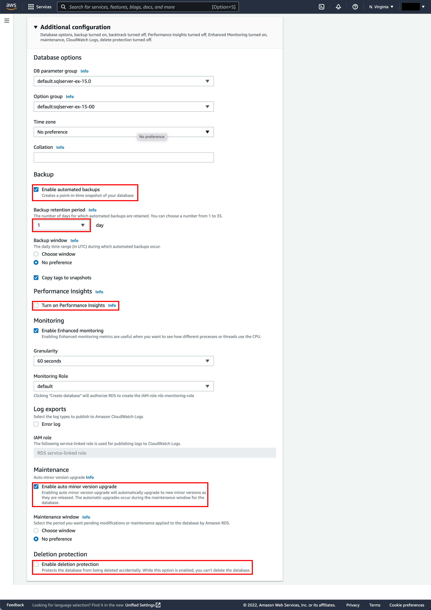 9. Review costs At the bottom of the creation wizard, AWS will show you estimated monthly costs for your Amazon RDS database. If you are still eligible for the [Amazon RDS Free Tier](https://aws.amazon.com/rds/free/ "https://aws.amazon.com/rds/free/"), you will see a note that the database will be free to you for up to 12 months. Choose the **Create database** button to create your database. 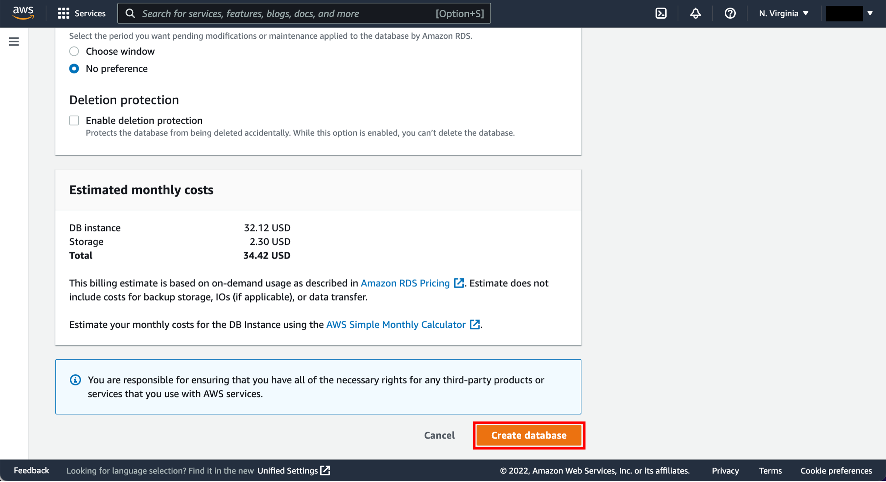 10. Monitor database creation Your DB Instance is now being created. Choose **View Your DB Instances**. ###### Note Depending on the DB instance class and storage allocated, it could take several minutes for the new DB instance to become available. The new DB instance appears in the list of DB instances on the Amazon RDS console. The DB instance will have a status of creating until the DB instance is created and ready for use. When the state changes to available, you can connect to a database on the DB instance. Feel free to move on to the next step as you wait for the DB instance to become available. 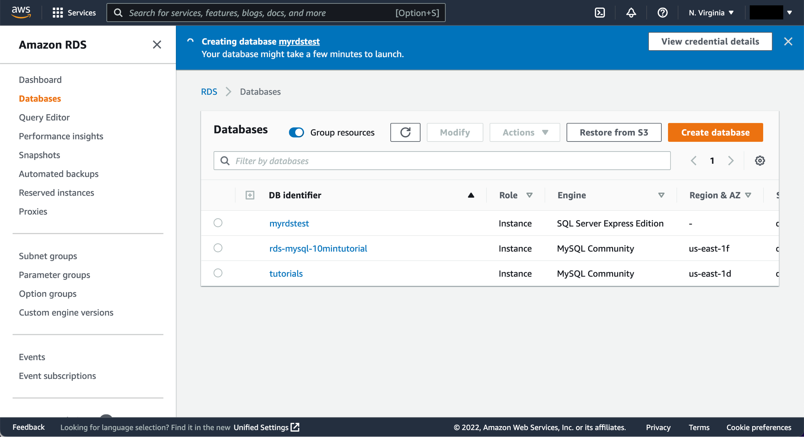 Once the database instance creation is complete and the status changes to available, you can connect to a database on the DB instance using any standard SQL client. In this step, we will download Microsoft SQL Server Management Studio, a popular client for SQL Server.  • Download SQL Server Management Studio Go to the SQL Documentation, under which you will find SQL tools. Look for [SQL Server Management Studio (SSMS)](https://learn.microsoft.com/en-us/sql/ssms/download-sql-server-management-studio-ssms?view=sql-server-ver16 "https://learn.microsoft.com/en-us/sql/ssms/download-sql-server-management-studio-ssms?view=sql-server-ver16") and download the latest version. ###### Note Remember to download the SQL client to the same device from which you created the RDS DB Instance. The security group your database is placed in is configured to allow connection only from the device from which you created the DB instance. 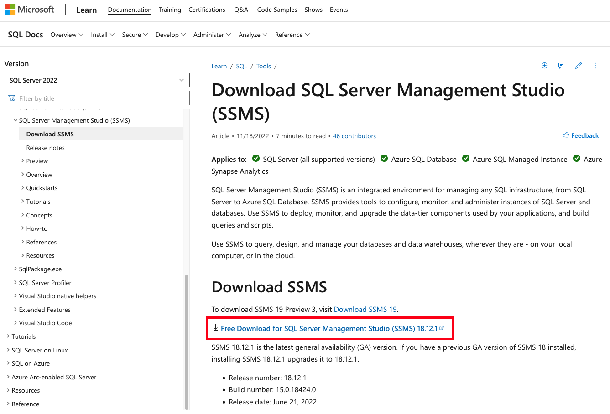 In this step, you will connect to the database you created using SQL Server Management Studio. 1. Configure SSMS connection settings Once you have completed your download, install and open the program. A dialog box appears. Enter the following:  • **Server type:** Select Database Engine  • **Hostname:** Copy and paste the hostname from the Amazon RDS console as shown in the screenshot to the right. Afterwards, change the colon between the DNS and port number to a comma. For example, your server name should look like **sample-instance.cg034hpkmmjt.us-east-1.rds.amazonaws.com,1433**  • **Username:** Type in the username you created for the Amazon RDS database. Our example is **masterUsername**.  • **Password:** Enter the password you used while creating the Amazon RDS database. Choose **Connect**. 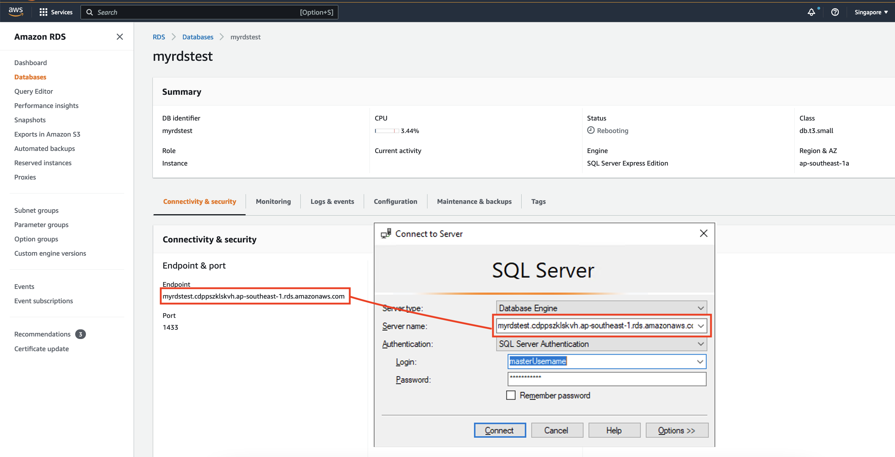 2. Verify database connection You are now connected to the database. In the SQL Server Management Studio, you will see various schema objects available in the database. Now you can create tables, insert data, and run queries. 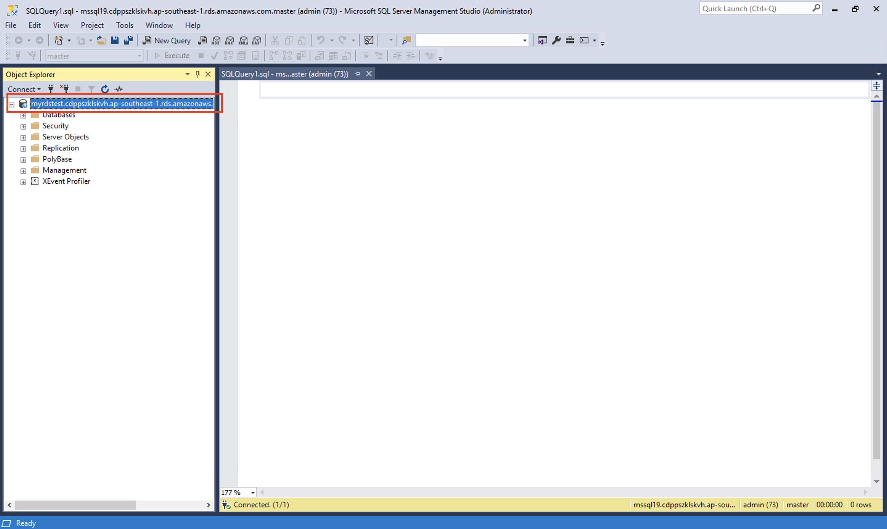 You can easily delete the Microsoft SQL Server DB instance from the Amazon RDS console. It is a best practice to delete instances that you are no longer using so that you don’t keep getting charged for them. 1. Delete the instance Go back to the Amazon RDS console. Select **Databases**, choose the instance that you want to delete, and then select **Delete** from the **Actions** dropdown menu. 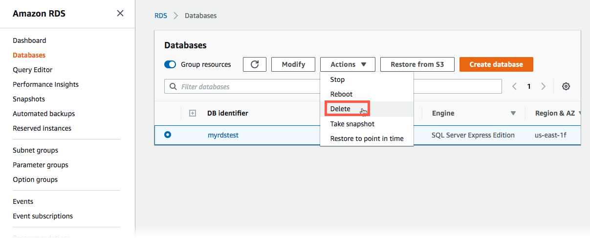 2. Confirm deletion You are asked to create a final snapshot and to confirm the deletion. For our example, do not create a final snapshot, acknowledge that you want to delete the instance, and then choose **Delete**. ###### Note Deleting your DB Instance may take a few minutes 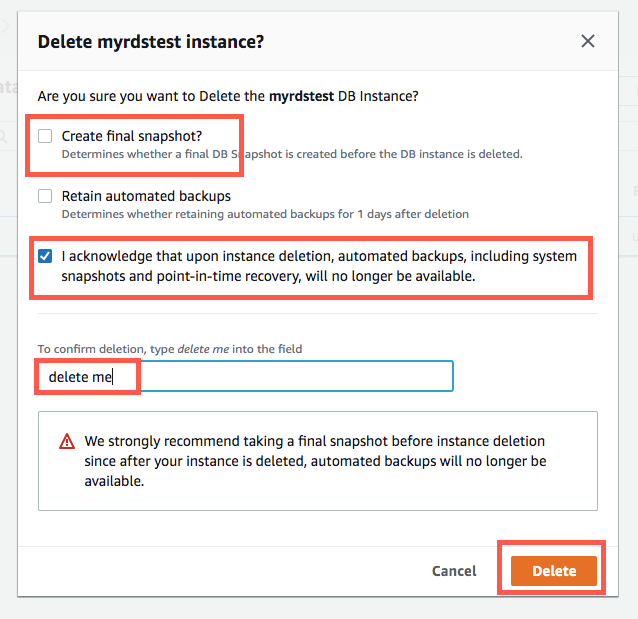 ## Conclusion Congratulations! You have created, connected to, and deleted a Microsoft SQL Server database instance with [Amazon RDS.](https://aws.amazon.com/rds/ "https://aws.amazon.com/rds/") Amazon RDS makes it easy to set up, operate, and scale a relational database in the cloud. It provides cost-efficient and resizable capacity while managing time-consuming database administration tasks, freeing you up to focus on your applications and business. |
