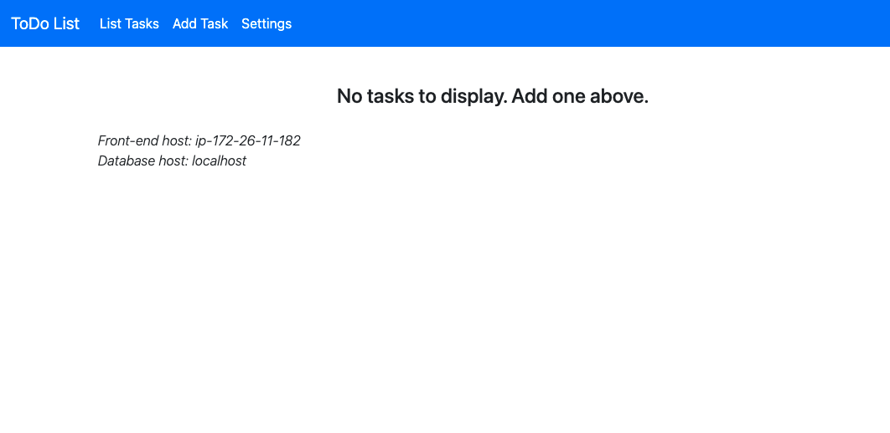

# Module 1: Create Your Lightsail PHP Application

|                      |                |
| -------------------- | -------------- |
| **AWS experience**   | Beginner       |
| **Time to complete** | 10 minutes     |
| **Last updated**     | March 17, 2023 |

## Overview

You will use the AWS CLI to create a Lightsail instance from a
blueprint that has the LAmazon Managed Service for Prometheus components preconfigured. You will
install a PHP application from a GitHub repository during instance
creation.

## What you will accomplish

In this module, you will:

- Create a Lightsail instance using the AWS CLI.
- Deploy your PHP application using the user data of the
  instance.

## Prerequisites

- AWS Account with administrator-level access
- Recommended browser: The latest version of Chrome or Firefox

###### Note

Accounts created within
the past 24 hours might not yet have access to the services
required for this tutorial.

## Implementation

- We will use the following AWS CLI command to create a Lightsail instance:

```
aws lightsail create-instances \
    --instance-names <name_of_your_instance> \
    --availability-zone <availability_zone> \
    --blueprint-id <blueprint_id> \
    --bundle-id <bundle_id> \
    --key-pair-name <key_pair_name> \
    --user-data <user-data>
```

The command expects the following parameters:

    + an **instance name**
    + an **Availability Zone,** where you want to
     deploy your instance
    + the **ID of a blueprint**
    + the **ID of a bundle**
    + an **SSH key pair** to access your instance
    + and **user data**, which will be executed at the
     start of your instance.

###### Note

A bundle refers to a preconfigured set of resources that determine the amount of
memory, compute power, and storage that is available for an Amazon Lightsail
instance. A blueprint, on the other hand, refers to the virtual machine image of the
instance. This machine image includes the operation system and commonly used
software applications that are configured on the machine.

- As shown in the command above, when you create a Lightsail instance, you have
  the option of passing user data to the instance that can be used to perform common
  automated configuration tasks and even run scripts after the instance starts.

In our case, the user data will be used to deploy our LAmazon Managed Service for Prometheus stack. The following
script will remove the default website of the blueprint, clone the sample app to
replace it, set the appropriate file permissions, configure the auto-generated
database password in the sample app's config file, and run the init.sql script to
create the database and populate it with the initial values.

```
# remove default website
#-----------------------
cd /opt/bitnami/apache2/htdocs
rm -rf *

# clone github repo
#------------------
/usr/bin/git clone -b loft https://github.com/mikegcoleman/todo-php.git .

# set write permissons on the settings file
#-------------------------------------------
chown bitnami:daemon ./*
chmod 666 connectvalues.php

# inject database password into configuration file
#-------------------------------------------------
sed -i.bak "s/<password>/$(cat /home/bitnami/bitnami_application_password)/;" /opt/bitnami/apache2/htdocs/connectvalues.php

# create database
#----------------
cat /home/bitnami/htdocs/data/init.sql | /opt/bitnami/mariadb/bin/mysql -u root -p$(cat /home/bitnami/bitnami_application_password)
```

- In addition to the user data, we may also want to connect to our instance after it
  has been created. To connect to the instance, we will need an SSH key pair. To create
  an SSH key pair, you can use the AWS CLI. The following command will create an SSH key
  for you and save the public key in **lightsailguide.pub**
  and the private key in **lightsailguide.**

```
aws lightsail create-key-pair --key-pair-name LightsailGuide > ssh_key_response.json

cat ssh_key_response.json | jq -r '.publicKeyBase64' > lightsailguide.pub

cat ssh_key_response.json | jq -r '.privateKeyBase64' > lightsailguide

chmod 400 lightsailguide.pub lightsailguide
```

###### Note

You might need to install jq, a lightweight and flexible command line JSON
processor, on your machine using a packet manager of your choice.

- Now that we prepared everything, we can use the AWS CLI to create the instance. For
  this guide, we will be using the Ireland (eu-west-1) Region, and the LAmazon Managed Service for Prometheus blueprint
  with the **blueprintId** of **lamp_7**.

```
aws lightsail get-blueprints
```

- You must specify an instance bundle when creating a Lightsail instance. For this
  guide, we will use a **micro_2_0** bundle. You can view a
  list of available bundles with the following command:

```
aws lightsail get-bundles
```

- To create your Lightsail instance with the user data script, and the SSH key you
  created, run the following command:

```
# Create the Lightsail instance:
aws lightsail create-instances \
    --instance-names "LightsailLampExample" \
    --availability-zone eu-west-1a \
    --blueprint-id lamp_7 \
    --bundle-id micro_2_0 \
    --key-pair-name LightsailGuide \
    --user-data '# remove default website
#-----------------------
cd /opt/bitnami/apache2/htdocs
rm -rf *

# clone github repo
#------------------
/usr/bin/git clone -b loft https://github.com/mikegcoleman/todo-php.git .

# set write permissons on the settings file
#-----------------------------------
chown bitnami:daemon ./*
chmod 666 connectvalues.php

# inject database password into configuration file
#-------------------------------------------------
sed -i.bak "s/<password>/$(cat /home/bitnami/bitnami_application_password)/;" /opt/bitnami/apache2/htdocs/connectvalues.php

# create database
#----------------
cat /home/bitnami/htdocs/data/init.sql | /opt/bitnami/mariadb/bin/mysql -u root -p$(cat /home/bitnami/bitnami_application_password)'
```

- The command will output details of the instance you created:

```
{
    "operations": [
        {
            "id": "a49e1398-fb81-455a-8a50-3159c9bd9966",
            "resourceName": "LightsailLampExample",
            "resourceType": "Instance",
            "createdAt": "2021-09-21T16:38:40.566000+02:00",
            "location": {
                "availabilityZone": "eu-west-1a",
                "regionName": "eu-west-1"
            },
            "isTerminal": false,
            "operationType": "CreateInstance",
            "status": "Started",
            "statusChangedAt": "2021-09-21T16:38:40.566000+02:00"
        }
    ]
}
```

- It will take a few minutes for your instance to become available, and you can use
  the following command to check the progress:

```
aws lightsail get-instance-state --instance-name LightsailLampExample

```

- When you see the following output, the instance is running, but it may still be
  working through the user data script:

```
{
    "state": {
        "code": 16,
        "name": "running"
    }
}
```

- To test your application, you will need your instance’s public IP address. Run the
  following command to retrieve your instance’s public IP address.

```
aws lightsail get-instance --instance-name LightsailLampExample | jq -r .instance.publicIpAddress

```

- Copy the IP address and paste it in your browser. You should see the app running.



## Conclusion

In this first module, we learned how to create our infrastructure
using the AWS CLI, and deploy a sample application. In the next
module, we will learn how to clean up the resources used in this
guide.
