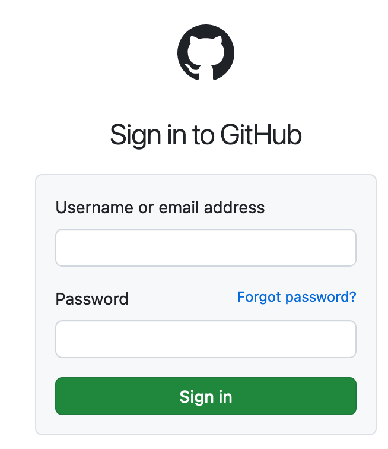
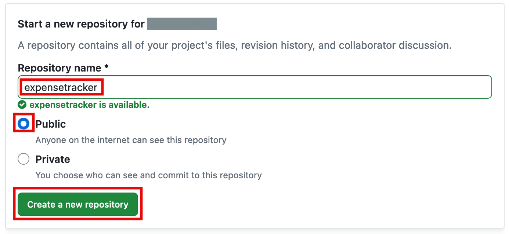
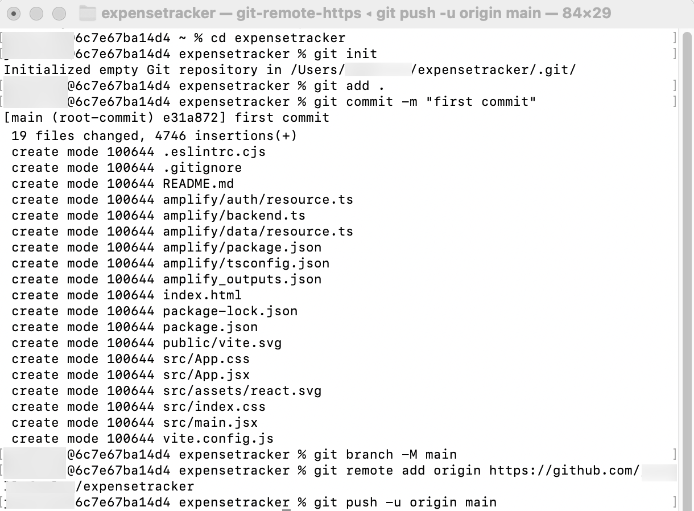
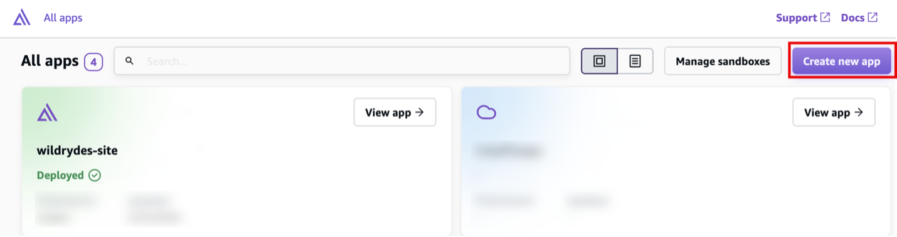
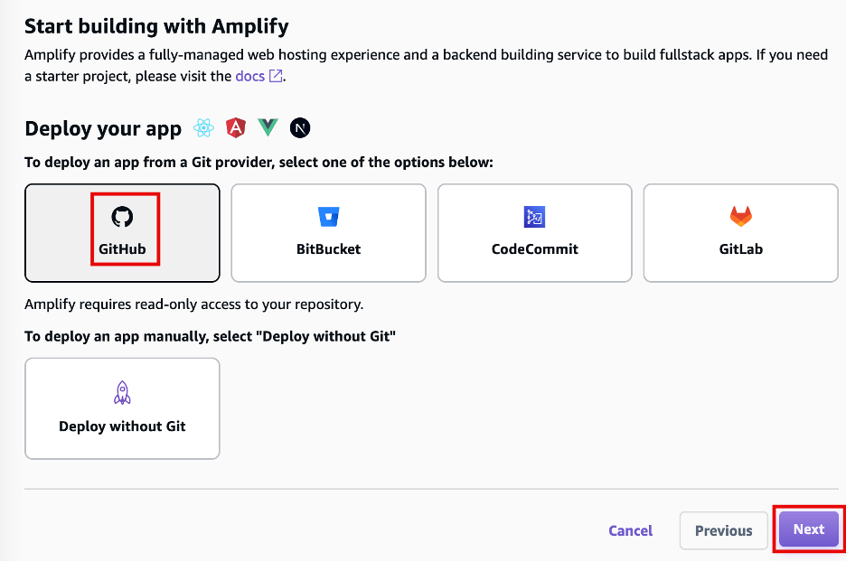
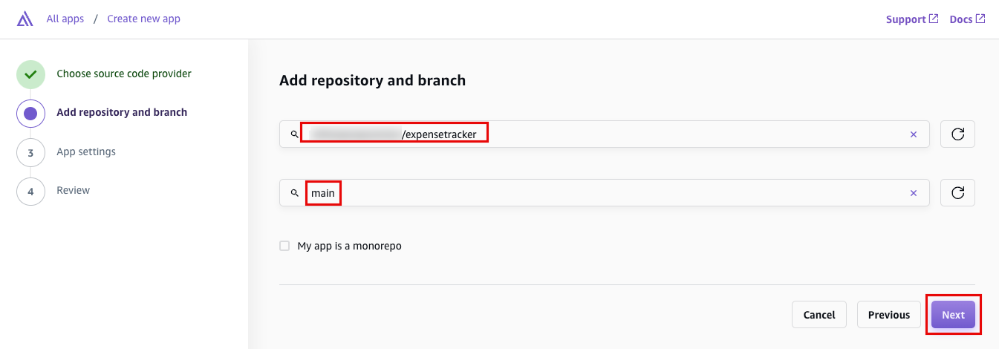
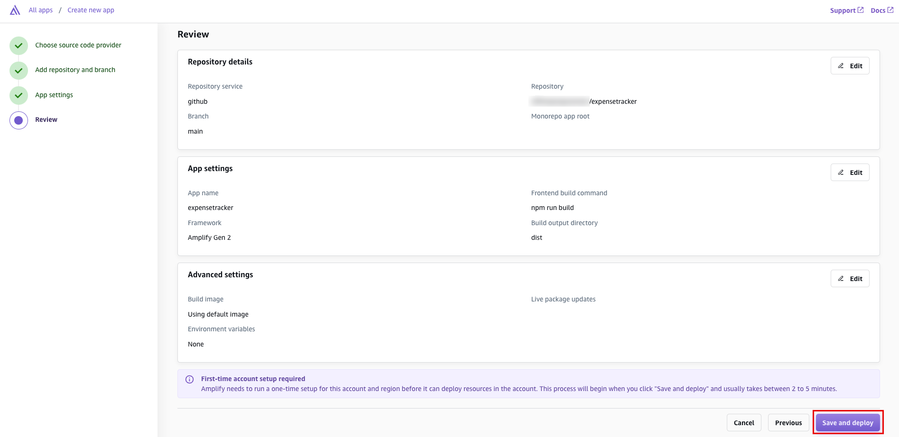

# Task 4: Deploy the App

|                      |                                                                                                                                                              |
| -------------------- | ------------------------------------------------------------------------------------------------------------------------------------------------------------ | ------------------------------------------------------------------------------------------------------------------------------------------------------------------------------------------------------------------------------------------------------------------------------------------------------------------------------------------------------------------------------------------------------------------------------------------------------------------------------------------------------------------------------------------------------------------------------------------------------------------------------------------------------------------------------------------------------------------------------------------------------------------------------------------------------------------------------------------------------------------------------------------------------------------------------------------------------------------------------------------------------------------------------------------------------------------------------------------------------------------------------------------------------------------------------------------------------------------------------------------------------------------------------------------------------------------------------------------------------------------------------------------------------------------------------------------------------------------------------------------------------------------------------------------------------------------------------------------------------------------------------------------------------------------------------------------------------------------------------------------------------------------------------------------------------------------------------------------------------------------------------------------------------------------------------------------------------------------------------------------------------------------------------------------------------------------------------------------------------------------------------------------------------------------------------------------------------------------------------------------------------------------------------------------------------------------------------------------------------------------------------------------------------------------------------------------------------------------------------------------------------------------------------------------------------------------------------------------------------------------------------------------------------------------------------------------------------------------------------------------------------------------------------------------------------------------------------------------------------------------------------------------------------------------------------------------------------------------------------------------------------------------------------------------------------------------------------------------------------------------------------------------------------------------------------------------------------------------------------------------------------------------------------------------------------------------------------------------------------------------------------------------------------------------------------------------------------------------------------------------------------------------------------------------------------------------------------------------------------------------------------------------------------------------------------------------------------------------------------------------------------------------------------------------------------------------------------------------------------------------------------------------------------------------------------------------------------------------------------------------------------------------------------------------------------------------------------------------------------------------------------------------------------------------------------------------------------------------------------------------------------------------------------------------------------------------------------------------------------------------------------------------------------------------------------------------------------------------------------------------------------------------------------------------------------------------------------------------------------------------------------------------------------------------------------------------------------------------------------------------------------------------------------------------------------------------------------------------------------------------------------------------------------------------------------------------------------------------------------------------------------------------------------------------------------------------------------------------------------------------------------------------------------------------------------------------------------------------------------------------------------------------------------------------------------------------------------------------------------------------------------------------------------------------------------------------------------------------------------------------------------------------------------------------------------------------------------ |
| **Time to complete** | 10 minutes                                                                                                                                                   |
| **Get help**         | [Troubleshooting Amplify](https://docs.amplify.aws/react/build-a-backend/troubleshooting/ "https://docs.amplify.aws/react/build-a-backend/troubleshooting/") | ## Overview In this task, you will store your application on a GitHub repository, and then set up continuous deployment using the Amplify Console. ## What you will accomplish In this task, you will:  • Connect a Github repository to Amplify  • Set up continuous deployment using Amplify ## Implementation In this step, you will create a GitHub repository and commit your code to the repository. You will need a GitHub account to complete this step. If you do not have an account, [sign up here](https://github.com/ "https://github.com/") . ###### Note If you have never used GitHub on your computer, follow [these steps](https://docs.github.com/en/authentication/connecting-to-github-with-ssh "https://docs.github.com/en/authentication/connecting-to-github-with-ssh") before continuing to allow connection to your account. 1. Sign in to GitHub **Sign in** to GitHub at [https://github.com/](https://github.com/ "https://github.com/") .  2. Start a new repository In the **Start a new repository** section, make the following selections:  • For **Repository name** , enter **expensetracker** , and choose the **Public** radio button.  • Then select, **Create a new repository** .  3. Initialize git and push the application **Open** a new terminal window, **navigate** to your projects root folder ( **expensetracker** ) , and **run** the following commands to initialize a git and push of the application to the new GitHub repo: ###### Note **Replace** the SSH GitHub URL in the command with your GitHub URL. `git init git add . git commit -m "first commit" git remote add origin git@github.com:<your-username>/profilesapp.git git branch -M main git push -u origin main`  In this step, you will connect the GitHub repository you just created to the AWS Amplify. This will allow you to build, deploy, and host your app on AWS. 1. Create a new app **Sign in** to the AWS Management Console in a new browser window, and **open** the AWS Amplify console at [https://console.aws.amazon.com/amplify/apps](https://console.aws.amazon.com/amplify/apps "https://console.aws.amazon.com/amplify/apps"). Choose **Create new app**.  2. Choose GitHub for deployment On the **Start building with Amplify** page, for **Deploy your app** , select **GitHub** , and select **Next**.  3. Add your repository and main branch When prompted, **authenticate** with GitHub. You will be automatically redirected back to the Amplify console. Choose the **repository** and **main branch** that you created earlier. Then, select **Next** .  4. Confirm default settings Leave the default **build setting,** and select **Next**.  5. Review settings Review the inputs selected and choose **Save and deploy**.  6. Verify app deployment AWS Amplify will now **build** your source code and **deploy** your app at \***\*https://...amplifyapp.com\*\*** , and on every git push your deployment instance will update. It may take up to 5 minutes to deploy your app. Once the build completes, select the **Visit deployed URL** button to see your web app up and running live.  |
