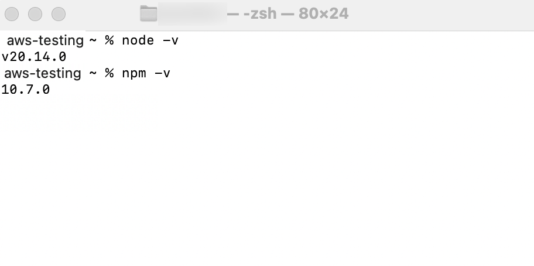
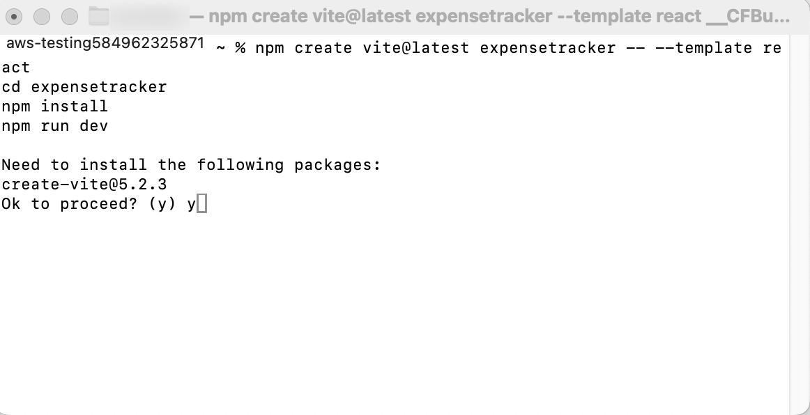
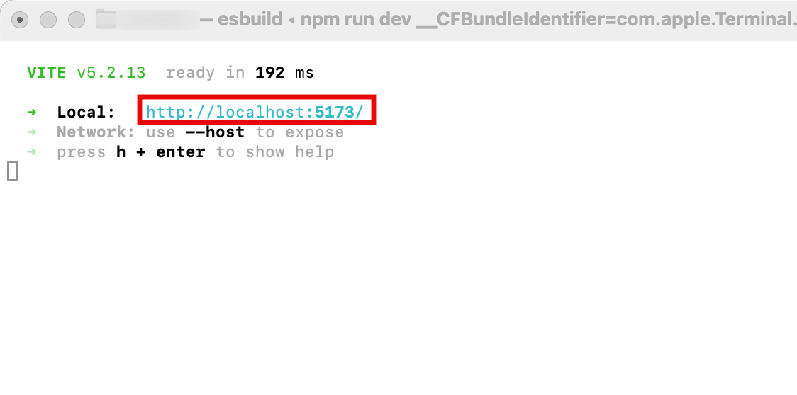
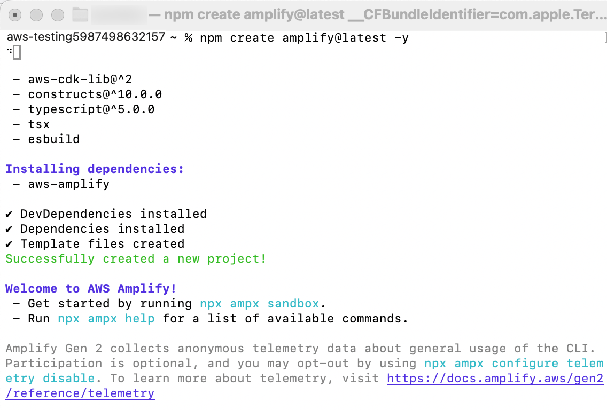
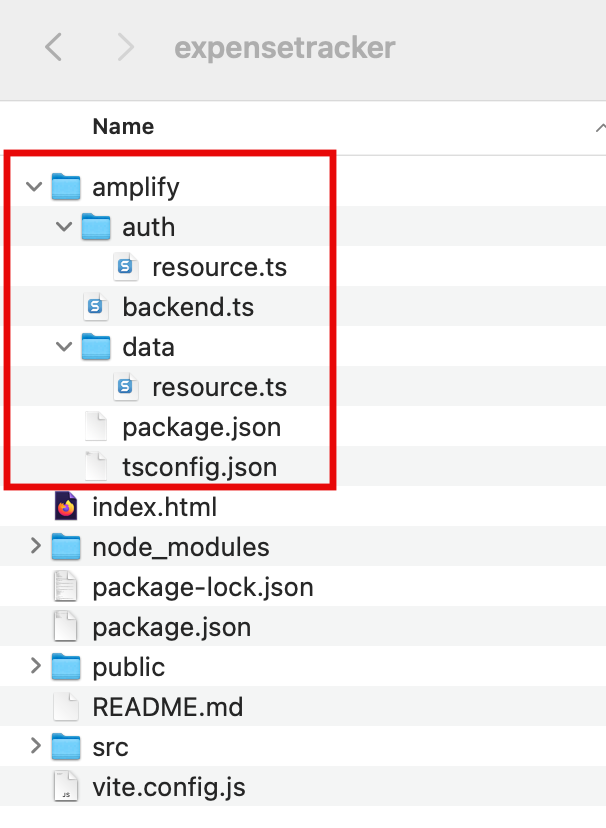

# Task 1: Create a new Amplify Project

|                      |                                                                                                                                                                                                                                                                                                                                                                                                 |
| -------------------- | ----------------------------------------------------------------------------------------------------------------------------------------------------------------------------------------------------------------------------------------------------------------------------------------------------------------------------------------------------------------------------------------------- | -------------------------------------------------------------------------------------------------------------------------------------------------------------------------------------------------------------------------------------------------------------------------------------------------------------------------------------------------------------------------------------------------------------------------------------------------------------------------------------------------------------------------------------------------------------------------------------------------------------------------------------------------------------------------------------------------------------------------------------------------------------------------------------------------------------------------------------------------------------------------------------------------------------------------------------------------------------------------------------------------------------------------------------------------------------------------------------------------------------------------------------------------------------------------------------------------------------------------------------------------------------------------------------------------------------------------------------------------------------------------------------------------------------------------------------------------------------------------------------------------------------------------------------------------------------------------------------------------------------------------------------------------------------------------------------------------------------------------------------------------------------------------------------------------------------------------------------------------------------------------------------------------------------------------------------------------------------------------------------------------------------------------------------------------------------------------------------------------------------------------------------------------------- |
| **Time to complete** | 5 minutes                                                                                                                                                                                                                                                                                                                                                                                       |
| **Requires**         |  • A [GitHub account](https://github.com/ "https://github.com/")  • GitHub [SSH connection](https://docs.github.com/en/authentication/connecting-to-github-with-ssh "https://docs.github.com/en/authentication/connecting-to-github-with-ssh")  • [Nodejs](https://nodejs.org/en/download "https://nodejs.org/en/download") and [npm](https://www.npmjs.com/ "https://www.npmjs.com/") |
| **Get help**         | [Troubleshooting Amplify](https://docs.amplify.aws/react/build-a-backend/troubleshooting/ "https://docs.amplify.aws/react/build-a-backend/troubleshooting/")                                                                                                                                                                                                                                    | ## Overview In this task, you will create a new web application using [React](https://reactjs.org/ "https://reactjs.org/"), a JavaScript library for building user interfaces, and learn how to configure AWS Amplify for your first project. ## What you will accomplish  • Create a new web application  • Set up Amplify on your project ## Implementation 1. Check environment In a new terminal window or command line, **run** the following commands to verify that you are running at least Node.js version 18.16.0 and npm version 6.14.4 or greater.  • If you are not running these versions, visit the [nodejs](https://nodejs.org/ "https://nodejs.org/") and [npm website](https://www.npmjs.com/ "https://www.npmjs.com/") for more information. ###### Note Your output might differ based on the version installed. `node -v npm -v`  2. Create a new React application In a new terminal or command line window, **run** the following command to use Vite to create a React application: `npm create vite@latest expensetracker -- --template react cd expensetracker npm install npm run dev`  3. Open the local development server In the terminal window, select and open the **Local link** to view the Vite + React application.  4. Install Amplify CLI **Open** a new terminal window, **navigate** to your projects root folder (**expensetracker**), and **run** the following command: `npm create amplify@latest -y`  Running the previous command will scaffold a lightweight Amplify project in the app’s directory where you installed the packages.  ## Conclusion In this task, you learned how to create a React frontend application, and installed the amplify packages in preparation to configure a backend for the app. |
