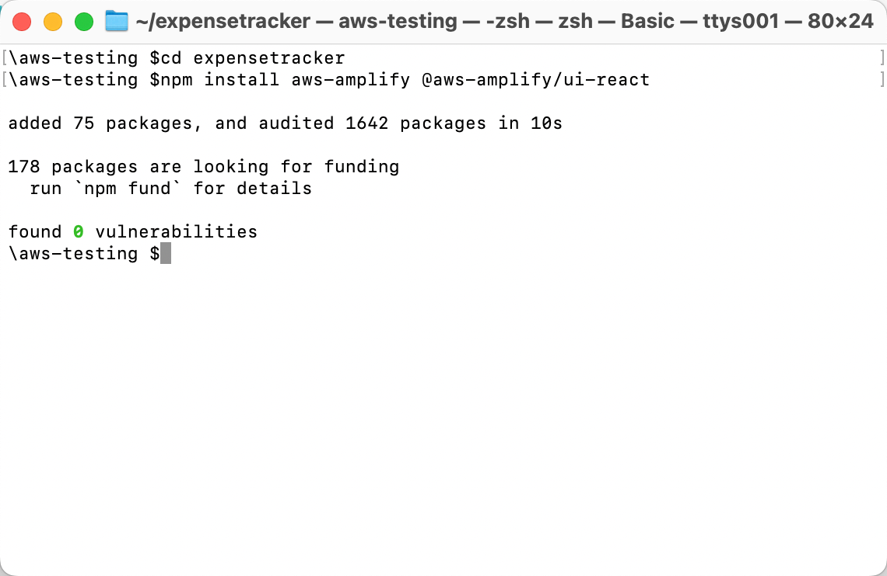
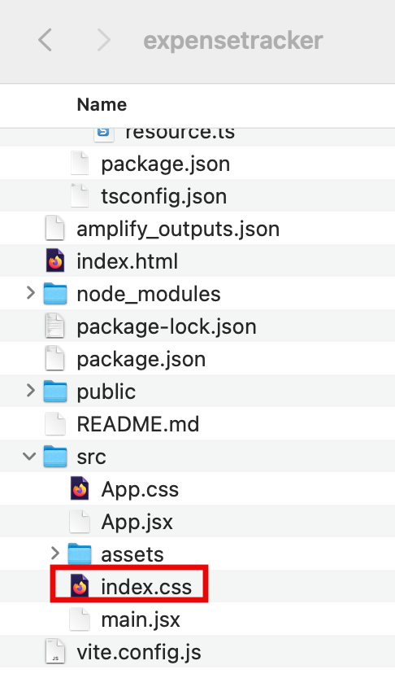
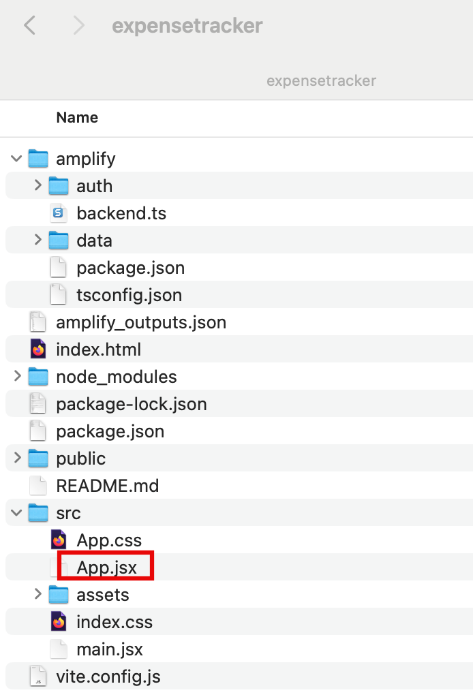
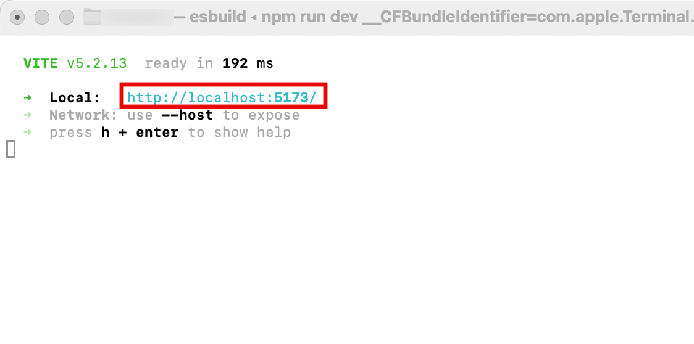
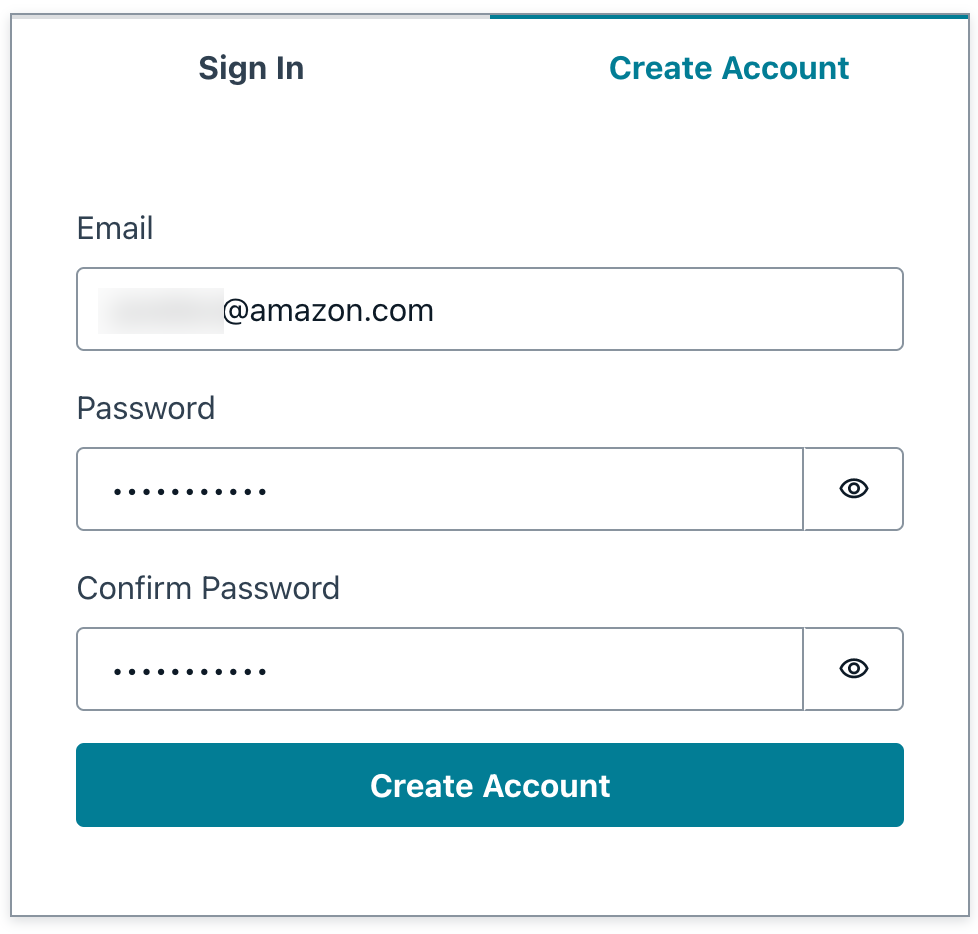
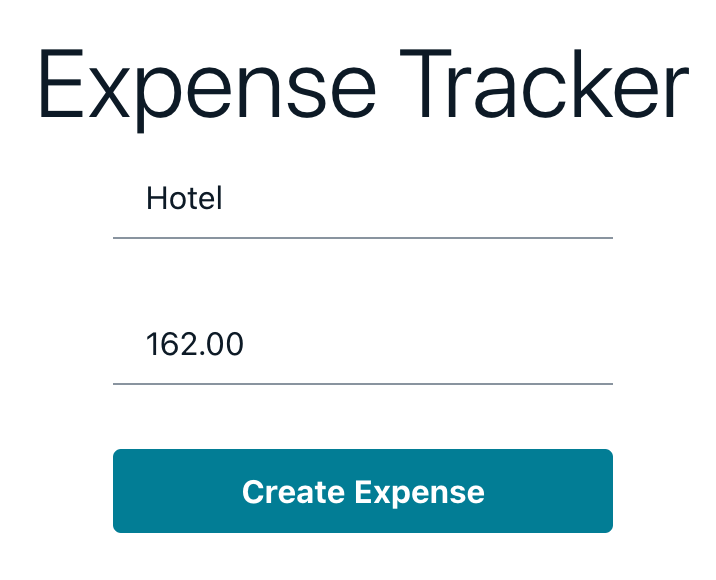

# Task 3: Build the Frontend

|                      |                                                                                                                                                                 |
| -------------------- | --------------------------------------------------------------------------------------------------------------------------------------------------------------- |
| **Time to complete** | 5 minutes                                                                                                                                                       |
| **Get help**         | [Troubleshooting<br>Amplify](https://docs.amplify.aws/react/build-a-backend/troubleshooting/ "https://docs.amplify.aws/react/build-a-backend/troubleshooting/") |

## Overview

In this task, you will learn how to use the Amplify UI component
library to scaffold out an entire user authentication flow, allow
users to sign up, sign in, and reset their password with just few
lines of code. Additionally, you will build an app frontend that
allows users to create, update, and delete their expenses. 

## What you will accomplish

In this task, you will:

- Install the Amplify client libraries
- Configure your React app to include authentication, data, and
  storage for the expenses feature

## Implementation

You will need two Amplify libraries for your project. The main
**aws-amplify library** contains all
of the client-side APIs for connecting our app's frontend to our
backend, and the
**@aws-amplify/ui-react** library
contains framework-specific UI components.

- Install the libraries

**Open** a new terminal window,
**navigate** to your projects root
folder (**expensetracker**), and
**run** the following command to
install these libraries in the root of the project.

```
npm install aws-amplify @aws-amplify/ui-react

```



- Navigate to the CSS

On your local machine, navigate to the **expensetracker/src/index.css** file. Replace your CSS with the following
CSS:

```
:root {
  font-family: Inter, system-ui, Avenir, Helvetica, Arial, sans-serif;
  line-height: 1.5;
  font-weight: 400;

  color: rgba(255, 255, 255, 0.87);

  font-synthesis: none;
  text-rendering: optimizeLegibility;
  -webkit-font-smoothing: antialiased;
  -moz-osx-font-smoothing: grayscale;

  max-width: 1280px;
  margin: 0 auto;
  padding: 2rem;

}

.card {
  padding: 2em;
}

.read-the-docs {
  color: #888;
}

.box:nth-child(3n + 1) {
  grid-column: 1;
}
.box:nth-child(3n + 2) {
  grid-column: 2;
}
.box:nth-child(3n + 3) {
  grid-column: 3;
}
```


In this step, you will update the
**src/App.jsx** file to configure the
Amplify library with the client configuration file
(**amplify_outputs.json**). Then, it
will generate a data client using
the **generateClient()**function. 

The code uses the Amplify Authenticator component to scaffold out an
entire user authentication flow allowing users to sign up, sign in,
reset their password, and confirm sign-in for multifactor
authentication (MFA). 

Additionally, the code contains the following:

- A code to use a real-time
  **observeQuery** to subscribe to
  a live feed of the user’s expenses data.
- **createExpense -**Get the data
  from the form and use the data client to create a new expense.
- **deleteExpense** - Use the data
  client to delete the selected expense.

1. Update the App.jsx file

On your local machine, navigate to the
**expensetracker/src/app.jsx** file.

Replace the code in the App.jsx with the following code from [this file](https://d1.awsstatic.com/onedam/marketing-channels/website/aws/en_US/getting-started/approved/assets/deploy-web-app-amplify-tutorial-app-jsx-file.pdf "https://d1.awsstatic.com/onedam/marketing-channels/website/aws/en_US/getting-started/approved/assets/deploy-web-app-amplify-tutorial-app-jsx-file.pdf"). Then, save the updated file.

```
import { useState, useEffect } from "react";
import {
  Authenticator,
  Button,
  Text,
  TextField,
  Heading,
  Flex,
  View,
  Grid,
  Divider,
} from "@aws-amplify/ui-react";
import { Amplify } from "aws-amplify";
import "@aws-amplify/ui-react/styles.css";
import { generateClient } from "aws-amplify/data";
import outputs from "../amplify_outputs.json";

/**
 * @type {import('aws-amplify/data').Client<import('../amplify/data/resource').Schema>}
 */

Amplify.configure(outputs);
const client = generateClient({
  authMode: "userPool",
});

export default function App() {
  const [expenses, setExpenses] = useState([]);

  useEffect(() => {
    client.models.Expense.observeQuery().subscribe({
      next: (data) => setExpenses([...data.items]),
    });
  }, []);

  async function createExpense(event) {
    event.preventDefault();
    const form = new FormData(event.target);

    await client.models.Expense.create({
      name: form.get("name"),
      amount: form.get("amount"),
    });

    event.target.reset();
  }

  async function deleteExpense({ id }) {
    const toBeDeletedExpense = {
      id,
    };

    await client.models.Expense.delete(toBeDeletedExpense);
  }

  return (
    <Authenticator>
      {({ signOut }) => (
        <Flex
          className="App"
          justifyContent="center"
          alignItems="center"
          direction="column"
          width="70%"
          margin="0 auto"
        >
          <Heading level={1}>Expense Tracker</Heading>
          <View as="form" margin="3rem 0" onSubmit={createExpense}>
            <Flex
              direction="column"
              justifyContent="center"
              gap="2rem"
              padding="2rem"
            >
              <TextField
                name="name"
                placeholder="Expense Name"
                label="Expense Name"
                labelHidden
                variation="quiet"
                required
              />
              <TextField
                name="amount"
                placeholder="Expense Amount"
                label="Expense Amount"
                type="float"
                labelHidden
                variation="quiet"
                required
              />

              <Button type="submit" variation="primary">
                Create Expense
              </Button>
            </Flex>
          </View>
          <Divider />
          <Heading level={2}>Expenses</Heading>
          <Grid
            margin="3rem 0"
            autoFlow="column"
            justifyContent="center"
            gap="2rem"
            alignContent="center"
          >
            {expenses.map((expense) => (
              <Flex
                key={expense.id || expense.name}
                direction="column"
                justifyContent="center"
                alignItems="center"
                gap="2rem"
                border="1px solid #ccc"
                padding="2rem"
                borderRadius="5%"
                className="box"
              >
                <View>
                  <Heading level="3">{expense.name}</Heading>
                </View>
                <Text fontStyle="italic">${expense.amount}</Text>

                <Button
                  variation="destructive"
                  onClick={() => deleteExpense(expense)}
                >
                  Delete note
                </Button>
              </Flex>
            ))}
          </Grid>
          <Button onClick={signOut}>Sign Out</Button>
        </Flex>
      )}
    </Authenticator>
  );
}

```

 2. Launch the app

**Open** a new terminal window,
**navigate** to your projects root
folder (**expensetracker**), and
**run** the following command to
launch the app:

```
npm run dev

```

3. Open the app

Select the **Local host link** to
open the Vite + React application.

 4. Create an account

Choose the **Create Account** tab,
and use the authentication flow to create a new user by entering
your **email address** and a
**password**.

Then, choose **Create Account**.

 5. Enter verification code

You will get a verification code sent to your email.

Enter the **verification code** to
log into the app.

 6. Create and delete expenses

When signed in, you can start **creating
expenses** and
**delete** them.



## Conclusion

You have now connected your App to the Amplify backend and built a
frontend allowing the users to create, edit, and delete expenses.
