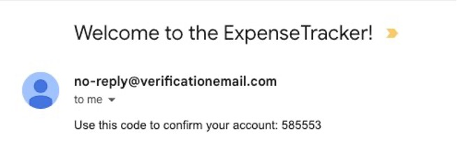
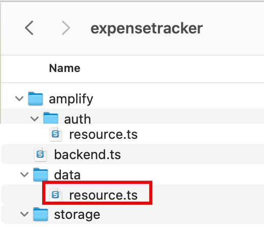
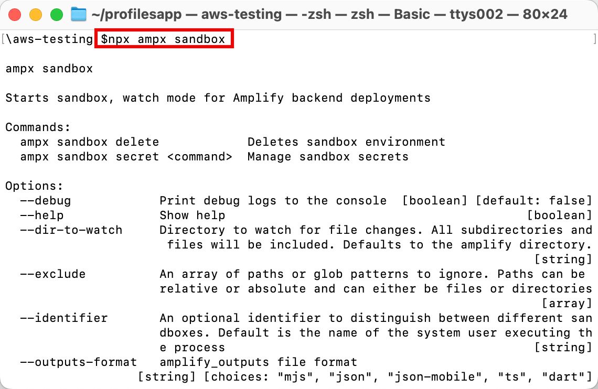
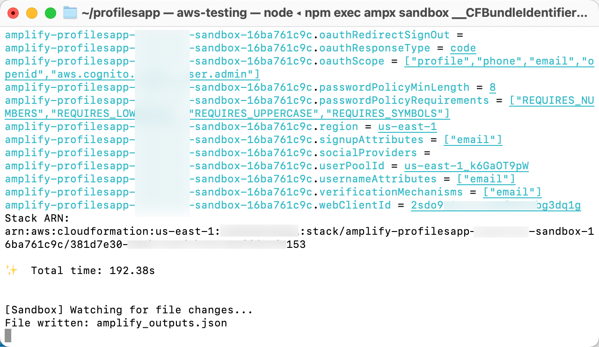

# Task 2: Initialize the Amplify Backend

|                      |                                                                                                                                                                                                                                                                                                                                                                                                                                                                                                                                                                                   |
| -------------------- | --------------------------------------------------------------------------------------------------------------------------------------------------------------------------------------------------------------------------------------------------------------------------------------------------------------------------------------------------------------------------------------------------------------------------------------------------------------------------------------------------------------------------------------------------------------------------------- |
| **Time to complete** | 10 minutes                                                                                                                                                                                                                                                                                                                                                                                                                                                                                                                                                                        |
| **Requires**         | • AWS profile<br>[configured](https://docs.amplify.aws/react/start/account-setup/ "https://docs.amplify.aws/react/start/account-setup/")<br>for local development<br>• A text editor. Here are a few free ones:<br>+ [Atom](https://atom.io/ "https://atom.io/")<br>+ [Notepad++](https://notepad-plus-plus.org/ "https://notepad-plus-plus.org/")<br>+ [Sublime](https://www.sublimetext.com/ "https://www.sublimetext.com/")<br>+ [Vim](https://www.vim.org/ "https://www.vim.org/")<br>+ [Visual Studio Code](https://code.visualstudio.com/ "https://code.visualstudio.com/") |
| **Get help**         | [Troubleshooting<br>Amplify](https://docs.amplify.aws/react/build-a-backend/troubleshooting/ "https://docs.amplify.aws/react/build-a-backend/troubleshooting/")                                                                                                                                                                                                                                                                                                                                                                                                                   |

## Overview

In this task you will use AWS Amplify to configure a cloud backend
for the app. AWS Amplify Gen 2 uses a fullstack TypeScript
developer experience (DX) for defining backends. Amplify offers a
unified developer experience with hosting, backend, and
UI-building capabilities and a code-first approach. 

The app that you build in this tutorial is an expense tracker app
that will allow users to create, delete, and list expenses. This
example app is a starting point to learn how to build many popular
types of CRUD+L (create, read, update, delete, and list)
applications.

## What you will accomplish

In this task, you will:

- Set up Amplify Authentication
- Set up Amplify Data

## Implementation

The app uses email as the default login mechanism. When the users
sign up, they receive a verification email. In this step, you will
customize the verification email.

1. Update the resource file

On your local machine, navigate to the
**amplify/auth/resource.ts** file, and use the
following code to customize the verification email. Then,
**save** the file.

```
import { defineAuth } from "@aws-amplify/backend";

export const auth = defineAuth({
  loginWith: {
    email: {
      verificationEmailStyle: "CODE",
      verificationEmailSubject: "Welcome to the ExpenseTracker!",
      verificationEmailBody: (createCode) =>
        `Use this code to confirm your account: ${createCode()}`,
    },
  },
});
```

 2. View the customized email

This image shows an example of the customized verification email.


In this step, you will define the schema for the Expense data model,
and use a per-owner authorization
rule **allow.owner()**to restrict the expense
record’s access to the owner of the record. Amplify will
automatically add a **owner: a.string()** field to
each expense which contains the expense owner's identity information
upon record creation.

- Update the resource file

On your local machine, navigate to the
**amplify/data/resource.ts** file, and update the
file with the following code to define the schema. Then,
**save** the file.

```
import { type ClientSchema, a, defineData } from '@aws-amplify/backend';

const schema = a.schema({
  Expense: a
    .model({
      name: a.string(),
      amount: a.float(),
    })
    .authorization((allow) => [allow.owner()]),
});

export type Schema = ClientSchema
<typeof schema>
;

export const data = defineData({
  schema,
  authorizationModes: {
    defaultAuthorizationMode: 'userPool',
  },
});
```



###### Note

The
**amplify/backend.ts** file is already configured
to import the auth and data backend definitions. You don’t need to
change it.

1. Deploy sandbox

**Open** a new terminal window,
**navigate** to your app's root
folder (**expensetracker**), and
**run** the following command to
deploy cloud resources into an isolated development space so you
can iterate fast.

```
npx ampx sandbox

```

 2. View confirmation message

After the cloud sandbox has been fully deployed, your terminal
will display a **confirmation
message.** This deployment will take several minutes to
complete.

 3. Verify output file

Verify that the **amplify_outputs.json** file was
**generated and added** to your
project.


## Conclusion

In this task, you used Amplify to configure auth and data resources.
You also started your own cloud sandbox environment. In the next
module, you will connect your app's frontend to your backend and
build app features.
