# Deploy a Web App on Nginx Server using AWS App Runner

|                      |                                                                                                                                                                                                                                                                                                                                                                                                          |
| -------------------- | -------------------------------------------------------------------------------------------------------------------------------------------------------------------------------------------------------------------------------------------------------------------------------------------------------------------------------------------------------------------------------------------------------- |
| **AWS experience**   | Beginner                                                                                                                                                                                                                                                                                                                                                                                                 |
| **Time to complete** | 20 minutes                                                                                                                                                                                                                                                                                                                                                                                               |
| **Cost to complete** | Less than $0.16 if completed within two hours and you delete your<br>resources at the end of the tutorial.                                                                                                                                                                                                                                                                                               |
| **Get help**         | [Troubleshooting<br>AWS CLI](https://repost.aws/tags/TASjhA8h35SAyOPVeqNO2b4Q?view=all&search=troubleshooting&sort=relevant "https://repost.aws/tags/TASjhA8h35SAyOPVeqNO2b4Q?view=all&search=troubleshooting&sort=relevant")<br>[Troubleshooting<br>Docker commands and ECR](../../../AmazonECR/latest/userguide/common-errors-docker.md "../../../AmazonECR/latest/userguide/common-errors-docker.md") |
| **Last updated**     | June 1, 2022                                                                                                                                                                                                                                                                                                                                                                                             |

## Overview

In this tutorial, you will learn how to deploy a sample
containerized application on a Nginx server using AWS App Runner.

AWS App Runner is a fully managed service that makes it easy for
developers to quickly deploy containerized web applications and
APIs, at scale and with no prior infrastructure experience
required. Start with your source code or a container image. App Runner automatically builds and deploys the web application and
load balances traffic with encryption. App Runner also scales up
or down automatically to meet your traffic needs.

## What you will accomplish

In this tutorial, you will:

- Create a container image for your web app
- Push the image to Amazon Elastic Container Registry
- Create an AWS App Runner service
- Clean up your resources

## Prerequisites

Before starting this tutorial, you will need:

- An AWS account: if you don't already have one follow
  the [Setup
  Your Environment](../setup-environment.md "../setup-environment.md") tutorial.
- [AWS Command Line Interface](https://aws.amazon.com/cli/ "https://aws.amazon.com/cli/")
  **installed** and
  **configured**.
- [Docker
  Engine](https://docs.docker.com/engine/install/ "https://docs.docker.com/engine/install/")
  **installed**,
  and the application
  **started**.
- Visual Studio Code
  **installed**.

## Implementation

Use the following step-by-step written tutorial or watch the video
to learn how to Deploy a Web Applicaton on Nginx Server using AWS App Runner.

In this step, you will create a private repository in Amazon ECR and
push the container image you built in previous module to the newly
created repository.

1. Create a project directory

In a new terminal window, **run** the
following commands to **create** a
new folder called **nginx-web-app**, and
**navigate** to the folder.

```
mkdir nginx-web-appcd nginx-web-app
```

2. Open Visual Studio Code

On your local machine, **navigate**
to the Visual Studio Code application, and open the
**nginx-web-app** folder.

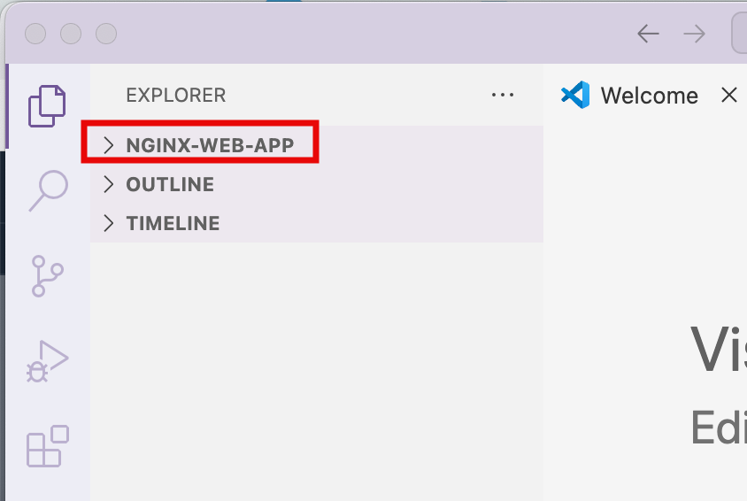 3. Create an HTML file

In the **Explorer** section, select
the **+New file** icon, and enter
**index.html** for the file name.

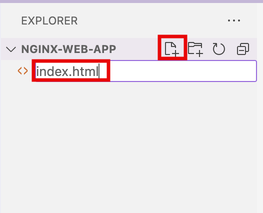 4. Add HTML content

Select the **index.html** file, and
**update** it with the following
code. Then, **save** the file.

```
<!DOCTYPE html>
<html>
<head>
    <title>Sample Web App</title>
    <style>
        html {
            color-scheme: light;
        }
        body {
            width: 35em;
            margin: 0 auto;
            font-family: Amazon Ember, Verdana, Arial, sans-serif;
        }
    </style>
</head>
<body>
    <h1>Welcome to AWS App Runner!</h1>
    <p>If you see this page, the nginx web server is successfully installed and
    working. Further configuration is required.</p>
    <p><em>Thank you for using AWS App Runner!</em></p>
</body>
</html>
```

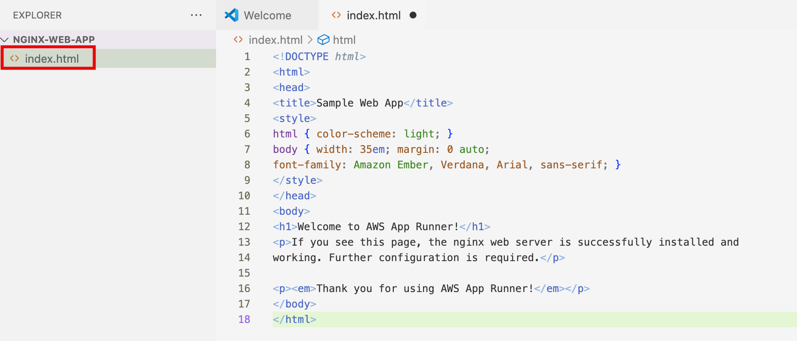 5. Create Dockerfile

Create another file named **Dockerfile**, and
**update** it with the following
code. Then, **save** the file.

```
FROM --platform=linux/amd64 nginx:latest
WORKDIR /usr/share/nginx/html
COPY index.html index.html
```

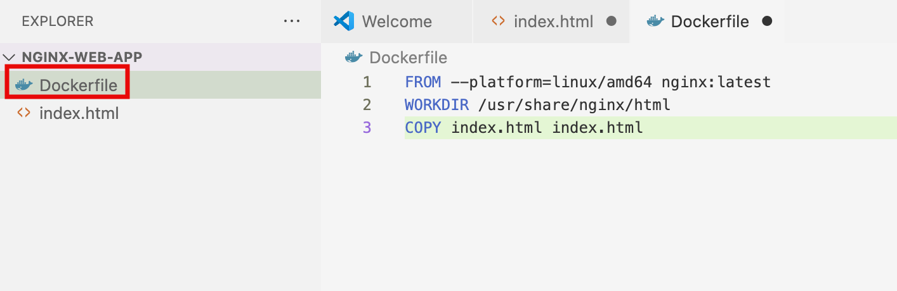 6. Build a container

In the open terminal window,
**run** the following command to
create container image.

```
docker build -t nginx-web-app .
```

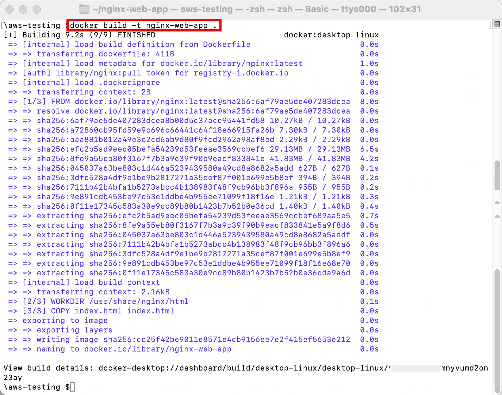
In this module, you will create an AWS App Runner service using the
container image you built in previous module.

1. Create an Amazon ECR repository

**Sign in** to the AWS Management
console in a new browser window, and
**open** the Amazon Elastic Container Registry at
[https://console.aws.amazon.com/ecr/home](https://console.aws.amazon.com/ecr/home "https://console.aws.amazon.com/ecr/home").

For **Create a repository**, choose
**Create**.

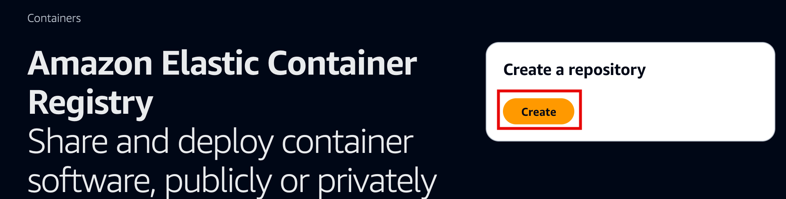 2. Configure repository settings

On the **Create repository** page,
for **Repository name** enter
**nginx-web-app**, leave the
default selections, and select **Create
repository**.

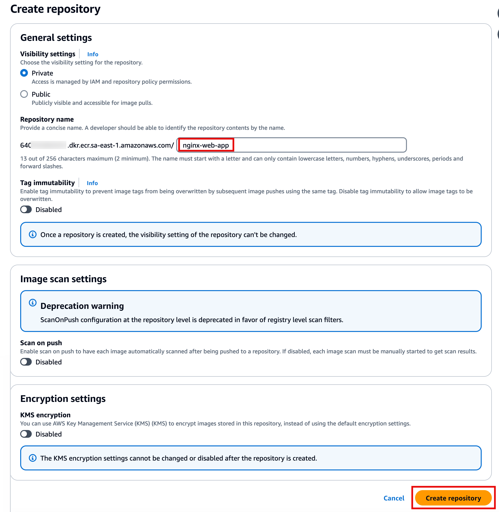 3. View push commands

Once the repository has been created, select the
**radio button** for the
repository, and then select **View push
commands**.

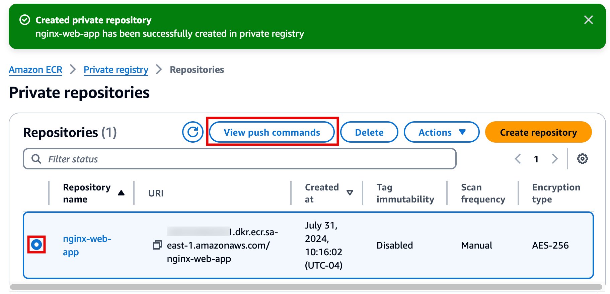 4. Push your image

**Follow** all the steps in the
pop-up window, to **authenticate**
and **push** the image to the
repository.

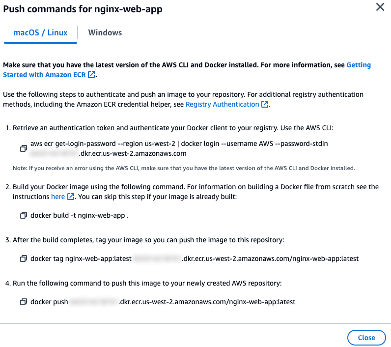
In this step, you will create a container image of a sample web app.

1. Create an App Runner service

In the Source and deployment section, leave the default selections
for Repository type and Provider. For Container image URI, select
Browse.

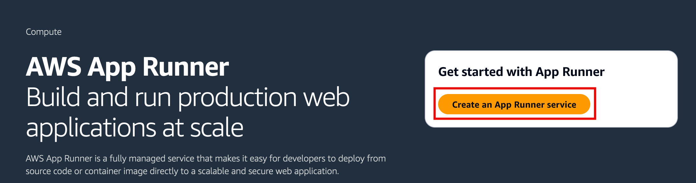 2. Configure the source

In the **Source and deployment**
section, leave the default selections for
**Repository type** and
**Provider**. For
**Container image URI**, select
**Browse**.

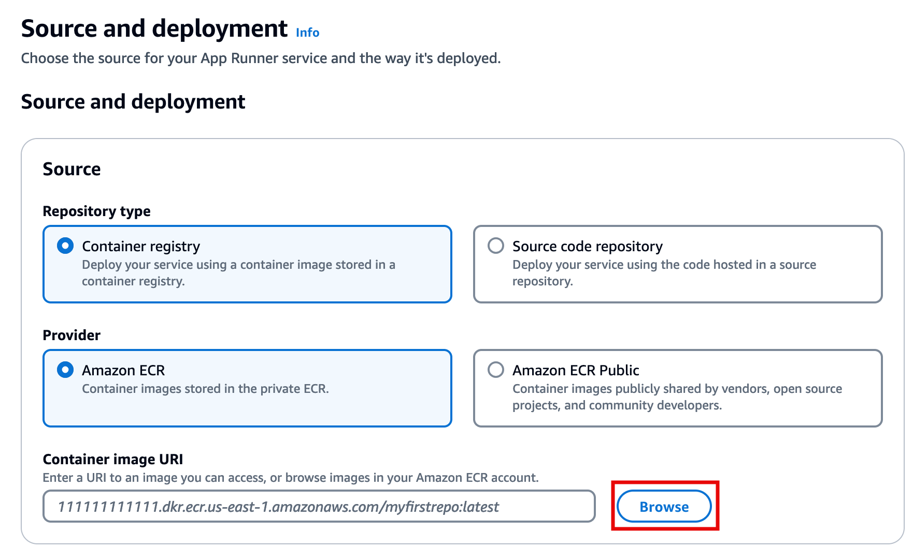 3. Select the container image

In the pop-up window, for **Image
repository**, select
**nginx-web-app**, and choose
**Continue**.

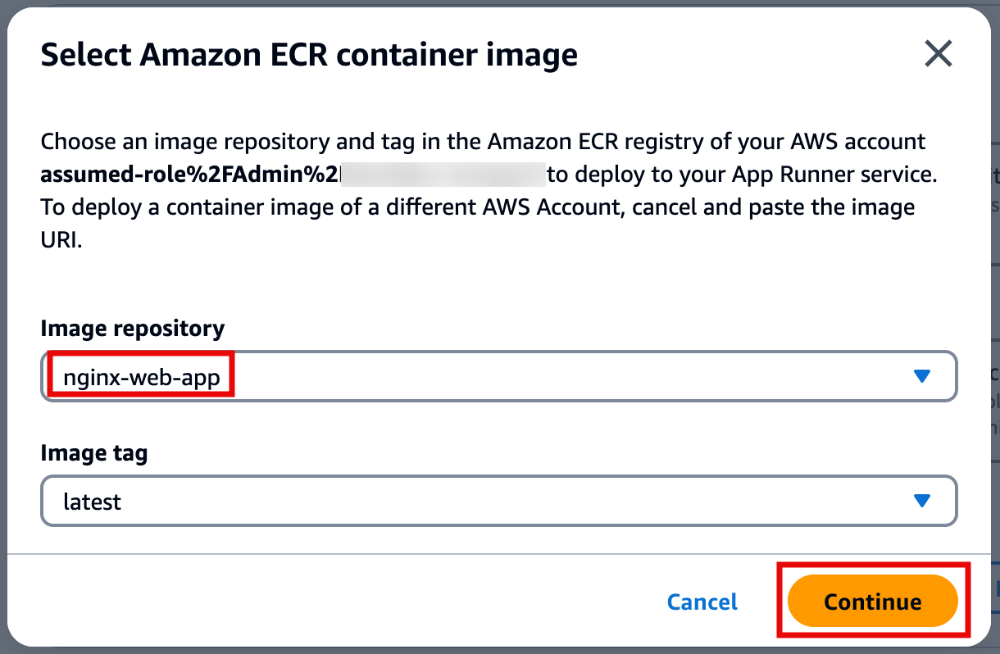 4. Set up ECR access

In the **Deployment settings**
section, for **ECR access role**,
select **Create new service role**,
and choose **Next**.

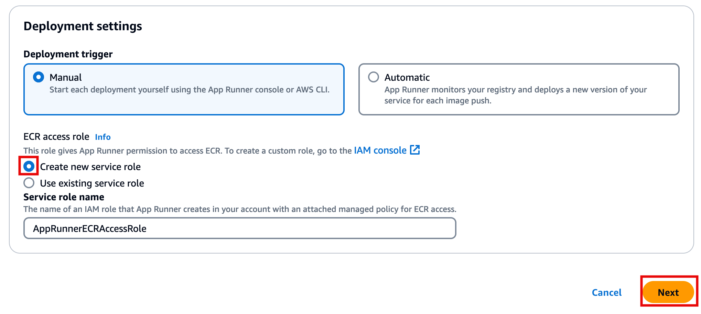 5. Configure service settings

On the **Configure service** page,
for **Service name** enter
**nginx-web-app-service**, and
change the **Port** to
**80**. Leave the rest as default,
and select **Next**.

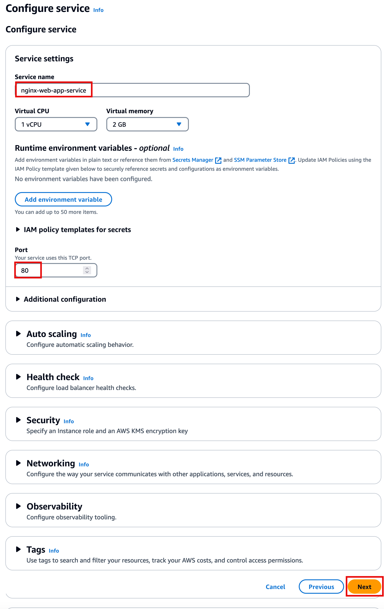 6. Review and deploy

On the **Review and create** page,
review all inputs, and choose **Create &
deploy**.

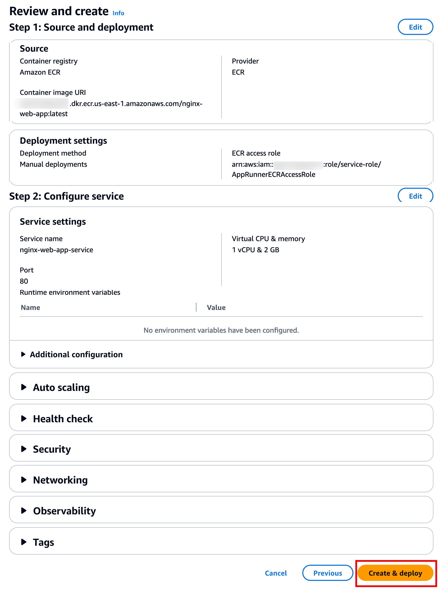 7. Monitor deployment

It will take several minutes for the service to be deployed. You
can **view** the event logs for
progress.

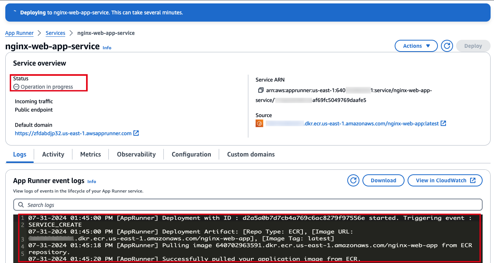 8. Access the application

Once the status updates to
**Running**, choose the default
domain name URL to view the web app.

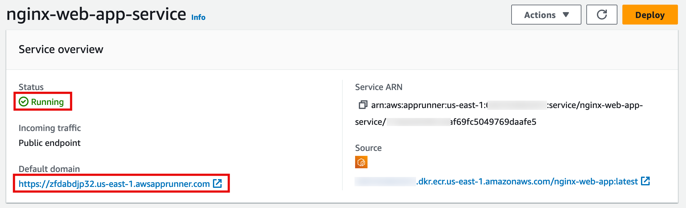 9. Verify the deployment

The Welcome page and confirmation message should look like the
image on the right.

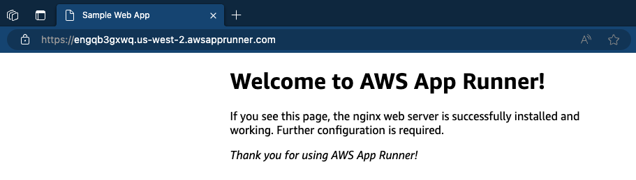
In this step, you will go through the steps to delete all the resources you created
throughout this tutorial. It is a best practice to delete resources you are no longer
using to avoid unwanted charges.

1. Delete the App Runner service

In the AWS App Runner console, navigate to the
**nginx-web-app-service**, choose
**Actions**, and select
**Delete**.

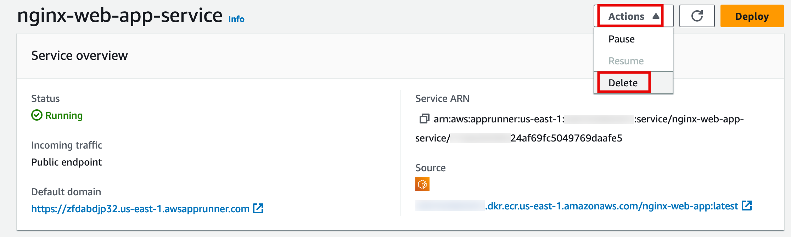 2. Confirm the deletion

Follow the prompts in the pop-up window to
**confirm** deletion of the
service.

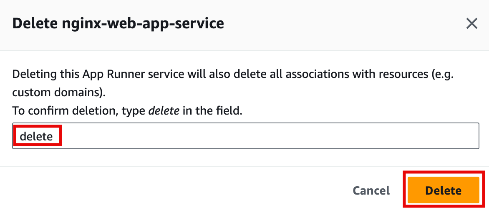 3. Delete the ECR repository

In the Amazon ECR console, select the radio button next to the
**nginx-web-app repository**, and
choose **Delete**.

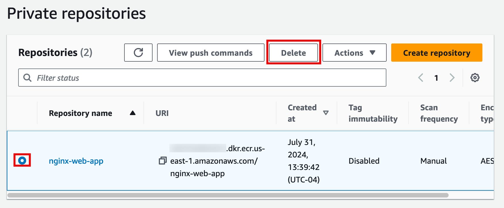

## Congratulations

You have containerized a sample web app running on a Nginx server
and pushed the image to Amazon Elastic Container Registry. Then, you
created an AWS App Runner service using the image.
