# Extract information from unstructured documents with Amazon

Bedrock and Amazon Textract

|                      |                                                                                                                                                                                                                                                                                                                                                             |
| -------------------- | ----------------------------------------------------------------------------------------------------------------------------------------------------------------------------------------------------------------------------------------------------------------------------------------------------------------------------------------------------------- |
| **AWS experience**   | Beginner                                                                                                                                                                                                                                                                                                                                                    |
| **Time to complete** | 20 minutes                                                                                                                                                                                                                                                                                                                                                  |
| **Cost to complete** | Less than $0.15 if completed within two hours and the notebook is deleted at the<br>end of the tutorial.                                                                                                                                                                                                                                                    |
| **Get help**         | [Troubleshooting<br>Amazon Bedrock models](../../../bedrock/latest/userguide/fine-tuning-troubleshooting.md "../../../bedrock/latest/userguide/fine-tuning-troubleshooting.md")<br>[Debugging traning<br>issues](../../../textract/latest/dg/textract-debugging-failures-adapters.md "../../../textract/latest/dg/textract-debugging-failures-adapters.md") |
| **Last update**      | November 14, 2024                                                                                                                                                                                                                                                                                                                                           |

## Overview

In this tutorial, you will learn how to utilize Amazon Bedrock and
Amazon Textract to extract and process information from
unstructured documents.

Amazon Bedrock is a fully managed service that offers a choice of
high-performing foundation models (FMs) from leading AI companies
like AI21 Labs, Anthropic, Cohere, Meta, Mistral AI, Stability AI,
and Amazon through a single API, along with a broad set of
capabilities you need to build generative AI applications with
security, privacy, and responsible AI.

Amazon Textract is a machine learning (ML) service that
automatically extracts text, handwriting, layout elements, and
data from scanned documents.

## What you will accomplish

In this tutorial, you will:

- Enable access to a foundation model on your AWS account
- Create a new Jupyter notebook to write test code and run tests
- Generate code
- Clean up your resources

## Prerequisites

Before starting this tutorial, you will need:

- An AWS account: if you don't already have one follow
  the [Setup
  Your Environment](../setup-environment.md "../setup-environment.md") tutorial.

## Implementation

In this step, you will enable the use of Anthropic models on your
AWS account.

###### Note

**Already requested and obtained access to Anthropic models on
Amazon Bedrock?** Skip to [Step 2: Create a Jupyter Notebook](#create-a-jupyter-notebook "#create-a-jupyter-notebook").

1. Open Amazon Bedrock

**Sign in** to the AWS Management
console, and **open** the Amazon
Bedrock console at
[https://console.aws.amazon.com/bedrock/home](https://console.aws.amazon.com/bedrock/home "https://console.aws.amazon.com/bedrock/home").

In the left navigation pane, under **Bedrock
configurations**, choose **Model
Access**.

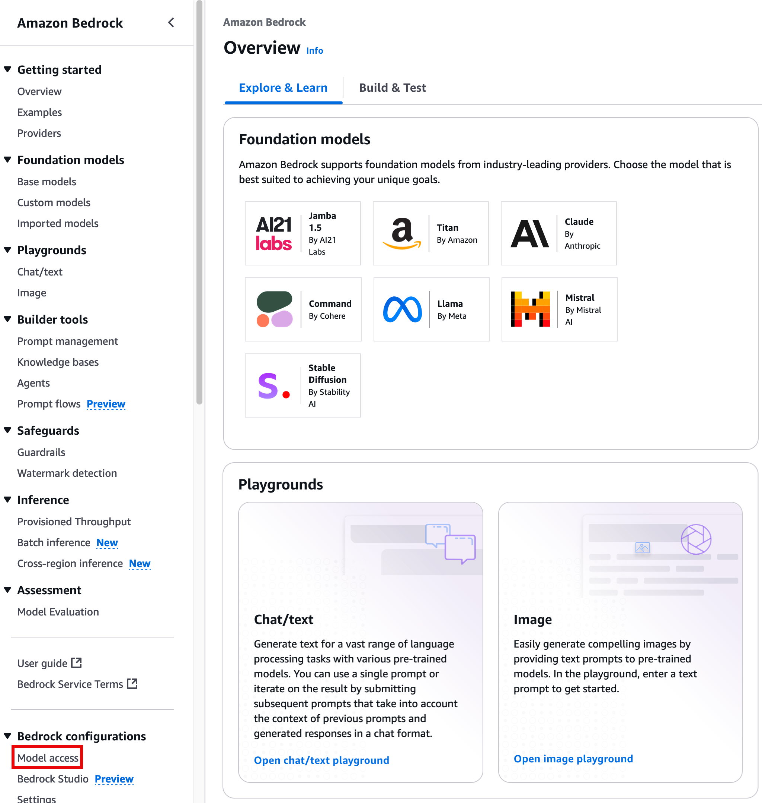 2. Enable a model

On the **What is Model access?**
page, choose **Enable specific
models**.

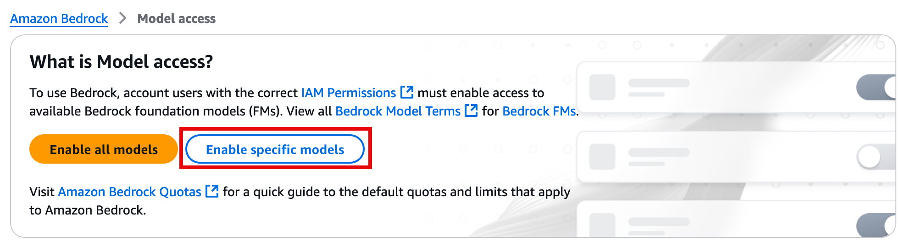 3. Choose the Anthropic models

On the **Edit model access** page,
select the **Anthropic models**,
and choose **Next**.

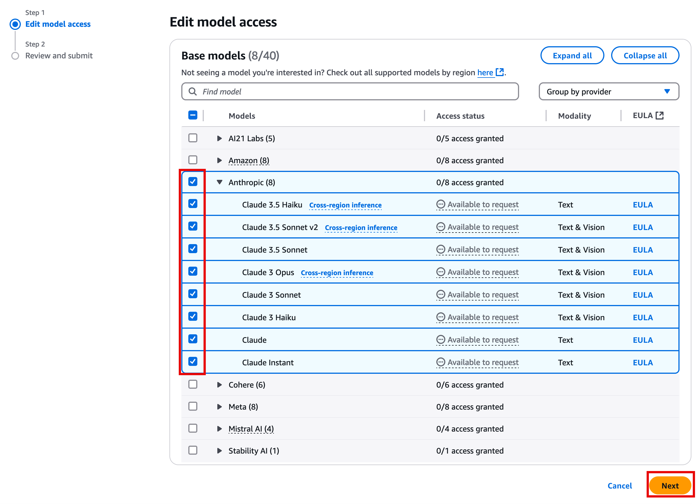 4. Review and submit the change

On the **Review and submit** page,
review your selections, and choose
**Submit**.

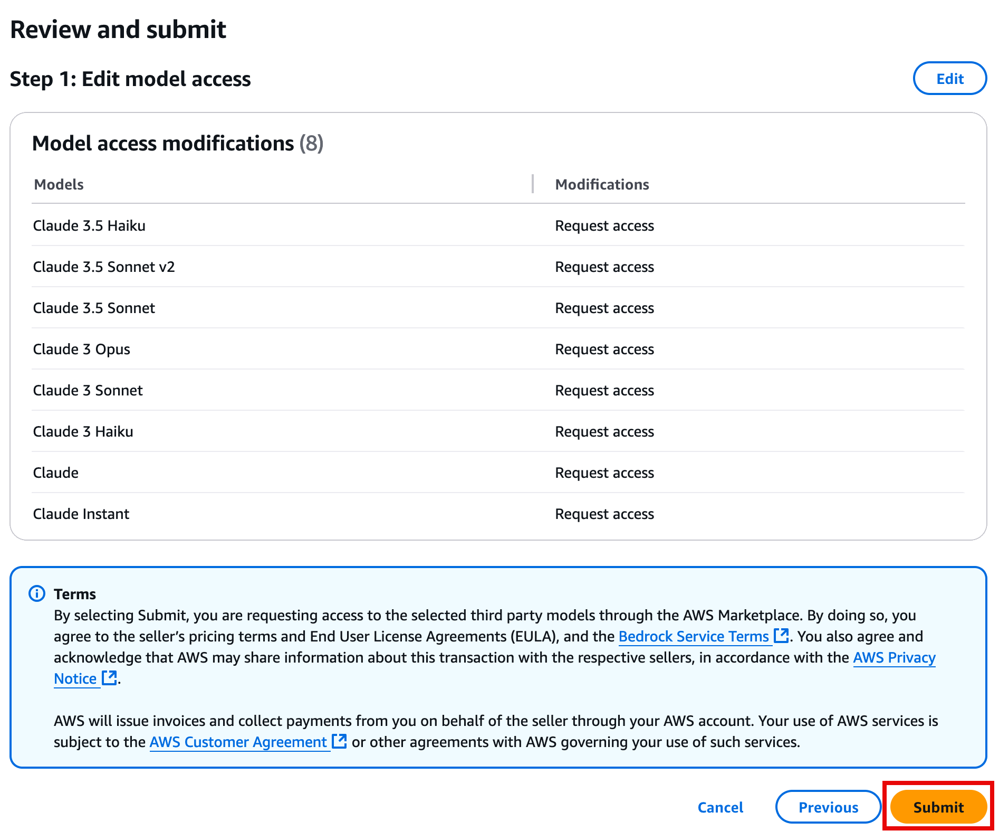
In this step, you will create a Jupyter notebook to write your
Proof-of-Concept code and test it out with real documents.

1. Open Amazon SageMaker AI

**Open** the Amazon Sagemaker
console at
[https://console.aws.amazon.com/sagemaker/home](https://console.aws.amazon.com/sagemaker/home "https://console.aws.amazon.com/sagemaker/home").

In the left navigation pane, under
**Applications and IDEs**, choose
**Notebooks**.

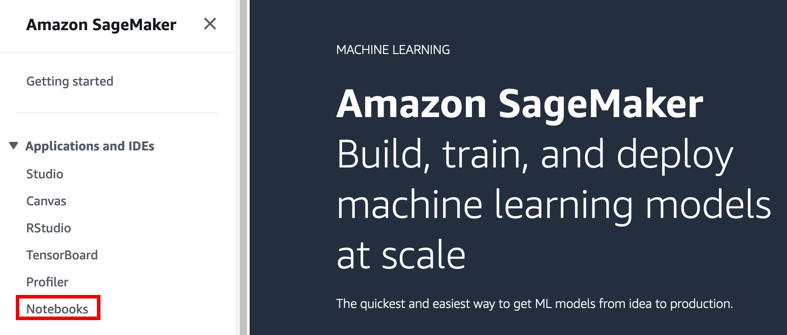 2. Create a notebook instance

On the **Notebooks and Git repos**
page, choose **Create notebook
instance**.

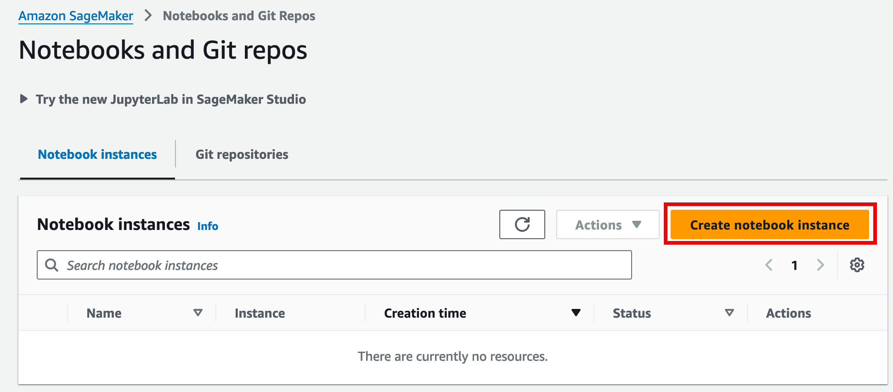 3. Configure notebook instance settings

On the **Create notebook instance**
page:

In the **Notebook instance
settings** section:

    * For **Notebook instance name**,
     enter a **name** for your
     Jupyter instance.
    * For **Notebook instance type**,
     verify **ml.t3.medium** is
     selected.
    * Keep all other default settings.

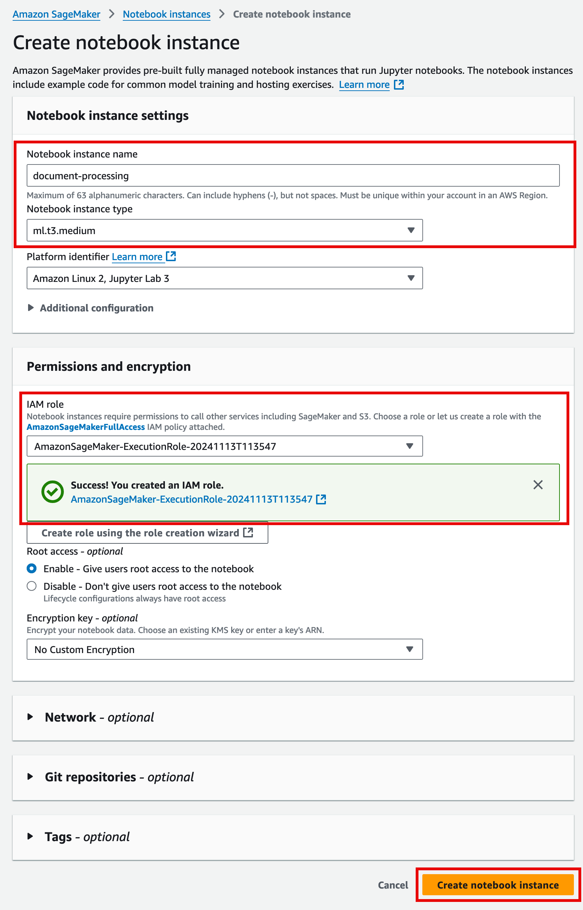 4. Configure permissions and encryption

In the **Permissions and
encryption** section:

    * For **IAM role**, choose
     **Create a new role**.
    * On the **Create an IAM role**
     pop up window, for **S3 buckets you
     specify** – **optional**, choose
     **None**, and then choose
     **Create role**.

Then, choose **Create notebook
instance**.

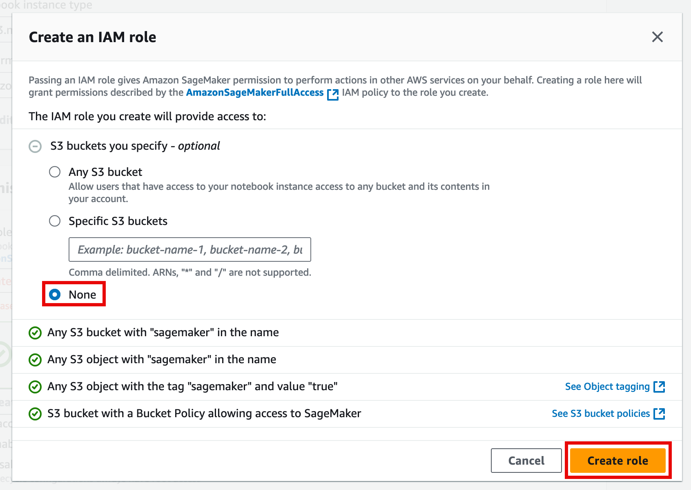
In this step, you will use Bedrock playground to generate code for
your Jupyter notebook.

1. Open JupyterLab

On the **Notebook instance** page,
choose **Open JupyterLab** for the
instance you created in the previous step.  

###### Note

The notebook will open in
a separate browser tab.

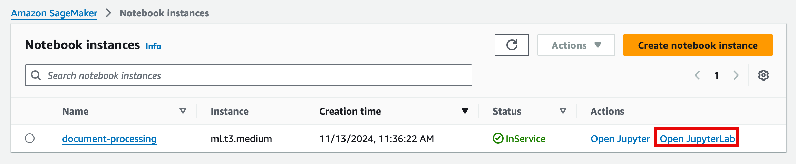 2. Create a new notebook

On the **JupyterLab** tab,
right-click the file area, and then select
**New Notebook**.

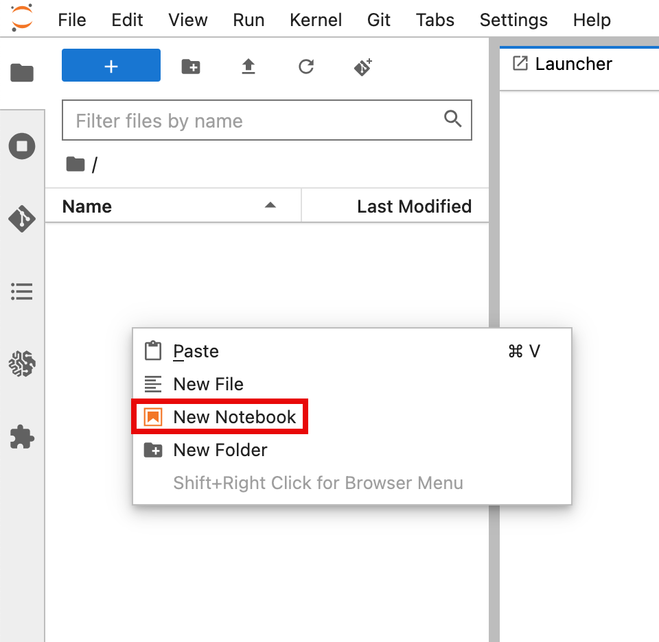 3. Select kernel

On the **Select Kernel** pop up
window, choose **conda_python3**,
and choose **Select**.

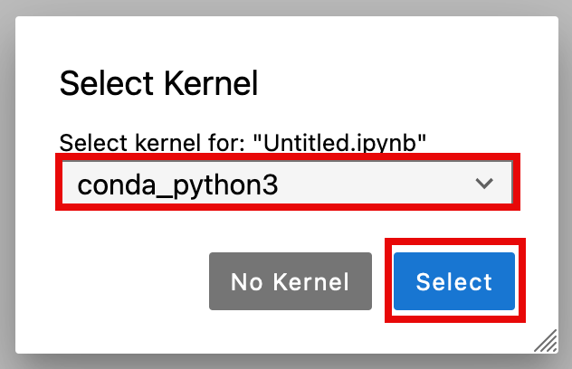 4. Open the chat playground

In a new tab, **open** the Amazon
Bedrock console at
[https://console.aws.amazon.com/bedrock/home](https://console.aws.amazon.com/bedrock/home "https://console.aws.amazon.com/bedrock/home").

In the left navigation pane, under
**Playgrounds**, choose
**Chat/text**.

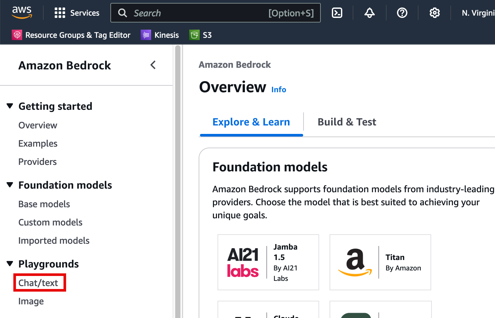 5. Select the model

On the **Mode** page, choose
**Select model**.

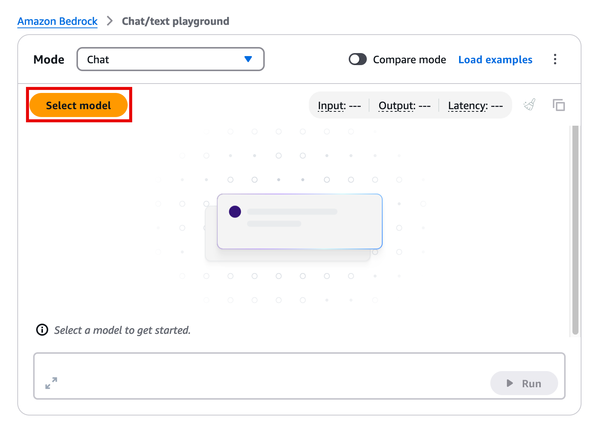 6. Specify the model details

In the **Select model** dialog box:

    * For **Categories**, choose
     **Anthropic**.
    * For **Models with access**,
     choose the **Claude 3.5
     Sonnet** model.
    * Then, choose **Apply**.

###### Note

The Claude 3.5 Sonnet is
the most intelligent model from Anthropic. You can see a more
detailed model comparison
[here](https://docs.anthropic.com/en/docs/about-claude/models "https://docs.anthropic.com/en/docs/about-claude/models").

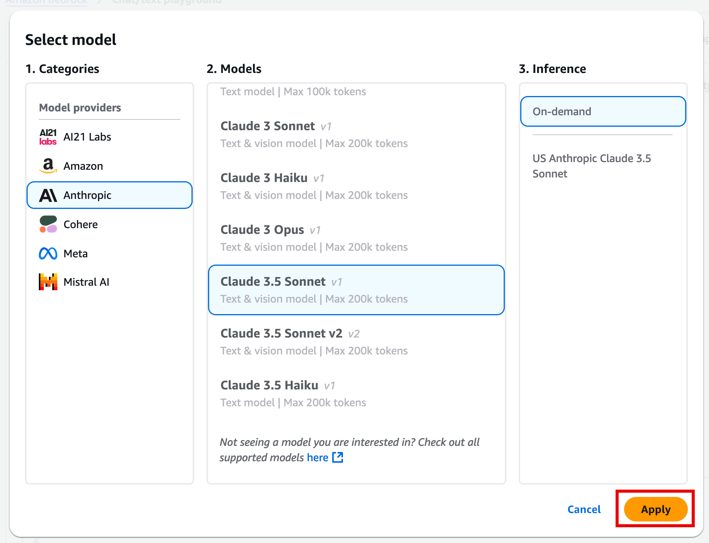 7. Generate code

In the **Chat playground**, you can
now ask the LLM to write sample code. The following is an example
prompt that you can use to extract information from an
unstructured document.

```

I am writing a Jupyter notebook with a proof of concept python code snippets to perform a few tasks.
To start, write a snippet to iterate the current folder and read all the jpg/png files and for each file call textract DetectDocumentText API to extract all the text on the image.
Re-save the result with the same file name and txt extension.
Also make sure to:
- Not reprocess any files that already have the txt file existing in the directory
- Print a progress bar output using tdqm
- Keep everything readable and properly componentized in methods
- No need for __main__ implementations as it's a snippet to run on Jupyter notebook.

```

Once you enter your prompt, and choose
**Run**, the prompt response will
include code and also explanation of everything that the model
generated. The code will typically be enclosed in quotation marks.

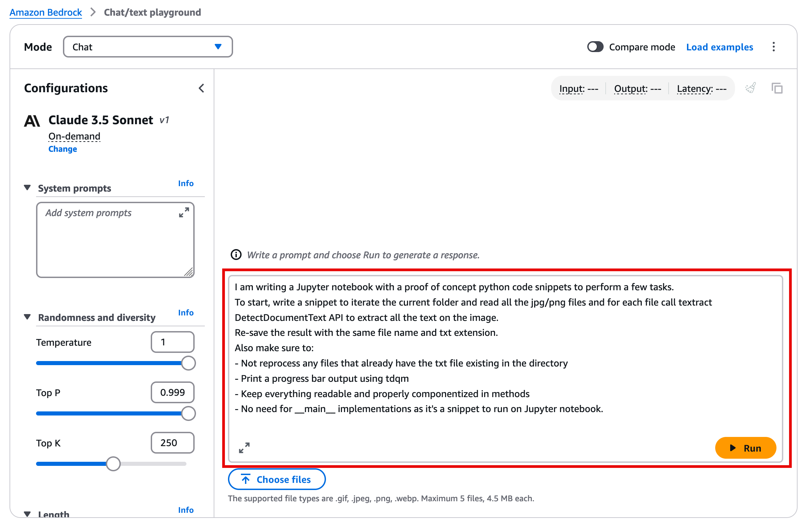 8. Check the output

The generated code with the example prompt should look similar to
the following example. You can also use the
**copy** function to
**paste** the code directly into
the Jupyter notebook.

```
import os
import boto3
from tqdm import tqdm
from PIL import Image

def get_image_files(directory):
    """Get all jpg and png files in the given directory."""
    return [f for f in os.listdir(directory) if f.lower().endswith(('.jpg', '.png'))]

def should_process_file(file_path):
    """Check if the file should be processed (i.e., no corresponding txt file exists)."""
    txt_path = os.path.splitext(file_path)[0] + '.txt'
    return not os.path.exists(txt_path)

def extract_text_from_image(image_path):
    """Extract text from the image using Amazon Textract."""
    client = boto3.client('textract')

    with open(image_path, 'rb') as image:
        response = client.detect_document_text(Document={'Bytes': image.read()})

    extracted_text = []
    for item in response['Blocks']:
        if item['BlockType'] == 'LINE':
            extracted_text.append(item['Text'])

    return '\n'.join(extracted_text)

def save_text_to_file(text, file_path):
    """Save the extracted text to a file."""
    txt_path = os.path.splitext(file_path)[0] + '.txt'
    with open(txt_path, 'w', encoding='utf-8') as f:
        f.write(text)

def process_images_in_directory(directory):
    """Process all images in the given directory."""
    image_files = get_image_files(directory)

    for image_file in tqdm(image_files, desc="Processing images"):
        image_path = os.path.join(directory, image_file)

        if should_process_file(image_path):
            extracted_text = extract_text_from_image(image_path)
            save_text_to_file(extracted_text, image_path)

# Usage in Jupyter notebook
directory = '.'  # Current directory
process_images_in_directory(directory)
```

###### Note

The previous example code
is built to process all files on the current directory and needs
an image in order to fully process the code.

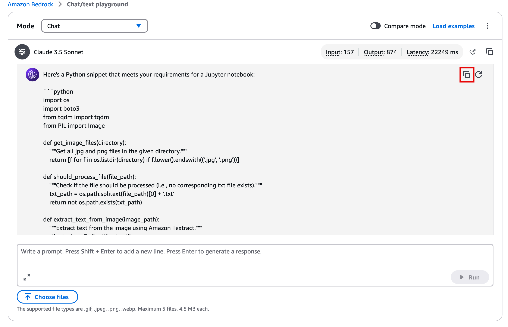 9. Prepare your image file

You can use your own image or download and save this
[image](images/health_insurance_card_redacted.md "images/health_insurance_card_redacted.md").
Then, **find** the image you want
to use on your local machine, and
**drag** the file to the Jupyter
Notebook file explorer in order to copy and paste it.

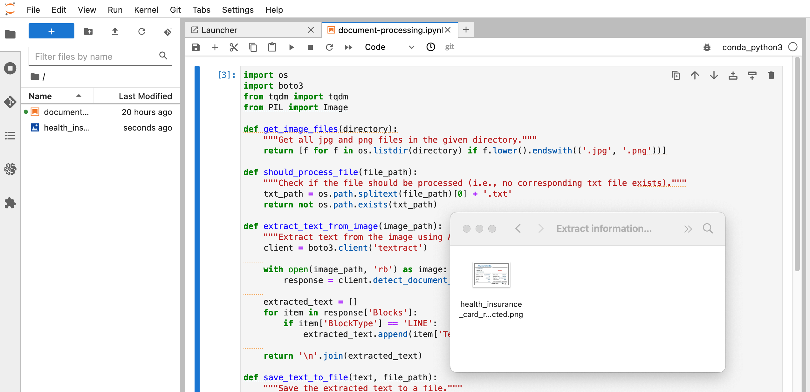 10. Configure permissions

Before you can run the code in your JupyterLab, the IAM role that
was previously created for your Jupyter notebook, needs the
appropriate permissions to run the AWS services that your code is
going to use. If you chose to use the previous example, Amazon Textract is the AWS service that would need the appropriate
permissions.

**Open** the AWS IAM console at
[https://console.aws.amazon.com/iam/home](https://console.aws.amazon.com/iam/home "https://console.aws.amazon.com/iam/home").

In the left navigation pane, choose
**Roles**.

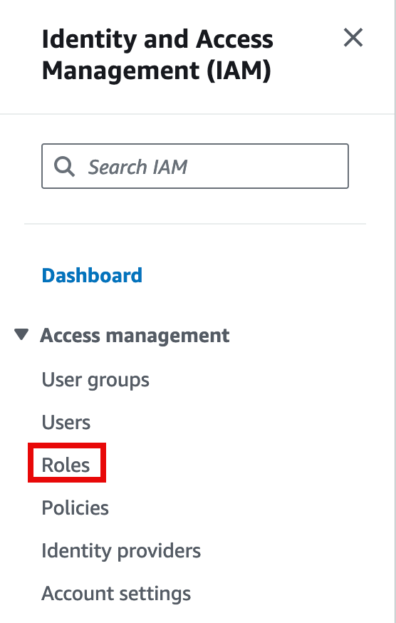 11. Search for the IAM role

In the **search box**, find the
previously created \***\*AmazonSageMaker AI-ExecutionRole-<timestamp>\*\***
role, and **open** the role.

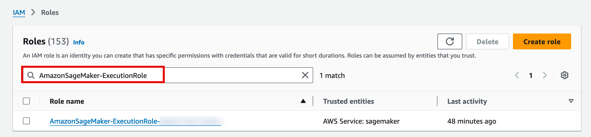 12. Add permissions

On the
**AmazonSageMaker AI-ExecutionRole-<timestamp>**
page, choose the **Add
permissions** drop down, and select
**Attach policies**.

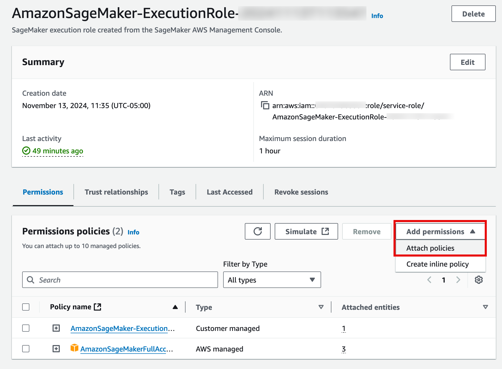 13. Attach the policy

On the **Attach policy to
AmazonSageMaker AI-ExecutionRole-<timestamp>** page,
in the **Other permissions
policies** section search bar, enter
**AmazonAmazon TextractFullAccess**. Then,
select the **policy**, and choose
**Add permissions**.

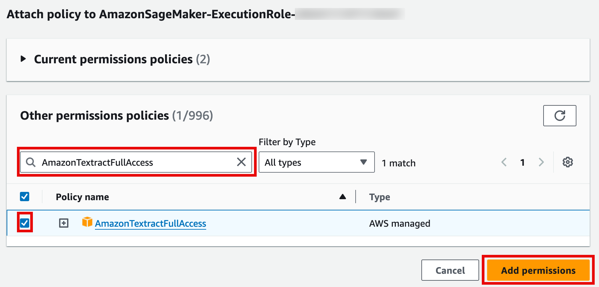 14. Run the notebook

Navigate back to your
**JupyterLab** tab, and select
**Run**.

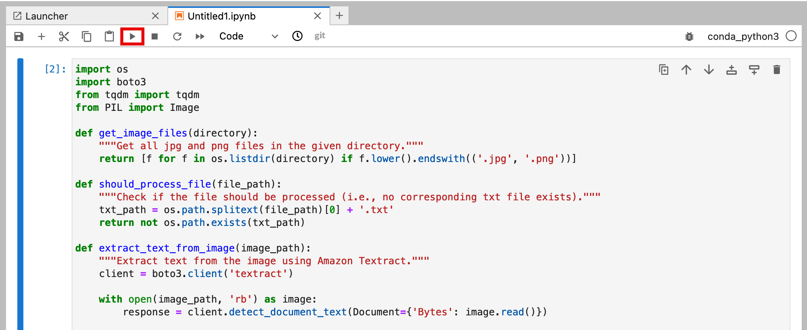 15. View the text file

After your code runs you should now be able to see a \***\*.txt file\*\***
with the extracted text in the left navigation pane of your
JupyterLab.

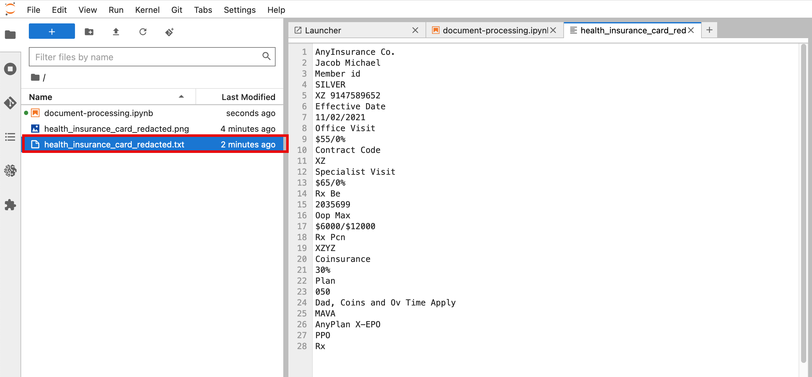
In this step, you will go through the steps to delete all the
resources you created throughout this tutorial. It is recommended
that you stop the Jupyter notebook you created to prevent unexpected
costs.

- Delete the notebook

In the SageMaker AI console, in the left navigation pane, choose
**Notebooks**, and select the
**Notebook**. Then, choose
**Actions**, and select
**Stop**.

###### Note

The stop operation might
take around 5 minutes. Once the notebook is stopped you can also
delete it by choosing **Actions**
and selecting **Delete**.

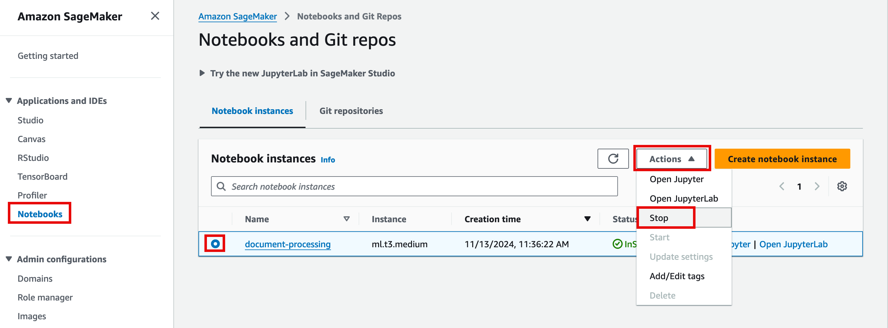

## Congratulations

You have created a sample Proof-of-Concept to extract information
from documents.
