# How to Register a Domain Name with Amazon Route 53

|                      |                                                                                                                                                                                                          |
| -------------------- | -------------------------------------------------------------------------------------------------------------------------------------------------------------------------------------------------------- | ---------------------------------------------------------------------------------------------------------------------------------------------------------------------------------------------------------------------------------------------------------------------------------------------------------------------------------------------------------------------------------------------------------------------------------------------------------------------------------------------------------------------------------------------------------------------------------------------------------------------------------------------------------------------------------------------------------------------------------------------------------------------------------------------------------------------------------------------------------------------------------------------------------------------------------------------------------------------------------------------------------------------------------------------------------------------------------------------------------------------------------------------------------------------------------------------------------------------------------------------------------------------------------------------------------------------------------------------------------------------------------------------------------------------------------------------------------------------------------------------------------------------------------------------------------------------------------------------------------------------------------------------------------------------------------------------------------------------------------------------------------------------------------------------------------------------------------------------------------------------------------------------------------------------------------------------------------------------------------------------------------------------------------------------------------------------------------------------------------------------------------------------------------------------------------------------------------------------------------------------------------------------------------------------------------------------------------------------------------------------------------------------------------------------------------------------------------------------------------------------------------------------------------------------------------------------------------------------------------------------------------------------------------------------------------------------------------------------------------------------------------------------------------------------------------------------------------------------------------------------------------------------------------------------------------------------------------------------------------------------------------------------------------------------------------------------------------------------------------------------------------------------------------------------------------------------------------------------------------------------------------------------------------------------------------------------------------------------------------------------------------------------------------------------------------------------------------------------------------------------------------------------------------------------------------------------------------------------------------------------------------------------------------------------------------------------------------------------------------------------------------------------------------------------------------------------------------------------------------------------------------------------------------------------------------------------------------------------------------------------------------------------------------------------------------------------------------------------------------------------------------------------------------------------------------------------------------------------------------------------------------------------------------------------------------------------------------------------------------------------------------------------------------------------------------------------------------------------------------------------------------------------------------------------------------------------------------------------------------------------------------------------------------------------------------------------------------------------------------------------------------------------------------------------------------------------------------------------------------------------------------------------------------------------------------------------------------------------------------------------------------------------------------------------------------------------------------------------------------------------------------------------------------------------------------------------------------------------------------------------------------------------------------------------------------------------------------------------------------------------------------------------------------------------------------------------------------------------------------------------------------------------------------------------------------------------------------------------------------------------------------------------------------------------------------------------------------------------------------------------------------------------------------------------------------------------------------------------------------------------------------------------------------------------------------------------------------------------------------------------------------------------------------------------------------------------------------------------------------------------------------------------------------------------------------------------------------------------------------------------------------------------------------------------------------------------------------------------------------------------------------------------------------------------------------------------------------------------------------------------------------------------------------------------------------------------------------------------------------------------------------------------------------------------------------------------------------------------------------------------------------------------------------------------------------------------------------------------------------------------------------------------------------------------------------------------------------------------------------------------------------------------------------------------------------------------------------------------------------------------------------------------------------------------------------------------------------------------------------------------------------------------------------------------------------------------------------------------------------------------------------------------------------------------------------------------------------------------------------------------------------------------------------------------------------------------------------------------------------------------------------------------------------------------------------------------------------------------------------------------------------------------------------------------------------------------------------------------------------------------------------------------------------------------------------------------------------------------------------------------------------------------------------------------------------------------------------------------------------------------------------------------------------------------------------------------------------------------------------------------------------------------------------------------------------------------------------------------------------------------------------------------------------------------------- |
| **AWS experience**   | Beginner                                                                                                                                                                                                 |
| **Time to complete** | 10 minutes                                                                                                                                                                                               |
| **Cost to complete** | See [Cost implications:](#cost-implications "#cost-implications")                                                                                                                                        |
| **Requires**         |  • AWS account NoteAccounts created within the past 24 hours might not yet have access to the services required for this tutorial.  • Recommended browser: The latest version of Chrome or Firefox |
| **Last updated**     | November 8, 2022                                                                                                                                                                                         | ## Overview In this guide, you will register a new domain name for your web application. You will then connect that domain name through the Domain Name System (DNS) to a [running web application fronted by an Application Load Balancer (ALB).](https://catalog.us-east-1.prod.workshops.aws/workshops/3de93ad5-ebbe-4258-b977-b45cdfe661f1/en-US/introduction "https://catalog.us-east-1.prod.workshops.aws/workshops/3de93ad5-ebbe-4258-b977-b45cdfe661f1/en-US/introduction") ## Cost implications: There's an annual fee to register a domain. The fee can range from $9 to several hundred dollars depending on the top-level domain. This fee is not refundable. See the [Amazon Route 53 domain pricing](https://aws.amazon.com/route53/pricing/#Domain_Names "https://aws.amazon.com/route53/pricing/#Domain_Names") documentation for full details. When you register a domain, we automatically create a hosted zone that has the same name as the domain. You use the hosted zone to specify where you want Amazon Route 53 to route traffic for your domain. The fee for a hosted zone is $0.50 per month. You can delete the hosted zone if you want to avoid this charge. See the [Amazon Route 53 Hosted Zone pricing](https://aws.amazon.com/route53/pricing/#Hosted_Zones_and_Records "https://aws.amazon.com/route53/pricing/#Hosted_Zones_and_Records") documentation for full details. ## What you will accomplish In this guide, you will learn how to:  • Register a new domain using Amazon Route 53 in the AWS console.  • Update DNS records to point to an existing Application Load Balancer. ## Prerequisites Before starting this guide, you will need:  • An AWS account: If you don't already have one, follow the [Setting Up Your AWS Environment](../setup-environment.md "../setup-environment.md") getting started guide for a quick overview. ## Implementation 1. Open the AWS Management Console Open a browser and navigate to the [AWS Management Console](https://console.aws.amazon.com/ "https://console.aws.amazon.com/"). Once you have logged in, ensure you have selected your desired Region in the upper right hand corner based on your infrastructure requirements. **Pro tip:** You can learn about the console through the [Getting Started with the AWS Management Console](../getting-started-with-aws-management-console.md "../getting-started-with-aws-management-console.md") tutorial. 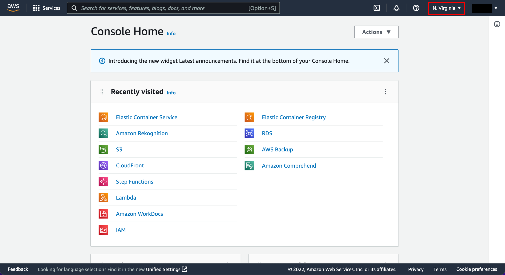 2. Open Route 53 Enter **Route 53** in the search bar and select **Route 53** to open the service console. 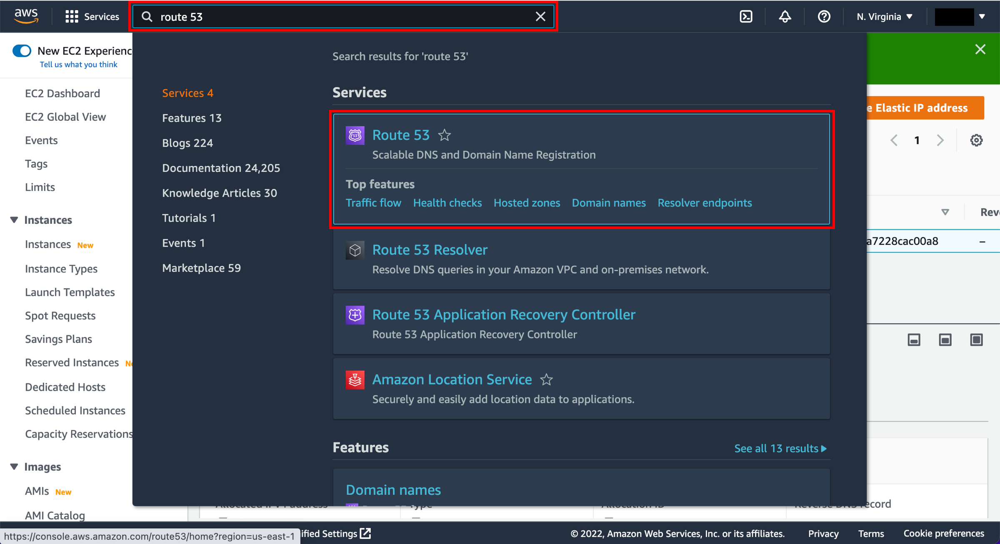 3. Choose Register domain Choose the **Register domain** button. **Dive deeper:** Read the [documentation for registering a new domain](../../../Route%C2%A053/latest/DeveloperGuide/domain-register.md "../../../Route%C2%A053/latest/DeveloperGuide/domain-register.md"). 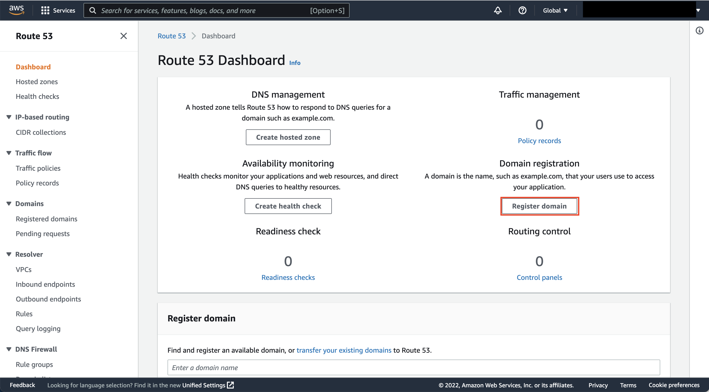 4. Enter a domain name Enter a desired domain name in the text box and choose an extension such as .com in the dropdown list and choose the **Check** button. Choose the **Add to cart** button next to the domain that you want to purchase. Choose the **Continue** button at the bottom of the page. If the domain you chose is not available, choose one of the related domain suggestions or try again with a different domain name. 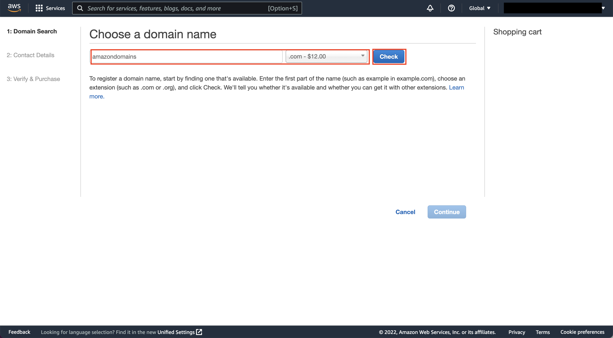 5. Enter your contact information Enter the registrant contact detail for your domain. Choose the **Continue** button on the bottom of the page. 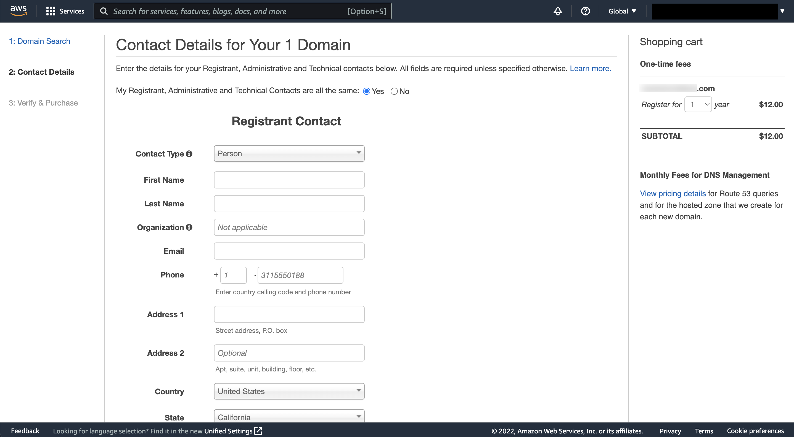 6. Complete your order Verify your contact details. Choose either **Enable** or **Disable** in the auto renewal section. Select the check box after reading and agreeing to the terms and conditions. Choose **Complete Order**. You will receive an email when your domain registration has been approved. To determine the current status of your request, see [Viewing the status of a domain registration](../../../Route%C2%A053/latest/DeveloperGuide/domain-view-status.md "../../../Route%C2%A053/latest/DeveloperGuide/domain-view-status.md"). 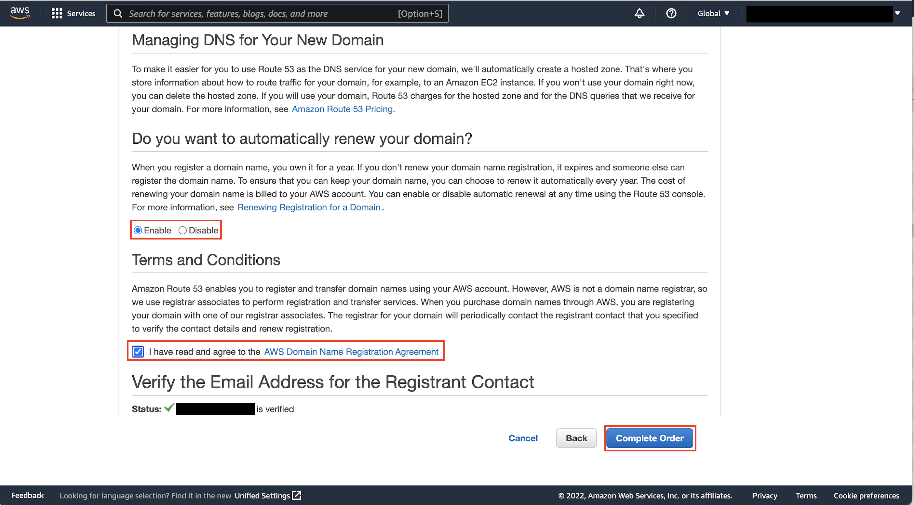 1. Open Route 53 After domain registration is complete, return to the AWS console. Enter **Route 53** in the search bar and select **Route 53** to open the service console.  2. Choose hosted zones Choose **Hosted zones** from the left navigation pane. 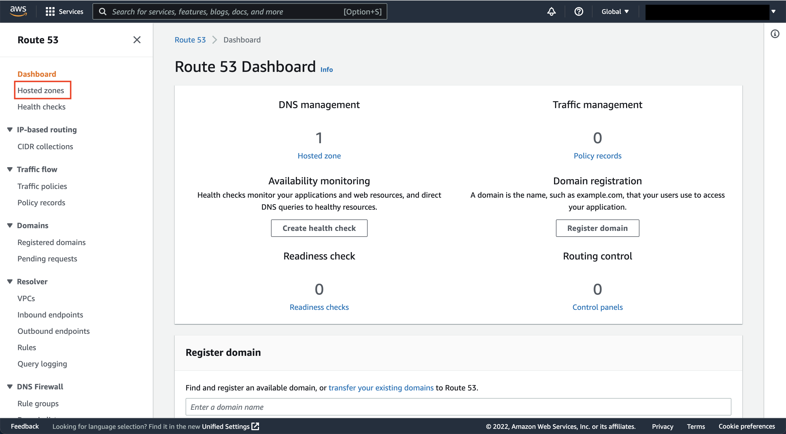 3. Select your hosted zone Select the hosted zone with your domain name that Route 53 created for you as part of the domain registration. 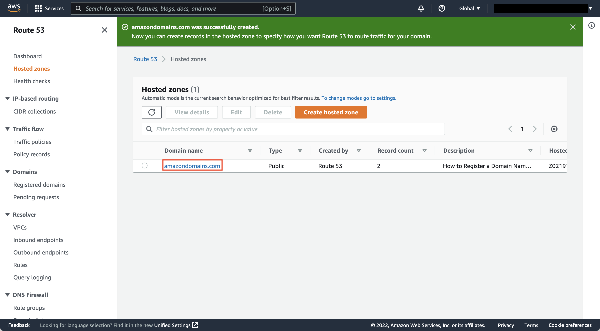 4. Create a record You can now create DNS records for your domain. In this guide, we will create a simple A record type. Choose the Create record button to get started. **Dive deeper:** Read the [Route 53 documentation](../../../route53.md "../../../route53.md") for a full overview of the various records you can create. 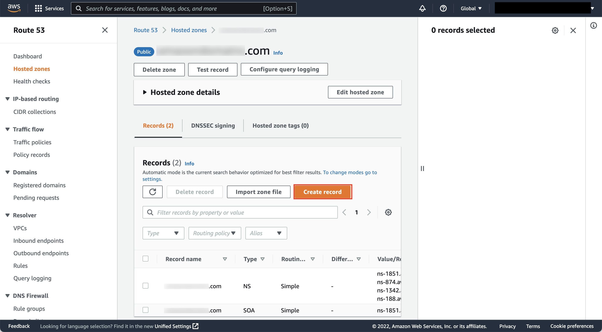 5. Switch to quick create Choose **Switch to quick create** if you are currently in the wizard view. 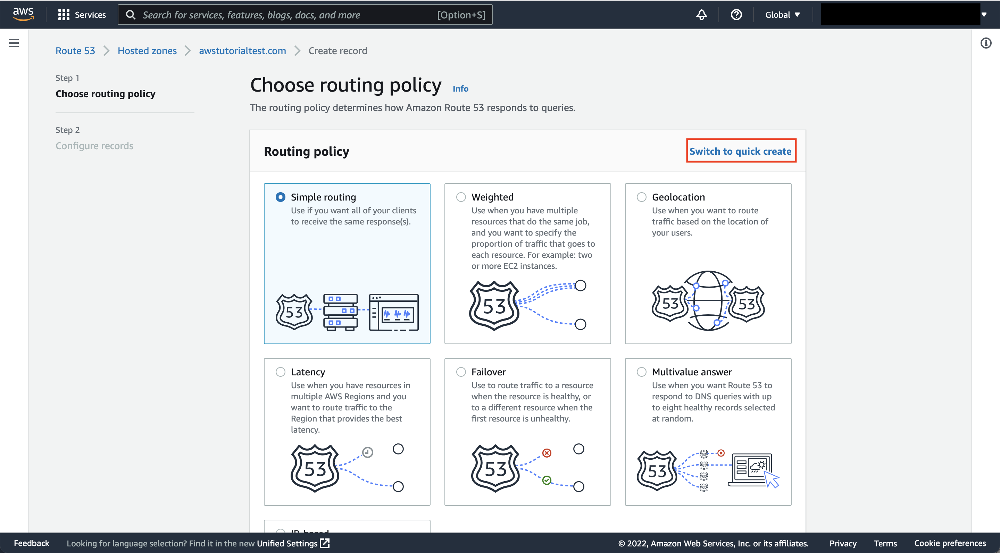 6. Configure IPv4 record To allow clients to connect to your ALB using IPv4, enter your A record information and ensure **A** is selected in the **Record type** field. For this guide, we will enter **www** for **Record name**.  • Turn on **Alias**.  • Select **Alias to Application and Classic Load Balancer** in the **Choose an end point** dropdown menu.  • In the **Choose Region** dropdown menu, select the Region in which your ALB is located.  • In the **Choose load balancer** dropdown menu, select the existing ALB that you want to receive traffic from this domain.  • Choose the **Create records** button once you have finished. **Pro tip:** You can add multiple record types at one time by using the **Add another record** button before finalizing. Your domain is now ready to use with IPv4. Open a browser and enter http://www.<your domain name>. (Make sure you have your application load balancer and target EC2 instance properly set up as a web server before browsing to your domain URL.) 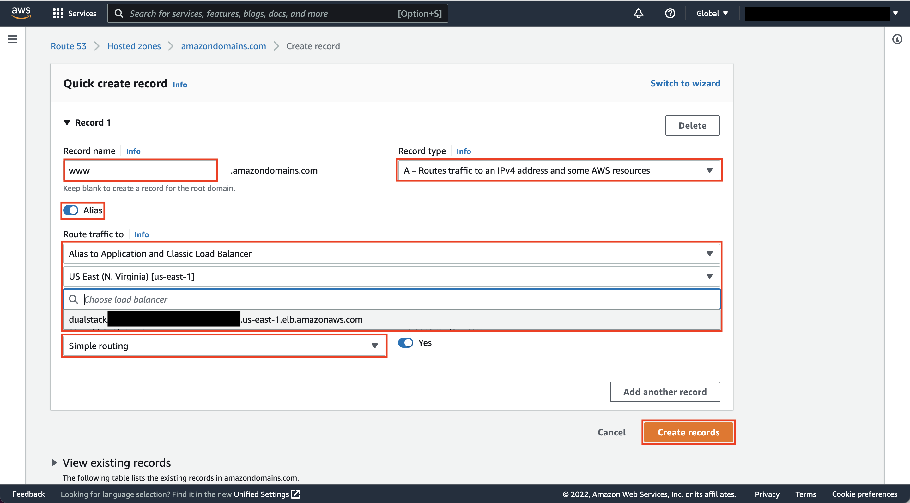 7. Configure IPv6 record To allow clients to connect to your ALB with IPv6, enter in your AAAA record information and ensure **AAAA** is selected in the Record type field. For this guide, we will enter **www** for **Record name**.  • Turn on **Alias**.  • Select **Alias to Application and Classic Load Balancer** in the **Choose an end point** dropdown menu.  • In the **Choose Region** dropdown menu, select the region in which your ALB is located.  • In the **Choose load balancer** dropdown menu, select the existing ALB that you want to receive traffic from this domain.  • Choose the **Create records** button once you have finished. **Pro tip:** You can add multiple record types at one time by using the **Add another record** button before finalizing. Your domain is now ready to use with IPv6. Open a browser and enter http://www.<your domain name>. (Please make sure you have your ALB and target EC2 instance properly set up as a web server before browsing to your domain URL). 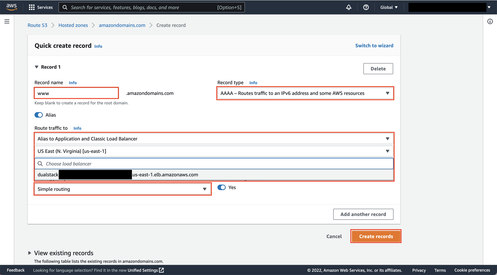 ## Conclusion Congratulations! You have finished the **How to Register a Domain Name with Amazon Route** **53**how-to guide. In this guide, you learned how to provision a public IP address, register a new domain name, and configure DNS. |
