# Host a Static Website

|                      |                                                                                                                                                                                                                                                                                                                                                                                                                                                                                                                                                                                                                                                            |
| -------------------- | ---------------------------------------------------------------------------------------------------------------------------------------------------------------------------------------------------------------------------------------------------------------------------------------------------------------------------------------------------------------------------------------------------------------------------------------------------------------------------------------------------------------------------------------------------------------------------------------------------------------------------------------------------------- | ------------------------------------------------------------------------------------------------------------------------------------------------------------------------------------------------------------------------------------------------------------------------------------------------------------------------------------------------------------------------------------------------------------------------------------------------------------------------------------------------------------------------------------------------------------------------------------------------------------------------------------------------------------------------------------------------------------------------------------------------------------------------------------------------------------------------------------------------------------------------------------------------------------------------------------------------------------------------------------------------------------------------------------------------------------------------------------------------------------------------------------------------------------------------------------------------------------------------------------------------------------------------------------------------------------------------------------------------------------------------------------------------------------------------------------------------------------------------------------------------------------------------------------------------------------------------------------------------------------------------------------------------------------------------------------------------------------------------------------------------------------------------------------------------------------------------------------------------------------------------------------------------------------------------------------------------------------------------------------------------------------------------------------------------------------------------------------------------------------------------------------------------------------------------------------------------------------------------------------------------------------------------------------------------------------------------------------------------------------------------------------------------------------------------------------------------------------------------------------------------------------------------------------------------------------------------------------------------------------------------------------------------------------------------------------------------------------------------------------------------------------------------------------------------------------------------------------------------------------------------------------------------------------------------------------------------------------------------------------------------------------------------------------------------------------------------------------------------------------------------------------------------------------------------------------------------------------------------------------------------------------------------------------------------------------------------------------------------------------------------------------------------------------------------------------------------------------------------------------------------------------------------------------------------------------------------------------------------------------------------------------------------------------------------------------------------------------------------------------------------------------------------------------------------------------------------------------------------------------------------------------------------------------------------------------------------------------------------------------------------------------------------------------------------------------------------------------------------------------------------------------------------------------------------------------------------------------------------------------------------------------------------------------------------------------------------------------------------------------------------------------------------------------------------------------------------------------------------------------------------------------------------------------------------------------------------------------------------------------------------------------------------------------------------------------------------------------------------------------------------------------------------------------------------------------------------------------------------------------------------------------------------------------------------------------------------------------------------------------------------------------------------------------------------------------------------------------------------------------------------------------------------------------------------------------------------------------------------------------------------------------------------------------------------------------------------------------------------------------------------------------------------------------------------------------------------------------------------------------------------------------------------------------------------------------------------------------------------------------------------------------------------------------------------------------------------------------------------------------------------------------------------------------------------------------------------------------------------------------------------------------------------------------------------------------------------------------------------------------------------------------------------------------------------------------------------------------------------------------------------------------------------------------------------------------------------------------------------------------------------------------------------------------------------------------------------------------------------------------------------------------------------------------------------------------------------------------------------------------------------------------------------------------------------------------------------------------------------------------------------------------------------------------------------------------------------------------------------------------------------------------------------------------------------------------------------------------------------------------------------------------------------------------------------------------------------------------------------------------------------------------------------------------------------------------------------------------------------------------------------------------------------------------------------------------------------------------------------------------------------------------------------------------------------------------------------------------------------------------------------------------------------------------------------------------------------------------------------------------------------------------------------------------------------------------------------------------------------------------------------------------------------------------------------------------------------------------------------------------------------------------------------------------------------------------------------------------------------------------------------------------------------------------------------------------------------------------------------------------------------------------------------------------------------------------------------------------------------------------------------------------------------------------------------------------------------------------------------------------------------------------------------------------------- |
| **AWS experience**   | Beginner                                                                                                                                                                                                                                                                                                                                                                                                                                                                                                                                                                                                                                                   |
| **Time to complete** | 10 minutes                                                                                                                                                                                                                                                                                                                                                                                                                                                                                                                                                                                                                                                 |
| **Cost to complete** | Total cost of hosting your static website on AWS is dependent on your usage  • Outside of [AWS Free Tier Limits](https://aws.amazon.com/free/?p=gsrc&c=ho_hsw "https://aws.amazon.com/free/?p=gsrc&c=ho_hsw"): typically $1-3/mo.  • Within AWS Free Tier Limits: typically $0.50/mo. To see a breakdown of the services used and their associated costs, see pricing for [AWS Amplify](https://aws.amazon.com/amplify/pricing/?p=gsrc&c=ho_hsw "https://aws.amazon.com/amplify/pricing/?p=gsrc&c=ho_hsw") and [Amazon Route 53](https://aws.amazon.com/route53/pricing/?p=gsrc&c=ho_hsw "https://aws.amazon.com/route53/pricing/?p=gsrc&c=ho_hsw"). |
| **Get help**         | [Troubleshooting Amplify](https://docs.amplify.aws/react/build-a-backend/troubleshooting/ "https://docs.amplify.aws/react/build-a-backend/troubleshooting/")                                                                                                                                                                                                                                                                                                                                                                                                                                                                                               |
| **Last updated**     | July 16, 2024                                                                                                                                                                                                                                                                                                                                                                                                                                                                                                                                                                                                                                              | ## Overview In this tutorial, you will learn how to deploy a static website with AWS Amplify. Amplify offers a Git-based CI/CD workflow for building, deploying, and hosting websites. Static websites deliver HTML, JavaScript, images, video and other files to your website visitors. Static websites are very low cost, provide high-levels of reliability, require almost no IT administration, and scale to handle enterprise-level traffic with no additional work. For more information, see the [FAQs](faq.md "faq.md"). ## What you will accomplish In this tutorial, you will:  • **Host a static website** using [AWS Amplify](https://aws.amazon.com/amplify/console/?p=gsrc&c=ho_hsw "https://aws.amazon.com/amplify/console/?p=gsrc&c=ho_hsw") in the AWS Management Console. AWS Amplify provides fully managed hosting for static websites and web apps. Amplify’s hosting solution leverages Amazon CloudFront and Amazon S3 to deliver your site assets via the AWS content delivery network (CDN).  • **Set up continuous deployment:** Amplify offers a Git-based workflow with continuous deployment, allowing you to automatically deploy updates to your site on every code commit. ## Prerequisites Before starting this tutorial, you will need:  • An **AWS account**: if you don't already have one follow the [Setup Your Environment](../setup-environment.md "../setup-environment.md") tutorial.  • Your **AWS profile** [configured](https://docs.amplify.aws/react/start/account-setup/ "https://docs.amplify.aws/react/start/account-setup/") for local development.  • **Installed** on your environment: [Nodejs](https://nodejs.org/en/download "https://nodejs.org/en/download") and [npm](https://www.npmjs.com/ "https://www.npmjs.com/").  • Familiarity with git and a [Github](https://github.com "https://github.com") account. ## Implementation Already have a repository to connect? Skip to Initialize GitHub Repository Want to deploy without connecting to a Git provider? [Follow these instructions](../../../amplify/latest/userguide/manual-deploys.md "../../../amplify/latest/userguide/manual-deploys.md") 1. Create the application In a new terminal window or command line, **run** the following command to use Vite to create a React application: `npm create vite@latest staticwebsite -- --template react cd staticwebsite npm install npm run dev` 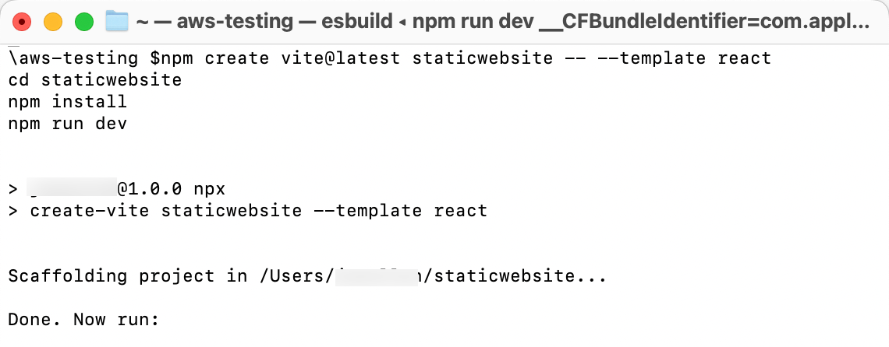 2. View the application In the terminal window, select and open the **Local link** to view the Vite + React application. `npm create vite@latest staticwebsite -- --template react cd staticwebsite npm install npm run dev` 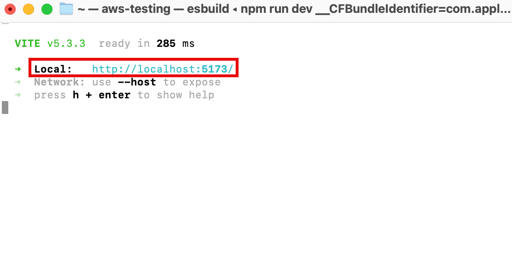 In this step, you will create a GitHub repository and commit your code to the repository. You will need a GitHub account to complete this step, if you do not have an account, [sign up here](https://github.com/ "https://github.com/"). ###### Note If you have never used GitHub on your computer, follow [the steps](https://docs.github.com/en/authentication/connecting-to-github-with-ssh "https://docs.github.com/en/authentication/connecting-to-github-with-ssh") to generate and add an SSH key to your account before continuing to allow connection to your account. 1. Open GitHub **Sign in** to GitHub at [https://github.com/](https://github.com/ "https://github.com/").  2. Create a repository In the **Start a new repository** section, make the following selections:  • For **Repository name**, enter **staticwebsite**, and choose the **Public** radio button.  • Then select, **Create a new repository**. 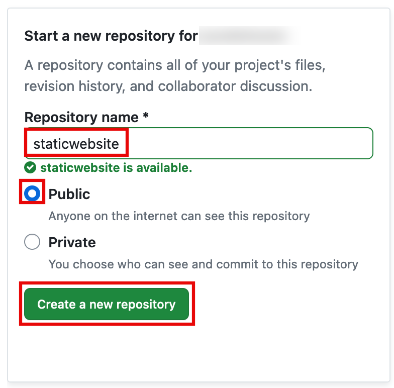 3. Push the application to GitHub **Open** a new terminal window, **navigate** to your projects root folder (**staticwebsite**), and **run** the following commands to initialize a git and push the application to the new GitHub repo: ###### Note Replace the **SSH GitHub UR**L in the command with your SSH GitHub URL. `git init git add . git commit -m "first commit" git remote add origin git@github.com:<your-username>/staticwebsite.git git branch -M main git push -u origin main` 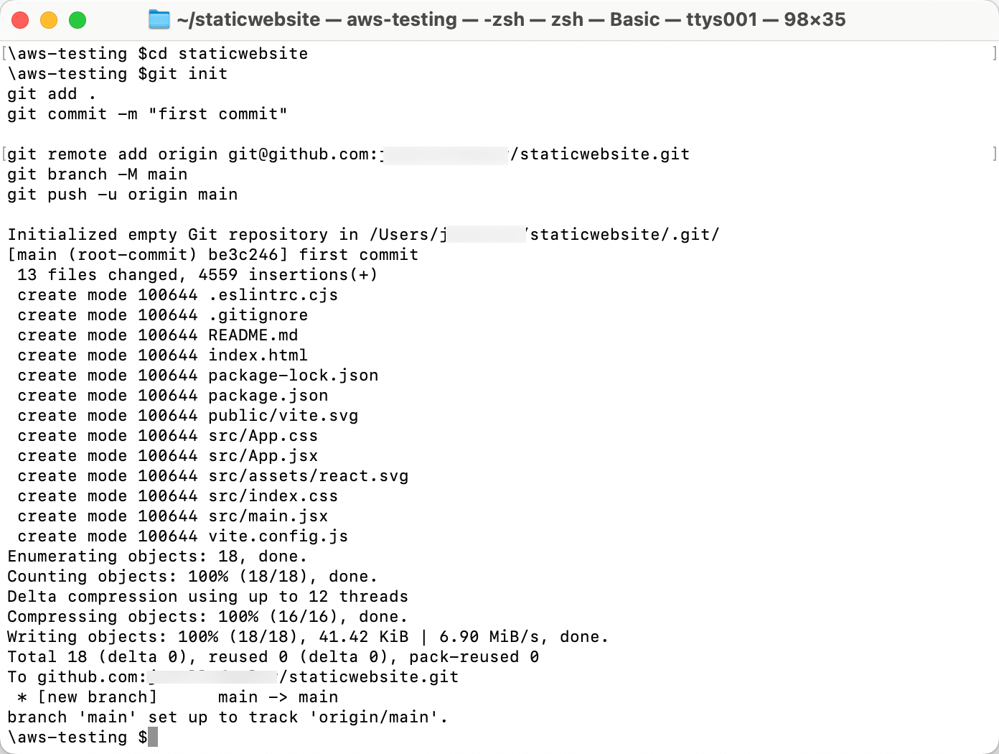 In this step, you will connect the GitHub repository you just created to AWS Amplify. This will enable you to build, deploy, and host your app on AWS. 1. Create an Amplify app **Sign in** to the AWS Management Console in a new browser window, and open the AWS Amplify console at [https://console.aws.amazon.com/amplify/apps](https://console.aws.amazon.com/amplify/apps "https://console.aws.amazon.com/amplify/apps"). Choose **Create new app.** 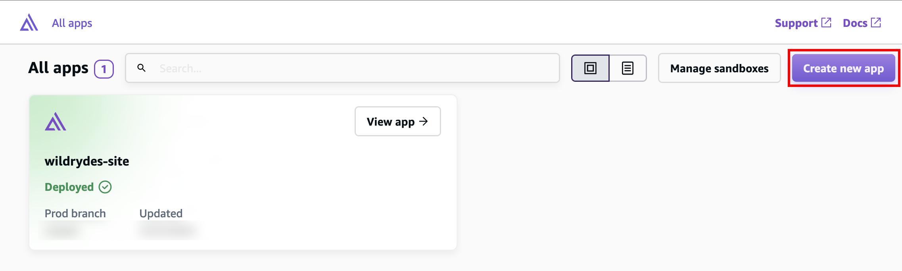 2. Choose the GitHub repository On the **Start building with Amplify** page, for **Deploy your app**, select **GitHub**, and select **Next**. ###### Notes  • If you are using an existing repository, connect your GitHub, Bitbucket, GitLab, or AWS CodeCommit repositories.  • You also have the option of manually uploading your build artifacts without connecting a Git repository (see [Manual Deploys](../../../amplify/latest/userguide/manual-deploys.md "../../../amplify/latest/userguide/manual-deploys.md")).  • After you authorize the Amplify console, Amplify fetches an access token from the repository provider, but it doesn’t store the token on the AWS servers. Amplify accesses your repository using deploy keys installed in a specific repository only. 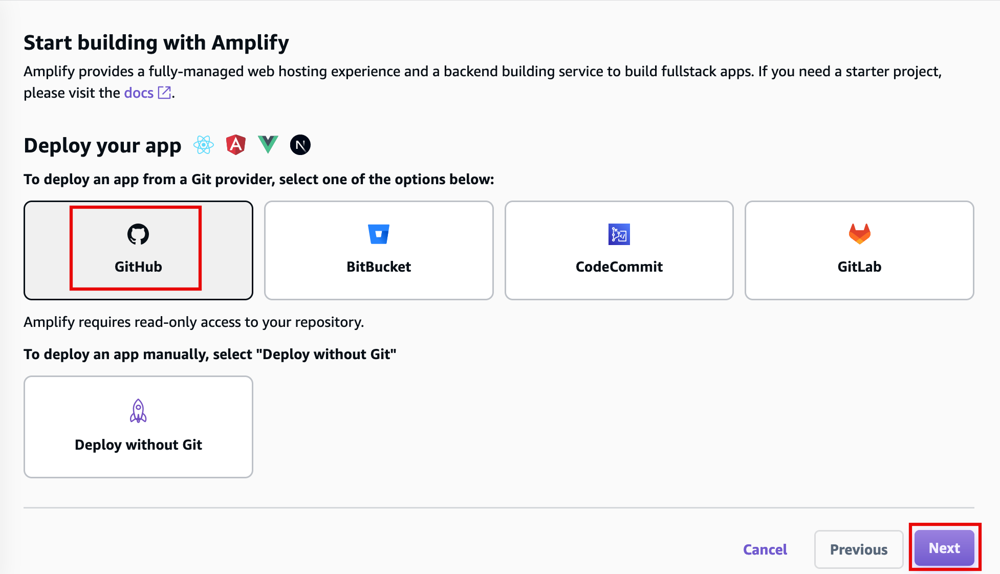 3. Select repository branch When prompted, **authenticate** with GitHub. You will be automatically redirected back to the Amplify console. Choose the **repository** and **main branch** you created earlier. Then select **Next**. 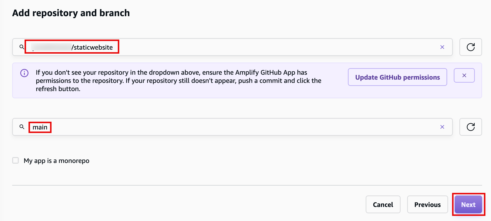 4. Review build settings Leave the default **build settings** and select **Next**.  • Amplify inspects your repository to automatically detect the sequence of build commands to be invoked. 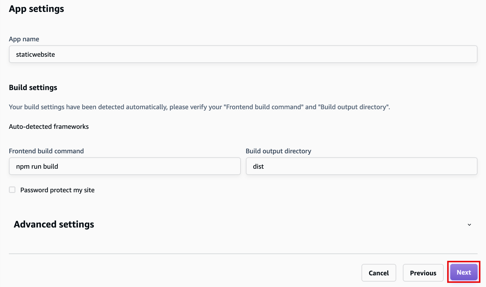 5. Deploy the app Review the inputs selected, and choose **Save and deploy** to deploy your web app to a global content delivery network (CDN). 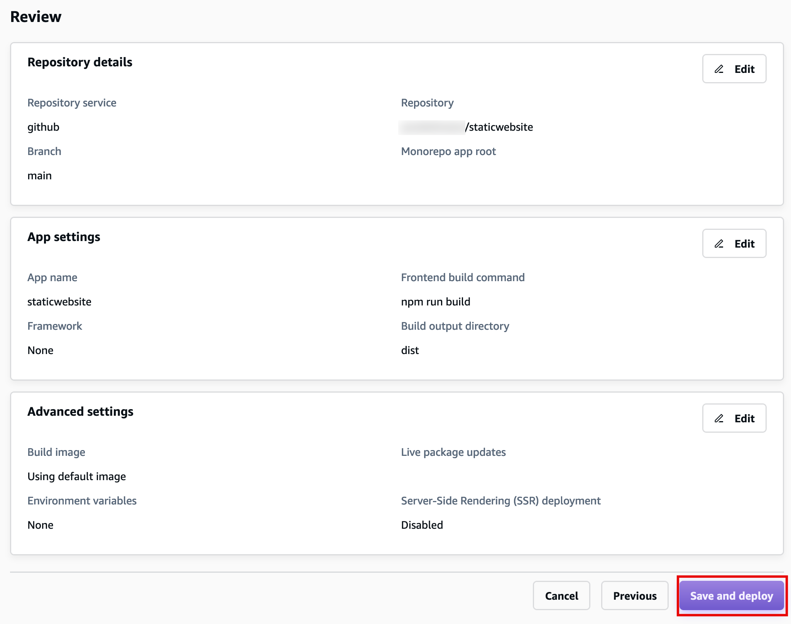 6. View your deployed app AWS Amplify will now build your source code and deploy your app at **https://...amplifyapp.com**, and on every git push your deployment instance will update. It may take 2-5 minutes to deploy your app based on the size. Once the build completes, select the **Visit deployed URL** button to see your web app up and running live. 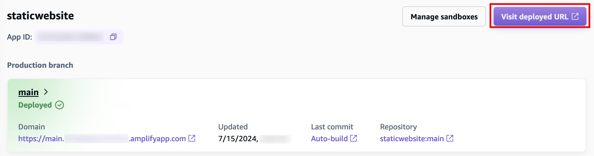 It is recommended that you delete the app and the backend resources that you created during this tutorial to prevent unexpected costs.  • Delete the app In the Amplify console, in the left-hand navigation for the **staticwebsite** app, choose **App settings**, and select **General settings**. In the General settings section, choose **Delete app**. 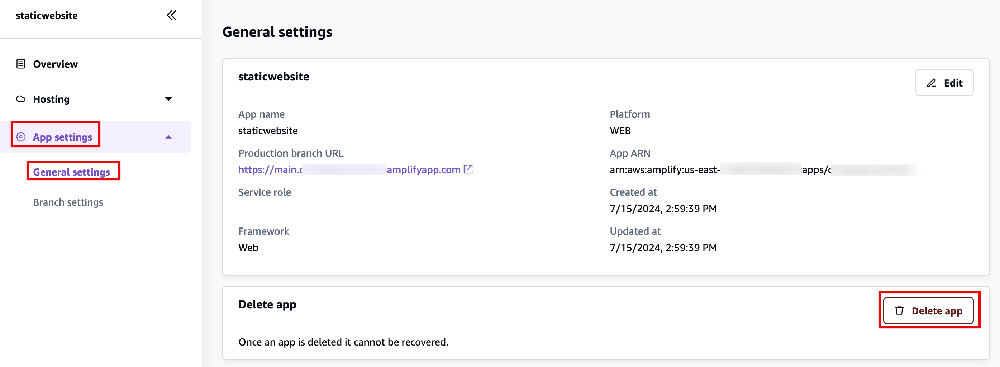 ## Congratulations You have finished the **Host a Static Website on AWS** tutorial! |
