# Launch a Linux Virtual Machine with Amazon Lightsail

|                      |                                                                                                                                                                                                          |
| -------------------- | -------------------------------------------------------------------------------------------------------------------------------------------------------------------------------------------------------- | ------------------------------------------------------------------------------------------------------------------------------------------------------------------------------------------------------------------------------------------------------------------------------------------------------------------------------------------------------------------------------------------------------------------------------------------------------------------------------------------------------------------------------------------------------------------------------------------------------------------------------------------------------------------------------------------------------------------------------------------------------------------------------------------------------------------------------------------------------------------------------------------------------------------------------------------------------------------------------------------------------------------------------------------------------------------------------------------------------------------------------------------------------------------------------------------------------------------------------------------------------------------------------------------------------------------------------------------------------------------------------------------------------------------------------------------------------------------------------------------------------------------------------------------------------------------------------------------------------------------------------------------------------------------------------------------------------------------------------------------------------------------------------------------------------------------------------------------------------------------------------------------------------------------------------------------------------------------------------------------------------------------------------------------------------------------------------------------------------------------------------------------------------------------------------------------------------------------------------------------------------------------------------------------------------------------------------------------------------------------------------------------------------------------------------------------------------------------------------------------------------------------------------------------------------------------------------------------------------------------------------------------------------------------------------------------------------------------------------------------------------------------------------------------------------------------------------------------------------------------------------------------------------------------------------------------------------------------------------------------------------------------------------------------------------------------------------------------------------------------------------------------------------------------------------------------------------------------------------------------------------------------------------------------------------------------------------------------------------------------------------------------------------------------------------------------------------------------------------------------------------------------------------------------------------------------------------------------------------------------------------------------------------------------------------------------------------------------------------------------------------------------------------------------------------------------------------------------------------------------------------------------------------------------------------------------------------------------------------------------------------------------------------------------------------------------------------------------------------------------------------------------------------------------------------------------------------------------------------------------------------------------------------------------------------------------------------------------------------------------------------------------------------------------------------------------------------------------------------------------------------------------------------------------------------------------------------------------------------------------------------------------------------------------------------------------------------------------------------------------------------------------------------------------------------------------------------------------------------------------------------------------------------------------------------------------------------------------------------------------------------------------------------------------------------------------------------------------------------------------------------------------------------------------------------------------------------------------------------------------------------------------------------------------------------------------------------------------------------------------------------------------------------------------------------------------------------------------------------------------------------------------------------------------------------------------------------------------------------------------------------------------------------------------------------------------------------------------------------------------------------------------------------------------------------------------------------------------------------------------------------------------------------------------------------------------------------------------------------------------------------------------------------------------------------------------------------------------------------------------------------------------------------------------------------------------------------------------------------------------------------------------------------------------------------------------------------------------------------------------------------------------------------------------------------------------------------------------------------------------------------------------------------------------------------------------------------------------------------------------------------------------------------------------------------------------------------------------------------------------------------------------------------------------------------------------------------------------------------------------------------------------------------------------------------------------------------------------------------------------------------------------------------- |
| **AWS experience**   | Beginner                                                                                                                                                                                                 |
| **Time to complete** | 10 minutes                                                                                                                                                                                               |
| **Cost to complete** | [Free Tier](https://aws.amazon.com/free/?e=gs2020&p=build-a-web-app-intro "https://aws.amazon.com/free/?e=gs2020&p=build-a-web-app-intro") eligible                                                      |
| **Requires**         |  • AWS account NoteAccounts created within the past 24 hours might not yet have access to the services required for this tutorial.  • Recommended browser: The latest version of Chrome or Firefox |
| **Last updated**     | Aug 23, 2022                                                                                                                                                                                             | ## Overview Lightsail is one of the easiest ways to get started on AWS. It offers virtual servers, storage, databases, and networking, plus a cost-effective, monthly plan. It’s designed to help you start small, and then scale as you grow. In this tutorial, you create an Amazon Linux instance in Amazon Lightsail in seconds. After the instance is up and running, you connect to it via SSH within the Lightsail console using the browser-based SSH terminal. [Get started with Lightsail for free](https://portal.aws.amazon.com/billing/signup?client=lightsail&fid=1A3F6B376ECAC516-2C15C39C5ACECACB&redirect_url=https%3A%2F%2Flightsail.aws.amazon.com%2Fls%2Fsignup#/start "https://portal.aws.amazon.com/billing/signup?client=lightsail&fid=1A3F6B376ECAC516-2C15C39C5ACECACB&redirect_url=https%3A%2F%2Flightsail.aws.amazon.com%2Fls%2Fsignup#/start") ## Implementation  • There are no charges for using Amazon Lightsail for this tutorial. [Sign up for an AWS account](https://signin.aws.amazon.com/signup?request_type=register "https://signin.aws.amazon.com/signup?request_type=register") Already have an account? [Sign-in](https://lightsail.aws.amazon.com/ls/ "https://lightsail.aws.amazon.com/ls/")  • Choose **Create instance** in the **Instances** tab of the Lightsail home page. 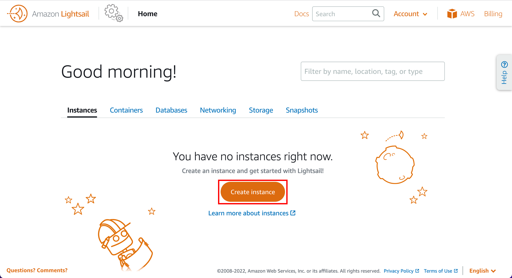 1. Choose a Region An AWS Region and Availability Zone is selected for you. Choose **Change AWS Region and Availability Zone** to create your instance in another location. ###### Note Static IP addresses can only be attached to instances in the same region.  2. Choose an instance image Choose the **Linux/Unix** platform option, and choose **OS Only** to view the operating system-only instance images available in Lightsail. To learn more about Lightsail instance images, see [Choose an Amazon Lightsail instance image](https://lightsail.aws.amazon.com/ls/docs/en_us/articles/compare-options-choose-lightsail-instance-image "https://lightsail.aws.amazon.com/ls/docs/en_us/articles/compare-options-choose-lightsail-instance-image"). 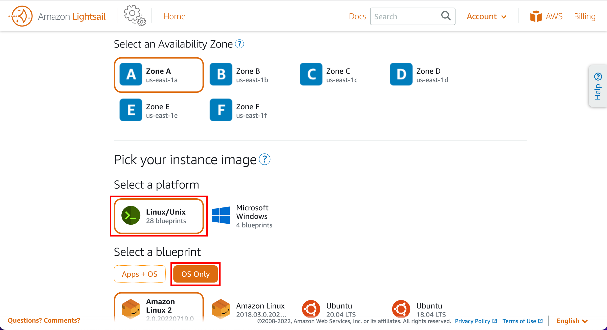 3. Choose the blueprint Choose the **Amazon Linux 2 blueprint** option. 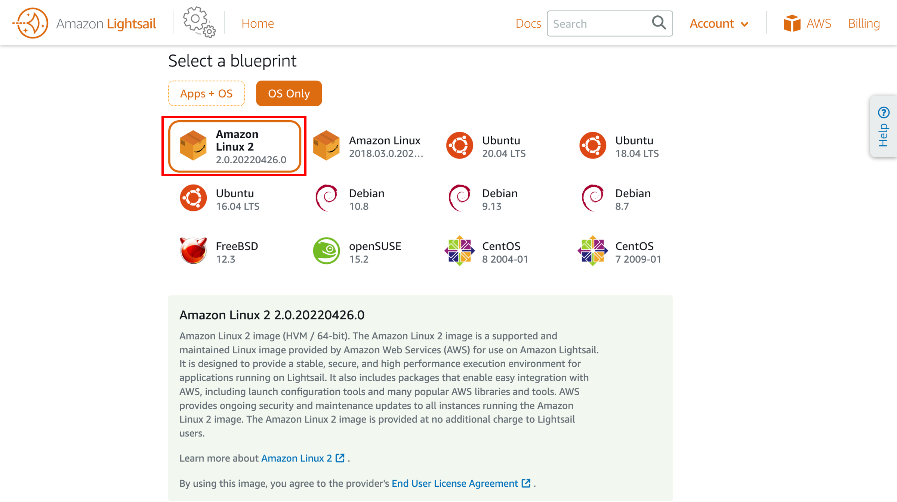 4. (Optional) Configure launch script Choose **Add launch script** to add a shell script that will run on your instance when it launches. 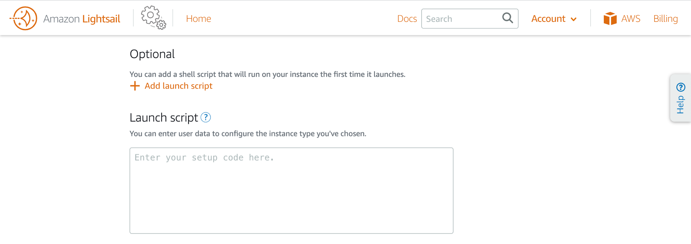 5. (Optional) Choose an SSH key pair Choose **Change SSH key pair** to select, create, or upload the key pair you would like to use to SSH into your instance. 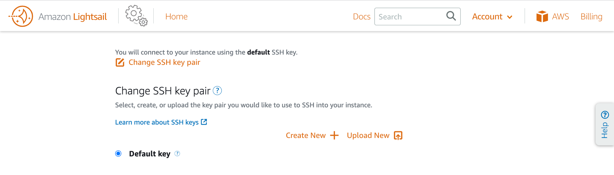 6. (Optional) Configure automatic snapshots Choose **Enable Automatic Snapshots** to automatically create a backup image of your instance and attached disks on a daily schedule. 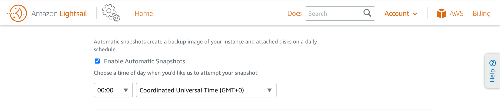 7. Select a pricing plan Choose your instance plan. You can try the $3.50 USD Lightsail plan free for the first three months (up to 750 hours). We'll credit the first three months to your account. Learn more on our [Lightsail pricing page](https://aws.amazon.com/lightsail/pricing/?p=gsrc&c=ho_lvm "https://aws.amazon.com/lightsail/pricing/?p=gsrc&c=ho_lvm"). 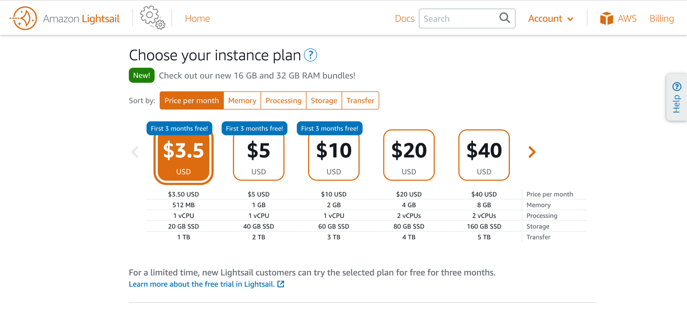 8. Specify the instance name Enter a name for your instance. 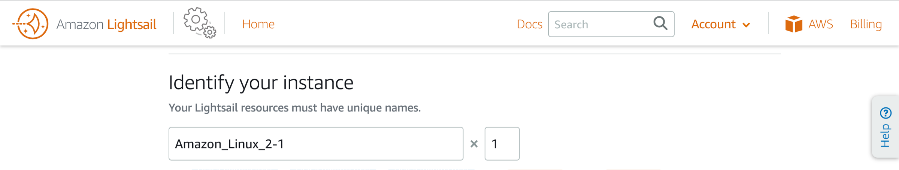 9. (Optional) Add instance tags Choose one of the following options to add tags to your instance: (Optional) Add key-only tags — Enter your new tag into the tag key text box, and press **Enter**. Choose **Save** when you’re done entering your tags to add them, or choose **Cancel** to not add them. (Optional) Create a key-value tag — Enter a key into the **Key** text box, and a value into the **Value** text box. Choose **Save** when you’re done entering your tags, or choose **Cancel** to not add them. Key-value tags can only be added one at a time before saving. To add more than one key-value tag, repeat the previous steps. For more information about key-only and key-value tags, see [Tags in Amazon Lightsail](https://lightsail.aws.amazon.com/ls/docs/en_us/articles/amazon-lightsail-tags "https://lightsail.aws.amazon.com/ls/docs/en_us/articles/amazon-lightsail-tags"). 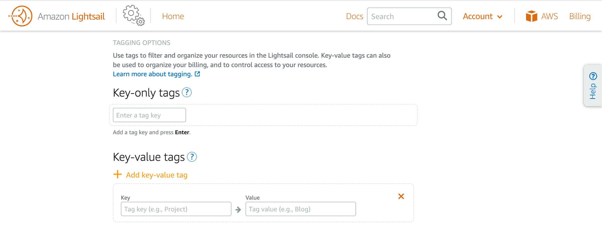 10. Launch the instance Choose **Create instance**. 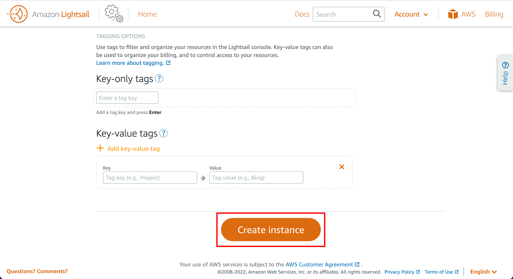 Connect to your instance using the browser-based SSH terminal in Lightsail.  • Connect to the instance terminal In the **Instances** tab of the [Lightsail home page](https://lightsail.aws.amazon.com/ls/webapp/home/instances "https://lightsail.aws.amazon.com/ls/webapp/home/instances"), choose the terminal icon, or the ellipsis (⋮) icon next to the Amazon Linux instance you just created. The browser-based SSH terminal window appears. You can type Linux commands into the browser terminal, and manage your instance without configuring an SSH client. 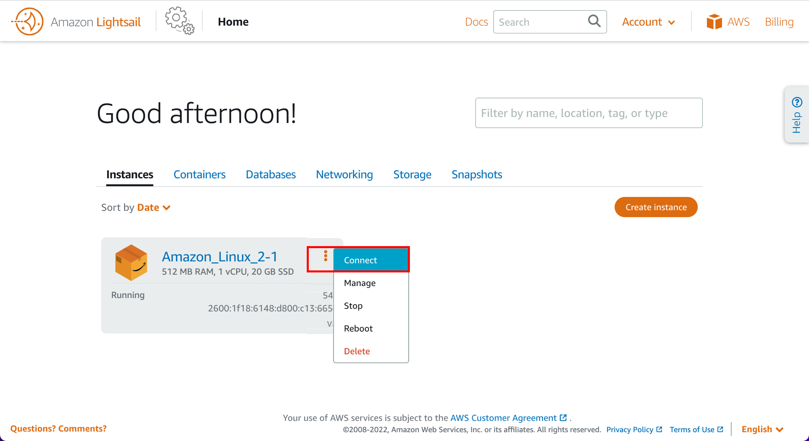 ## Congratulations Congratulations! You used Amazon Lightsail to easily spin up and configure a Linux instance. Amazon Lightsail is great for developers, web pros, and anyone looking to get started on AWS in a quick and cheap way. You can launch instances, databases, and SSD-based storage; transfer data; and monitor your resources, and so much more in a managed way. Whether you're an individual developer creating a project or a blogger creating a personal website, Amazon Lightsail is a great way for you to get started. |
