# Launch and Configure a WordPress Instance with Amazon Lightsail

|                      |                                                                                                                                                        |
| -------------------- | ------------------------------------------------------------------------------------------------------------------------------------------------------ |
| **AWS experience**   | Beginner                                                                                                                                               |
| **Time to complete** | 10 minutes                                                                                                                                             |
| **Cost to complete** | [Free<br>Tier](https://aws.amazon.com/free/?e=gs2020&p=build-a-web-app-intro "https://aws.amazon.com/free/?e=gs2020&p=build-a-web-app-intro") eligible |
| **Last updated**     | August 4, 2022                                                                                                                                         |

## Overview

[Amazon Lightsail](https://aws.amazon.com/lightsail/?p=gsrc&c=ho_lww "https://aws.amazon.com/lightsail/?p=gsrc&c=ho_lww") is one of the easiest ways to get started with
AWS. It offers virtual servers, storage, databases, and
networking, plus a cost-effective, monthly plan.

This tutorial shows you how to launch and configure a WordPress
instance on Lightsail. It includes steps to connect to your
instance by using SSH, sign in to your WordPress website, create a
static IP and attach it to your instance, create a DNS zone, and
map it to your instance. 

When you're done with this tutorial, you will have the
fundamentals to get your WordPress website up and running on
Amazon Lightsail.

[Get
started with Lightsail for free](https://portal.aws.amazon.com/billing/signup?client=lightsail&fid=1A3F6B376ECAC516-2C15C39C5ACECACB&redirect_url=https%3A%2F%2Flightsail.aws.amazon.com%2Fls%2Fsignup#/start "https://portal.aws.amazon.com/billing/signup?client=lightsail&fid=1A3F6B376ECAC516-2C15C39C5ACECACB&redirect_url=https%3A%2F%2Flightsail.aws.amazon.com%2Fls%2Fsignup#/start").

## Implementation

Complete the following steps to get your WordPress instance up and
running on Lightsail.

###### Note

For more information about
creating an instance in Lightsail, see
[Create
an Amazon Lightsail instance](https://lightsail.aws.amazon.com/ls/docs/en_us/articles/how-to-create-amazon-lightsail-instance-virtual-private-server-vps "https://lightsail.aws.amazon.com/ls/docs/en_us/articles/how-to-create-amazon-lightsail-instance-virtual-private-server-vps") in the Lightsail documentation.

1. Create an Amazon Lightsail account

This tutorial is free tier eligible.

[Sign
up for AWS](https://portal.aws.amazon.com/gp/aws/developer/registration/index.html?client=lightsail&fid=3BE5EA8FA64943AD-0284EED1954F5F15 "https://portal.aws.amazon.com/gp/aws/developer/registration/index.html?client=lightsail&fid=3BE5EA8FA64943AD-0284EED1954F5F15")

Already have an account?
[Sign-in](https://lightsail.aws.amazon.com/ls/ "https://lightsail.aws.amazon.com/ls/") 2. Create a Lightsail instance

Sign in to the
[Lightsail
console](https://lightsail.aws.amazon.com/ "https://lightsail.aws.amazon.com/"). 

On the Instances tab of the Lightsail home page, choose
**Create instance**.

 3. Select a Region

An AWS Region and Availability Zone is selected for you. Choose
**Change AWS Region and Availability
Zone** if you want to create your instance in another
location.

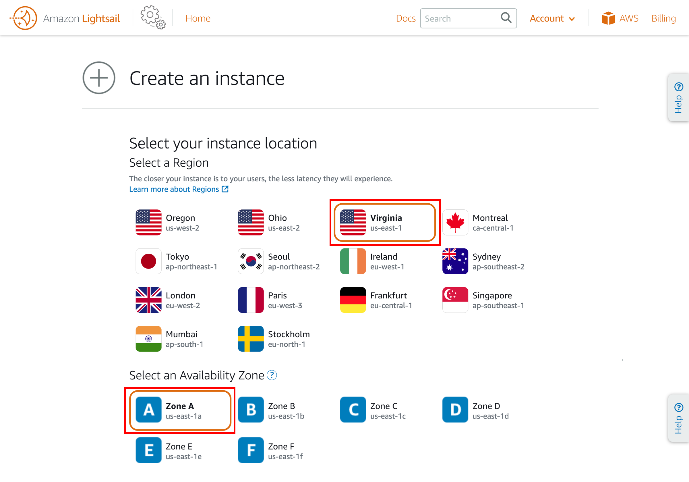 4. Choose an image

Choose your instance image.

    * Choose **Linux/Unix** as the
     platform.
    * Choose **WordPress** as the
     blueprint.

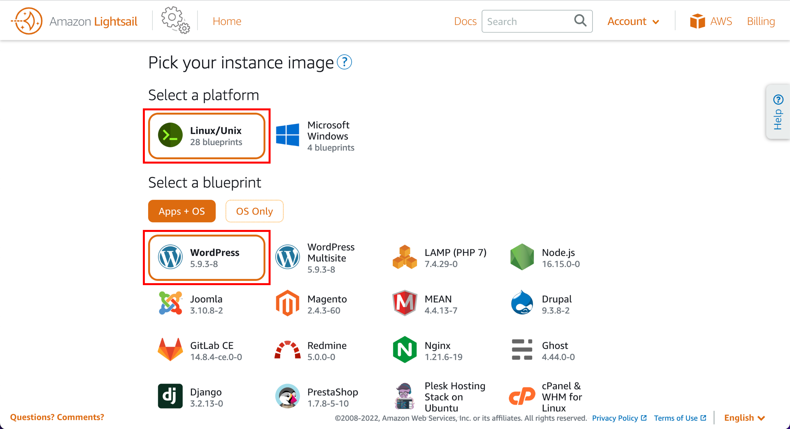 5. Select an instance plan

Choose an instance plan. 

A plan includes a machine configuration (RAM, SSD, vCPU) at a low,
predictable cost, and data transfer allowance. You can try the
$3.50 USD Lightsail plan without charge for three months (up to
750 hours). AWS credits the first three months to your account.

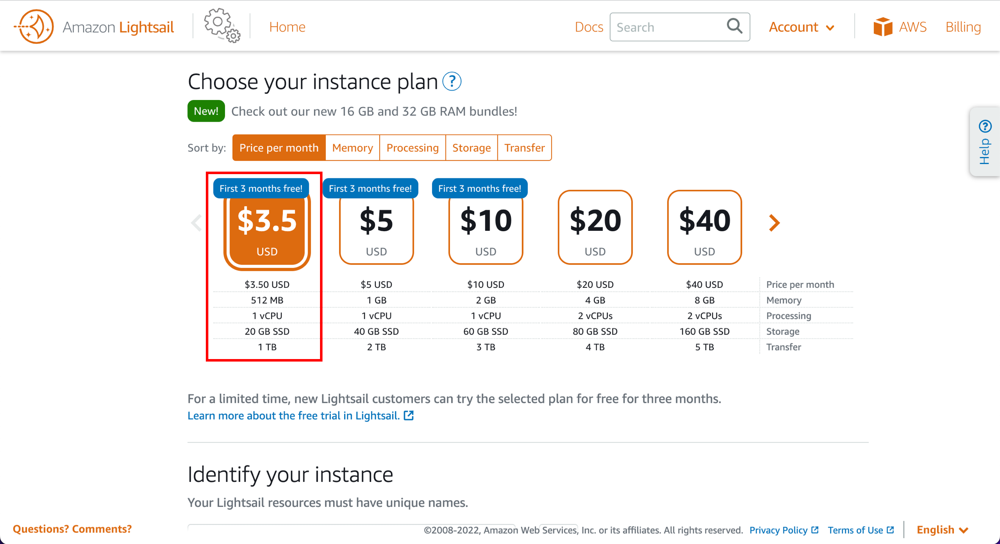 6. Create your instance

Enter a name for your instance and choose
**Create instance**. 

Resource name guidelines:

    * Must be unique within each AWS Region in your Lightsail
     account.
    * Must contain 2 to 255 characters.
    * Must start and end with an alphanumeric character or number.
    * Can include alphanumeric characters, numbers, periods, dashes,
     and underscores.

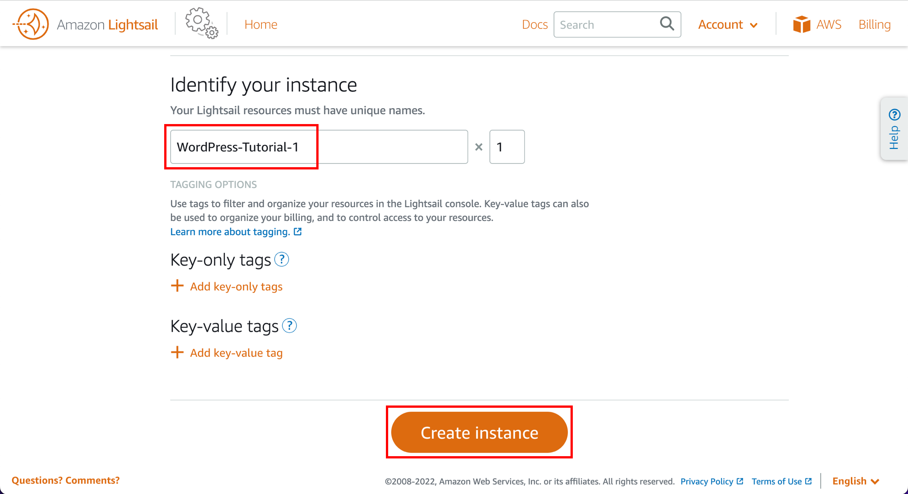
The default password to sign in to the administration dashboard of
your WordPress website is stored on the instance.

Complete the following steps to connect to your instance using the
browser-based SSH client in the Lightsail console, and get the
password for the administration dashboard.

###### Note

For more information, see
[Obtain
the default application username and password for Lightsail
Bitnami](https://lightsail.aws.amazon.com/ls/docs/en_us/articles/log-in-to-your-bitnami-application-running-on-amazon-lightsail "https://lightsail.aws.amazon.com/ls/docs/en_us/articles/log-in-to-your-bitnami-application-running-on-amazon-lightsail").

1. Connect using SSH

On the **Instances** tab of the
[Lightsail
home page](https://lightsail.aws.amazon.com/ "https://lightsail.aws.amazon.com/"), choose the SSH quick-connect icon for your
WordPress instance.

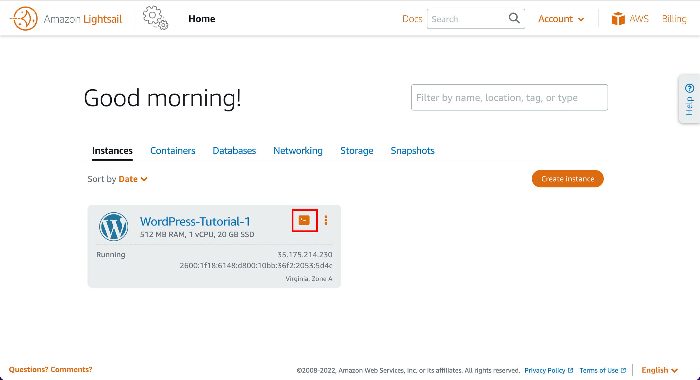 2. Retrieve the password

After the browser-based SSH client window opens, enter the following
command to retrieve the default application password:

```
cat $HOME/bitnami_application_password

```

3. Note the password

Make note of the password displayed on the screen. You use it
later to sign in to the administration dashboard of your WordPress
website.

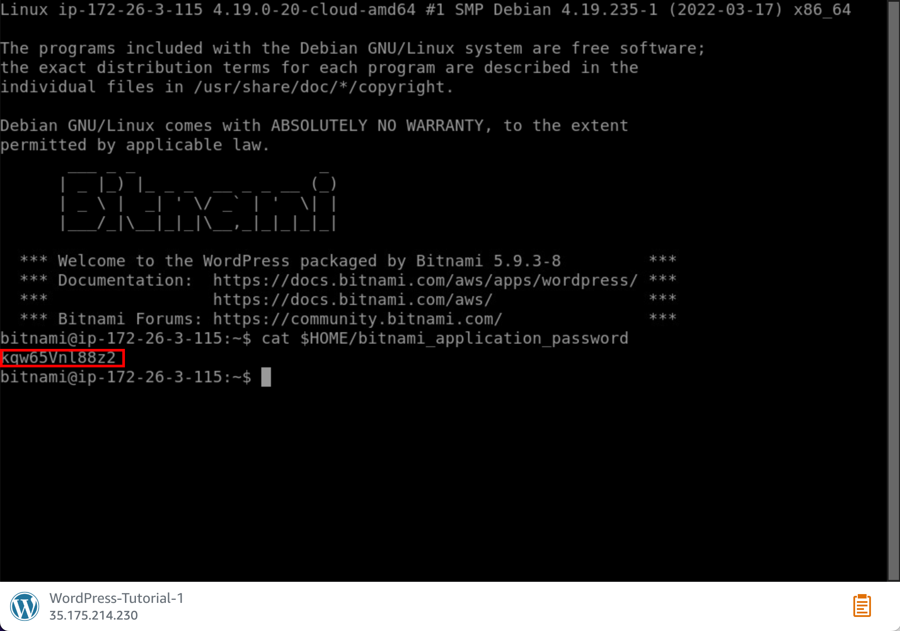
Now that you have the password for the administration dashboard of
your WordPress website, you can sign in. In the administration
dashboard, you can change your user password, install plugins,
change the theme of your website, and more.

Complete the following steps to sign in to the administration
dashboard of your WordPress website.

1. Log in to WordPress

In a browser, go to:

```
http://PublicIpAddress/wp-login.php

```

In the address, replace
**PublicIpAddress** with the public
IP address of your WordPress instance. You can get your instance's
public IP address from the Lightsail console as shown in the image
at the right.

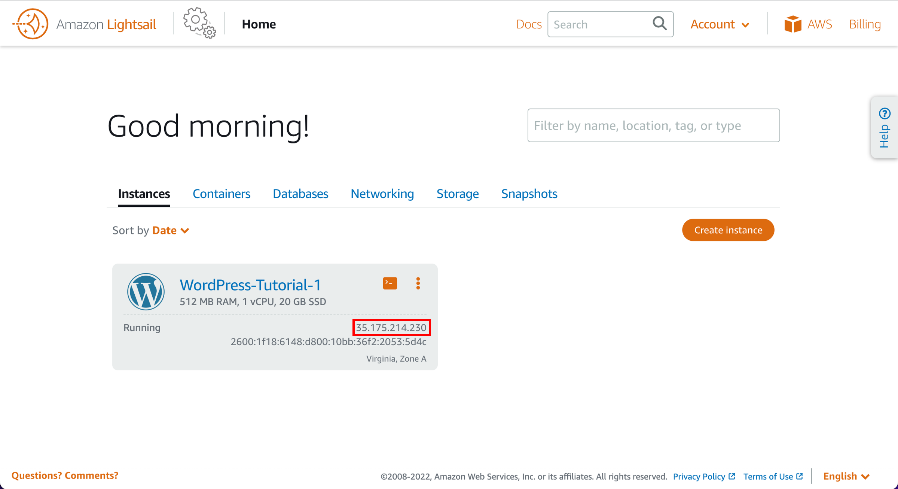 2. Enter your credentials

Log in to your instance. 

    * In the **Username**
    **or Email Address** box, enter
     **user.**
    * In the **Password** box, enter
     the default password obtained earlier in this tutorial.
    * Choose **Log in.**

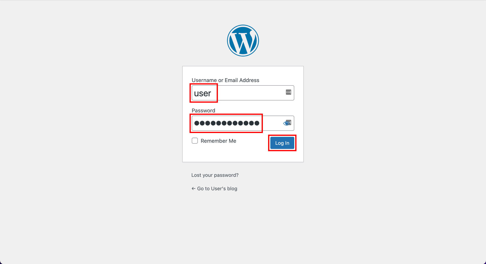 3. Manage WordPress

You are now signed in to the administration dashboard of your
WordPress website where you can perform administrative actions.
For more information about administering your WordPress website,
see the [WordPress
Codex](https://codex.wordpress.org/ "https://codex.wordpress.org/") in the WordPress documentation.

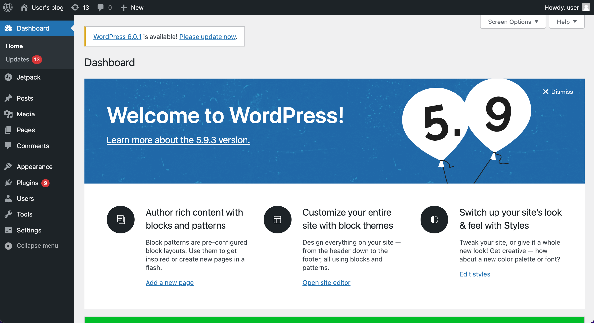
The default public IP for your WordPress instance changes if you
stop and start your instance. A static IP address, attached to an
instance, stays the same even if you stop and start your instance.

Complete the following steps to create a static IP address and
attach it to your WordPress instance.

###### Note

For more information, see [Create a static IP and attach it to an instance in Amazon Lightsail](https://lightsail.aws.amazon.com/ls/docs/en_us/articles/lightsail-create-static-ip "https://lightsail.aws.amazon.com/ls/docs/en_us/articles/lightsail-create-static-ip").

1. Choose your instance

On the **Instances** tab of the
[Lightsail
home page](https://lightsail.aws.amazon.com/ "https://lightsail.aws.amazon.com/"), choose your running WordPress instance.

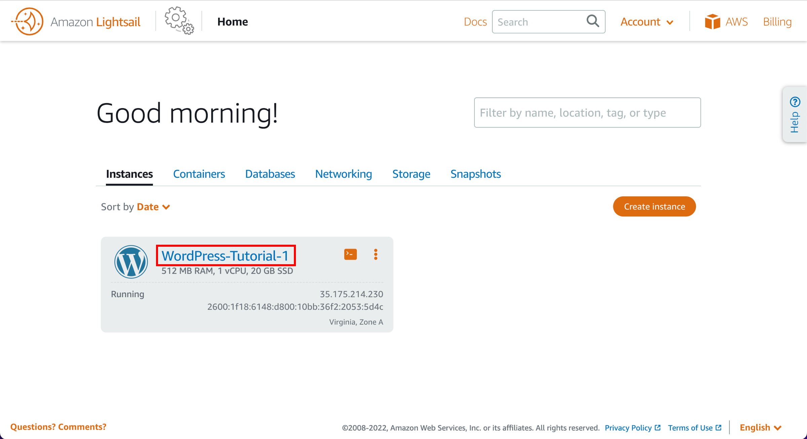 2. Create a static IP

Choose the **Networking** tab, then
choose **Create static IP.**

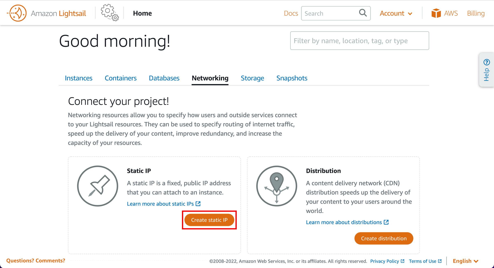 3. Attach to an instance

The static IP location is preselected based on the instance zone
that you chose earlier. Select the created WordPress instance from
the **Attach to an instance**
dropdown.

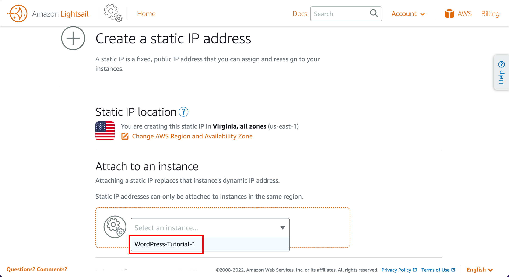 4. Name your static IP

Name your static IP, then choose
**Create**. 

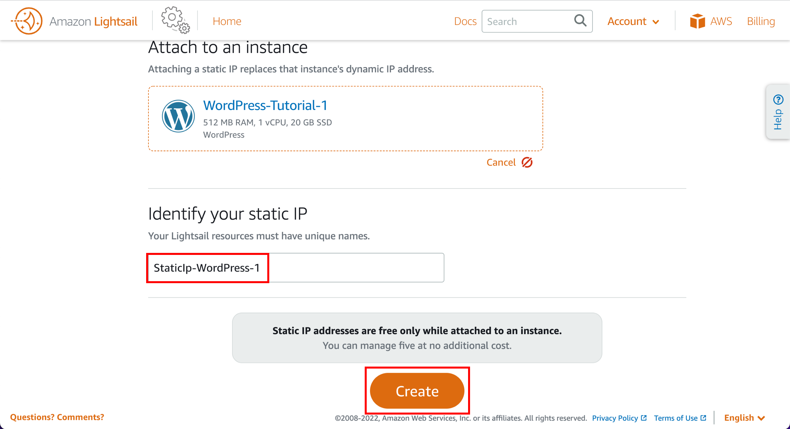
Transfer management of your domain's DNS records to Lightsail. This
allows you to more easily map a domain to your WordPress instance,
and manage more of your website’s resources using the Lightsail
console.

Complete the following steps to create a Lightsail DNS zone and map
a domain to your WordPress instance.

###### Note

For more information, see
[Creating
a DNS zone to manage your domain’s DNS records in Amazon Lightsail](https://lightsail.aws.amazon.com/ls/docs/en_us/articles/lightsail-how-to-create-dns-entry "https://lightsail.aws.amazon.com/ls/docs/en_us/articles/lightsail-how-to-create-dns-entry").

1. Create a DNS zone

On the **Networking** tab of the
[Lightsail
home page](https://lightsail.aws.amazon.com/ "https://lightsail.aws.amazon.com/"), choose **Create DNS
zone**.

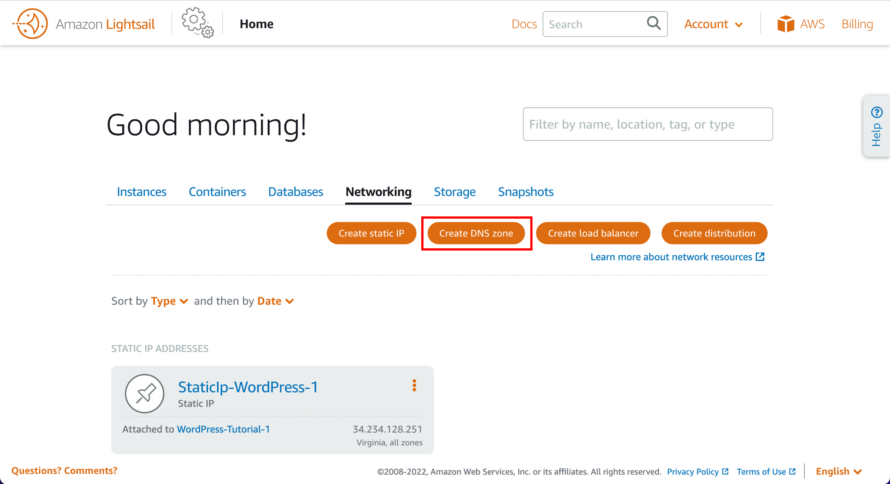 2. Add your domain

Enter your domain, then choose **Create DNS
zone.** 

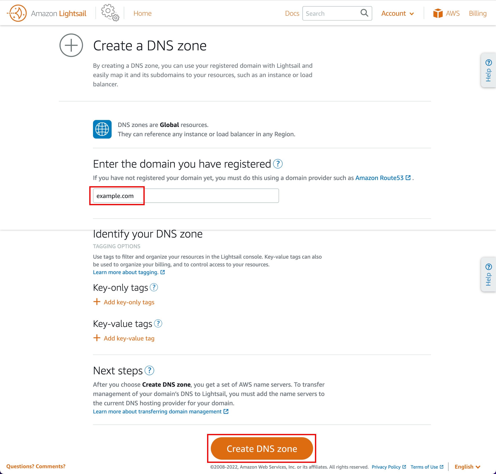 3. Note the name servers

Make note of the name server address listed on the page. 

You add these name server addresses to your domain name’s
registrar to transfer management of your domain’s DNS records to
Lightsail.

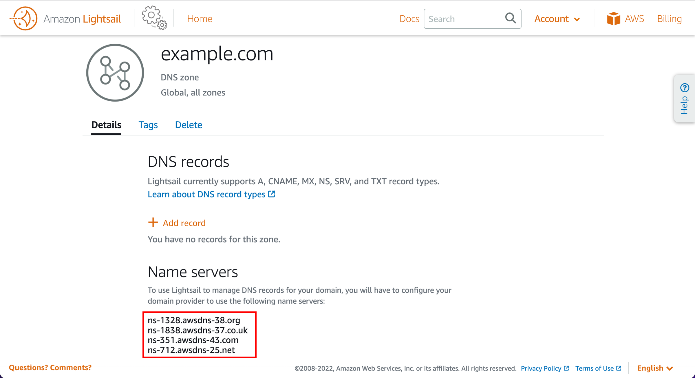 4. Add an A record

After management of your domain’s DNS records are transferred to
Lightsail, add an A record to point the apex of your domain to
your WordPress instance, as follows:

You add these name server addresses to your domain name’s
registrar to transfer management of your domain’s DNS records to
Lightsail.

In the DNS zone for your domain, choose
**Add record**.

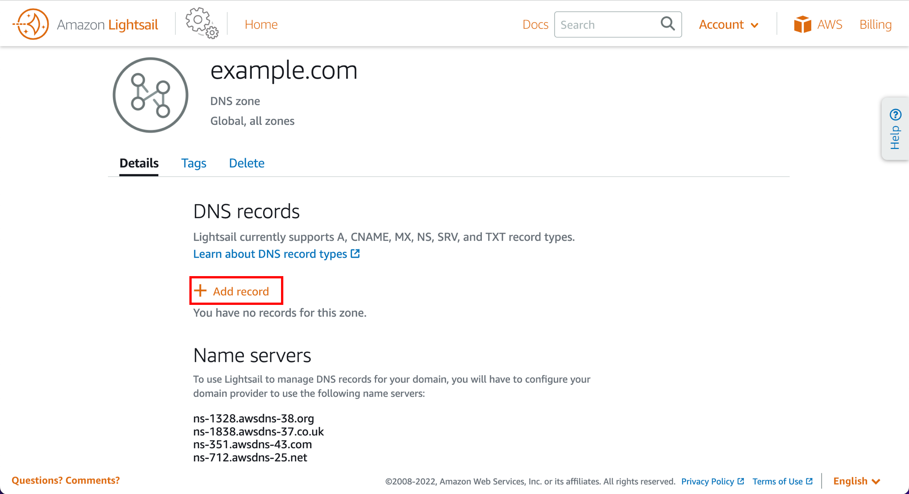 5. Configure DNS settings

Continue adding the following details to complete pointing the
apex of your domain to your WordPress instance:

    1. In the **Subdomain** box, enter
     an @ symbol to map the apex of your domain (such as
     [example.com](http://example.com "http://example.com")) to
     your instance. The @ symbol explicitly symbolizes that you’re
     adding an apex record. It is not added as a subdomain.
    2. In the **Resolves to** box,
     choose the static IP that you attached to the WordPress
     instance in the previous step of this tutorial.
    3. Choose the green **save** icon.Allow time for the change to propagate through the internet's DNS

before your domain begins routing traffic to your WordPress
instance.

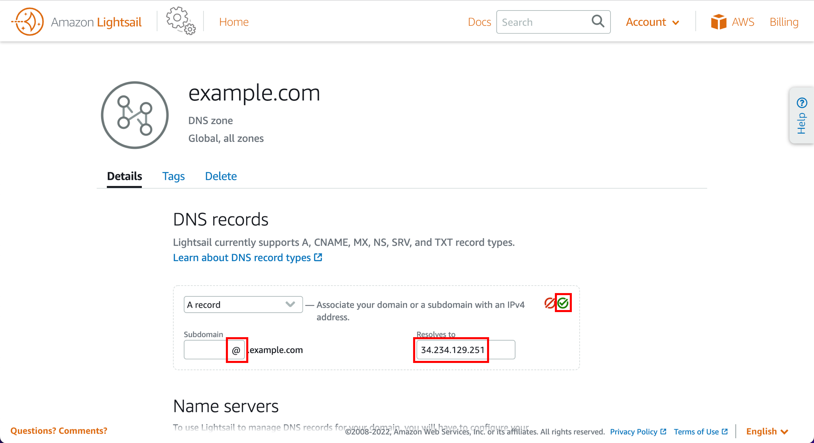

1. Delete instance

On the **Instances** tab of the
[Lightsail
home page](https://lightsail.aws.amazon.com/ "https://lightsail.aws.amazon.com/"), choose the ellipsis (⋮) icon next to the
WordPress instance you just created and choose
**Delete**.

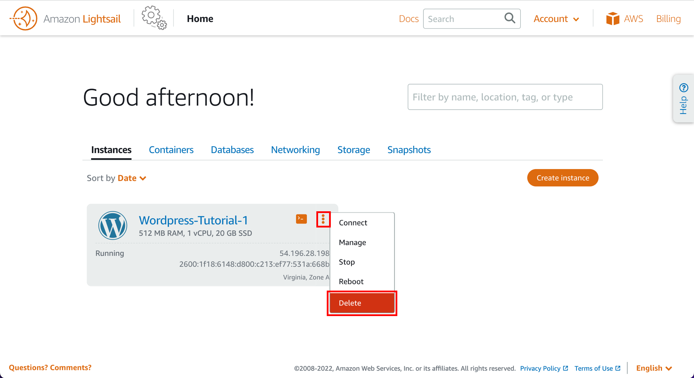 2. Confirm deletion

Choose **Yes, delete** from the
prompt.

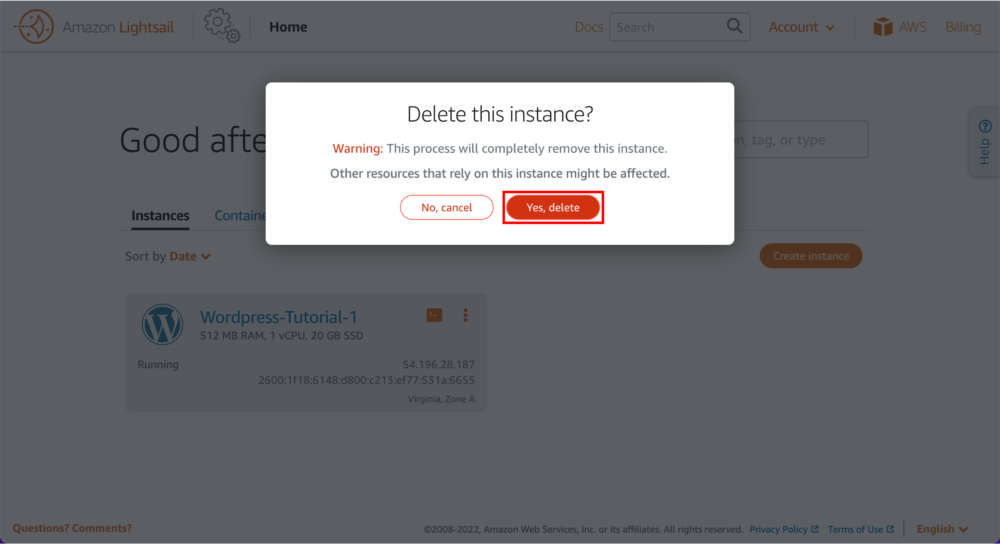

## Congratulations

Congratulations! You have used Amazon Lightsail to launch and deploy
a WordPress instance.

Amazon Lightsail is a great choice to develop, build, and deploy a
variety of applications like WordPress, websites, and blog
platforms.
