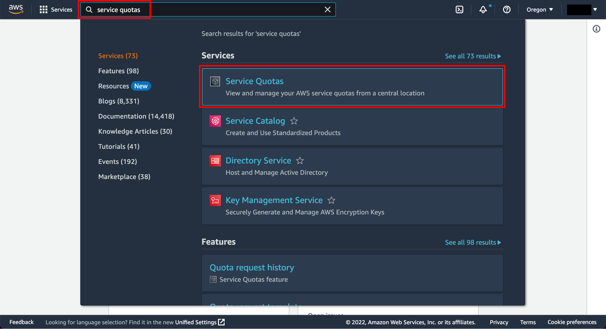
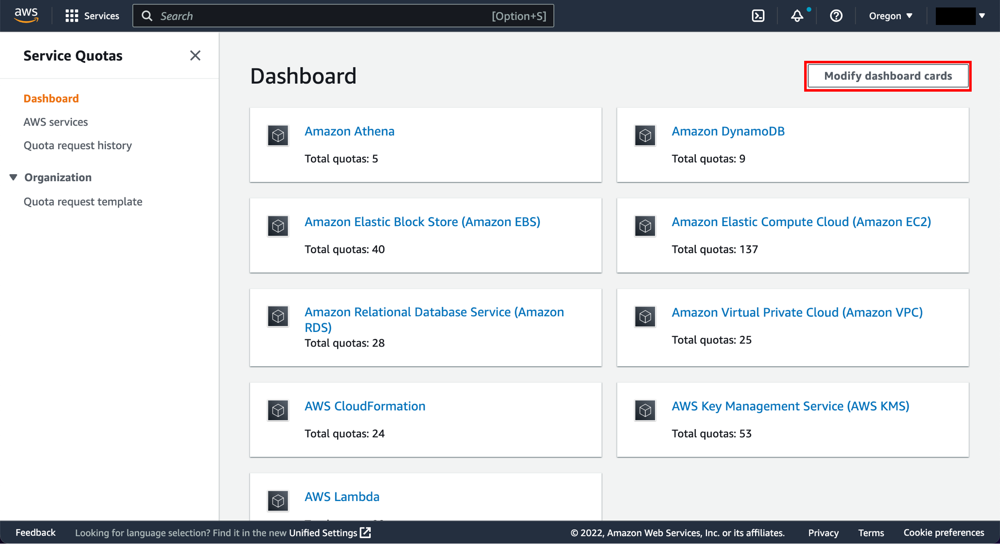
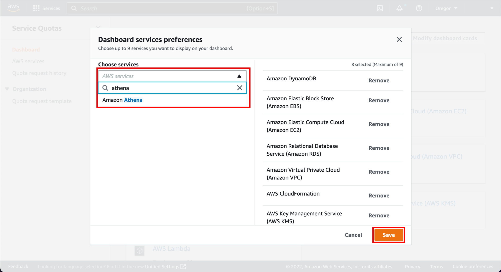
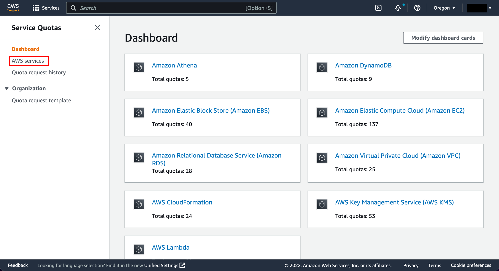
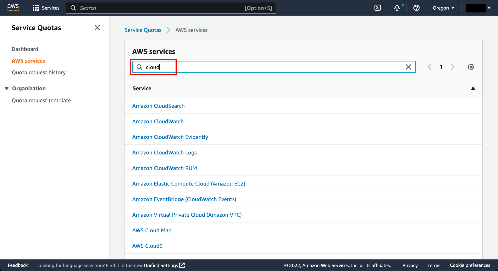
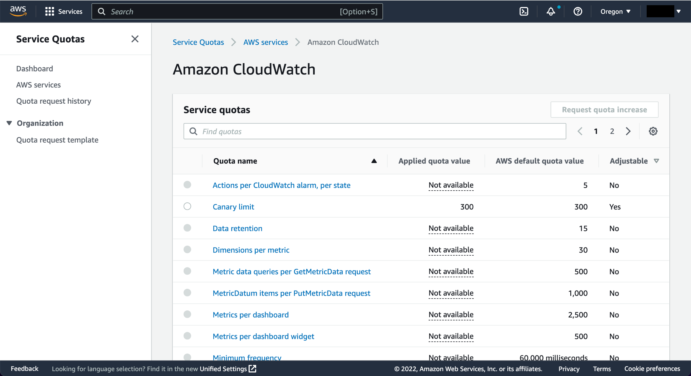

# Request a Quota Increase with Service Quotas

|                      |                                                                                                                       |
| -------------------- | --------------------------------------------------------------------------------------------------------------------- |
| **AWS experience**   | Beginner                                                                                                              |
| **Time to complete** | 10 minutes                                                                                                            |
| **Cost to complete** | [Free Tier](https://free/ "https://free/") eligible                                                                   |
| **Services used**    | [Service Quotas](../../../servicequotas/latest/userguide/intro.md "../../../servicequotas/latest/userguide/intro.md") |
| **Last updated**     | February 3, 2023                                                                                                      |

## Overview

[Service Quotas](../../../servicequotas/latest/userguide/intro.md "../../../servicequotas/latest/userguide/intro.md") is an AWS service that helps you manage your quotas,
formerly referred to as limits, for over 100 AWS services, from
one location. In addition to viewing quota values, you can also
request a quota increase from the
[Service Quotas console](https://console.aws.amazon.com/servicequotas/ "https://console.aws.amazon.com/servicequotas/").  

This tutorial shows you how to view and manage the service quotas
for your AWS account. Your account has default quotas for each AWS service. Unless otherwise noted, each quota is specific to an
[AWS Region](../../../servicequotas/latest/userguide/reference_limits.md "../../../servicequotas/latest/userguide/reference_limits.md"). You can request increases for some quotas; other
quotas cannot be adjusted.

When you're done with this tutorial, you will understand how to
view and manage service quotas for your AWS account.

[Get
started with managing Service Quotas for free.](https://console.aws.amazon.com/servicequotas/ "https://console.aws.amazon.com/servicequotas/")

## What you'll accomplish

- After completing this tutorial, you will understand how to view and manage service
  quotas for your AWS account.

## Prerequisites

Before starting this guide, you will need:

- An AWS account: If you don't already have an account, follow the [Setting Up Your AWS Environment](../setup-environment/setup-environment.md "../setup-environment/setup-environment.md") guide for a quick overview.

## Implementation

Complete the following steps to access the Service Quotas dashboard and customize the cards
that appear on the dashboard.

###### Note

For more information, see [Getting started with
Service Quotas](../../../servicequotas/latest/userguide/getting-started.md "../../../servicequotas/latest/userguide/getting-started.md") in the Service Quotas documentation.

1. Open the Service Quotas dashboard

Navigate to the [AWS Management Console](https://console.aws.amazon.com/console/home "https://console.aws.amazon.com/console/home"). Enter
Service quotas in the search bar and select the Service Quotas service.

 2. Review quotas for a service

On the Service Quotas dashboard, choose **Modify dashboard
cards**.

 3. Select services to display

In the **Dashboard services preference** box, customize
the AWS services you want to include as cards on the dashboard:

    * Choose **Remove** to remove a service.
    * In the search box, enter a service name to add the service.

###### Note

Choose up to nine services you want to display on your dashboard.

Choose **Save**.

Complete the following steps to review your current quotas across various
AWS services.

###### Note

For more information, see [Viewing service
quotas](../../../servicequotas/latest/userguide/gs-request-quota.md "../../../servicequotas/latest/userguide/gs-request-quota.md") in the Service Quotas documentation.

1. Find and choose a service

In the Service Quotas navigation pane, choose **AWS services**.

 2. Review quota values and usage

Select a service from the list, or enter the name of the service in the search
field.

 3. Access quota metadata

For each quota, the console displays its name, applied value, default value, and
whether the quota is adjustable. If the applied value is not available, the console
displays a dash.

