# Send Fanout Event Notifications

|                                                                   |                                                                                                                                                                                                                                                                                                                                                                                                                                                                                                                                                          |
| ----------------------------------------------------------------- | -------------------------------------------------------------------------------------------------------------------------------------------------------------------------------------------------------------------------------------------------------------------------------------------------------------------------------------------------------------------------------------------------------------------------------------------------------------------------------------------------------------------------------------------------------- | ------------------------------------------------------------------------------------------------------------------------------------------------------------------------------------------------------------------------------------------------------------------------------------------------------------------------------------------------------------------------------------------------------------------------------------------------------------------------------------------------------------------------------------------------------------------------------------------------------------------------------------------------------------------------------------------------------------------------------------------------------------------------------------------------------------------------------------------------------------------------------------------------------------------------------------------------------------------------------------------------------------------------------------------------------------------------------------------------------------------------------------------------------------------------------------------------------------------------------------------------------------------------------------------------------------------------------------------------------------------------------------------------------------------------------------------------------------------------------------------------------------------------------------------------------------------------------------------------------------------------------------------------------------------------------------------------------------------------------------------------------------------------------------------------------------------------------------------------------------------------------------------------------------------------------------------------------------------------------------------------------------------------------------------------------------------------------------------------------------------------------------------------------------------------------------------------------------------------------------------------------------------------------------------------------------------------------------------------------------------------------------------------------------------------------------------------------------------------------------------------------------------------------------------------------------------------------------------------------------------------------------------------------------------------------------------------------------------------------------------------------------------------------------------------------------------------------------------------------------------------------------------------------------------------------------------------------------------------------------------------------------------------------------------------------------------------------------------------------------------------------------------------------------------------------------------------------------------------------------------------------------------------------------------------------------------------------------------------------------------------------------------------------------------------------------------------------------------------------------------------------------------------------------------------------------------------------------------------------------------------------------------------------------------------------------------------------------------------------------------------------------------------------------------------------------------------------------------------------------------------------------------------------------------------------------------------------------------------------------------------------------------------------------------------------------------------------------------------------------------------------------------------------------------------------------------------------------------------------------------------------------------------------------------------------------------------------------------------------------------------------------------------------------------------------------------------------------------------------------------------------------------------------------------------------------------------------------------------------------------------------------------------------------------------------------------------------------------------------------------------------------------------------------------------------------------------------------------------------------------------------------------------------------------------------------------------------------------------------------------------------------------------------------------------------------------------------------------------------------------------------------------------------------------------------------------------------------------------------------------------------------------------------------------------------------------------------------------------------------------------------------------------------------------------------------------------------------------------------------------------------------------------------------------------------------------------------------------------------------------------------------------------------------------------------------------------------------------------------------------------------------------------------------------------------------------------------------------------------------------------------------------------------------------------------------------------------------------------------------------------------------------------------------------------------------------------------------------------------------------------------------------------------------------------------------------------------------------------------------------------------------------------------------------------------------------------------------------------------------------------------------------------------------------------------------------------------------------------------------------------------------------------------------------------------------------------------------------------------------------------------------------------------------------------------------------------------------------------------------------------------------------------------------------------------------------------------------------------------------------------------------------------------------------------------------------------------------------------------------------------------------------------------------------------------------------------------------------------------------------------------------------------------------------------------------------------------------------------------------------------------------------------------------------------------------------------------------------------------------------------------------------------------------------------------------------------------------------------------------------------------------------------------------------------------------------------------------------------------------------------------------------------------------------------------------------------------------------------------------------------------------------------------------------------------------------------------------------------------------------------------------------------------------------------------------------------------------------------------------------------------------------------------------------------------------------------------------------------------------------------------------------------------------------------------------------------------------------------------------------------------------------------------------------------------------------------------------------------------------------------------------------------------------------------------------------------------------------------------------------------------------------------------------------------------------------------------------------------------------------------------------------------------------------------------------------------------------------------------------------------------------------------------------------------------------------------------------------------------------------------------------------------------------------------------------------------------------------------------------------------------------------------------------------------------------------------------------------------------------------------------------------------------------------------------------------------------------------------------------------------------------------------------------------------------------------------------------------------------------------------------------------------------------------------------------------------------------------------------------------------------------------------------------------------------------------------------------------------------------------------------------------------------------------------------------------------------------------------------------------------------------------------------------------------------------------------------------------------------------------------------------------------------------------------------------------------------------------------------------------------------------------------------------------------------------------------------------------------------------------------------------------------------------------------------------------------------------------------------------------------------------------------------------------------------------------------------------------------------------------------------------------------------------------------------------------------------------------------------------------------------------------------------------------------------------------------------------------------------------------------------------------------------------------------------------------------------------------------------------------------------------------------------------------------------------------------------------------------------------------------------------------------------------------ |
| **Cost to Complete**                                              | Free Tier                                                                                                                                                                                                                                                                                                                                                                                                                                                                                                                                                |
| **Services Used**                                                 | [Amazon SNS](https://aws.amazon.com/sns/ "https://aws.amazon.com/sns/") [Amazon SQS](https://aws.amazon.com/sqs/ "https://aws.amazon.com/sqs/")                                                                                                                                                                                                                                                                                                                                                                                                          |
| **Sending Fanout Event Notifications on AWS Requires an Account** | AWS Free Tier includes 1,000,000 publishes for Amazon Simple Notification Service and 1,000,000 requests of Amazon Simple Queue Service. [View AWS Free Tier Details »](https://aws.amazon.com/free/?e=gs21&src=introduction_freetier "https://aws.amazon.com/free/?e=gs21&src=introduction_freetier") [Create a Free Account in Minutes](https://portal.aws.amazon.com/gp/aws/developer/registration/index.html?e=gs21&src=introduction_signup "https://portal.aws.amazon.com/gp/aws/developer/registration/index.html?e=gs21&src=introduction_signup") | ## Overview In this tutorial, you will implement a fanout messaging scenario using [Amazon Simple Notification Service (SNS)](https://aws.amazon.com/sns/ "https://aws.amazon.com/sns/") and [Amazon Simple Queue Service (SQS)](https://aws.amazon.com/sqs/ "https://aws.amazon.com/sqs/"). In this scenario, messages are "pushed" to multiple subscribers, which eliminates the need to periodically check or poll for updates and enables parallel asynchronous processing of the message by the subscribers. To illustrate this, we will assume that you are developing a cloud-native application that sends an Amazon SNS message to a topic whenever an order is placed on an online store. The Amazon SQS queues that are subscribed to that topic will each receive identical notifications for the new order. The AWS services you use in this tutorial are within the [AWS Free Tier](https://aws.amazon.com/free/ "https://aws.amazon.com/free/"). ## Implementation 1. Launch the AWS Management Console When you [click here](https://console.aws.amazon.com/console/home "https://console.aws.amazon.com/console/home"), the AWS Management Console will open in a new browser window, so you can keep this step-by-step guide open. When the screen loads, enter your user name and password to get started. Then type **notification** in the search bar and select **Simple Notification Service** to open the service console. 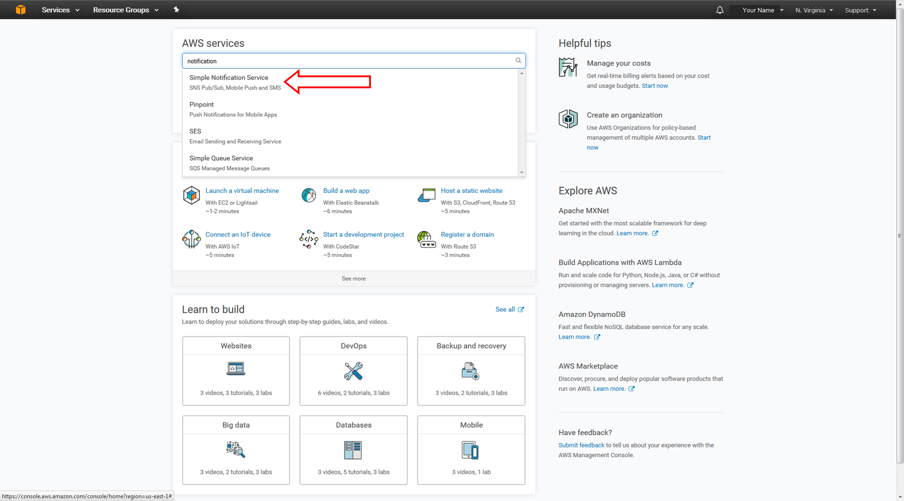 2. Start the Amazon SNS Console If the SNS console landing page appears, click **Next step**. 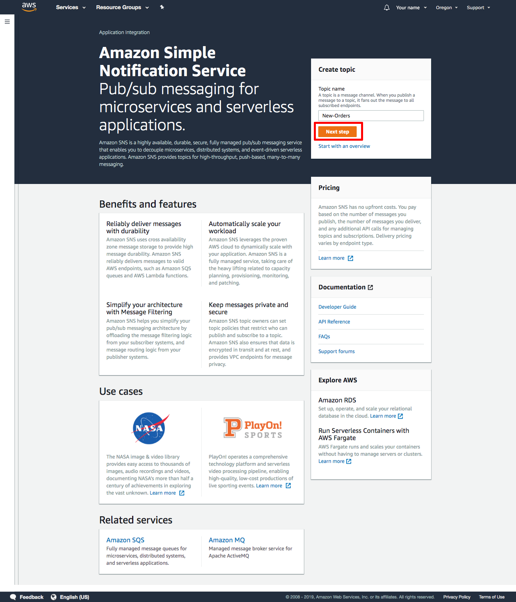 In this step, you will create an Amazon SNS topic. A topic is a communication channel to send messages and subscribe to notifications. In this example, a sample ecommerce application will push a message to an Amazon SNS topic whenever a new order is placed on the online store. 1. Create an SNS topic In the Create topic page, type **New-Orders**, in the topic name box, then click **Create topic**. 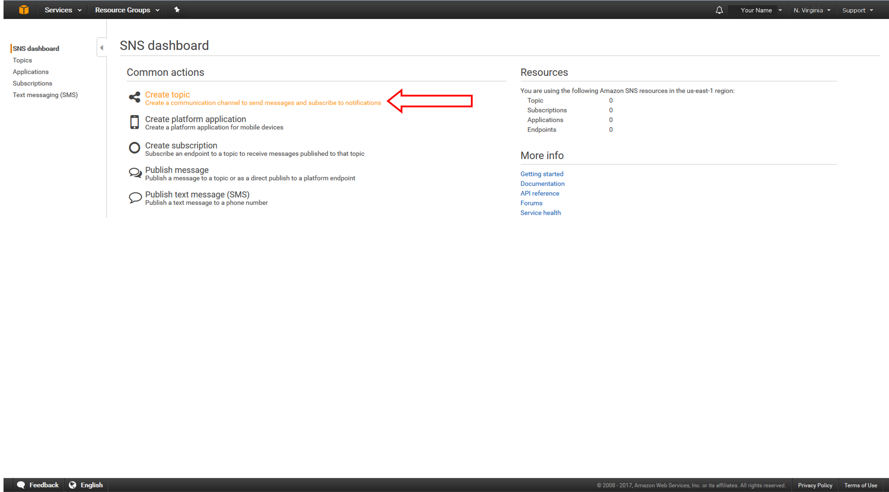 2. Verify topic creation The Topic details page confirms the topic is successfully created. 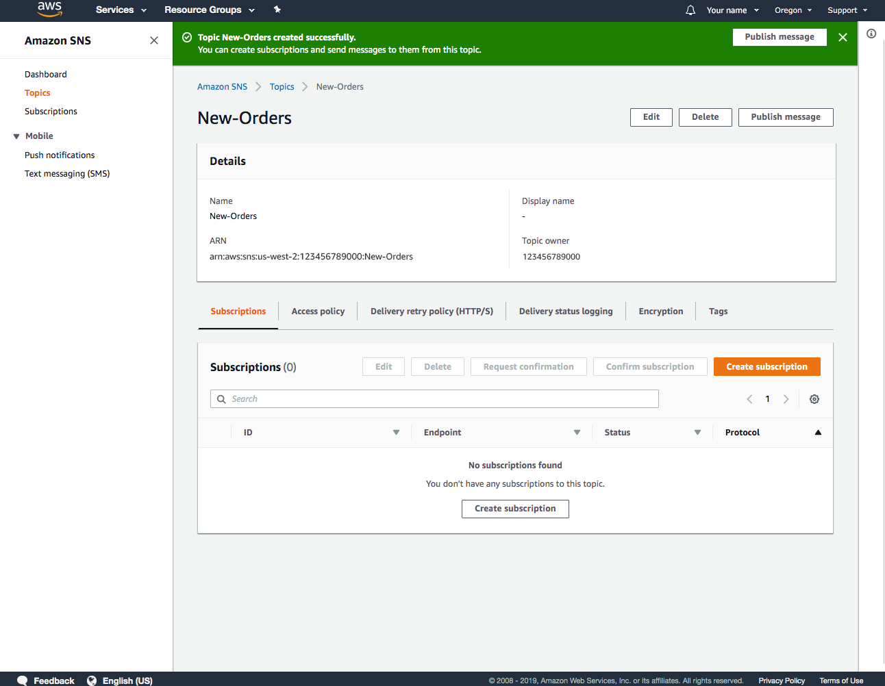 Now that you have created the topic with Amazon SNS, you will create Amazon SQS queues that will subscribe to the topic. When you subscribe multiple queues to a topic, each queue receives identical notifications every time a message is pushed to the topic. Services attached to those queues can then process the orders asynchronously and in parallel. For example, an Amazon EC2 server instance attached to one of the queues could handle the processing or fulfillment of the order, while the other server instance could be attached to a data warehouse for analysis of all orders received. To keep things simple, we won't actually attach EC2 instances to the queues in this tutorial. 1. Open the Amazon SQS console [Click here](https://console.aws.amazon.com/sqs "https://console.aws.amazon.com/sqs") to open the Amazon SQS console in a new browser window. If the SQS landing page appears, click **Get Started Now**. Otherwise, proceed to the next step. 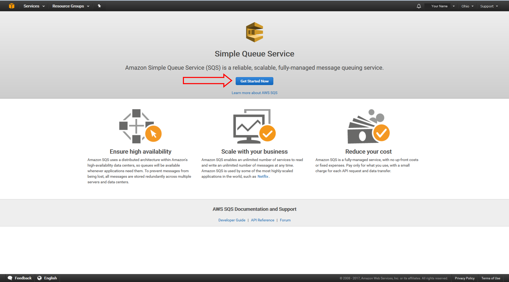 2. Create Orders-for-Inventory queue Our first queue will store orders for a fictional Inventory Service that keeps track of products, adding and deleting them as needed from inventory with each order. On the **Create New Queue** page, enter **Orders-for-Inventory** in the **Queue Name** field. Leave **Standard Queue** selected and click **Quick-Create Queue**. 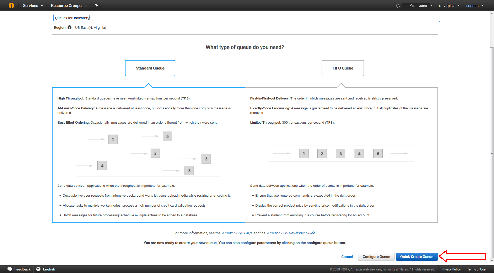 3. Create Orders-for-Analytics queue Your new queue is created and selected in the queue list. Next, you’ll create a second queue to handle order analytics. Click **Create New Queue**to create another queue to store orders for the Analytics Service. 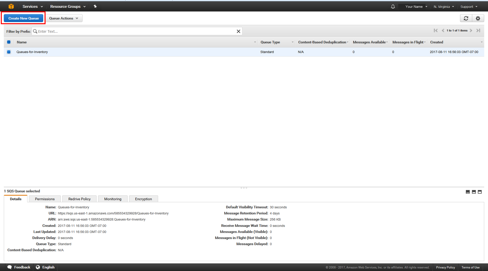 4. Enter queue name Enter **Orders-for-Analytics** in the **Queue Name** field, and click **Quick-Create Queue**. 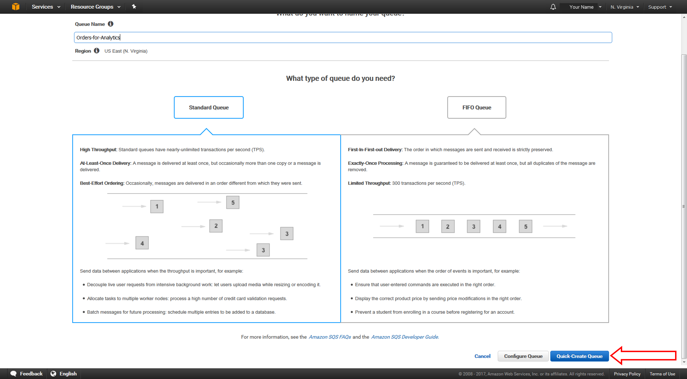 5. Verify queue creation The new queue now appears in the queue list. 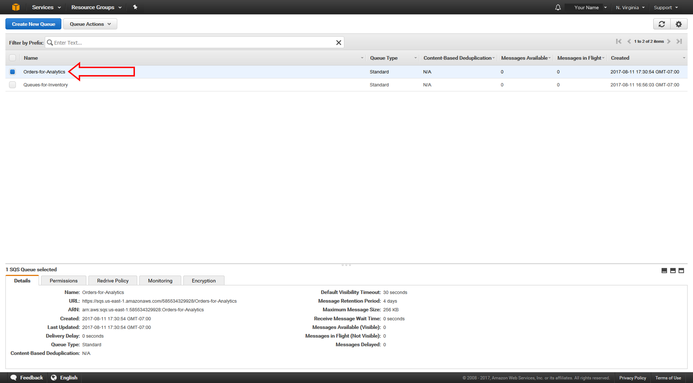 Now that you have created your two Amazon SQS queues, you need to subscribe them to the Amazon SNS topic that broadcasts notifications of new orders. 1. Subscribe the queues From the list of queues, select the **Orders-for-Inventory** and **Orders-for-Analytics** queues. From **Queue Actions**, select **Subscribe Queues to SNS Topic**. 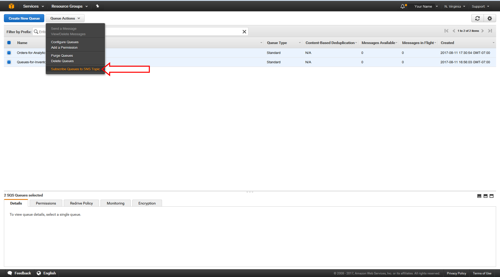 2. Select topic The **Subscribe to a Topic** dialog box is displayed. From the **Choose a Topic** drop-down list, select your **New-Orders** Amazon SNS topic. Your SNS topic appears in the list because you created it from the same account that you used to create your Amazon SQS queues. If the SNS topic was made by another account, you could subscribe to it by using the Topic ARN. For more details, see the [Amazon SNS documentation](../../../sns/latest/dg/SubscribeTopic.md "../../../sns/latest/dg/SubscribeTopic.md"). Leave the **Topic Region** unchanged, and click **Subscribe**. 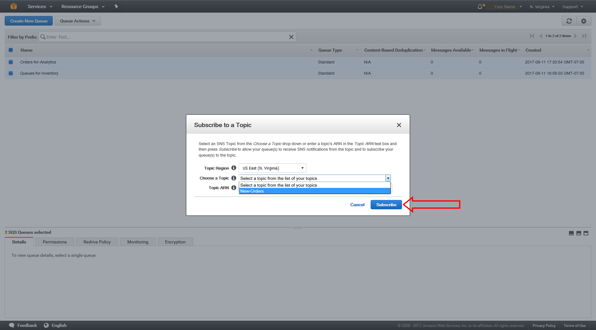 3. Confirm subscription The **Topic Subscription Result** dialog box is displayed. Click **OK**. 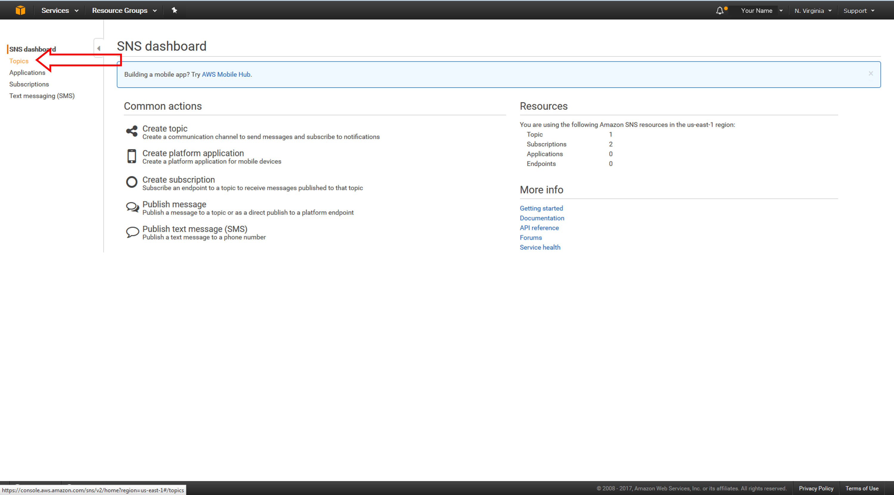 Your queues are now subscribed to the topic. In this step, you will simulate a new order by having the fictional ecommerce application push a message to the topic with the order details. 1. Open the publish page In the Amazon SNS console **New Orders** topic details page, click **Publish message**. 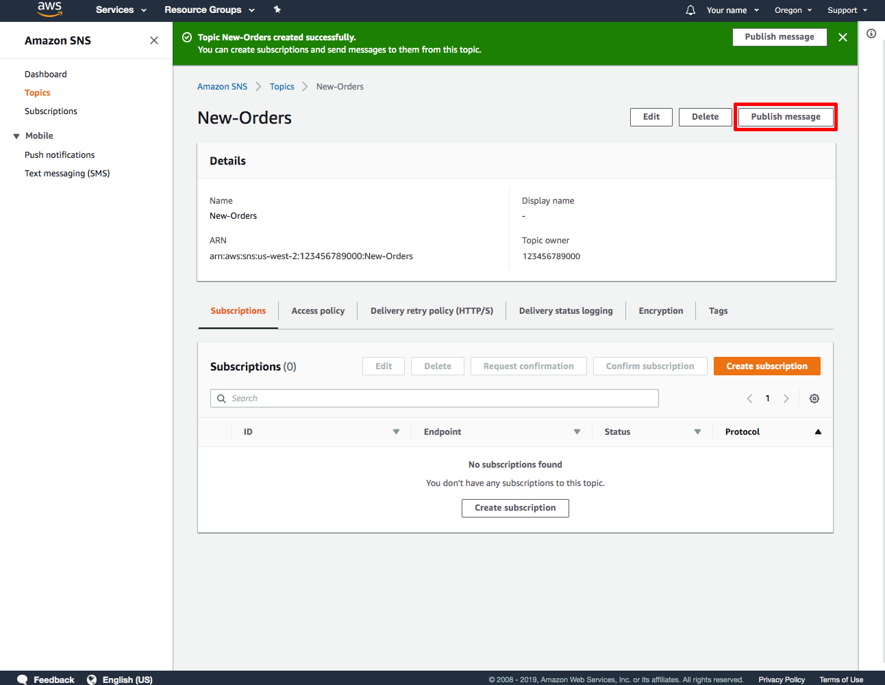 2. Send the order message **Publish Message to topic** page appears. In the Subject box, type Order 123-4567890-1234567. In the **Message** field, enter the following text to represent a sample order: **1 x Widget @ $29.99 USD 2 x Widget Cables @ $4.99** Click **Publish Message**. A confirmation dialog box will appear. 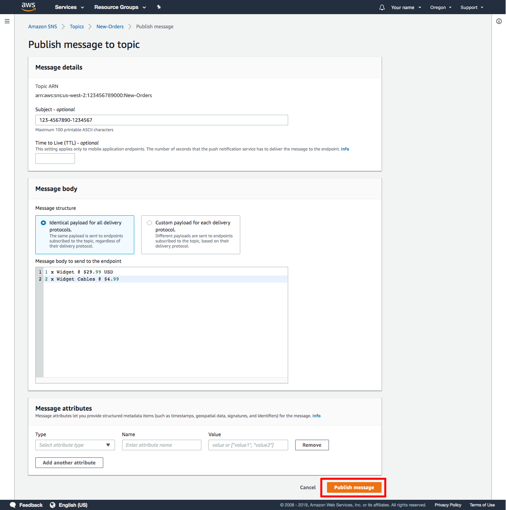 Once a new message is published, Amazon SNS will deliver that message to every endpoint that is subscribed to the topic. In a fanout scenario like this one, the Amazon SQS queues are the endpoints. In this step, you will confirm that the queues received the new order notification by viewing the message that the topic sent to the queues. 1. Open queue messages In the Amazon SQS console, check the box for the **Orders-for-Inventory** queue from the queue list. From the **Queue Action** drop-down, select **View/Delete Messages**. 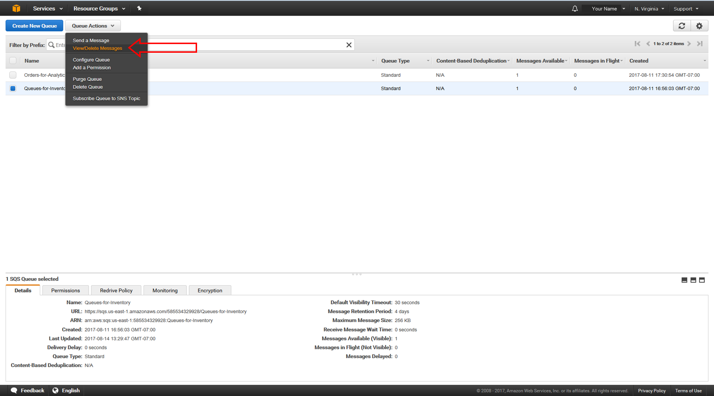 2. Start message polling Click **Start Polling for Messages**. 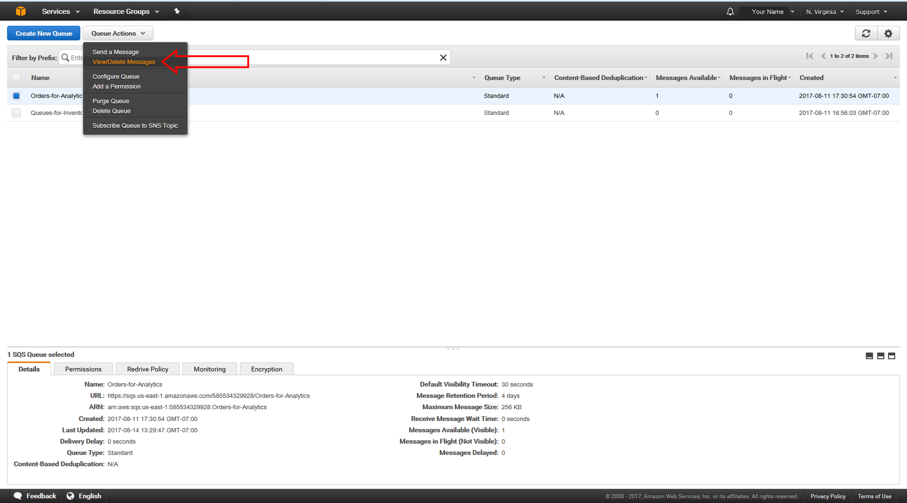 3. View message panel The **View/Delete Messages in Orders-for-Inventory** dialog box appears. 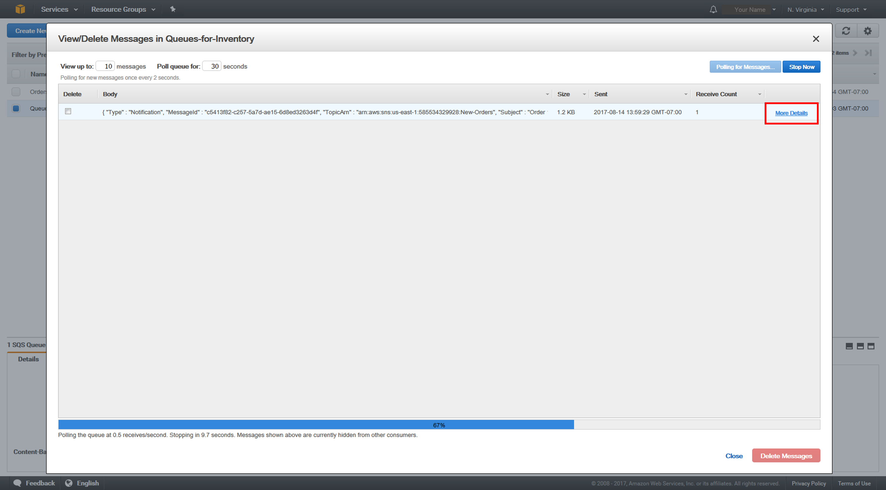 4. Check message content In the Body column, click **More Details**. The **Message Details** box contains a JSON document that contains the subject and message that you published to the topic. You have confirmed that the **Orders-for-Inventory** queue received the notification of the new order from the **New-Orders** topic. Click **Close**. 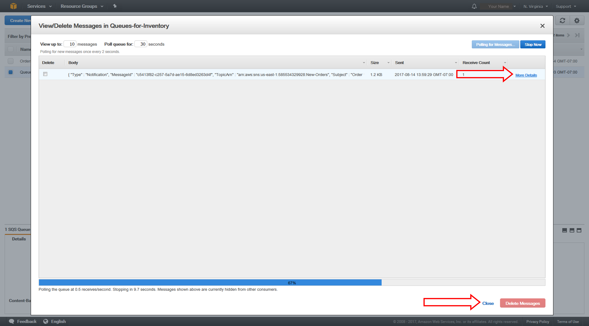 5. Delete message We'll assume that our fictional Inventory Service has finished processing this message, and that we can now safely delete the message from the queue. Click **Delete 1 Message**. To confirm, click **Yes, Delete Checked Messages**. Then click **Close**. 6. Verify Orders-for-Analytics queue received notification Repeat steps 1 through 5 to confirm that the **Orders-for-Analytics** queue also received the notification of the new order.  In this step, you will delete the resources you have created for this tutorial, which include the Topic Subscriptions, Topics, and Queues. It is a best practice to delete resources you are no longer using so you don’t incur charges. 1. Delete the topics Open the Amazon SNS console and click **Topics** in the left navigation pane. Select the **New-Orders** topic. Click **Delete** to delete topics. 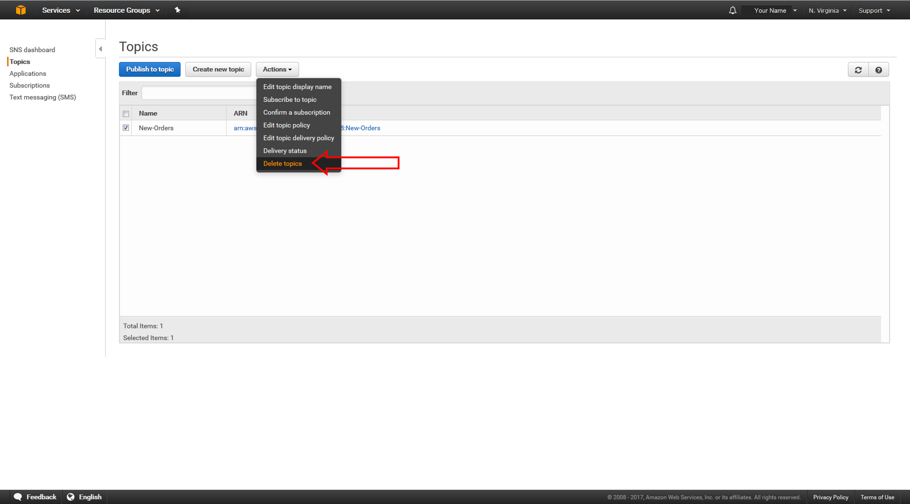 2. Confirm deletion The **Delete** confirmation dialog box appears. Type **delete me** in the dialog box and click **Delete**. The topic, and its subscriptions, are deleted. You can now close the SNS browser window (but don't sign out, as you still need to delete the queues in the SQS console). 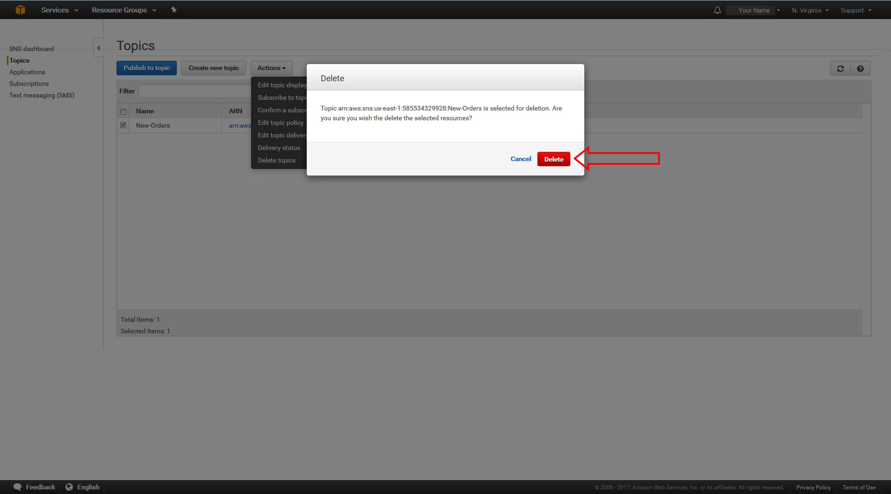 3. Delete the queues In the Amazon SQS console, select the **Orders-for-Inventory** and **Orders-for-Analytics** queues. From **Queue Actions**, select **Delete Queues**. 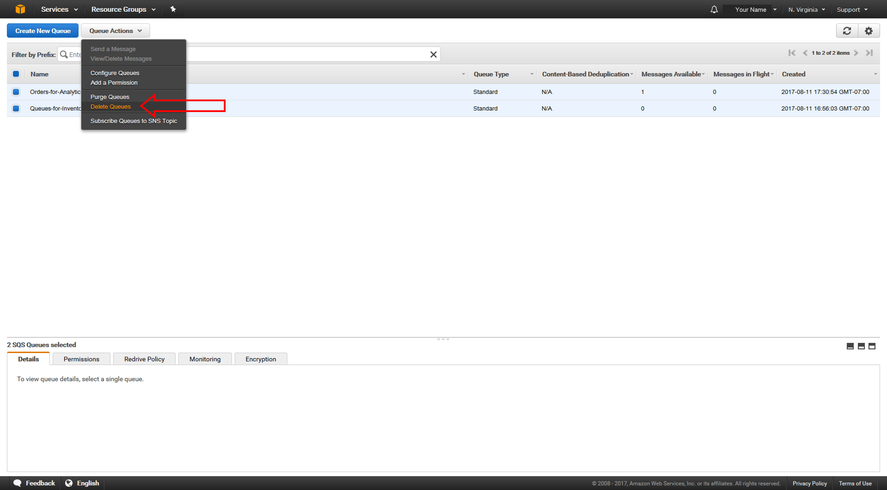 4. Confirm deletion The **Delete Queues** dialog box is displayed. Click **Yes, Delete 2 Queues**. The queues are deleted. You can now sign out of the Amazon SQS console. 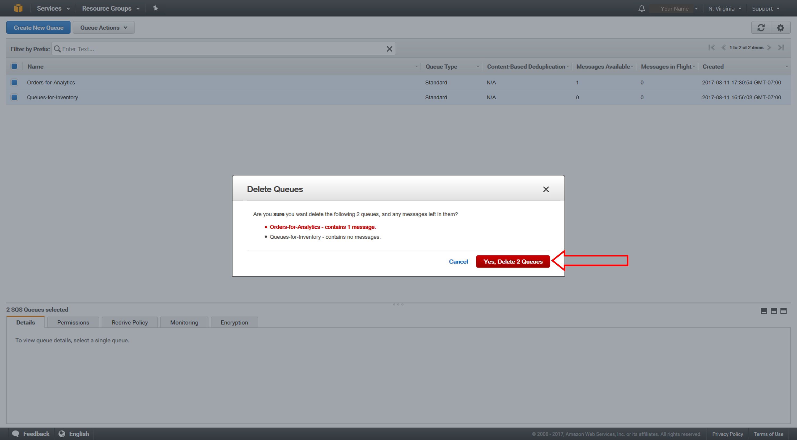 ## Congratulations! You have implemented a fanout scenario using Amazon SNS and Amazon SQS. You are now ready to use Amazon SNS and Amazon SQS together to deliver messages to applications that require immediate notification of an event, or to buffer messages in Amazon SQS queues for other applications to process later. |
