# **Set up an AWS Transfer Family server with Amazon Cognito as a custom identity provider**

|                      |                                                                                                                                                                                                                                                                                                                                                                                                                                                          |
| -------------------- | -------------------------------------------------------------------------------------------------------------------------------------------------------------------------------------------------------------------------------------------------------------------------------------------------------------------------------------------------------------------------------------------------------------------------------------------------------- |
| **AWS experience**   | Beginner                                                                                                                                                                                                                                                                                                                                                                                                                                                 |
| **Time to complete** | 35 minutes                                                                                                                                                                                                                                                                                                                                                                                                                                               |
| **Cost to complete** | Less than $1 when completed in 1 hour                                                                                                                                                                                                                                                                                                                                                                                                                    |
| **Services used**    | [AWS Transfer Family](https://aws.amazon.com/aws-transfer-family/ "https://aws.amazon.com/aws-transfer-family/"),<br>[Amazon S3](https://aws.amazon.com/s3/ "https://aws.amazon.com/s3/"),<br>[Amazon Cognito](https://aws.amazon.com/cognito/ "https://aws.amazon.com/cognito/"), [Amazon DynamoDB](https://aws.amazon.com/dynamodb/ "https://aws.amazon.com/dynamodb/"), [AWS Lambda](https://aws.amazon.com/lambda/ "https://aws.amazon.com/lambda/") |
| **Last updated**     | November 06, 2025                                                                                                                                                                                                                                                                                                                                                                                                                                        |

## Introduction

The [AWS Transfer Family custom identity provider solution](../../../transfer/latest/userguide/custom-idp-toolkit.md "../../../transfer/latest/userguide/custom-idp-toolkit.md") is a modular [custom identity provider](../../../transfer/latest/userguide/custom-lambda-idp.md "../../../transfer/latest/userguide/custom-lambda-idp.md") (IdP) solution designed for AWS Transfer Family that addresses many common authentication and authorization use cases enterprises encounter when implementing the service.

This modular solution offers:

- A reusable foundation for implementing custom identity providers
- Granular per-user session configuration
- Separated authentication and authorization logic

In this tutorial, you will follow step-by-step instructions to set up an AWS Transfer Family server using Amazon Cognito for authentication and authorization through the custom identity provider solution.

## Architecture

This solution allows you to use your existing identity system for user authentication. It combines AWS Lambda and the Amazon DynamoDB database to store configuration metadata about users and IdPs. This approach supports various identity providers and can be easily expanded to meet future needs. The user records in the DynamoDB table map usernames to specific IdPs and store per-user settings like home directory details, roles, and POSIX profiles. When a client connects to the AWS Transfer Family server, the custom IdP Lambda function authenticates the user against the configured IdP module, retrieves the user-specific session settings from DynamoDB, and provisions those settings for the session.

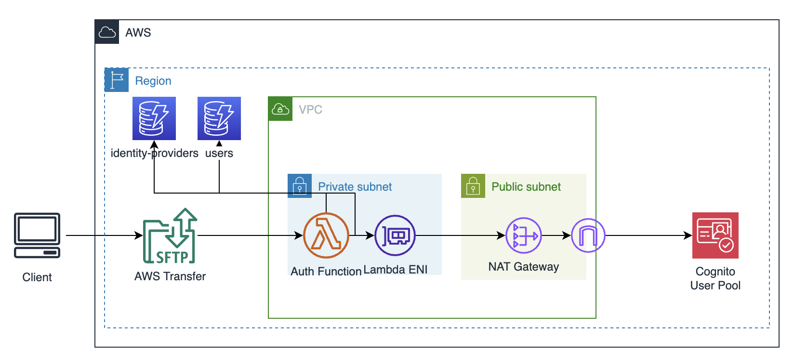

## Prerequisites

- Recommended browser: The latest version of Chrome or Firefox

- AWS account with administrator-level access: If you don't already have one, follow the [Setting Up Your AWS Environment](https://aws.amazon.com/getting-started/guides/setup-environment/ "https://aws.amazon.com/getting-started/guides/setup-environment/") getting started guide for a quick overview.

## Tasks

This tutorial is divided into the following short tasks. You must complete each task before moving on to the next one.

1. Deploy an AWS Transfer Family custom IdP solution using an AWS Serverless Application Model template (5 minutes)
2. Create an AWS Transfer Family server (5 minutes)
3. Create an Amazon S3 bucket and IAM role for Transfer Family server (5 minutes)
4. Create an Amazon Cognito user pool and client (5 minutes)
5. Configure Amazon Cognito as an identity provider (5 minutes)
6. Test user access to AWS Transfer Family server (5 minutes)
7. Clean up resources (5 minutes)

## Implementation

In this task, you will deploy an AWS Transfer Family Custom IdP solution using an AWS Serverless Application Model (AWS SAM)
template in [AWS CloudShell,](https://aws.amazon.com/cloudshell/ "https://aws.amazon.com/cloudshell/") a browser-based,
pre-authenticated shell that you can launch directly from the AWS Management Console

1. Open [AWS CloudShell](https://console.aws.amazon.com/cloudshell/ "https://console.aws.amazon.com/cloudshell/") and ensure you are in a region
   you want to deploy the solution.

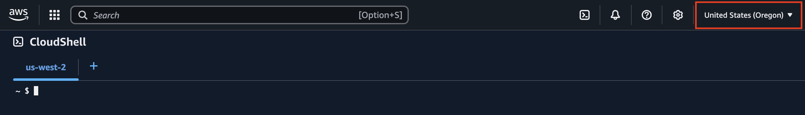 2. Clone the git repository into your environment

```
cd ~
git clone https://github.com/aws-samples/toolkit-for-aws-transfer-family.git

```

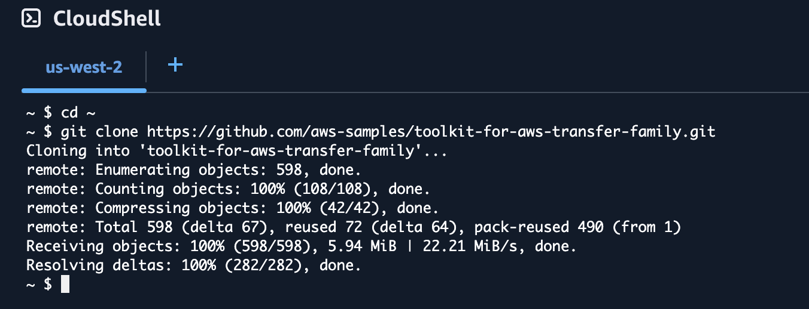 3. Run the following command to start the build script.

This script downloads all package dependencies and generates archives for the
Lambda layer and function used in the solution.

```
cd ~/toolkit-for-aws-transfer-family/solutions/custom-idp
./build.sh

```

Monitor the execution and verify that the script completes successfully.

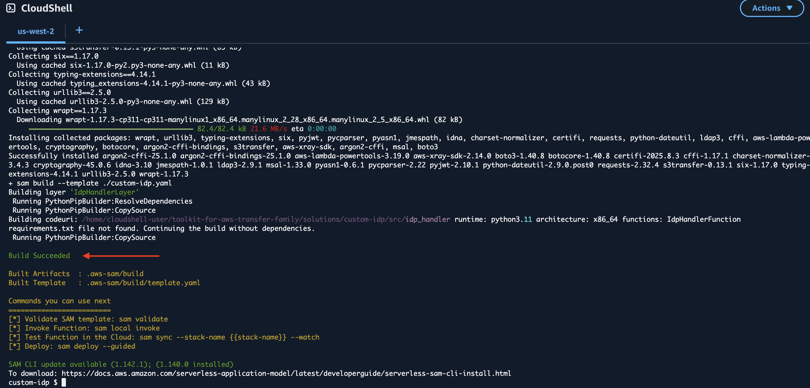 4. Run the following command to deploy the custom idp solution using the AWS SAM
template.

```
sam deploy --guided --capabilities "CAPABILITY_NAMED_IAM"
```

At the prompts, provide the values as highlighted in the image:

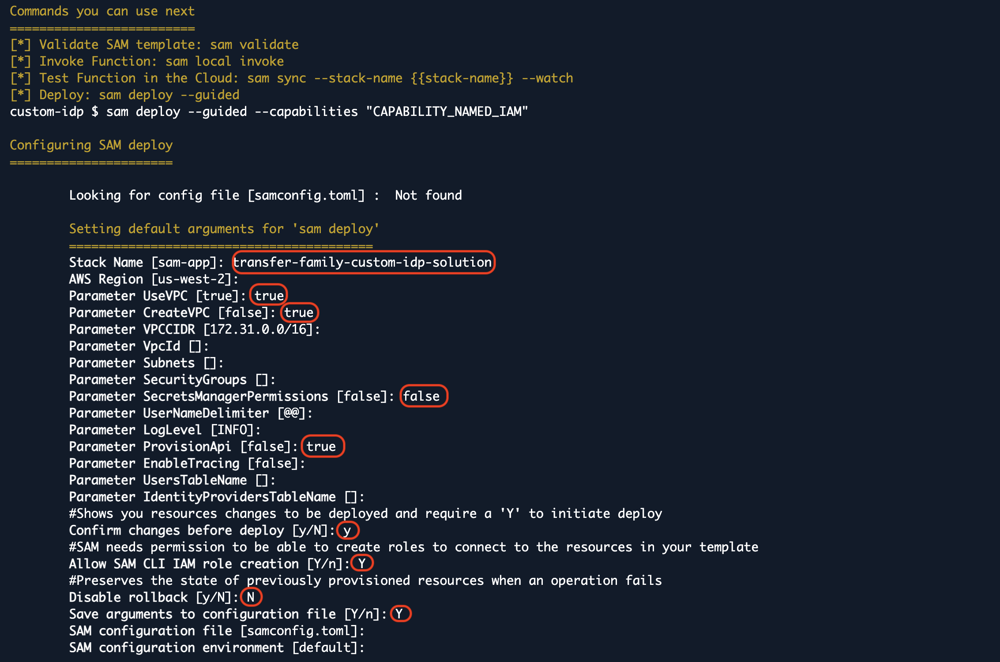 5. Open [AWS CloudFormation](https://console.aws.amazon.com/cloudformation/ "https://console.aws.amazon.com/cloudformation/"), and check the
**Status** column for the **transfer-family-custom-idp-solution** stack.

Successful status is CREATE_COMPLETE 6. Select the **stack** and review the **Outputs** tab. We will need this information in future
tasks.
In this task, you will create an AWS Transfer Family server which will use the custom IdP solution
deployed in the previous task.

1. Open [AWS Transfer Family](https://console.aws.amazon.com/transfer/ "https://console.aws.amazon.com/transfer/") and select
   **Create server**.

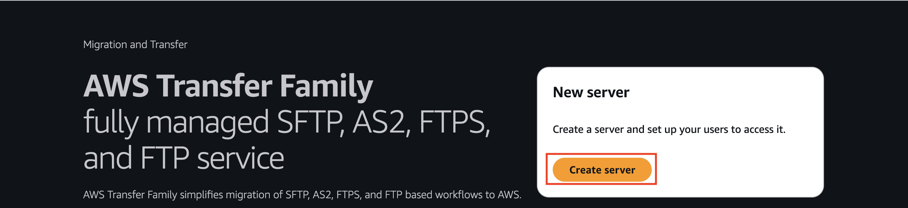 2. For **Choose protocols**, leave the default SFTP and choose **Next.**

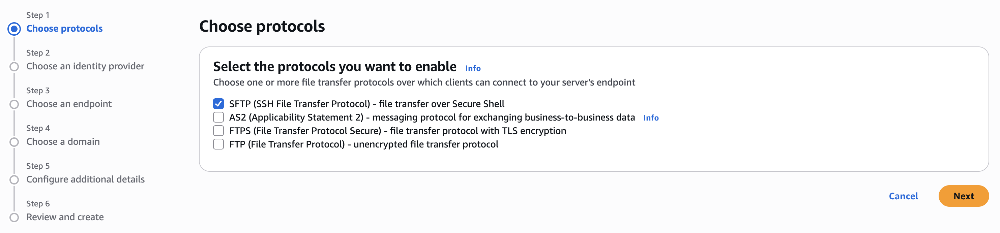 3. For **Choose an identity provider**, select **Custom Identity Provider**, then select one of the identity provider options below.

    * **Option 1: Use AWS Lambda to connect your identity
     provider**


    	+ Choose **transfer-family-custom-idp-solution-idp** Lambda function in the
    	 dropdown and choose **Next**.


    	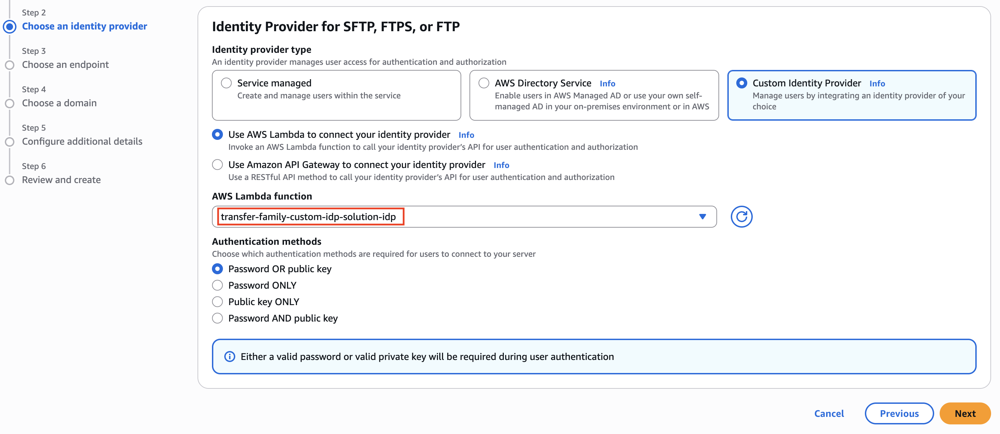
    * Option 2: **Use API Gateway to connect your identity
     provider**


    	+ Specify the API Gateway Url from the **ApiUrl**
    	 output (for example, )
    	+ Choose the IAM role from the list that matches the output from the
    	 **ApiRole** (for example,
    	 *[StackName]\_ [Region]-tf-api*)


    	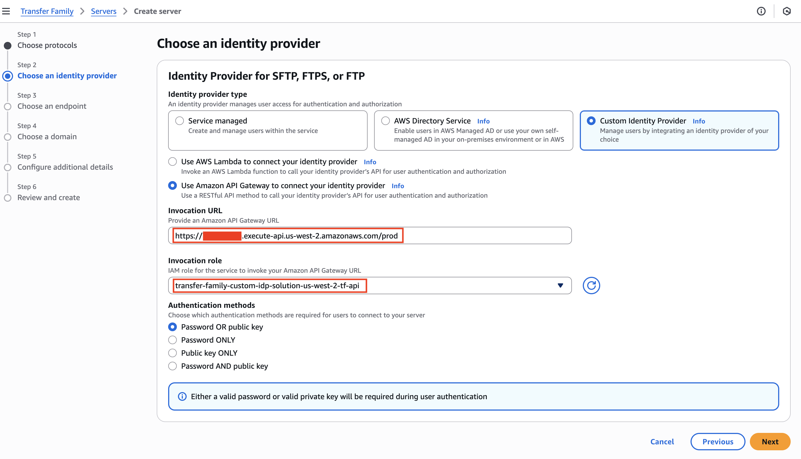

4. At the **Choose an endpoint** screen, confirm
   Endpoint configuration as **Publicly accessible,** then
   choose **Next**.

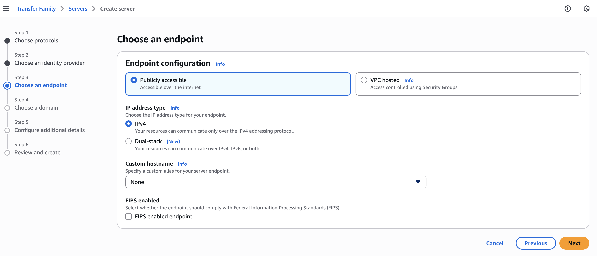 5. For **Choose a domain**, select the AWS Storage
Service to use **Amazon S3** and choose **Next**.

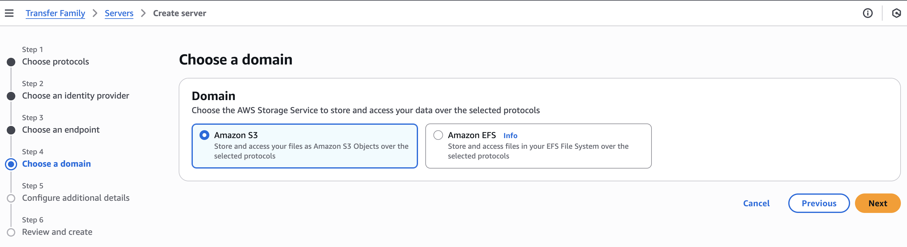 6. At the **Configure additional details** screen, leave all
defaults and choose **Next**. 7. For **Review and create**, review and verify all settings for the
new server and choose **Create**. 8. In the AWS Transfer Family console, a new server will appear in the list with a **State** of Starting. Wait for the **State** to show Online before proceeding to the next task.

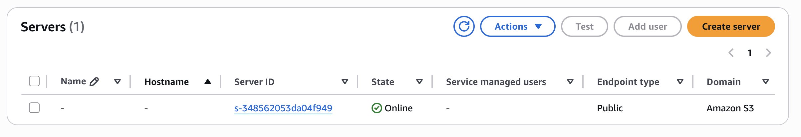
In this task, you will create an [Amazon S3](https://aws.amazon.com/s3/ "https://aws.amazon.com/s3/") bucket to store information accessed through the AWS Transfer Family server that was created in the previous task. You will then create an IAM role to provide the Transfer Family server with access to the S3 bucket.

1. Open [Amazon S3](https://console.aws.amazon.com/s3/get-started/ "https://console.aws.amazon.com/s3/get-started/"), and select
   **Create bucket**.

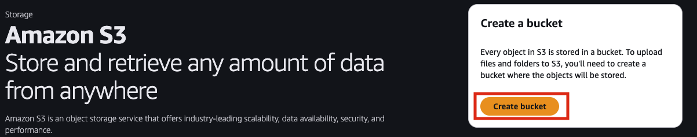 2. Under **General configuration**, provide a bucket
name.

###### Note

The bucket name should be globally unique.

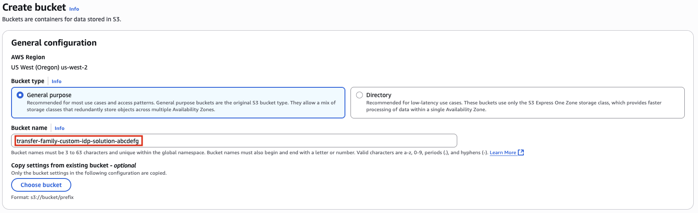 3. Leave all the other settings as defaults and select **Create bucket**. 4. Copy the name of the bucket in a text editor. 5. Open [AWS IAM](https://console.aws.amazon.com/iam/ "https://console.aws.amazon.com/iam/"), and select **Policies** in the navigation. 6. Choose **Create policy** and then select **JSON** view. 7. Paste the following policy into the policy editor. 8. Replace `YOUR-BUCKET-NAME` with the bucket you created and choose **Next**.

See Step 3 for bucket name.

```
{
      "Version": "2012-10-17",&TCX5-2025-waiver;
      "Statement": [{
        "Effect": "Allow",
        "Action": [
          "s3:GetBucketLocation",
          "s3:ListBucket",
          "s3:*Object",
          "s3:GetObjectVersion",
          "s3:PutObjectTagging",
          "s3:PutObjectVersionTagging",
          "s3:ListBucketVersions"
        ],
        "Resource": [
          "arn:aws:s3:::`YOUR-BUCKET-NAME`*",
          "arn:aws:s3:::`YOUR-BUCKET-NAME`/*"
        ]
      }]
  }

```

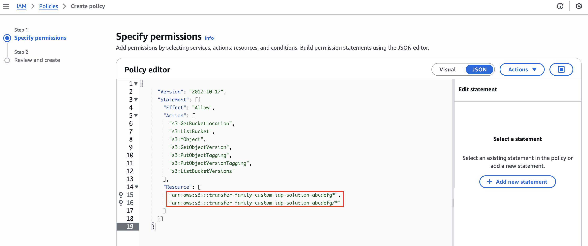 9. In the **Review and create** screen, provide the name of the
policy as _transfer-family-custom-idp-user-policy_ and then choose
**Create policy\***.* 10. In the navigation pane, choose Roles, then select on Create role. 11. Confirm that *AWS Service* is selected as **Trusted entity type** and select *Transfer\*
for **Use case** and choose **Next.**

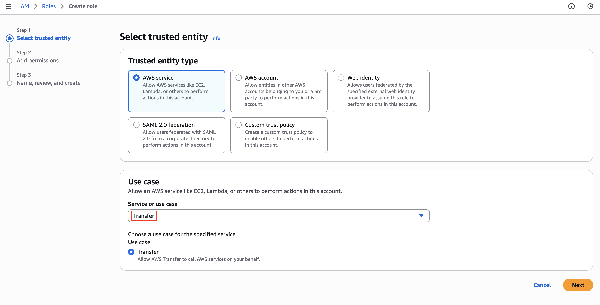 12. In the Add Permissions screen, search and select
_transfer-family-custom-idp-user-policy_ and choose **Next\***.\*

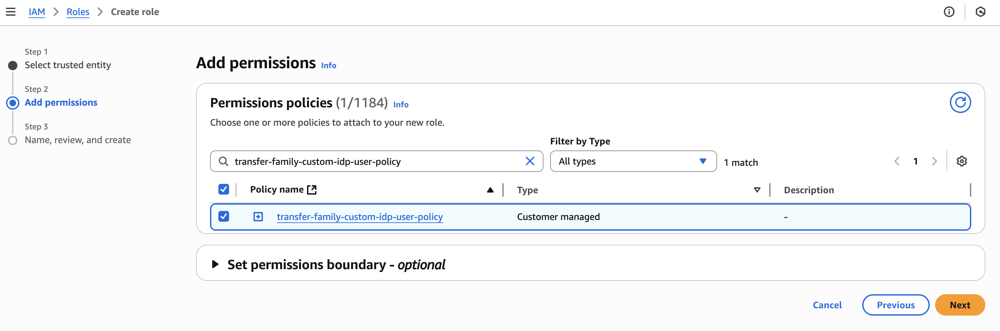 13. In the Name, review and create screen, provide the Role name as
_transfer-family-custom-idp-user-role and_ select
**Create role\***.* 14. Select the **View role** button to view the details
of the IAM role and copy the ARN in your text editor. For example,
*arn:aws:iam::ACCOUNTNUMBER:role/transfer-family-custom-idp-user-role\*.
In this task, you will create an Amazon Cognito user pool and client which will be used as an IdP
for AWS Transfer Family Server created in the previous task.

**Implementation**

1. Open [AWS CloudShell](https://console.aws.amazon.com/cloudshell/ "https://console.aws.amazon.com/cloudshell/") and paste the
   following command to create an Amazon Cognito user pool.

```
aws cognito-idp create-user-pool \
  --pool-name "TransferFamilyUserPool" \
  --username-configuration CaseSensitive=false \
  --auto-verified-attributes email \
  --schema '[
    {
      "Name": "email",
      "AttributeDataType": "String",
      "Mutable": false,
      "Required": true
    },
    {
      "Name": "name",
      "AttributeDataType": "String",
      "Mutable": true,
      "Required": true
    }
  ]'

```

2. Copy and save the **user pool id** (format:
   region_xxxxxxxxxxxxx) from the command output.

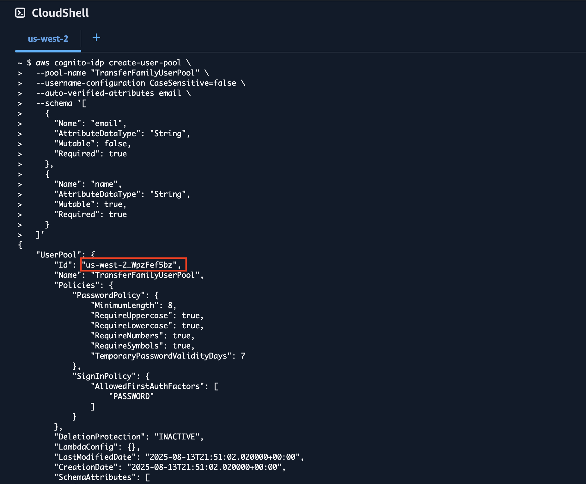 3. In the same command line, paste the following command with your newly created user
pool id to create an Amazon Cognito user pool client for the user pool created above.

```
aws cognito-idp create-user-pool-client \
  --user-pool-id `YOUR_USER_POOL_ID` \
  --client-name "TransferUserPoolClient" \
  --explicit-auth-flows ALLOW_USER_PASSWORD_AUTH ALLOW_REFRESH_TOKEN_AUTH ALLOW_USER_SRP_AUTH ALLOW_CUSTOM_AUTH \
  --allowed-o-auth-flows-user-pool-client \
  --callback-urls "http://localhost:3000" \
  --allowed-o-auth-flows code implicit \
  --allowed-o-auth-scopes phone email openid profile \
  --supported-identity-providers COGNITO

```

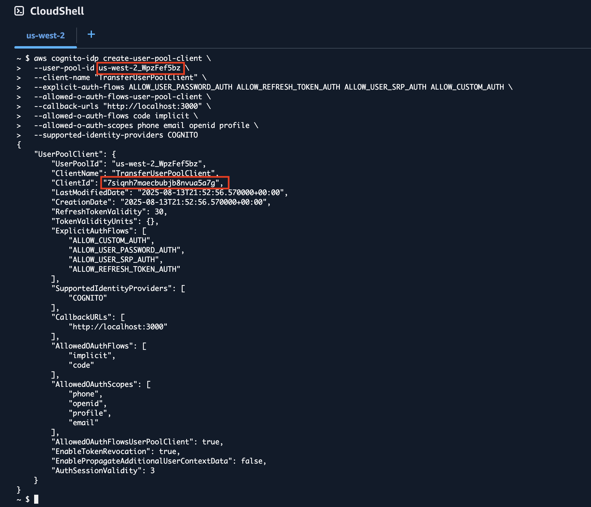 4. Save the ClientId in a secure location

We will use the user pool ID and Client ID to configure the identity provider for the
Transfer Family Server. 5. Paste the following commands to create a new user named John in the Cognito User Pool
created above.

Update USER_POOL_ID from previous step and choose a password of your choice.

Create a user named John:

```
aws cognito-idp admin-create-user --user-pool-id `USER_POOL_ID` --username john --temporary-password "`PASSWORD`" --message-action SUPPRESS --user-attributes Name=email,Value=john@example.com Name=email_verified,Value=true
```

Set permanent password:

```
aws cognito-idp admin-set-user-password --user-pool-id `USER_POOL_ID` --username john --password "`PASSWORD`" --permanent
```

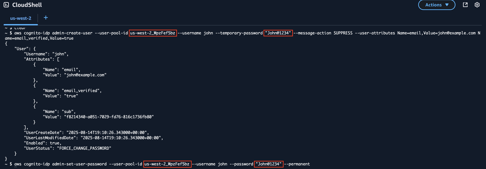
In this task, you will use [Amazon DynamoDB](https://aws.amazon.com/dynamodb/ "https://aws.amazon.com/dynamodb/") to
configure Amazon Cognito as a custom identity provider for the AWS Transfer Family Server.

1. Open [Amazon DynamoDB,](https://console.aws.amazon.com/dynamodbv2/ "https://console.aws.amazon.com/dynamodbv2/") choose
   **Tables** from the navigation on the left hand side, then select the
   **transfer-family-custom-idp-solution_identity_providers**
   table.

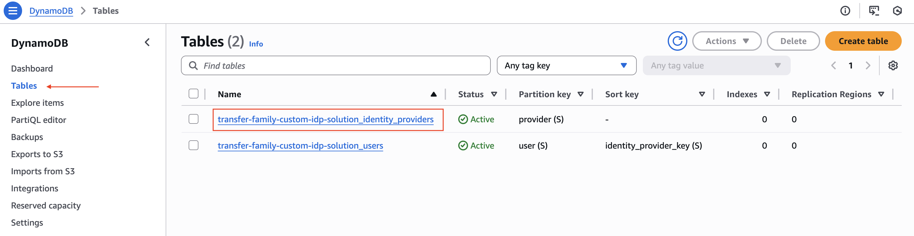 2. Select **Explore table items** and then select **Create
item**.

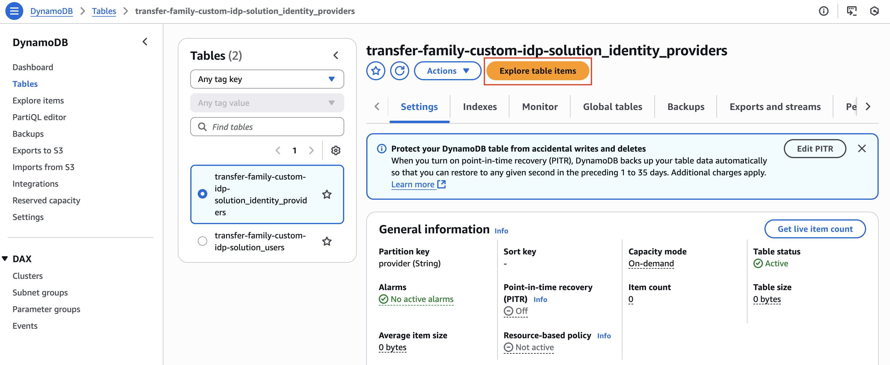 3. In the Create item screen, select JSON View, then paste the following into the
record.

Update `cognito_client_id` value with your ClientId
created in the previous task.

```
{ "provider": { "S": "CognitoIDP" }, "config": { "M": { "cognito_client_id": { "S": "`YOUR_OWN_CLIENT_ID`" } } }, "module": { "S": "cognito" }
```

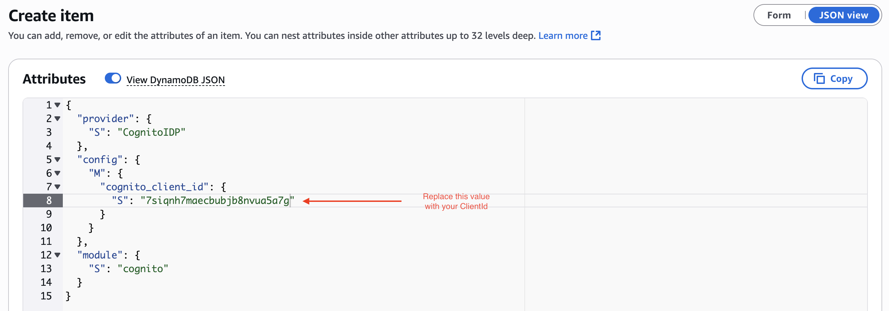 4. Select **Create item**. 5. Now, select the **transfer-family-custom-idp-solution_users** table, then select
**Create item**. 6. In the Create item screen, select JSON View, then paste the following into the
record.

Update `YOUR-BUCKET-NAME` and `ACCOUNTNUMBER` accordingly and select **Create
item**.

```
{ "user": { "S": "john" }, "identity_provider_key": { "S": "CognitoIDP" },
 "config": { "M": { "HomeDirectoryDetails": { "L": [ { "M": { "Entry": { "S": "/john" }, "Target": { "S": "/`YOUR-BUCKET-NAME`/john" } } } ] }, "HomeDirectoryType": { "S": "LOGICAL" }, "Role": { "S": "arn:aws:iam::`ACCOUNTNUMBER`:role/transfer-family-custom-idp-user-role" } } } }

```

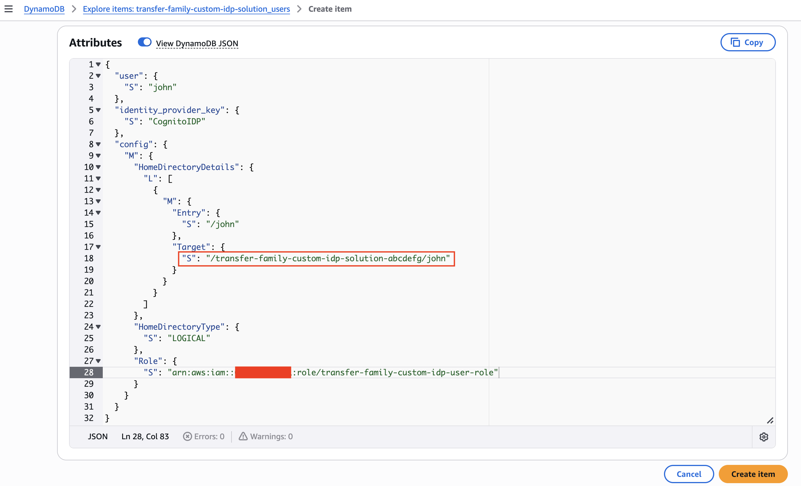
In this task, you will log into the AWS Transfer Family server and see how different permissions
will affect user access to files.

When setting the user permissions, we used the [logical directories](../../../transfer/latest/userguide/logical-dir-mappings.md "../../../transfer/latest/userguide/logical-dir-mappings.md")
feature of AWS Transfer Family to create a virtual directory structure based on user entitlements. With
logical directories, you can construct a virtual directory structure that uses user-friendly
names that your users navigate when they connect to your Amazon S3 bucket or Amazon EFS file system.
When you use logical directories, you can avoid disclosing absolute directory paths, Amazon S3
bucket names, and EFS file system names to your end users.

1. Find the `TRANSFER_FAMILY_SERVER_ENDPOINT_URL` by opening to [AWS Transfer Family](https://console.aws.amazon.com/transfer/ "https://console.aws.amazon.com/transfer/") and choosing **Servers** in the navigation bar.
2. Select the server you created and copy the **Endpoint
   URL**.

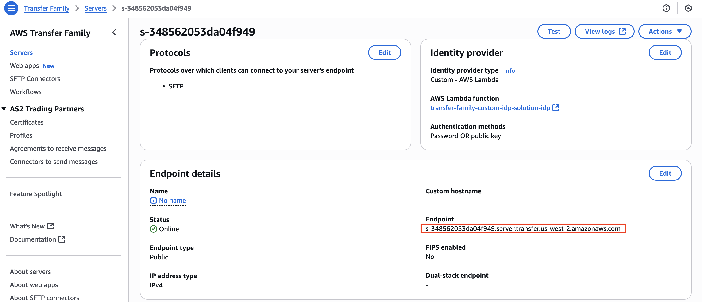 3. Open [AWS CloudShell](https://console.aws.amazon.com/cloudshell/ "https://console.aws.amazon.com/cloudshell/") and create a
test file for John by pasting the following command:

```
echo "This is just some text." > index.txt
```

4. Log into the AWS Transfer Family server as John by pasting the following command:

```
sftp john@`TRANSFER_FAMILY_SERVER_ENDPOINT_URL`
```

5. Enter yes for RSA key fingerprint. Press the enter key. Enter the password you set in
   Amazon Cognito for the user, and press the enter key.

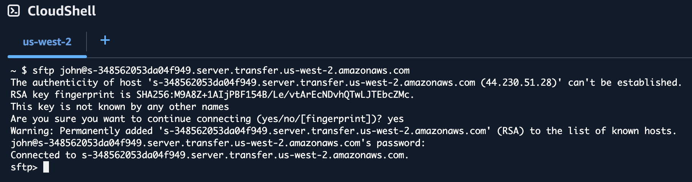 6. View the contents of the logical directories that are mapped for John by running
_ls_ command. 7. Upload the _index.txt_ file to the _john_
folder.

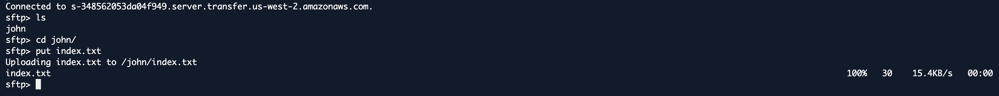
You have successfully created an AWS Transfer Family server using Amazon Cognito as an identity provider and
tested user access as John.

It is recommended that you delete the app and the backend resources that you created during this tutorial to prevent unexpected costs.

Paste the following commands in [AWS CloudShell](https://console.aws.amazon.com/cloudshell/ "https://console.aws.amazon.com/cloudshell/") to clean up the resources created in this tutorial.

1. Empty Amazon S3 bucket (required before deletion):

```
aws s3 rm s3://`YOUR-BUCKET-NAME` --recursive --region $AWS_REGION
```

2. Then delete the empty bucket:

```
aws s3 rb s3://`YOUR-BUCKET-NAME`E --region $AWS_REGION
```

3. Detach AWS IAM policy from the AWS IAM role and then delete both:

```
aws iam detach-role-policy --role-name transfer-family-custom-idp-user-role --policy-arn $(aws iam list-policies --query 'Policies[?PolicyName==`transfer-family-custom-idp-user-policy`].Arn' --output text)
```

```
aws iam delete-policy --policy-arn $(aws iam list-policies --query 'Policies[?PolicyName==`transfer-family-custom-idp-user-policy`].Arn' --output text)
```

```
aws iam delete-role --role-name transfer-family-custom-idp-user-role
```

4. Delete Amazon Cognito User Pool Client ID:

```
aws cognito-idp delete-user-pool-client --user-pool-id `USER_POOL_ID` --client-id `CLIENT_ID`
```

5. Delete Amazon Cognito user pool:

```
aws cognito-idp delete-user-pool --user-pool-id `USER_POOL_ID`
```

6. Delete AWS Transfer Family Server (Replace s-xxxxxxxxxx with your actual server ID):

```
aws transfer delete-server --server-id `s-xxxxxxxxxx`
```

7. Delete AWS Transfer Family Custom IdP solution AWS SAM deployment:

```
sam delete --stack-name transfer-family-custom-idp-solution
```

## **Conclusion**

In this tutorial, we introduced the AWS Transfer Family custom identity provider (IdP) solution for managing users and demonstrated how to deploy and use the solution with Amazon Cognito as identity provider. The combination of pre-built identity provider modules and flexibility to apply per-user settings to AWS Transfer Family sessions makes it a compelling option for customers implementing custom IdPs. Check out [AWS Transfer Family Custom IdP Solution](https://github.com/aws-samples/toolkit-for-aws-transfer-family "https://github.com/aws-samples/toolkit-for-aws-transfer-family") GitHub project for documentation on other supported identity providers.
