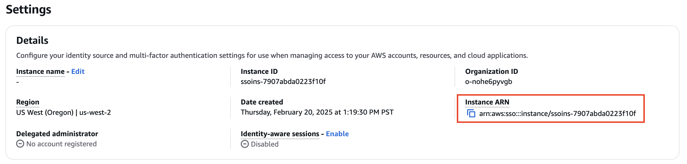
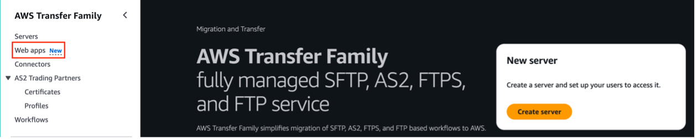
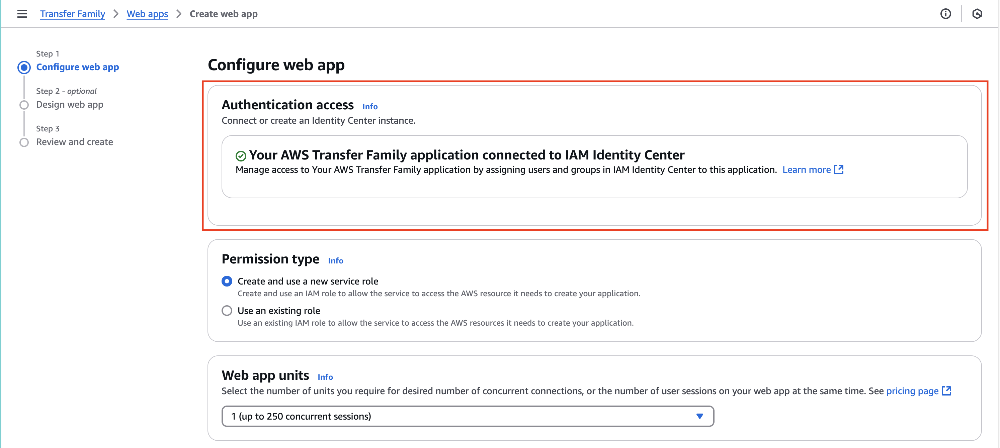
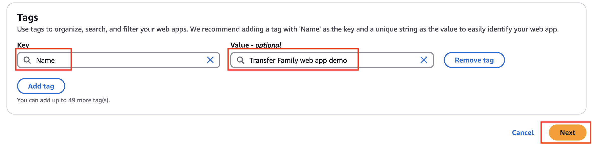
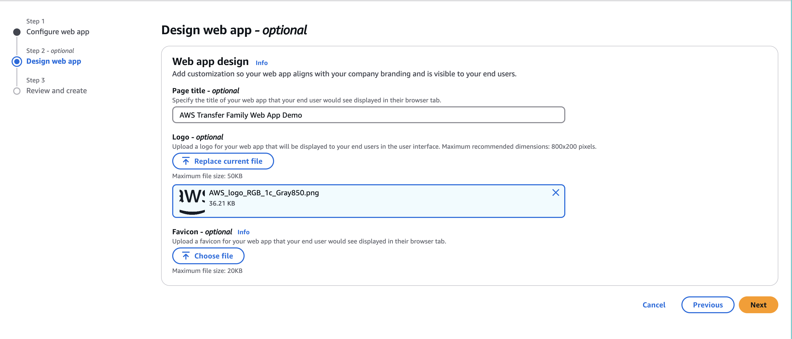
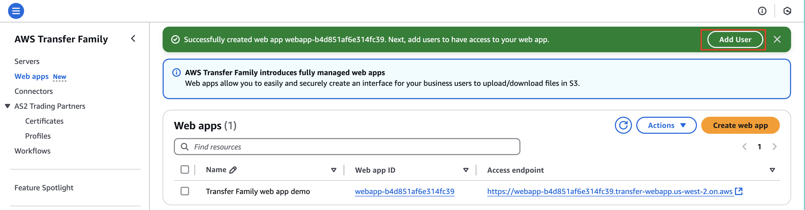
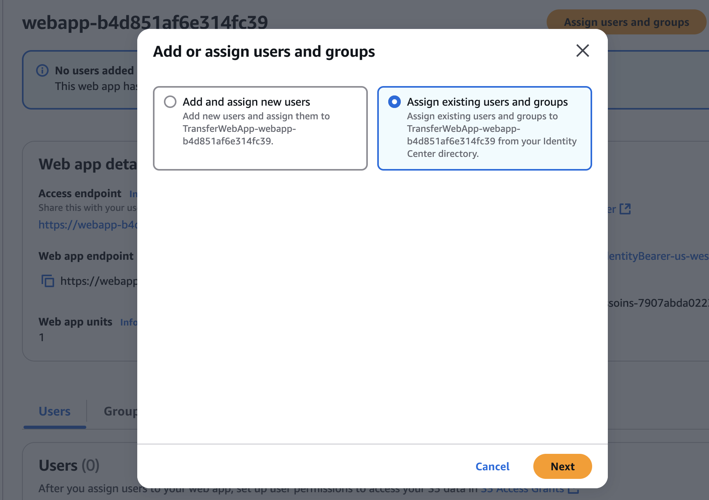
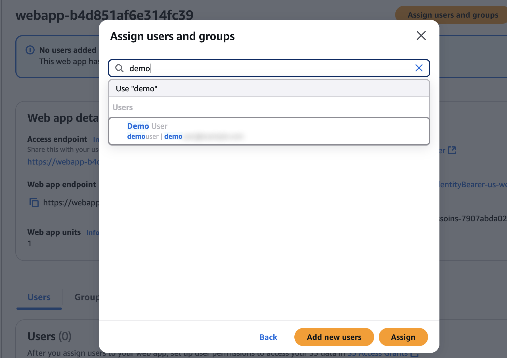
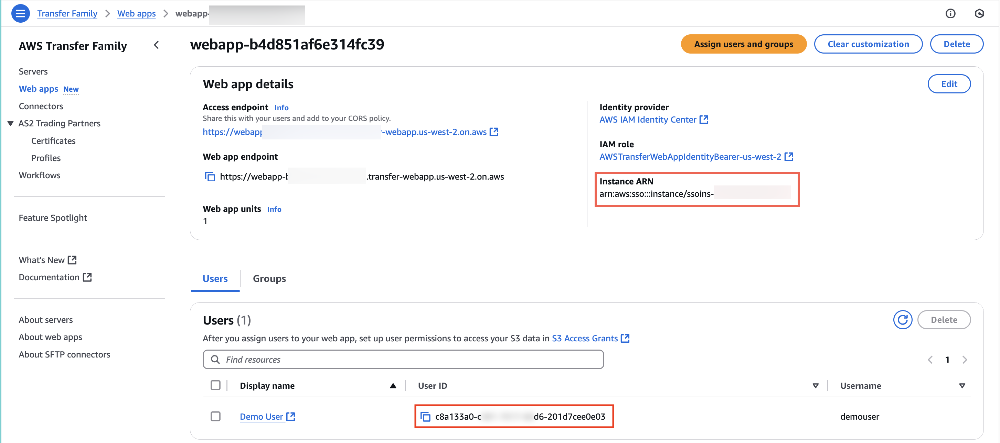

# Task 1: Create the web app

|                      |                                                                                                                                                                                                 |
| -------------------- | ----------------------------------------------------------------------------------------------------------------------------------------------------------------------------------------------- |
| **Time to complete** | 5 minutes                                                                                                                                                                                       |
| **Requires**         | • An AWS account: If you don't already have an account, follow the [Setting Up Your Environment](../setup-environment.md "../setup-environment.md") tutorial. • An internet browser |
| **Get help**         | [Troubleshooting IAM issues](../../../IAM/latest/UserGuide/troubleshoot_general.md "../../../IAM/latest/UserGuide/troubleshoot_general.md")                                                     |

## Overview

In this task, you will create an AWS Transfer Family web app and assign your user to the app.

## Implementation

1. Get IAM Identity Center instance ARN

Sign in to the [AWS Management Console](https://aws.amazon.com/console/ "https://aws.amazon.com/console/"), search
for **AWS IAM Identity Center**, and confirm that you are in the
correct AWS Region.

Select **Settings** and note the **Instance ARN**. (You will need it in a later task.)

 2. Open the Transfer Family console

Navigate to AWS Transfer Family and select **Web apps**.

 3. Configure web app

Select **Create web app** to configure a web
app.

Verify that IAM Identity Center is connected under **Authentication
Access**:

    * For **Permission type**, choose **Create** and use a new service role.
    * For **Web app units**, choose **1 (up to 250 concurrent sessions)**.

 4. Add tags

For **Tags**, select **Add
tag**.

    * For **Key**, enter **Name**.
    * For **Value**, enter **Transfer Family
     web app demo**.

Choose **Next**.

 5. Customize web app

On the **Design web app** page:

    * For **Page title**, enter **AWS Transfer Family Web App Demo**.
    * (Optional) Upload a logo.

Choose **Next**.

 6. Create web app

Choose **Next** and review your inputs.

Choose **Create web app**.

Once the web app is created, choose **Add
User**.

1. Assign users and groups

Choose **Assign users and groups.**

Select **Assign existing users and groups**.

Choose **Next**.

 2. Assign your user

In the pop-up window, search for **your user**.

Select **your user** and choose **Assign**. (The user created in the prerequisite tutorial [Setting Up Your
Environment](../setup-environment.md "../setup-environment.md").)

###### Note

If you need to confirm the name of your user, go to the [IAM Identity Center](https://us-west-2.console.aws.amazon.com/singlesignon/home "https://us-west-2.console.aws.amazon.com/singlesignon/home"),
and select **Users**.

 3. Get your instance ARN and user ID

In the **Web** **app** **details** pane, copy the **Instance** **ARN** as you will
need it when you enable cross-origin resource sharing.

On the **Users** tab, for **your** **user**, copy the **User** **ID** as you will need it
for the next task.

## Conclusion

In this task, you’ve learned how to create an AWS Transfer Family web app and assign a user to the app.
