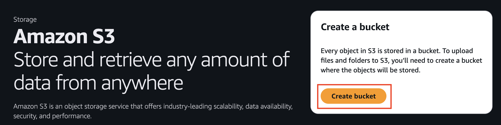
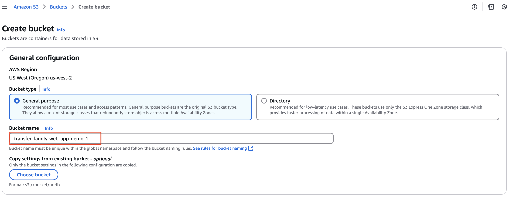
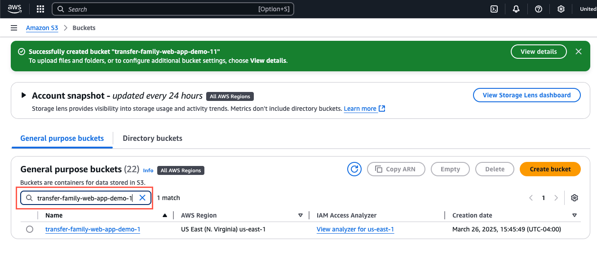
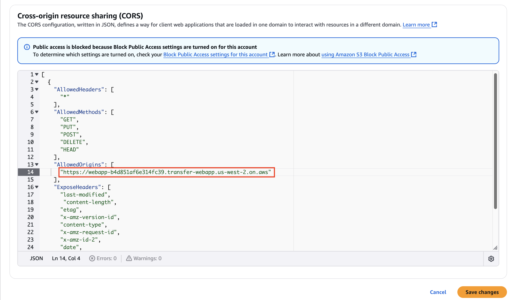

# Task 2: Set up cross-origin resource sharing (CORS)

|                      |                                                                                                                                                                                                 |
| -------------------- | ----------------------------------------------------------------------------------------------------------------------------------------------------------------------------------------------- |
| **Time to complete** | 5 minutes                                                                                                                                                                                       |
| **Requires**         | • An AWS account: If you don't<br>already have an account, follow the<br>[Setting<br>Up Your Environment](../setup-environment.md "../setup-environment.md") tutorial.<br>• An internet browser |
| **Get help**         | [Amazon S3 Troubleshooting](../../../AmazonS3/latest/userguide/object-ownership-error-responses.md "../../../AmazonS3/latest/userguide/object-ownership-error-responses.md")                    |

## Overview

In this task, you will create an Amazon S3 bucket and set up cross-origin resource sharing
(CORS). This S3 bucket will be used to store data by the user.

## Implementation

1. Create an S3 bucket

Open [Amazon S3 console](https://console.aws.amazon.com/s3/ "https://console.aws.amazon.com/s3/") and
choose **Create bucket**.

 2. Configure bucket details

For **Bucket name**, enter a descriptive, globally
unique name, for example, **transfer-family-web-app-demo-<your-username>**.

Leave the remaining options as defaults. Scroll to the bottom of the page and
choose **Create bucket**.



1. Open bucket permissions

After the bucket is created, on the **General purpose
buckets** tab, search for the bucket you created, select its **Name**, and then choose the **Permissions** tab.

 2. Configure CORS settings

    1. In **Cross-origin resource sharing (CORS)**,
     choose **Edit** and paste in the following code.


    ```
    [
      {
        "AllowedHeaders": [
          "*"
        ],
        "AllowedMethods": [
          "GET",
          "PUT",
          "POST",
          "DELETE",
          "HEAD"
        ],
        "AllowedOrigins": [
          "AccessEndpoint"
        ],
        "ExposeHeaders": [
          "last-modified",
          "content-length",
          "etag",
          "x-amz-version-id",
          "content-type",
          "x-amz-request-id",
          "x-amz-id-2",
          "date",
          "x-amz-cf-id",
          "x-amz-storage-class",
          "access-control-expose-headers"
        ],
        "MaxAgeSeconds": 3000
      }
    ]
    ```

    Replace **AccessEndpoint** with the actual
     **InstanceARN** you copied in the previous task.


    ###### Note

    Do not enter trailing slashes because trailing slashes will cause errors
     when users attempt to log into the web app.


    	* Correct example: **https://webapp-b4d851af6e314fc39.transfer-webapp.us-west-2.on.aws**
    	* Incorrect example: **https://webapp-b4d851af6e314fc39.transfer-webapp.us-west-2.on.aws******/****
    Choose **Save changes**.


    

## Conclusion

In this task, you’ve learned how to create an S3 bucket and set up cross-origin resource sharing (CORS).
