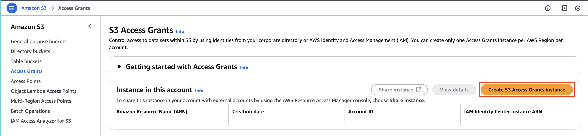
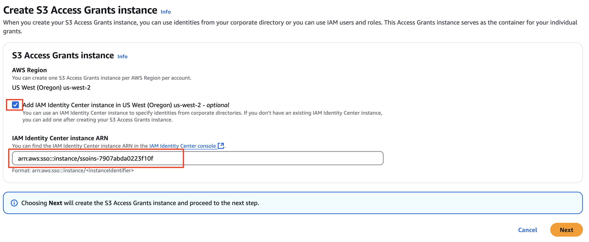
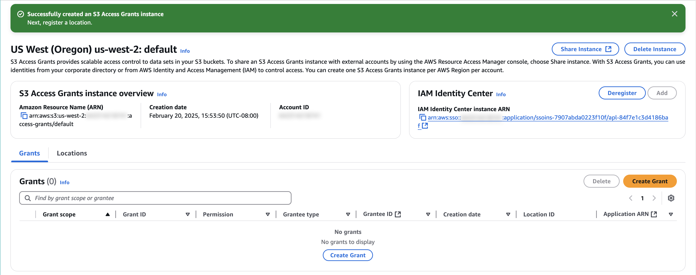
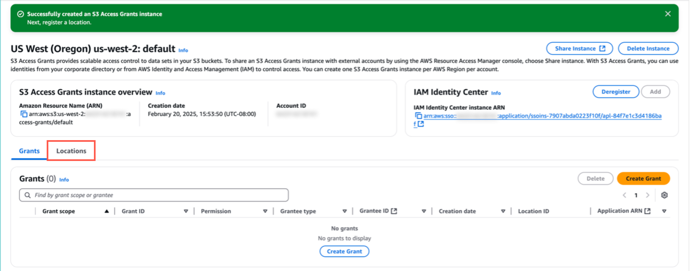
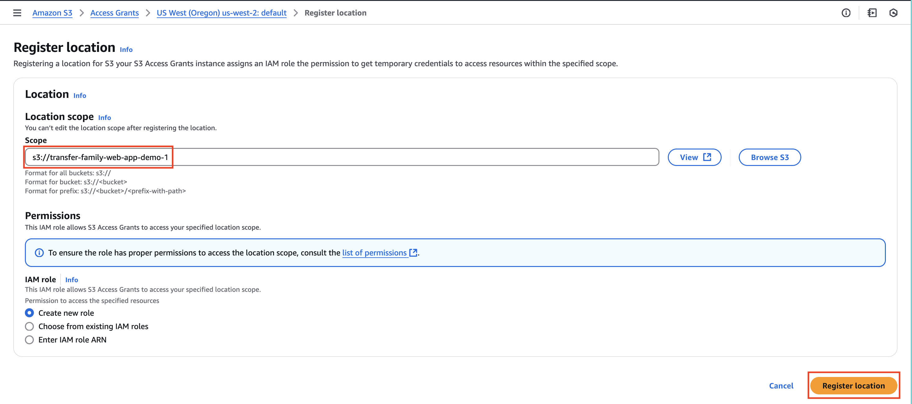
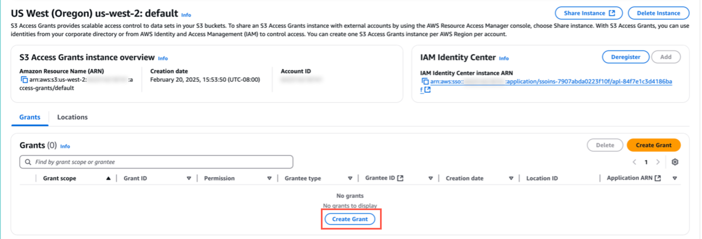
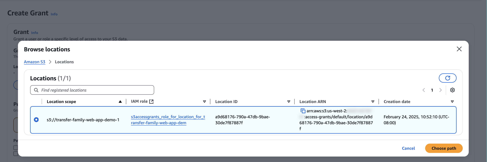
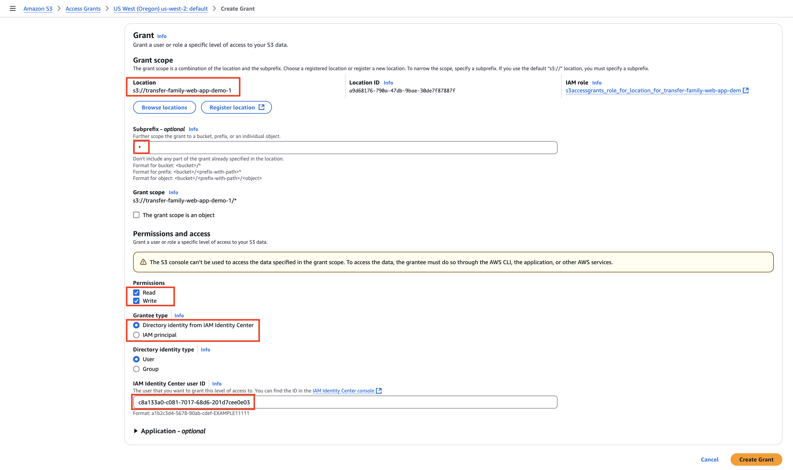

# Task 3: Create the instance

|                      |                                                                                                                                                                                                     |
| -------------------- | --------------------------------------------------------------------------------------------------------------------------------------------------------------------------------------------------- |
| **Time to complete** | 5 minutes                                                                                                                                                                                           |
| **Requires**         | • **An AWS account**: If you don't already have an account, follow the [Setting Up Your Environment](../setup-environment.md "../setup-environment.md") tutorial. • An internet browser |
| **Get help**         | [Amazon S3 Access Grants Instance Troubleshooting](../../../AmazonS3/latest/userguide/access-grants-instance.md "../../../AmazonS3/latest/userguide/access-grants-instance.md")                     |

## Overview

In this task, you will create an S3 access grants instance, register
a location, and set up an access grant for the S3 bucket you’ve
created in the previous task.

## Implementation

1. Open the console

Open
[Amazon S3 Access Grants console](https://console.aws.amazon.com/s3/access-grants "https://console.aws.amazon.com/s3/access-grants"), and choose
**Create S3 Access Grants
instance**.

 2. Add Identity Center instance ARN

Select **Add IAM Identity Center
instance**. For **IAM Identity Center instance ARN**, enter the
**InstanceARN** you copied in Task
1 and choose **Next**.

 3. Create the instance

Choose **Next** to create an S3
Access Grants instance.

Select **Cancel.** (Note: This is
for ease of creating a new IAM Role).

1. Open Locations

Choose the **Locations** tab.

 2. Configure location

On the **Register location** page,
do the following:

    * For the **Scope**, select
     **Browse** and choose your
     bucket.

    	+ Note that the scope begins with the string
    	 **s3://**.
    * For the **IAM role**, choose
     **Create new role**.

    	+ This role allows S3 Access Grants to access your specified
    	 location scope.

Choose **Register location** to
continue.

1. Create a grant

Choose **Create Grant**.

 2. Choose location

For **Location**, choose
**Browse** locations, then choose
the location that you registered in the
**Register a location** section.

Then select **Choose path**.

 3. Configure and create grant

On the **Path** page, do the
following:

    * For **Subprefix**, enter
     **\*** to indicate that the
     access grant applies to the entire bucket.
    * For **Permissions**, select
     **Read** and
     **Write**.
    * For **Grantee type**, select
     **Directory identity from IAM Identity Center**.
    * For **Directory identity
     type**, select
     **User**.
    * For **IAM Identity Center user
     ID**, enter the user ID you copied in Task 1.

Choose **Create Grant**.

## Conclusion

In this task, you created an S3 Access Grants instance, registered a location, and set up an access grant for the S3 bucket you created in the previous task.
