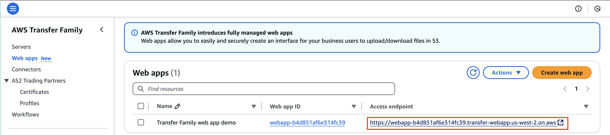
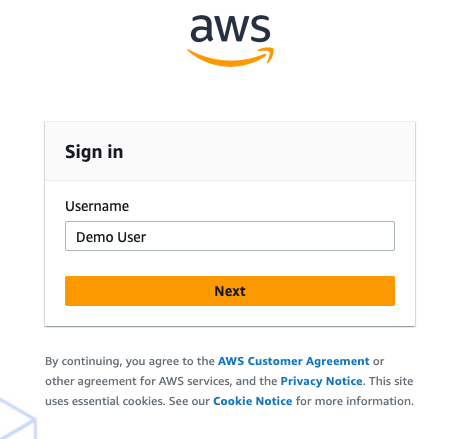
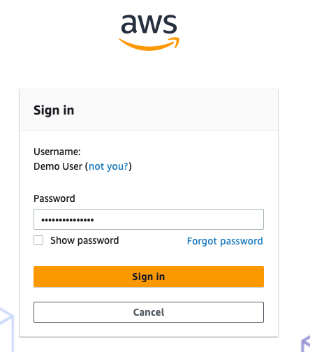
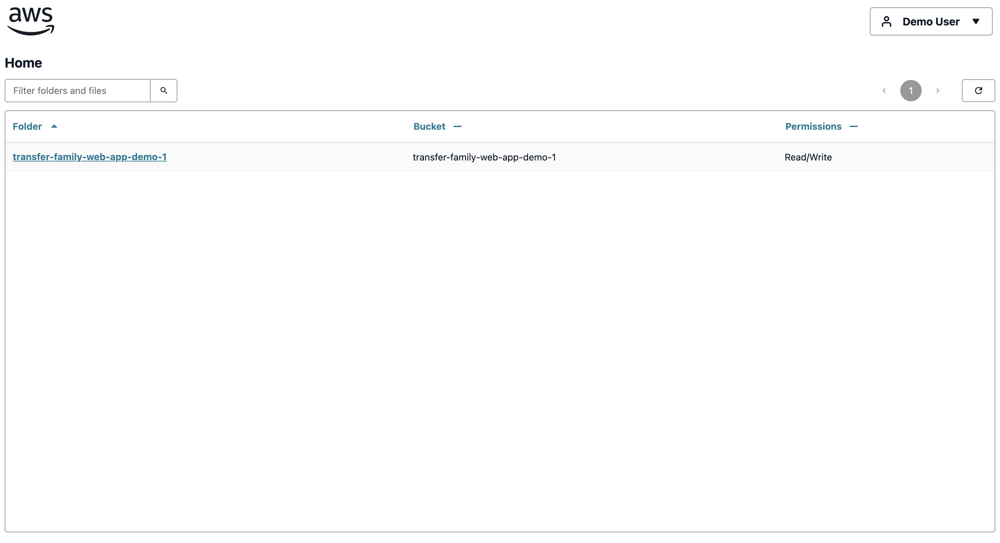
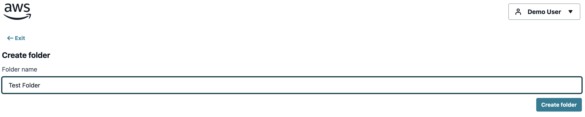
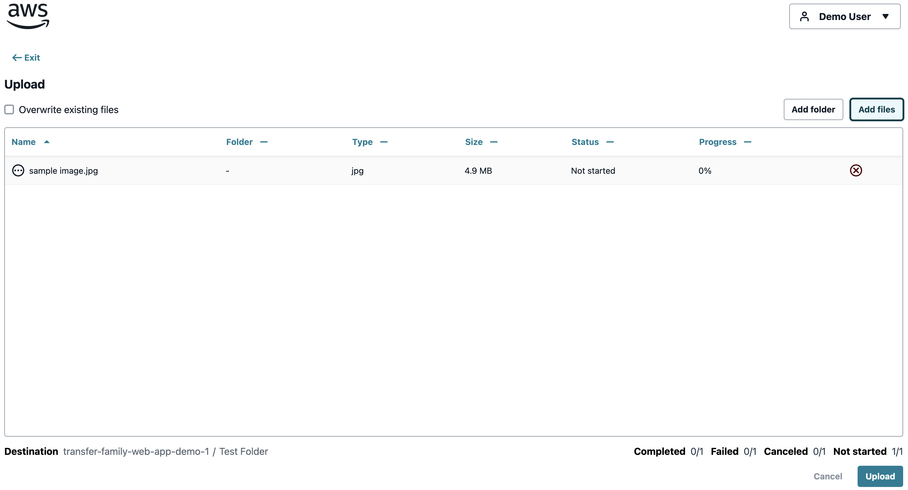
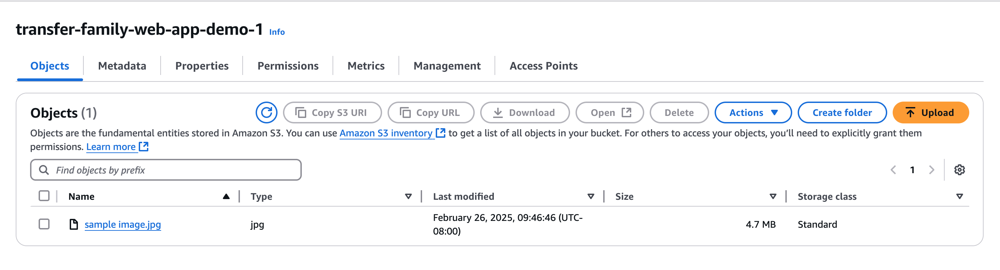

# Task 4: Access your AWS Transfer Family web app

|                      |                                                                                                                                                         |
| -------------------- | ------------------------------------------------------------------------------------------------------------------------------------------------------- |
| **Time to complete** | 5 minutes                                                                                                                                               |
| **Requires**         | • An internet browser • An AWS user                                                                                                                  |
| **Get help**         | [Troubleshooting AWS Transfer Family](../../../transfer/latest/userguide/troubleshooting.md "../../../transfer/latest/userguide/troubleshooting.md") |

## Overview

In this task, you will access your AWS Transfer Family web app with your user, create a folder, and
upload a sample file.

AWS Transfer Family

## Implementation

1. Open
   the [AWS Transfer Family console](https://console.aws.amazon.com/transfer/home "https://console.aws.amazon.com/transfer/home"). 

In the left pane, choose **Web**
**apps**.

Search for **Transfer Family web app
demo** and select the
**Access**
**endpoint**.

 2. Enter username

Enter **your**
**username** into the **Username** box and choose **Next**.

 3. Enter password

Enter your password and choose **Sign in**.

 4. View landing page

Once you complete the above steps and sign-in successfully, you will see your web
app’s landing page.

1. Create folder

Enter a **Folder**
**name** and choose **Create
folder**.

 2. Upload a file

In the folder you created, choose **Add**
**files.**

Select any file on your local machine and choose **Upload**.

 3. Confirm upload

Navigate to your S3 bucket and confirm that the sample file was uploaded
successfully.

## Conclusion

In this task, you successfully accessed your AWS Transfer Family web app on your user, created a folder, and uploaded a sample file.
