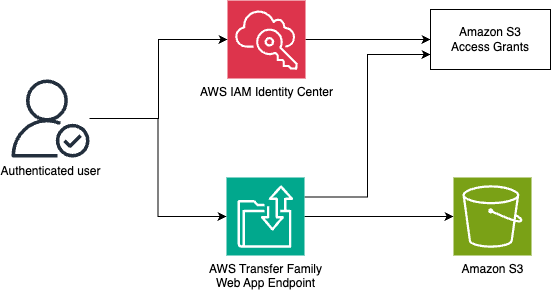

# Set up an AWS Transfer Family web app

|                      |                                                                                                                                                                                                                                                                                                                              |
| -------------------- | ---------------------------------------------------------------------------------------------------------------------------------------------------------------------------------------------------------------------------------------------------------------------------------------------------------------------------- | ----------------------------------------------------------------------------------------------------------------------------------------------------------------------------------------------------------------------------------------------------------------------------------------------------------------------------------------------------------------------------------------------------------------------------------------------------------------------------------------------------------------------------------------------------------------------------------------------------------------------------------------------------------------------------------------------------------------------------------------------------------------------------------------------------------------------------------------------------------------------------------------------------------------------------------------------------------------------------------------------------------------------------------------------------------------------------------------------------------------------------------------------------------------------------------------------------------------------------------------------------------------------------------------------------------------------------------------------------------------------------------------------------------------------------------------------------------------------------------------------------------------------------------------------------------------------------------------------------------------------------------------------------------------------------------------------------------------------------------------------------------------------------------------------------------------------------------------------------------------------------------------------------------------------------------------------------------------------------------------------------------------------------------------------------------------------------------------------------------------------------------------------------------------------------------------------------------------------------------------------------------------------------------------------------------------------------------------------------------------------------------------------------------------------------------------------------------------------------------------------------------------------------------------------------------------------------------------------------------------------------------------------------------------------------------------------------------------------------------------------------------------------------------------------------------------------------------------------- |
| **AWS experience**   | Beginner                                                                                                                                                                                                                                                                                                                     |
| **Time to complete** | 25 minutes                                                                                                                                                                                                                                                                                                                   |
| **Cost to complete** | Less than $0.50 if completed in 1 hour                                                                                                                                                                                                                                                                                       |
| **Services used**    | [AWS Transfer Family](https://aws.amazon.com/aws-transfer-family/web-apps/ "https://aws.amazon.com/aws-transfer-family/web-apps/") [Amazon S3](https://aws.amazon.com/s3/ "https://aws.amazon.com/s3/") [AWS IAM Identity Center](https://aws.amazon.com/iam/identity-center/ "https://aws.amazon.com/iam/identity-center/") |
| **Last updated**     | April 04, 2025                                                                                                                                                                                                                                                                                                               | ## Overview [AWS Transfer Family web apps](../../../transfer/latest/userguide/web-app.md "../../../transfer/latest/userguide/web-app.md") offer a straightforward, no-code, fully managed browser-based experience that enables secure file transfers to and from [Amazon Simple Storage Service (Amazon S3)](../../../AmazonS3/latest/userguide/Welcome.md "../../../AmazonS3/latest/userguide/Welcome.md"). Organizations can reduce their operational overhead by eliminating the need to install, support, and troubleshoot various file transfer clients across different end-user devices and operating systems by adopting this browser-based solution. This approach is particularly beneficial for non-technical users, as client applications can be challenging to operate. These web apps are natively integrated with [AWS IAM Identity Center](../../../singlesignon/latest/userguide/what-is.md "../../../singlesignon/latest/userguide/what-is.md") and [Amazon S3 Access Grants](../../../AmazonS3/latest/userguide/access-grants.md "../../../AmazonS3/latest/userguide/access-grants.md"), ensuring that only authenticated users can view the data they are authorized to access. ## What you will accomplish In this tutorial, you will:  • Create an AWS Transfer Family web app and assign a user.  • Create an S3 bucket and set up an access grant.  • Access the AWS Transfer Family web app. ## Prerequisites Before starting this tutorial, you will need:  • An AWS account:  • If you don't already have an account, follow the [Setting Up Your Environment](../setup-environment.md "../setup-environment.md") tutorial. ## Watch video This twenty-one-minute video by Pichaimani Rajesh Kumar, a solutions architect at AWS, provides a walkthrough of the tutorial. ## Application architecture The following diagram provides a visual representation of the services used in this tutorial and how they are connected. This application uses AWS IAM Identity Center, AWS Transfer Family, and Amazon S3. As you go through the tutorial, you will learn about the services in detail and find resources that will help you get up to speed with them.  ## Tasks This tutorial is divided into the following tasks. You must complete each task before moving on to the next one. 1. [Task 1: Create the web app](module-1.md "module-1.md") (5 Minutes) 2. [Task 2: Set up cross-origin resource sharing (CORS)](module-2.md "module-2.md") (5 Minutes) 3. [Task 3: Create the instance](module-3.md "module-3.md") (5 Minutes) 4. [Task 4: Access your AWS Transfer Family web app](module-4.md "module-4.md") (5 Minutes) 5. [Task 5: Clean up resources](clean-up.md "clean-up.md") (5 Minutes) |
