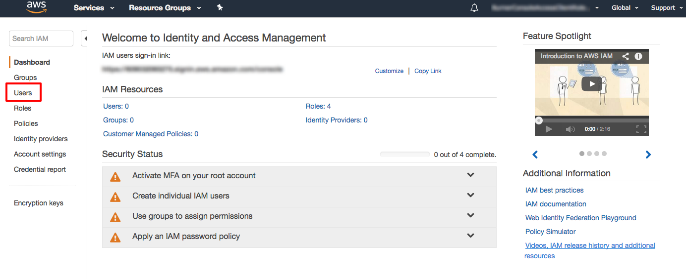
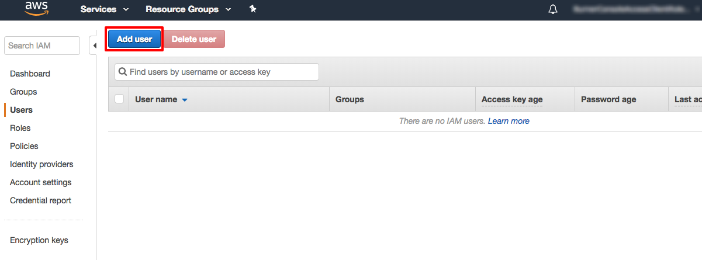
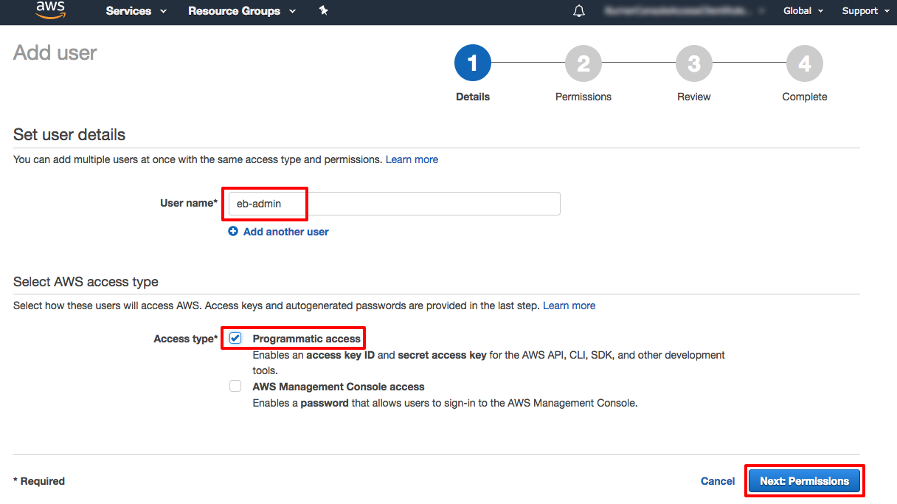
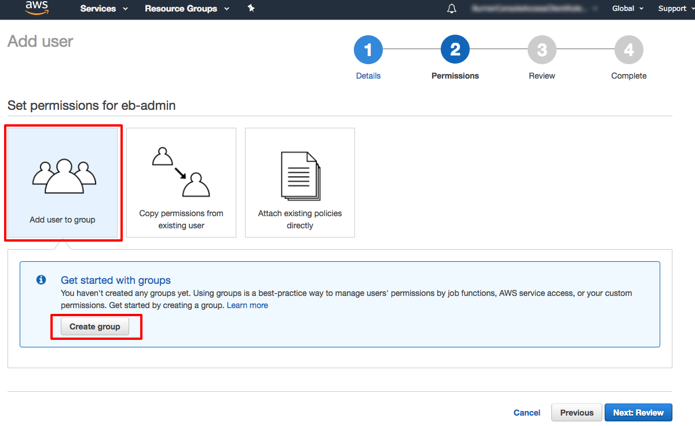
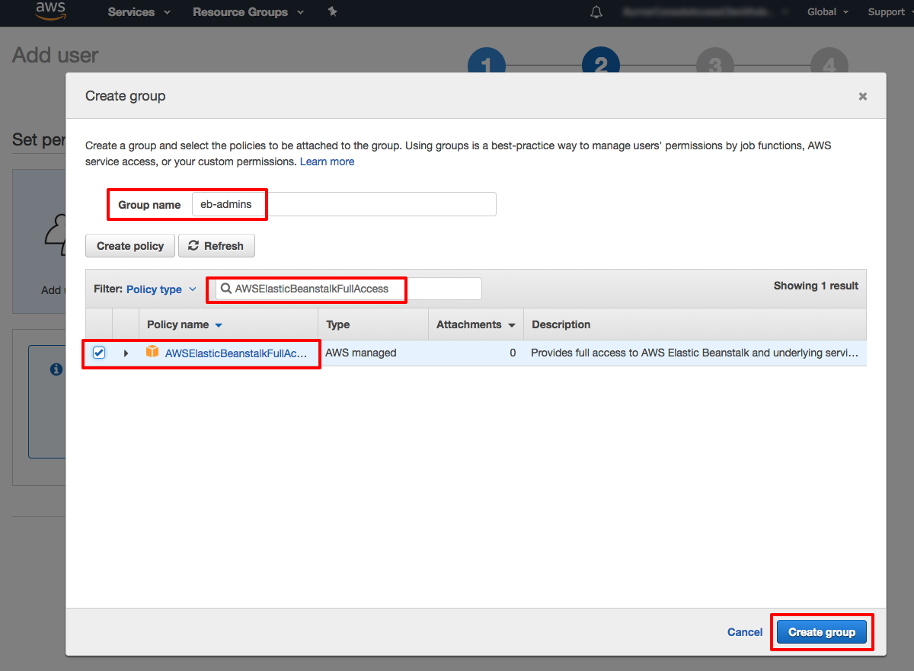
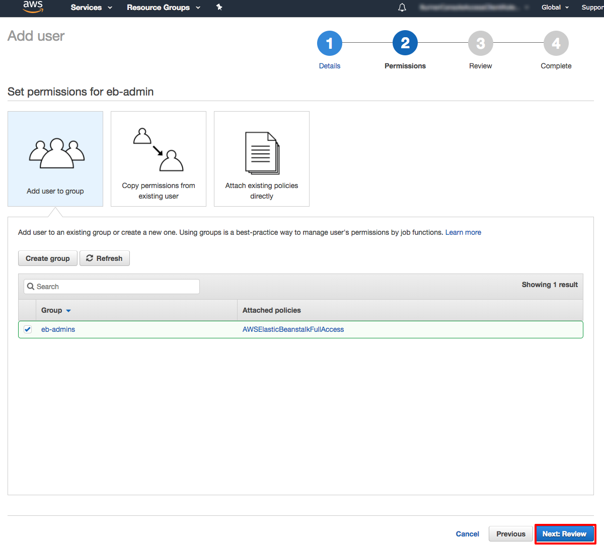
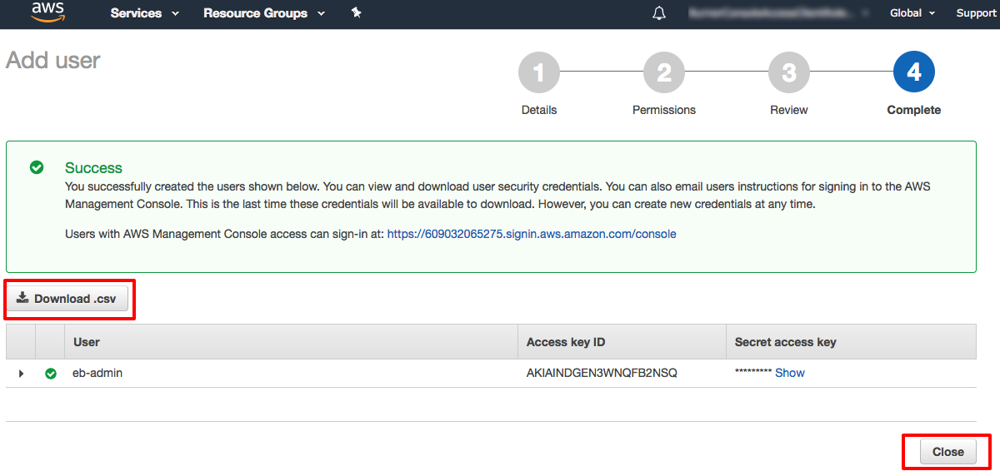
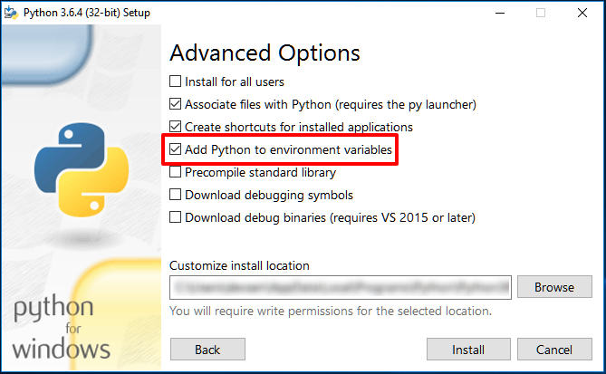

# Set up the Elastic Beanstalk Command Line Interface

with AWS Elastic Beanstalk and AWS Identity and Access Management (IAM)

|                      |                                                                                                                                                                                 |
| -------------------- | ------------------------------------------------------------------------------------------------------------------------------------------------------------------------------- | ------------------------------------------------------------------------------------------------------------------------------------------------------------------------------------------------------------------------------------------------------------------------------------------------------------------------------------------------------------------------------------------------------------------------------------------------------------------------------------------------------------------------------------------------------------------------------------------------------------------------------------------------------------------------------------------------------------------------------------------------------------------------------------------------------------------------------------------------------------------------------------------------------------------------------------------------------------------------------------------------------------------------------------------------------------------------------------------------------------------------------------------------------------------------------------------------------------------------------------------------------------------------------------------------------------------------------------------------------------------------------------------------------------------------------------------------------------------------------------------------------------------------------------------------------------------------------------------------------------------------------------------------------------------------------------------------------------------------------------------------------------------------------------------------------------------------------------------------------------------------------------------------------------------------------------------------------------------------------------------------------------------------------------------------------------------------------------------------------------------------------------------------------------------------------------------------------------------------------------------------------------------------------------------------------------------------------------------------------------------------------------------------------------------------------------------------------------------------------------------------------------------------------------------------------------------------------------------------------------------------------------------------------------------------------------------------------------------------------------------------------------------------------------------------------------------------------------------------------------------------------------------------------------------------------------------------------------------------------------------------------------------------------------------------------------------------------------------------------------------------------------------------------------------------------------------------------------------------------------------------------------------------------------------------------------------------------------------------------------------------------------------------------------------------------------------------------------------------------------------------------------------------------------------------------------------------------------------------------------------------------------------------------------------------------------------------------------------------------------------------------------------------------------------------------------------------------------------------------------------------------------------------------------------------------------------------------------------------------------------------------------------------------------------------------------------------------------------------------------------------------------------------------------------------------------------------------------------------------------------------------------------------------------------------------------------------------------------------------------------------------------------------------------------------------------------------------------------------------------------------------------------------------------------------------------------------------------------------------------------------------------------------------------------------------------------------------------------------------------------------------------------------------------------------------------------------------------------------------------------------------------------------------------------------------------------------------------------------------------------------------------------------------------------------------------------------------------------------------------------------------------------------------------------------------------------------------------------------------------------------------------------------------------------------------------------------------------------------------------------------------------------------------------------------------------------------------------------------------------------------------------------------------------------------------------------------------------------------------------------------------------------------------------------------------------------------------------------------------------------------------------------------------------------------------------------------------------------------------------------------------------------------------------------------------------------------------------------------------------------------------------------------------------------------------------------------------------------------------------------------------------------------------------------------------------------------------------------------------------------------------------------------------------------------------------------------------------------------------------------------------------------------------------------------------------------------------------------------------------------------------------------------------------------------------------------------------------------------------------------------------------------------------------------------------------------------------------------------------------------------------------------------------------------------------------------------------------------------------------------------------------------------------------------------------------------------------------------------------------------------------------------------------------------------------------------------------------------------------------------------------------------------------------------------------------------------------------------------------------------------------------------------------------------------------------------------------------------------------------------------------------------------------------------------------------------------------------------------------------------------------------------------------------------------------------------------------------------------------------------------------------------------------------------------------------------------------------------------------------------------------------------------------------------------------------------------------------------------------------------------------- |
| **AWS experience**   | Beginner                                                                                                                                                                        |
| **Cost to complete** | [Free tier](https://free/ "https://free/") eligible There is no additional charge for AWS Elastic Beanstalk. The resources you create in this tutorial are Free Tier eligible.  |
| **Requirements**     | An AWS account                                                                                                                                                                  | ## Introduction In this step-by-step tutorial, you will set up the Elastic Beanstalk Command Line Interface (EB CLI). This is part one of a two-part tutorial. In the second half of EB CLI tutorial, you will deploy and monitor an application on the AWS cloud. Elastic Beanstalk (EB) is a service used to deploy, manage, and scale web applications and services. You can use Elastic Beanstalk from the [AWS Management console](../getting-started-with-aws-management-console.md "../getting-started-with-aws-management-console.md") or from the command line using the Elastic Beanstalk Command Line Interface (EB CLI). You should use the EB CLI as part of your everyday development and testing cycle when you favor using the terminal. You can use EB with popular languages and frameworks including Node, PHP, Java, Python, Ruby, .NET/IIS, Tomcat, Docker, and Multi-Container Docker. During this part of the EB CLI tutorial, you will set up a user with the proper permissions then install the EB CLI. ## Implementation In this step, you will create an IAM user and grant access for the user to use AWS from the command line. Next, you will grant the user an Elastic Beanstalk IAM permission. Finally, you will download the user credentials for use later in the tutorial. 1. Open the IAM Console Open the [AWS Identity and Access Management (IAM) console](https://console.aws.amazon.com/iam/home "https://console.aws.amazon.com/iam/home"). In the navigation pane on the left, select **Users**.  2. Add a new user Select **Add user**.  3. Configure users For **User name**, enter **eb-admin**. To use the EB CLI with the **eb-admin** user, it needs programmatic access to AWS. But to use the EB CLI, **eb-admin** does not need access to the AWS Management console. Understanding that, for Access type, choose **Programmatic access**. Leave **AWS Management Console access** unchecked. Select **Next: Permissions**.  4. Add user to group Select **Add user to group** then select **Create group**.  5. Configure group In the **Group name** field, enter **eb-admins**. In the policy section of this screen, you need to select the IAM policy which grants members of the group full access to Elastic Beanstalk. In the policy search box, type **AWSElasticBeanstalkFullAccess**. Select **AWSElasticBeanstalkFullAccess**and select **Create group**.  6. Verify the policy is attached You will see **eb-admin** created with the **AWSElasticBeanstalkFullAccess**policy attached to the group. Select **Next: Review**.  7. Review configuration Review your user details and permissions. Select **Create group**. 8. Download credentials In a later step, you will need to use **eb-admin's** access key from this page. Save the access key and secret access key on your workstation by selecting **Download .csv**. Select **Close**.  In this step, you will install the EB command line interface. Follow the OS specific configuration steps. Windows 1. Download and install Python 3.6+ by going to the [Python Software Foundation](https://www.python.org/downloads/ "https://www.python.org/downloads/") website and choose the version of Python for your OS. Make sure and select **Add Python to environment variables**  in the Python installer so Python will work from any command line location. The Python installer will install Python and the pip package manager. 2. Start the Windows Command Prompt using the Run Window (Win +R on your keyboard) and typing **cmd** then pressing **Enter**. 3. Using the Windows Command Prompt, confirm that Python is installed properly by running: `python --version` 4. Using the Windows Command Prompt, confirm that pip is installed properly by running: `pip --version` 5. Now that Python and pip has been installed, install the EB CLI by running: `pip install awsebcli --upgrade --use` 6. Now confirm that the EB CLI is installed correctly by running: `eb --version`  Linux 1. Your modern Linux distro probably includes Python by default. Confirm that Python is installed by starting a terminal session and running the following command: `python -–version` 2. If your Python Version is 2.7, continue with these installation instructions. If your Python is greater than 2.7, do not use these installation instructions. Use the comprehensive [EB CLI installation instructions](../../../elasticbeanstalk/latest/dg/eb-cli3-install-linux.md "../../../elasticbeanstalk/latest/dg/eb-cli3-install-linux.md") . 3. Now confirm that the pip Python package manager is installed by running the following command: `pip -–version` 4. Now that Python and pip have been verified, install the EB CLI by running: `pip install awsebcli --upgrade --user` 5. Now confirm that the EB CLI is installed correctly by running: `eb –-version` macOS 1. Start the macOS terminal application. 2. If you have the [Homebrew package manager](https://brew.sh/ "https://brew.sh/") on your mac, update your homebrew fomulae by running the following command in Terminal: `brew update` 3. If you don't have the the [Homebrew package manager](https://brew.sh/ "https://brew.sh/") installed, install it by running the following command in Terminal: `/usr/bin/ruby -e "$(curl -fsSL https://raw.githubusercontent.com/Homebrew/install/master/install)"` 4. Using Homebrew, install the EB CLI by running the following command in Terminal: `brew install awsebcli` 5. Now confirm that the EB CLI is installed correctly by running: `eb --version` ## Congratulations! Congratulations, you have set up the Elastic Beanstalk Command Line Interface. You should use the EB CLI to deploy and manage applications whenever you want the power of Elastic Beanstalk from the command line. |
