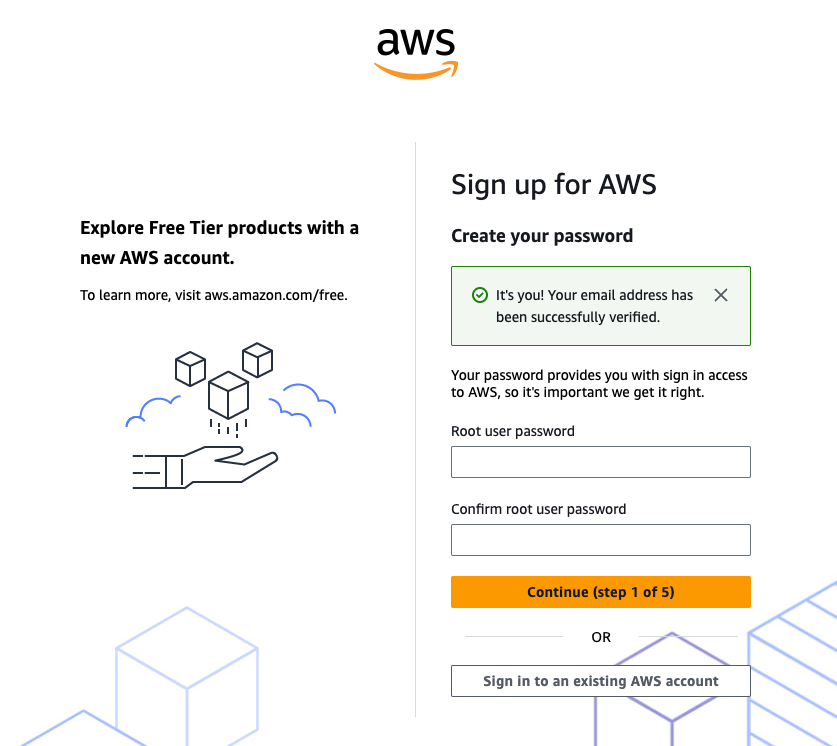
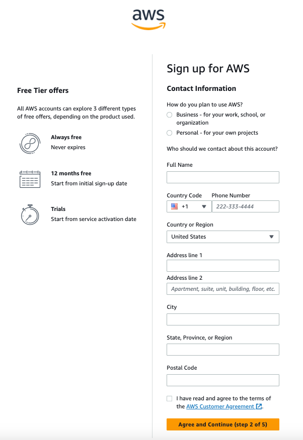
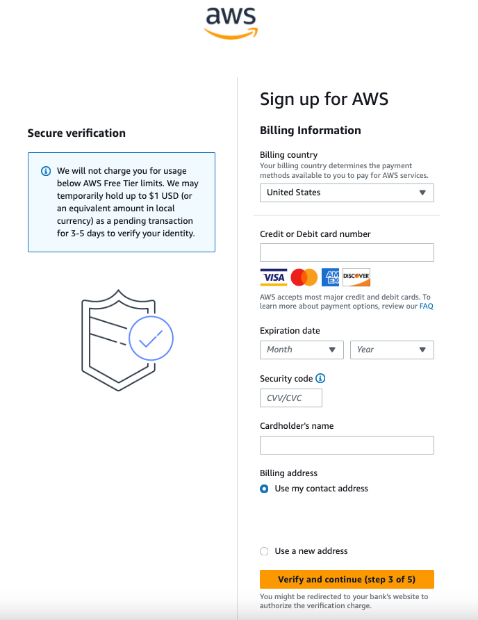
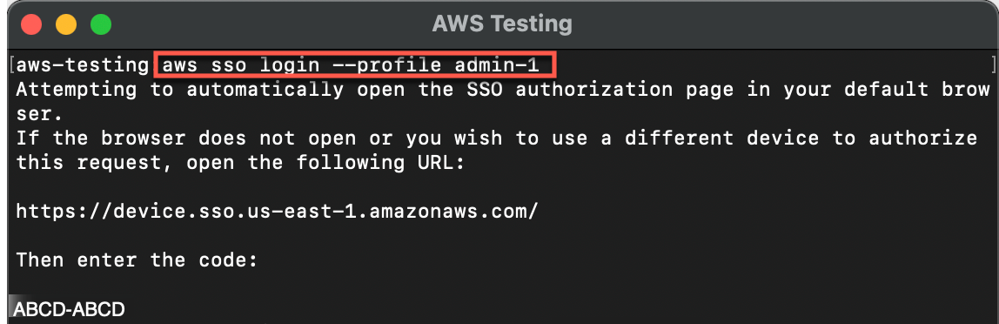
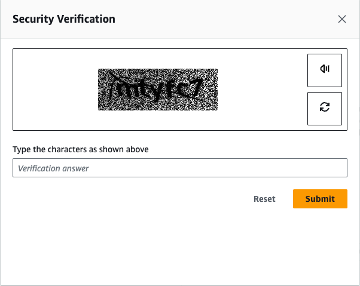
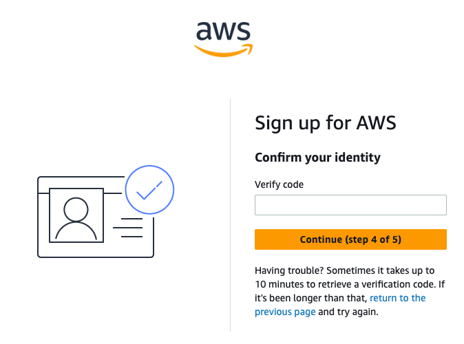
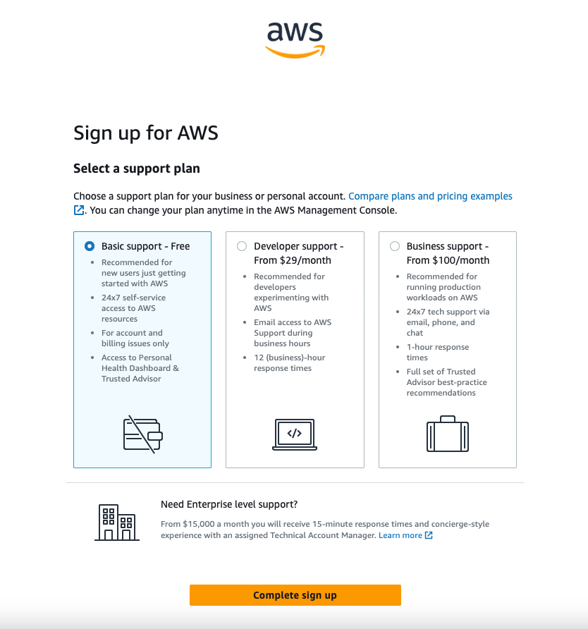

# Module 1: Create Your AWS Account

|                         |                                                                                                                                                                                          |
| ----------------------- | ---------------------------------------------------------------------------------------------------------------------------------------------------------------------------------------- |
| **Time to complete**    | 10 minutes                                                                                                                                                                               |
| **Module requirements** | An internet browser                                                                                                                                                                      |
| **Get help**            | [Troubleshooting AWS account sign-in issues](../../../signin/latest/userguide/troubleshooting-sign-in-issues.md "../../../signin/latest/userguide/troubleshooting-sign-in-issues.md") |

## What you will accomplish

- Sign up for an AWS account
- Verify your contact details

## Implementation

An AWS account is the starting point to allow provisioning
infrastructure. In this module, we cover how to set up your
account.

To create a new AWS account, go to
[**aws.amazon.com**](https://aws.amazon.com/ "https://aws.amazon.com/")
and choose
[**Create
an AWS Account**](https://portal.aws.amazon.com/billing/signup?nc2=h_ct&src=header_signup&redirect_url=https%3A%2F%2Faws.amazon.com%2Fregistration-confirmation#/start "https://portal.aws.amazon.com/billing/signup?nc2=h_ct&src=header_signup&redirect_url=https%3A%2F%2Faws.amazon.com%2Fregistration-confirmation#/start").

1. Enter your information

Enter an **email address** and an
**account name.**

    * Carefully consider which email address you want to use. If you
     are setting up for a personal account, we don't recommend
     using a work email address because you may change jobs at some
     point. Conversely, for business accounts, we recommend using
     an email alias that can be managed because the person setting
     up the account may, at some point, change roles or companies.

 2. Enter the email verification code

Select **Verify email address**.

    * You will get a verification code in your email. Enter the
     verification code and choose
     **Verify**.

You will be redirected to a new screen where you will create your
**root user password**. 3. Create a password

Create your **root user password**.

    * The password you choose is extremely sensitive, and should be
     shared only with people who have access to the credit card
     that will be used on this account.
    * Your password must include: uppercase letters, lowercase
     letters, numbers, and non-alphabetic characters.

 4. Choose continue

Once you have entered and confirmed your password, choose
**Continue (step 1 of 5)**.
Now you need to add your contact information and select how you plan
to use AWS.

1. Choose an account type

Choose between a **business** or
**personal** account.

    * There is no difference in account type or functionality, but
     there is a difference in the type of information required to
     open the account for billing purposes.
    * For a business account, choose a **phone
     number** that is tied to the business and can be
     reached if the person setting up the account is not available.

2. Enter contact details

Once you have selected the account type, fill out the the
**contact information** about the
account.

    * Save these details in a safe place. If you ever lose access to
     the email or your two-factor authentication device, AWS Support can use these details to confirm your identity.

 3. Accept the AWS Customer Agreement

At the end of this form, read through the terms of the
[AWS Customer Agreement](https://aws.amazon.com/agreement/ "https://aws.amazon.com/agreement/") and select the
checkbox to accept them. 4. Choose Continue

Choose **Agree and Continue (step 2 of 5)** to proceed to the next screen.
In the following screen, add your preferred credit or debit card to
use for payment.

1. Enter billing information

Enter your **Billing Information**
details.

    * A small hold will be placed on the card, so the address must
     match what your financial institution has on file for you or
     your business.

 2. Choose Continue

Select **Verify and continue**
**(step 3 of 5)** to proceed.
Now you need to verify your account. 

1. Choose a verification method

Choose how you want to **confirm your
identity**.  

    * You can verify your account either through a text message (SMS)
     or a voice call on the number you are associating with this
     account.
    * For the text message (SMS) option, you will be sent a numeric
     code to enter on the next screen after you choose
     **Send SMS (step 4 of 5).**
    * For the **Voice call** option,
     you will be shown a code on the screen to enter after being
     prompted by the automated voice verification system.

2. Send the SMS

Choose your verification choice, then
choose **Send SMS (step 4 of 5)
t**o proceed to verification.

 3. Solve the CAPTCHA

Enter the **CAPTCHA** as
appropriate, then choose
**Submit** to receive a call or
SMS.

 4. Enter the verification code

Enter the **code** as appropriate
for your verification choice, then choose
**Continue (step 4 of 5)** to
proceed to the final step.

Choose a support plan for your AWS account. 

1. Select a support plan

Choose a **support plan**. For this
tutorial, we recommend the default selection.

    * You have three options for support plans. The default option
     is called Basic Support and is free of charge. If you are not
     sure, select Basic Support. You can always change support
     tiers at a later date.

To see the full list of differences between the tiers, see
[Compare
AWS Support Plans](https://aws.amazon.com/premiumsupport/plans/ "https://aws.amazon.com/premiumsupport/plans/"). 

 2. Choose Complete sign up

To finish creating your account, choose
**Complete sign up**.

## Conclusion

Congratulations! Your account is now set up and being activated.
When activation is complete, you will receive an email from AWS. Use
the credentials you created in this module to log in to your root
account.

In the next module, you will learn how to secure your root account
and set up additional users.
