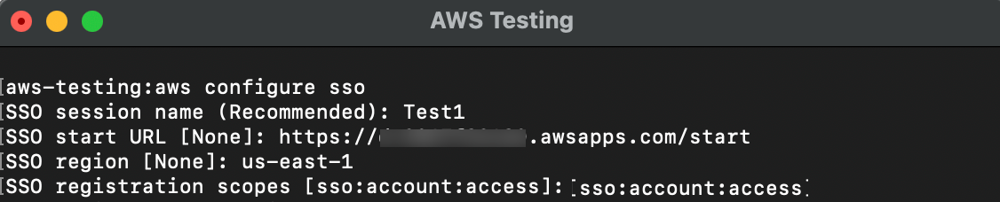
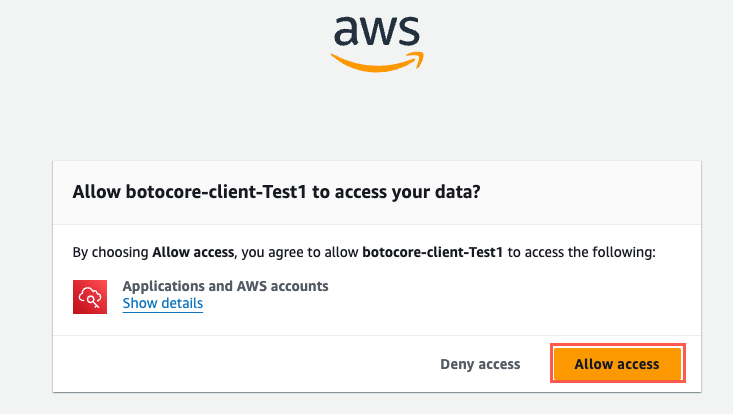
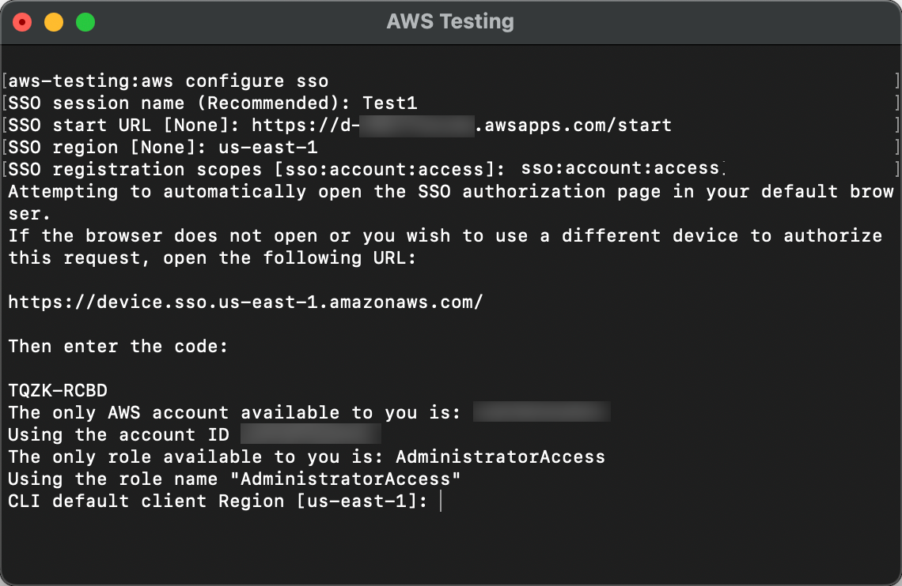
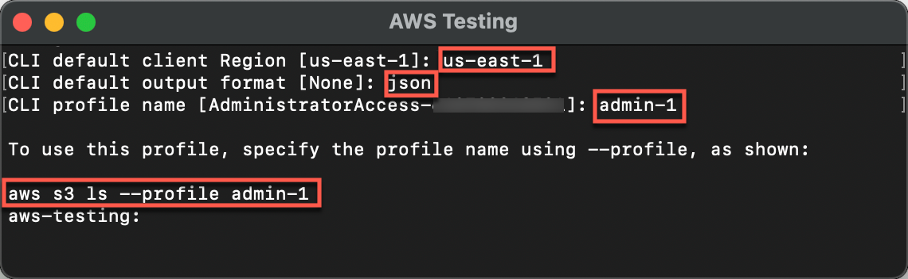
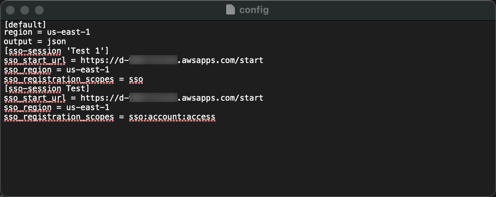

# Module 3: (Optional) Set Up the AWS CLI

|                         |                                                                                                                                               |
| ----------------------- | --------------------------------------------------------------------------------------------------------------------------------------------- |
| **Time to complete**    | 10 minutes                                                                                                                                    |
| **Module requirements** | An internet browser<br>An AWS account                                                                                                         |
| **Get help**            | [Common<br>CLI errors](../../../cli/latest/userguide/cli-chap-troubleshooting.md "../../../cli/latest/userguide/cli-chap-troubleshooting.md") |

## Introduction

The AWS CLI is a unified tool to manage your AWS services. With just
one tool to download and configure, you can control multiple AWS services from the command line and automate them through scripts.

To interact with AWS using the CLI, you need to configure
credentials for it to use when making API calls. In this module, you
will also learn how you can set up multiple profiles to access more
than one AWS account, either with additional credentials, or through
IAM role switching.

## Implementation

There are different ways to install the AWS CLI, depending on your
operating system or preference to use containers.

**Install** the AWS CLI v2 for your
operating system (OS), using the instructions
[here](../../../cli/latest/userguide/install-cliv2.md "../../../cli/latest/userguide/install-cliv2.md").

 

```
aws --version

```

**Example:** the response when
installing the AWS CLI on macOS Ventura 13.6 is as follows:

```
aws-cli/2.15.9 Python/3.11.6 Darwin/22.6.0 exe/x86_64 prompt/off
```

The AWS CLI is now installed and you are ready to configure your
credentials. 

To configure the credentials, you will need to include the
credentials of the user you created in Module 2 of this tutorial.

You will be prompted to provide the following information for each
of these items in the CLI:

- \***\*SSO session
  name\*\*\*\***:** Provides a name
  for the session that is included in the AWS CloudTrail logs for
  entries associated with this session. If you don't enter a name,
  one is generated automatically. For this tutorial, use
  <\*\***Test1\*\*\*\*>.
- \***\*SSO start
  URL\*\*\*\***:** The
  **AWS Access portal URL\*\* you
  were provided when you configured IAM Identity Center.

###### Note

The URL can be found in the Settings summary in the IAM Identity Center console
Dashboard.

- \***\*SSO
  region\*\*\*\***:** In this
  tutorial the examples use
  \*\***<us-east-1>\***\*.
  You must **specify the region\*\*
  in which you have enabled IAM Identity Center. 

###### Note

You can find this information in the Settings summary in the IAM Identity Center console
Dashboard.

- \***\*SSO registration
  scopes\*\*\*\***:** Scopes
  authorize access to different endpoints. In this tutorial, we
  will use the minimum scope of
  **<**\*\***sso:account:access**\*\***>\*\*
  to get a refresh token back from the IAM Identity Center
  service.

1. Run configuration command

In your CLI, **run** the following
command:

```
aws configure sso

```

2. Enter SSO details

Provide the **required
information** when prompted. Remember to use your
**SSO start URL** and
**SSO region.**

    * SSO session name (Recommended):
     **Test1**
    * SSO start URL [None]:
     **<https://my-sso-portal.awsapps.com/start>**
    * SSO region [None]:
     **<us-east-1>**
    * SSO registration scopes [None]:
     **sso:account:access**

The following image is an example of the CLI content at this stage.

The CLI attempts to automatically open the SSO authorization page
in your default browser and begins the sign in process for your
IAM Identity Center account.

 3. Authorize CLI access

You might be asked to provide your password (and MFA credential,
if enabled). On the Authorization requested page, select Confirm
and continue.

This gives permissions to the AWS CLI to retrieve and display the
AWS accounts and roles that you are authorized to use with IAM Identity Center.

 4. Grant permissions

Since the AWS CLI is built on top of the SDK for Python,
permission messages may contain variations of the botocore name,
such as **botocore-client-Test1**. Select
**Allow access**. After
authentication, you will be told that you can close the window.   

 5. Review available accounts

Navigate back to your **CLI
window.** The CLI will update and show you the
**AWS accounts** and
**roles** that are available to
you.

    * Because you have only set up one AWS account with the
     **AdministratorAccess role** at this point
     that is the account and role you are signed in with.

Your CLI window should now look like the example image to the
right and have the following lines displayed.

The only AWS account available to you is: 111122223333

Using the account ID 111122223333

The only role available to you is: AdministratorAccess

Using the role name "AdministratorAccess"   

 6. Set CLI preferences

In the terminal window, when prompted, enter the following
information:

    * For **CLI default client Region
     [<**your-region>**]**: enter
     the Region where you enabled IAM Identity Center. For this
     tutorial we used **us-east-1**
    * For **CLI default output format
     [None]**: enter
     **json**
    * For **CLI profile name
     [AdministratorAccess-xxxxxxxxxxxx]:** enter
     **admin-1**


    	+ The **suggested profile name** is the
    	 account ID number followed by an underscore followed by
    	 the role name, however for this tutorial, we are going to
    	 use a shorter profile name,
    	 ****admin-1****.

Your CLI window should now look similar to the example image on
the right and have these lines displayed:

**To use this profile, specify the profile name using --profile, as
shown:**
**aws s3 ls --profile admin-1**

 7. (Optional) View the configuration file

This session created a config file located at ~/.aws/config on
computers running Linux or macOS, or at C:\Users\ USERNAME
\.aws\config on computers running Windows. Your config file will
look similar to the example image.

 8. Start SSO session

You can now use this **sso-session and profile**
to request credentials by
**running** the following
command:

```
aws sso login --profile admin-1

```

Your CLI window should now look similar to the example image on
the right and have these lines displayed:

**aws sso login -–profile admin-1
Attempting to automatically open the SSO authorization page in your default browser.**

**If the browser does not open or you wish to use a different device to authorize this request, open the following URL:
https://device.sso.us-east1.amazonaws.com/**

**Then enter the code:**

**ABCD-ABCD**

 9. Complete authentication

Navigate to the browser window and **allow
access** to your data. When you return to the CLI window
the following message should be displayed:

**Successfully logged into Start URL:
https://my-sso-portal.awsapps.com/start**

For more information about CLI file credential, see the
[Configuration
and credential file settings in the AWS CLI](../../../cli/latest/userguide/cli-configure-files.md "../../../cli/latest/userguide/cli-configure-files.md") in the
**AWS Command Line Interface** user guide.


As you add roles to your AWS account and add additional AWS accounts
to your organization, repeat the procedure above to create a profile
for those roles and accounts.

As you add complexity having a profile naming strategy that
associates AWS account IDs and role names is recommended so that you
can distinguish between the profiles.  

For more information about configuring and formatting multiple
roles, see the
[Format
of the configuration and credential files](../../../cli/latest/userguide/cli-configure-files.md#cli-configure-files-format "../../../cli/latest/userguide/cli-configure-files.md#cli-configure-files-format") in the
**AWS Command Line Interface** user guide.

## Conclusion

Congratulations! You have now completed the sign-in process, created an administrative
user in IAM Identity Center, added enhanced security for both your root user and your administrative user, and set up the AWS CLI and configured a named profile.
