# Module 2: Secure Your AWS Account

|                         |                                                                                                                                             |
| ----------------------- | ------------------------------------------------------------------------------------------------------------------------------------------- | ---------------------------------------------------------------------------------------------------------------------------------------------------------------------------------------------------------------------------------------------------------------------------------------------------------------------------------------------------------------------------------------------------------------------------------------------------------------------------------------------------------------------------------------------------------------------------------------------------------------------------------------------------------------------------------------------------------------------------------------------------------------------------------------------------------------------------------------------------------------------------------------------------------------------------------------------------------------------------------------------------------------------------------------------------------------------------------------------------------------------------------------------------------------------------------------------------------------------------------------------------------------------------------------------------------------------------------------------------------------------------------------------------------------------------------------------------------------------------------------------------------------------------------------------------------------------------------------------------------------------------------------------------------------------------------------------------------------------------------------------------------------------------------------------------------------------------------------------------------------------------------------------------------------------------------------------------------------------------------------------------------------------------------------------------------------------------------------------------------------------------------------------------------------------------------------------------------------------------------------------------------------------------------------------------------------------------------------------------------------------------------------------------------------------------------------------------------------------------------------------------------------------------------------------------------------------------------------------------------------------------------------------------------------------------------------------------------------------------------------------------------------------------------------------------------------------------------------------------------------------------------------------------------------------------------------------------------------------------------------------------------------------------------------------------------------------------------------------------------------------------------------------------------------------------------------------------------------------------------------------------------------------------------------------------------------------------------------------------------------------------------------------------------------------------------------------------------------------------------------------------------------------------------------------------------------------------------------------------------------------------------------------------------------------------------------------------------------------------------------------------------------------------------------------------------------------------------------------------------------------------------------------------------------------------------------------------------------------------------------------------------------------------------------------------------------------------------------------------------------------------------------------------------------------------------------------------------------------------------------------------------------------------------------------------------------------------------------------------------------------------------------------------------------------------------------------------------------------------------------------------------------------------------------------------------------------------------------------------------------------------------------------------------------------------------------------------------------------------------------------------------------------------------------------------------------------------------------------------------------------------------------------------------------------------------------------------------------------------------------------------------------------------------------------------------------------------------------------------------------------------------------------------------------------------------------------------------------------------------------------------------------------------------------------------------------------------------------------------------------------------------------------------------------------------------------------------------------------------------------------------------------------------------------------------------------------------------------------------------------------------------------------------------------------------------------------------------------------------------------------------------------------------------------------------------------------------------------------------------------------------------------------------------------------------------------------------------------------------------------------------------------------------------------------------------------------------------------------------------------------------------------------------------------------------------------------------------------------------------------------------------------------------------------------------------------------------------------------------------------------------------------------------------------------------------------------------------------------------------------------------------------------------------------------------------------------------------------------------------------------------------------------------------------------------------------------------------------------------------------------------------------------------------------------------------------------------------------------------------------------------------------------------------------------------------------------------------------------------------------------------------------------------------------------------------------------------------------------------------------------------------------------------------------------------------------------------------------------------------------------------------------------------------------------------------------------------------------------------------------------------------------------------------------------------------------------------------------------------------------------------------------------------------------------------------------------------------------------------------------------------------------------------------------------------------------------------------------------------------------------------------------------------------------------------------------------------------------------------------------------------------------------------------------------------------------------------------------------------------------------------------------------------------------------------------------------------------------------------------------------------------------------------------------------------------------------------------------------------------------------------------------------------------------------------------------------------------------------------------------------------------------------------------------------------------------------------------------------------------------------------------------------------------------------------------------------------------------------------------------------------------------------------------------------------------------------------------------------------------------------------------------------------------------------------------------------------------------------------------------------------------------------------------------------------------------------------------------------------------------------------------------------------------------------------------------------------------------------------------------------------------------------------------------------------------------------------------------------------------------------------------------------------------------------------------------------------------------------------------------------------------------------------------------------------------------------------------------------------------------------------------------------------------------------------------------------------------------------------------------------------------------------------------------------------------------------------------------------------------------------------------------------------------------------------------------------------------------------------------------------------------------------------------------------------------------------------------------------------------------------------------------------------------------------------------------------------------------------------------------------------------------------------------------------------------------------------------------------------------------------------------------------------------------------------------------------------------------------------------------------------------------------------------------------------------------------------------------------------------------------------------------------------------------------------------------------------------------------------------------------------------------------------------------------------------------------------------------------------------------------------------------------------------------------------------------------------------------------------------------------------------------------------------------------------------------------------------------------------------------------------------------------------------------------------------------------------------------------------------------------------------------------------------------------------------------------------------------------------------------------------------------------------------------------------------------------------------------------------------------------------------------------------------------------------------------------------------------------------------------------------------------------------------------------------------------------------------------------------------------------------------------------------------------------------------------------------------------------------------------------------------------------------------------------------------------------------------------------------------------------------------------------------------------------------------------------------------------------------------------------------------------------------------------------------------------------------------------------------------------------------------------------------------------------------------------------------------------------------------------------------------------------------------------------------------------------------------------------------------------------------------------------------------------------------------------------------------------------------------------------------------------------------------------------------------------------------------------------------------------------------------------------------------------------------------------------------------------------------------------------------------------------------------------------------------------------------------------------------------------------------------------------------------------------------------------------------------------------------------------------------------------------------------------------------------------------------------------------------------------------------------------------------------------------------------------------------------------------------------------------------------------------------------------------------------------------------------------------------------------------------------------------------------------------------------------------------------------------------------------------------------------------------------------------------------------------------------------------------------------------------------------------------------------------------------------------------------------------------------------------------------------------------------------------------------------------------------------------------------------------------------------------------------------------------------------------------------------------------------------------------------------------------------------------------------------------------------------------------------------------------------------------------------------------------------------------------------------------------------------------------------------------------------------------------------------------------------------------------------------------------------------------------------------------------------------------------------------------------------------------------------------------------------------------------------------------------------------------------------------------------------------------------------------------------------------------------------------------------------------------------------------------------------------------------------------------------------------------------------------------------------------------------------------------------------------------------------------------------------------------------------------------------------------------------------------------------------------------------------------------------------------------------------------------------------------------------------------------------------------------------------------------------------------------------------------------------------------------------------------------------------------------------------------------------------------------------------------------------------------------------------------------------------------------------------------------------------------------------------------------------------------------------------------------------------------------------------------------------------------------------------------------------------------------------------------------------------------------------------------------------------------------------------------------------------------------------------------------------------------------------------------------------------------------------------------------------------------------------------------------------------------------------------------------------------------------------------------------------------------------------------------------------------------------------------------------------------------------------------------------------------------------------------------------------------------------------------------------------------------------------------------------------------------------------------------------------------------------------------------------------------------------------------------------------------------------------------------------------------------------------------------------------------------------------------------------------------------------------------------------------------------------------------------------------------------------------------------------------------------------------------------------------------------------------------------------------------------------------------------------------------------------------------------------------------------------------------------------------------------------------------------------------------------------------------------------------------------------------------------------------------------------------------------------------------------------------------------------------------------------------------------------------------------------------------------------------------------------------------------------------------------------------------------------------------------------------------------------------------------------------------------------------------------------------------------------------------------------------------------------------------------------------------------------------------------------------------------------------------------------------------------------------------------------------------------------------------------------------------------------------------------------------------------------------------------------------------------------------------------------------------------------------------------------------------------------------------------------------------------------------------------------------------------------------------------------------------------------------------------------------------------------------------------------------------------------------------------------------------------------------------------------------------------------------------------------------------------------------------------------------------------------------------------------------------------------------------------------------------------------------------------------------------------------------------------------------------------------------------------------------------------------------------------------------------------------------------------------------------------------------------------------------------------------------------------------------------------------------------------------------------------------------------------------------------------------------------------------------------------------------------------------------------------------------------------------------------------------------------------------------------------------------------------------------------------------------------------------------------------------------------------------------------------------------------------------------------------------------------------------------------------------------------------------------------------------------------------------------------------------------------------------------------------------------------------------------------------------------------------------------------------------------------------------------------------------------------------------------------------------------------------------------------------------------------------------------------------------------------------------------------------------------------------------------------------------------------------------------------------------------------------------------------------------------------------------------------------------------------------------------------------------------------------------------------------------------------------------------------------------------------------------------------------------------------------------------------------------------------------------------------------------------------------------------------------------------------------------------------------------------------------------------------------------------------------------------------------------------------------------------------------------------------------------------------------------------------------------------------------------------------------------------------------------------------------------------------------------------------------------------------------------------------------------------------------------------------------------------------------------------------------------------------------------------------------------------------------------------------------------------------------------------------------------------------------------------------------------------------------------------------------------------------------------------------------------------------------------------------------------------------------------------------------------------------------------------------------------------------------------------------------------------------------------------------------------------------------------------------------------------------------------------------------------------------------------------------------------------------------------------------------------------------------------------------------------------------------------------------------------------------------------------------------------------------------------------------------------------------------------------------------------------------------------------------------------------------------------------------------------------------------------------------------------------------------------------------------------------------------------------------------------------------------------------------------------------------------------------------------------------------------------------------------------------------------------------------------------------------------------------------------------------------------------------------------------------------------------------------------------------------------------------------------------------------------------------------------------------------------------------------------------------------------------------------------------------------------------------------------------------------------------------------------------------------------------------------------------------------------------------------------------------------------------------------------------------------------------------------------------------------------------------------------------------------------------------------------------------------------------------------------------------------------------------------------------------------------------------------------------------------------------------------------------------------------------------------------------------------------------------------------------------------------------------------------------------------------------------------------------------------------------------------------------------------------------------------------------------------------------------------------------------------------------------------------------------------------------------------------------------------------------------------------------------------------------------------------------------------------------------------------------------------------------------------------------------------------------------------------------------------------------------------------------------------------------------------------------------------------------------------------------------------------------------------------------------------------------------------------------------------------------------------------------------------------------------------------------------------------------------------------------------------------------------------------------------------------------------------------------------------------------------------------------------------------------------------------------------------------------------------------------------------------------------------------------------------------------------------------------------------------------------------------------------------------------------------------------------------------------------------------------------------------------------------------------------------------------------------------------------------------------------------------------------------------------------------------------------------------------------------------------------------------------------------------------------------------------------------------------------------------------------------------------------------------------------------------------------------------------------------------------------------------------------------------------------------------------------------------------------------------------------------------------------------------------------------------------------------------------------------------------------------------------------------------------------------------------------------------------------------------------------------------------------------------------------------------------------------------------------------------------------------------------------------------------------------------------------------------------------------------------------------------------------------------------------------------------------------------------------------------------------------------------------------------------------------------------------------------------------------------------------------------------------------------------------------------------------------------------------------------------------------------------------------------------------------------------------------------------------------------------------------------------------------------------------------------------------------------------------------------------------------------------------------------------------------------------------------------------------------------------------------------------------------------------------------------------------------------------------------------------------------------------------------------------------------------------------------------------------------------------------------------------------------------------------------------------------------------------------------------------------------------------------------------------------------------------------------------------------------------------------------------------------------------------------------------------------------------------------------------------------------------------------------------------------------------------------------------------------------------------------------------------------------------------------------------------------------------------------------------------------------------------------------------------------------------------------------------------------------------------------------------------------------------------------------------------------------------------------------------------------------------------------------------------------------------------------------------------------------------------------------------------------------------------------------------------------------------------------------------------------------------------------------------------------------------------------------------------------------------------------------------------------------------------------------------------------------------------------------------------------------------------------------------------------------------------------------------------------------------------------------------------------------------------------------------------------------------------------------------------------------------------------------------------------------------------------------------------------------------------------------------------------------------------------------------------------------------------------------------------------------------------------------------------------------------------------------------------------------------------------------------------------------------------------------------------------------------------------------------------------------------------------------------------------------------------------------------------------------------------------------------------------------------------------------------------------------------------------------------------------------------------------------------------------------------------------------------------------------------------------------------------------------------------------------------------------------------------------------------------------------------------------------------------------------------------------------------------------------------------------------------------------------------------------------------------------------------------------------------------------------------------------------------------------------------------------------------------------------------------------------------------------------------------------------------------------------------------------------------------------------------------------------------------------------------------------------------------------------------------------------------------------------------------------------------------------------------------------------------------------------------------------------------------------------------------------------------------------------------------------------------------------------------------------------------------------------------------------------------------------------------------------------------------------------------------------------------------------------------------------------------------------------------------------------------------------------------------------------------------------------------------------------------------------------------------------------------------------------------------------------------------------------------------------------------------------------------------------------------------------------------------------------------------------------------------------------------------------------------------------------------------------------------------------------------------------------------------------------------------------------------------------------------------------------------------------------------------------------------------------------------------------------------------------------------------------------------------------------------------------------------------------------------------------------------------------------------------------------------------------------------------------------------------------------------------------------------------------------------------------------------------------------------------------------------------------------------------------------------------------------------------------------------------------------------------------------------------------------------------------------------------------------------------------------------------------------------------------------------------------------------------------------------------------------------------------------------------------------------------------------------------------------------------------------------------------------------------------------------------------- |
| **Time to complete**    | 15 minutes                                                                                                                                  |
| **Module requirements** |  • An internet browser  • An AWS account                                                                                              |
| **Get help**            | [Troubleshooting IAM issues](../../../IAM/latest/UserGuide/troubleshoot_general.md "../../../IAM/latest/UserGuide/troubleshoot_general.md") | ## Overview When you create an AWS account, a root user is created automatically for your account. The root user is a special entity that has full access to the account, and can perform all actions, including changing the payment methods or closing the account. When you sign-in using the root user you have complete access to all AWS service and resources in the account. Due to this level of permissions, we recommend that you:  • Enable additional security for the root user with multi-factor authentication  • Set up additional users to perform daily tasks related to your account AWS has two identity services:  • [AWS Identity and Access Management (IAM)](https://aws.amazon.com/iam/ "https://aws.amazon.com/iam/"). This service provides access control policies and manages long-term users like the root user. If you create users in IAM, those users have long-term access credentials. As a security best practice, it is recommended that you minimize the use of long-term credentials in AWS. In this tutorial you will not create an IAM user.  • [AWS IAM Identity Center](https://aws.amazon.com/iam/identity-center/ "https://aws.amazon.com/iam/identity-center/"). This service provides temporary credentials that are granted each time a user signs in for a session. It can integrate with any existing identity providers you might already have, like Microsoft Active Directory or Okta, so that your users can use the same sign on for AWS as they use for other services in your organization. If you don't have another identity provider, you can create users in IAM Identity Center. This is the recommended way to create additional users for your AWS account and is the method we will walk through in this tutorial. ## Implementation The AWS account root user is accessed by signing in with the email address and password that you used to create the account. 1. Open the console Sign in to the [AWS Management Console.](https://aws.amazon.com/console/ "https://aws.amazon.com/console/") 2. Sign in as root user Select **Root user** or **Sign in using root user email** (may be one of the two forms due to browser caching), and enter the email address you specified when you created your account and then choose **Next**. 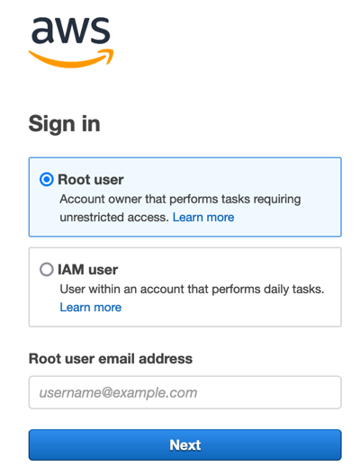 3. Enter your password On the sign-in page, enter your **password**, and choose **Sign in**. 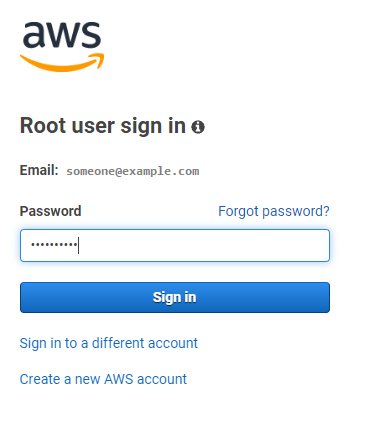 4. Complete verification You may need to confirm your identity. Enter the **code** sent to the root user email, and choose **Verify and continue**. 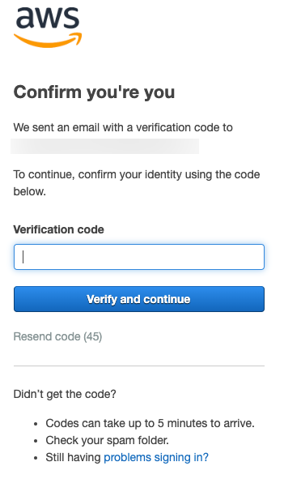 #### Congratulations You have just signed in to the AWS Management Console as your root user. But you don’t want to use your root user for everyday tasks. The root user should only be used for specific account management tasks, two of which we are going to do in the next part of this tutorial.  • Enable MFA for the root user  • Create an administrative user in IAM Identity Center For the complete list of tasks that require you to sign in as the root user, see [Tasks that require root user credentials](../../../accounts/latest/reference/root-user-tasks.md "../../../accounts/latest/reference/root-user-tasks.md"). To help keep your root user credentials secure, we strongly recommend that you enable multi-factor authentication (MFA) for your root user sign-in. When you enable MFA, in addition to providing the email address and password for the root user you will also provide credentials from another authenticator, making it much more difficult for someone to use your root user credentials without your permission. To add more security to the root user sign-in, you will use the AWS Identity and Access Management (IAM) service. For more information, see [What is IAM](../../../IAM/latest/UserGuide/introduction.md "../../../IAM/latest/UserGuide/introduction.md")? 1. View security credentials On the right side of the navigation bar, choose your account name, and choose **Security credentials**. If necessary, choose **Continue to Security credentials**. 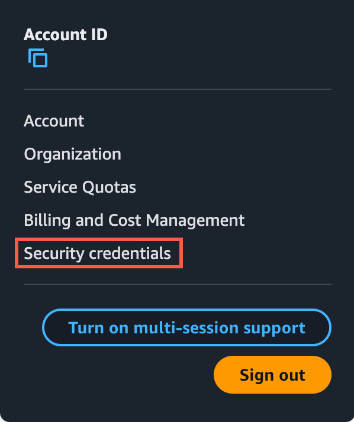 2. Add an MFA device In the **Multi-factor authentication** section, choose **Assign MFA device**. 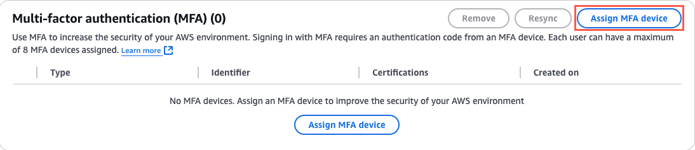 3. Select an authenticator app On the Register MFA device page, name the **Device**, choose the **Authenticator app**option, and then choose **Next**. **Tip:** You need a mobile device or hardware device to enable MFA. Find out how to get a [free MFA security key from AWS](https://aws.amazon.com/security/amazon-security-initiatives/free-mfa-security-key/ "https://aws.amazon.com/security/amazon-security-initiatives/free-mfa-security-key/"). 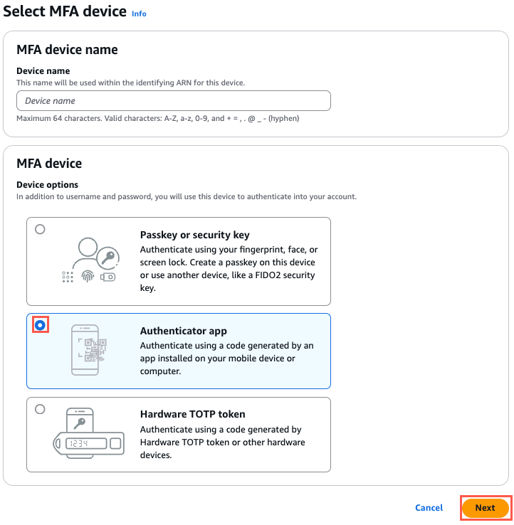 4. Set up your MFA device Set up the **Authenticator app** on your mobile device. Several different authenticator apps are supported for both Android and iOS devices. See the **Virtual authenticator apps** section on the [Multi-Factor Authentication (MFA) for IAM](https://aws.amazon.com/iam/features/mfa/?audit=2019q1 "https://aws.amazon.com/iam/features/mfa/?audit=2019q1") page for a list of supported apps and links to their download locations. 1. **Open** the authenticator app on your mobile device. 2. Select the **Show QR code** link to show a unique QR code for your account. If you can't scan the QR code, select the **Show secret key** link to display a text key that you can enter into the Authenticator app to identify your account. Either **scan** the QR code with your authenticator app or **enter** the code in your authenticator app to **link** your authenticator device to your account. 3. After your authenticator has established the link to your account, it will start generating secret codes that are good for a limited number of seconds. In **MFA code 1**, type the code you see in the app. Wait for that code to change to the next code, then type that code in **MFA code 2**, then select **Add MFA** before the second code has expired. You are returned to the **Security credentials** page. A notification message is displayed at the top that states the MFA device is assigned.Your root user credentials are now more secure. 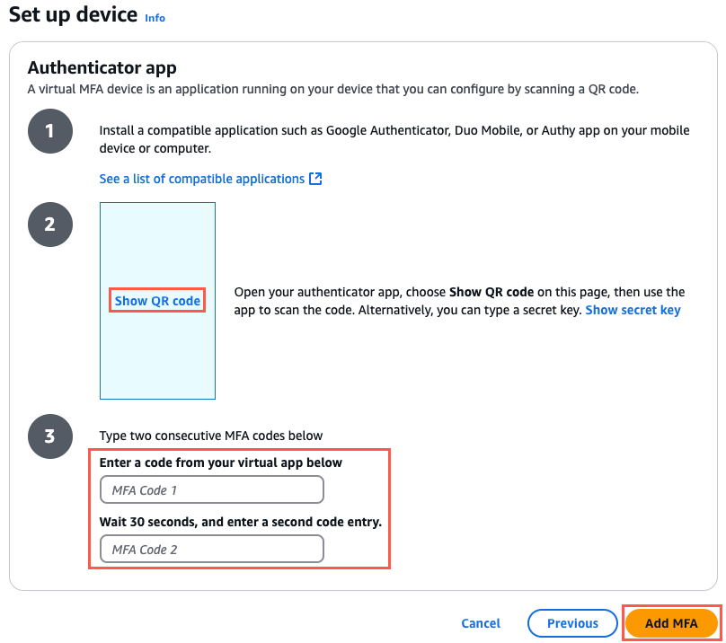 5. Verify MFA setup You are returned to the **Security credentials** page. A notification message is displayed at the top that states the MFA device is assigned. Your root user credentials are now more secure. 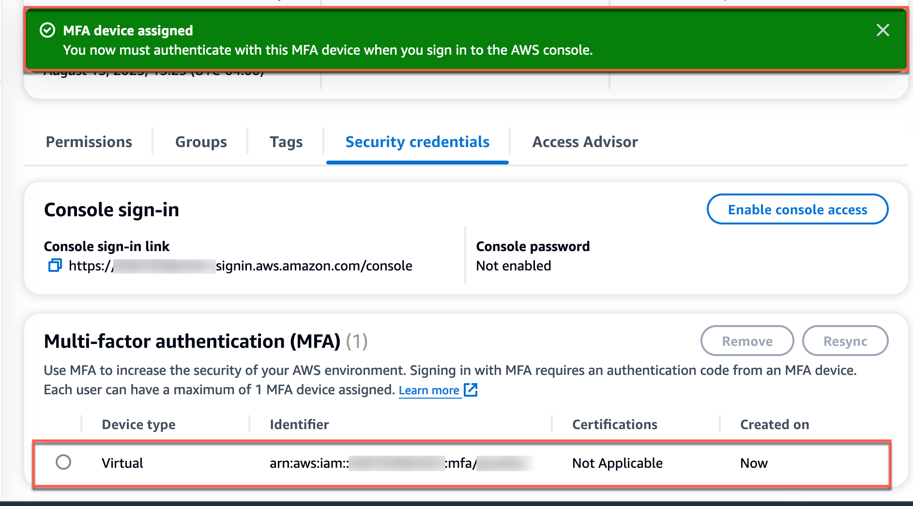 It is considered a security best practice to not use your root account for everyday tasks, but right now you only have a root user. In this tutorial, we will use IAM Identity Center to create an administrative user. We are using IAM Identity Center because it provides users with unique credentials for every session, also known as temporary credentials. Providing users these credentials results in enhanced security for your AWS account, because they are generated each time the user signs in. Once you have an administrative user, you can sign in with that user to create additional Identity Center users and assign them to groups with permissions to perform specific job functions. Another benefit to creating users in IAM Identity Center is that the users are automatically granted access to the the [AWS Billing and Cost Management console](https://us-east-1.console.aws.amazon.com/billing/home?region=us-east-1#/ "https://us-east-1.console.aws.amazon.com/billing/home?region=us-east-1#/"). For more information about billing, see the [AWS Billing and Cost Management](../../../awsaccountbilling/latest/aboutv2/billing-what-is.md "../../../awsaccountbilling/latest/aboutv2/billing-what-is.md") user guide. This section of the tutorial has the following steps:  • Enable IAM Identity Center + Add users + Add users to groups  • Configure your identity source  • Create an administrative permission set  • Sign in to the AWS access portal with your administrative credentials 1. Open the IAM Identity Center console In the search bar, enter \***\*IAM Identity Center\*\***, and then select **IAM Identity Center**. 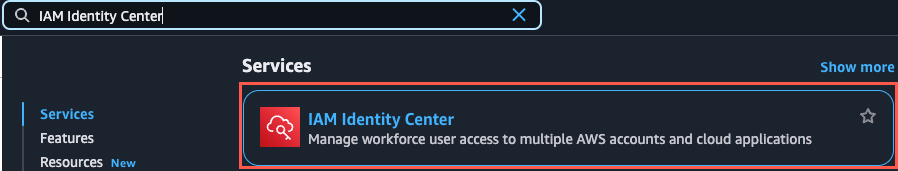 2. Enable IAM Identity Center The **IAM Identity Center service** overview page opens. Review the information to learn about the features of the IAM Identity Center service. In the **Enable IAM Identity Center**, select **Enable**. 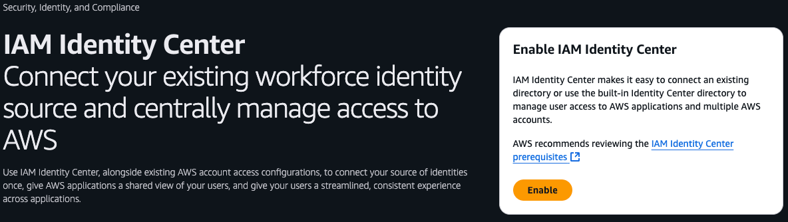 3. Enable AWS Organizations When you enable IAM Identity Center you also need to enable AWS Organizations. AWS Organizations lets you organize multiple AWS accounts so that you can have separate AWS accounts for different use cases. AWS Organizations is a feature of your AWS account offered at no additional charge. Choose **Enable**.  • The root user is now the management account for the AWS Organization.  • At this point, AWS Organizations sends a verification email to the root user. Verifying your root user account allows you to invite other accounts to become members of your organization, so you don't need to verify your account before continuing with this tutorial. For more information about account management, see the [AWS Organizations](../../../organizations/latest/userguide/orgs_introduction.md "../../../organizations/latest/userguide/orgs_introduction.md") user guide. ###### Note The verification link is only valid for 24 hours, so if you wait longer than that to verify the email address, you will need to resend the verification email. For more information about how to do this, see [Email address verification](../../../organizations/latest/userguide/orgs_manage_org_create.md#about-email-verification "../../../organizations/latest/userguide/orgs_manage_org_create.md#about-email-verification"). 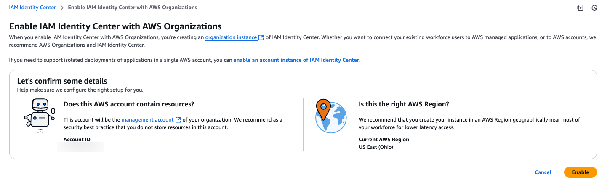 Your identity source is where your users and groups are managed. After you configure your identity source, you can look up users or groups to grant them single sign-on access to AWS accounts, cloud applications, or both. When you enable IAM Identity Center for the first time, it is automatically configured with an IAM Identity Center directory as your default identity source. [Learn more about identity sources.](../../../console/singlesignon/manage-your-identity-source.md "../../../console/singlesignon/manage-your-identity-source.md") Complete the following steps to create a user in IAM Identity Center. 1. Open the IAM Identity Center console Navigate to the [**IAM Identity Center**](https://console.aws.amazon.com/iamv2/ "https://console.aws.amazon.com/iamv2/") console, and choose **Users**. Then, select **Add user**. 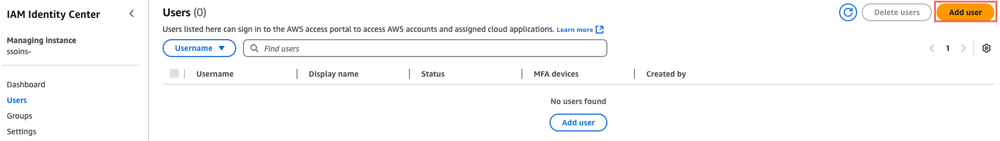 2. Add user details On the **Specify user details** page, complete the following information:  • **Username** – Choose a **name** that will be easy to remember. For this tutorial, we will be adding the user **John**.  • **Password** – Choose **Send an email to this user with password setup instructions (Recommended).**This option sends the user an email addressed from Amazon Web Services, with the subject line Invitation to join IAM Identity Center (successor to AWS IAM Identity Center). The email will come from either **no-reply@signin.aws** or **no-reply@login.awsapps.com**. Add these email addresses to your approved senders list so that they are not treated as junk or spam.  • **Email address** – Enter an email address for the user where you can receive the email. Then, enter it again to confirm it. Each user must have a unique email address. ###### Tip During testing, you might be able to use email subaddressing to create valid email addresses for multiple fictitious users. If your email provider supports it, you can create a new email address by appending the plus sign (+) and then numbers or characters to your current email address, such as someone@example.com, someone+1@example.com, and someone+test@example.com. All of those email addresses would result in an email being received at the same email address.  • **First name** – Enter the first name for the user.  • **Last name** – Enter the last name for the user.  • **Display name** – This is automatically filled in with the first and last name of the user. If you want to change the display name, you can enter something different. The display name is visible in the sign-in portal and users list.  • Complete the **optional information** if desired. It isn’t used during this tutorial and can be added later. Choose **Next**. 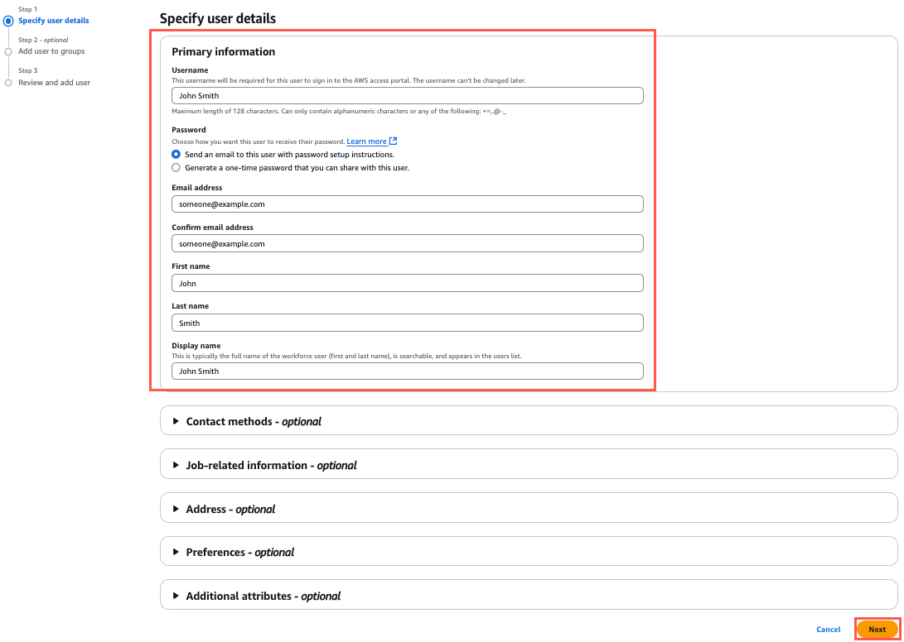 User groups let you specify permissions for multiple users, which can make it easier to manage the permissions for those users. 1. Create a group On the **Step 2 - **optional** Add user to groups** page, select **Create group**. 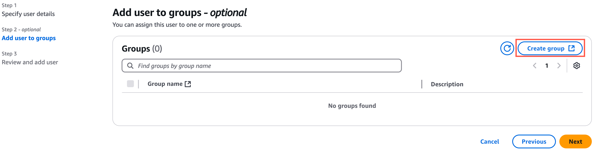 2. Specify a group name Under **Group details**, for **Group name**, enter **Admins**. Select **Create group**. 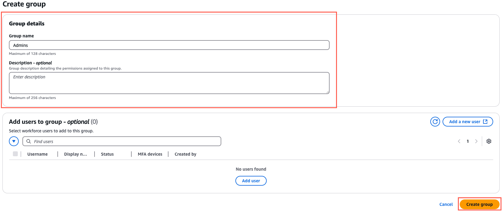 3. Return to Add user The **Groups** page is displayed, showing your new **Admins** group. Exit out or navigate away from the **Groups** browser tab and return to the **Add user** browser tab. 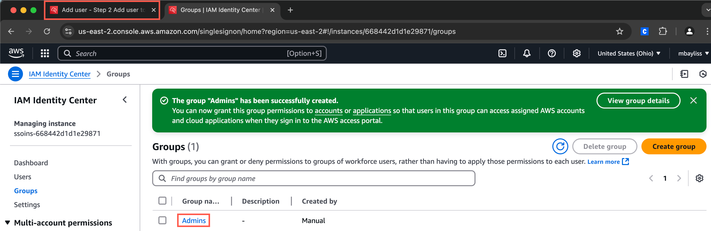 4. Refresh groups On the **Add users to groups- **optional\***\* page, select the **Refresh** button. The new **Admins** group appears in the list. 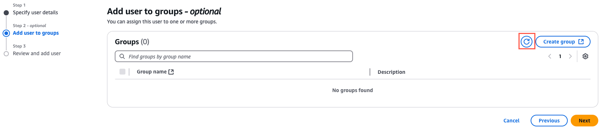 5. Add group membership Select the **check box** next to the **Admins** group, and then choose **Next**. 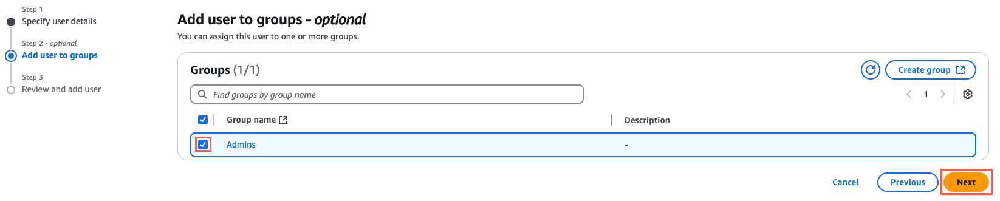 6. Review and confirm On the **Review and add user** page confirm the following:  • Primary information appears as you intended  • Groups shows the user added to the group you created If you need to make changes, choose **Edit** to make the updates. Once everything is correct, select **Add user**. 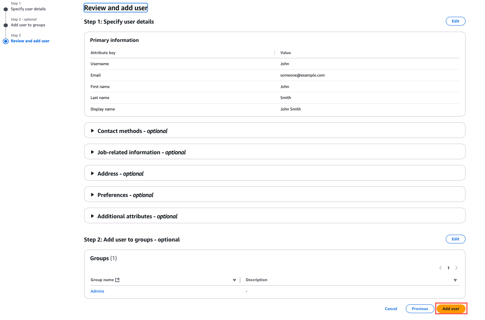 7. (Optional) Create additional users and groups You are returned to the main **IAM Identity Center > Users** page. A notification message informs you that the user was successfully added. Congratulations, you now have a user in your AWS Organization. You can repeat these steps to add additional users and groups. 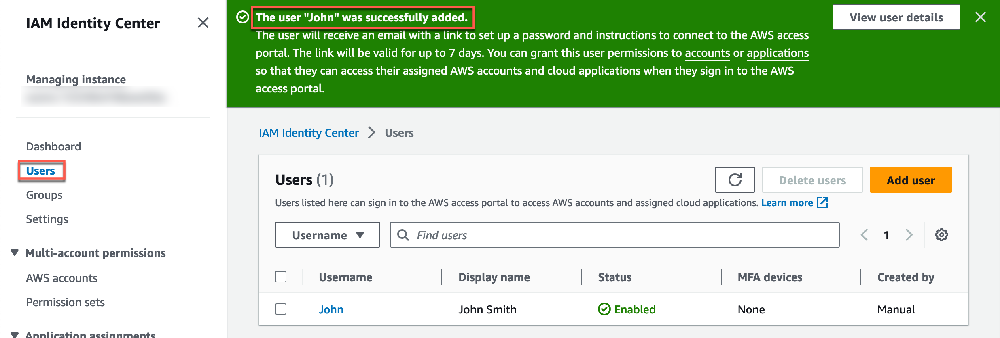 Your new user exists but does not have access to any resources, services, or applications, so the user can't replace your root user for daily administrative tasks yet. Let’s give your new user access to your AWS account. Since we put the user into a group, we will assign the group to an account and then we will add a permission set that defines what the members of the group can access. ###### Note We will still be using the **root user** credentials for this step. 1. Set up multi-account permissions In [IAM Identity Center](https://us-east-1.console.aws.amazon.com/iamv2/home?region=us-east-1#/home "https://us-east-1.console.aws.amazon.com/iamv2/home?region=us-east-1#/home") console left hand navigation, choose **Dashboard**. In the **Recommended setup** steps, under **Manage permissions to multiple AWS accounts**, choose **Manage permissions**. 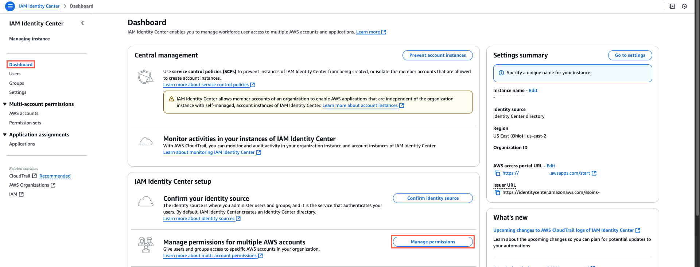 2. Select your AWS account In the left hand navigation, choose **AWS accounts**. Under **Organizational structure > Root**, choose the **account** you created in Module 1. ###### Note For this tutorial, we are using a placeholder AWS account name. 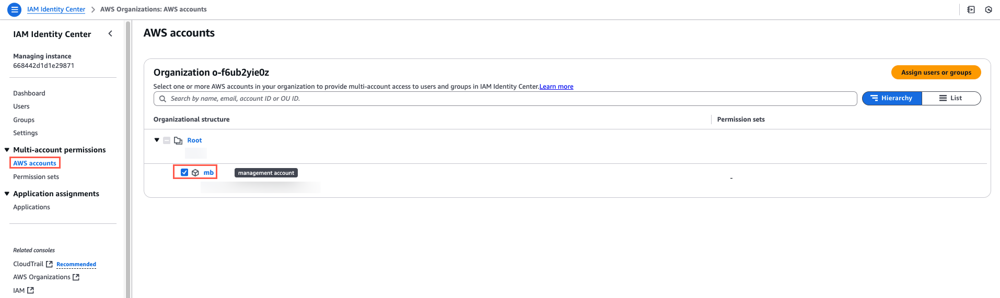 3. Add users and groups On the **Test-acct** page, choose the **User and groups** tab. Select **Assign users or groups**. The Assign users and groups workflow displays. 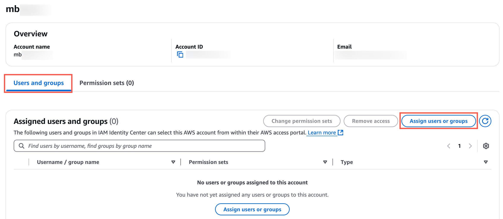 4. Select a group For **Step 1: Select users and groups** select the \*\***Admins\***\* group you created previously in this tutorial. Then, choose **Next**. 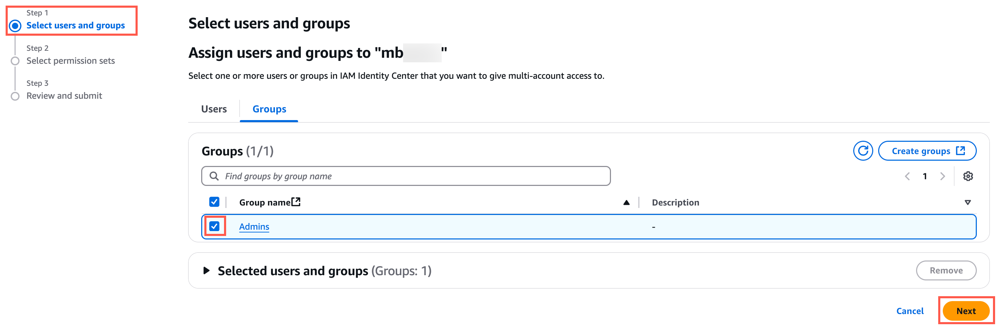 5. Select a permission set For **Step 2: Select permission sets**, select **Create permission set**. A new browser tab will open and will walk you through the three sub-steps involved in creating the permission set. 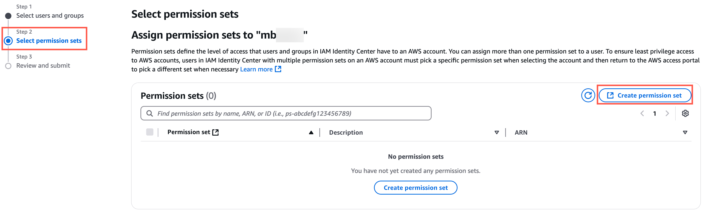 6. Choose a permission type In the new browser tab, for **Step 1: Select permission set type**. Make the following selections:  • For **Permissions set type**, select **Predefined permission set**  • For **Policy for predefined permission set**, select **AdministratorAccess**  • For more information on managing permissions, see the [Predefined permissions for AWS managed policies](../../../singlesignon/latest/userguide/permissionsetpredefined.md "../../../singlesignon/latest/userguide/permissionsetpredefined.md") in the **AWS IAM Identity Center** guide. Then, choose **Next**. 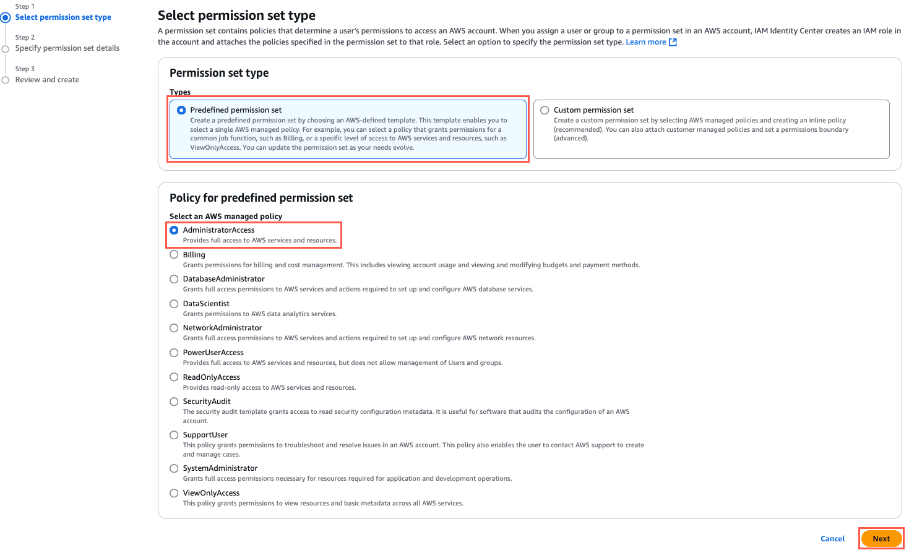 7. Configure permission settings For **Step 2: Specify permission set details**, keep the default settings, and choose **Next**. ###### Note The default settings create a permission set named \*\***AdministratorAccess\***\* with session duration set to one hour. 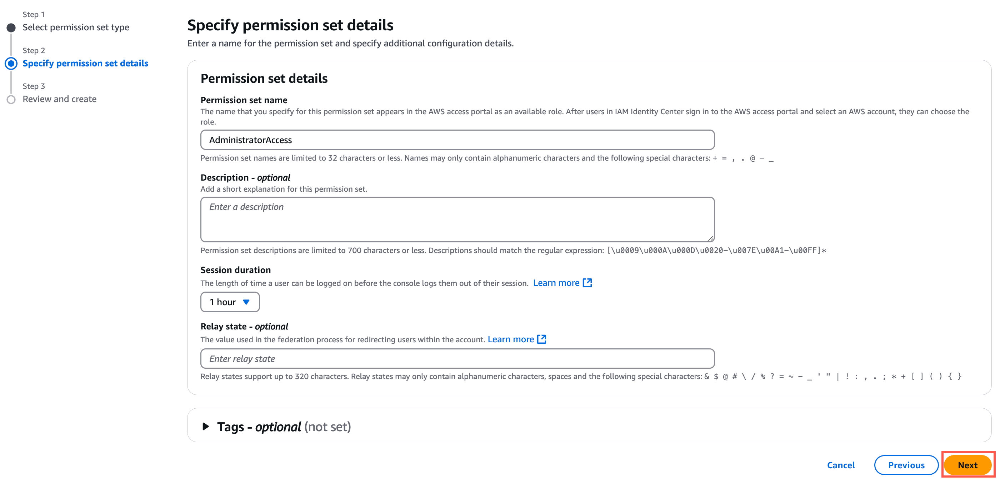 8. Review and create For **Step 3: Review and create**, verify that the **Permission set type** uses the AWS managed policy **AdministratorAccess**. Choose **Create**. You are returned to the **Permission sets** page. A notification appears at the top of the page informing you that the permission set was successfully created. 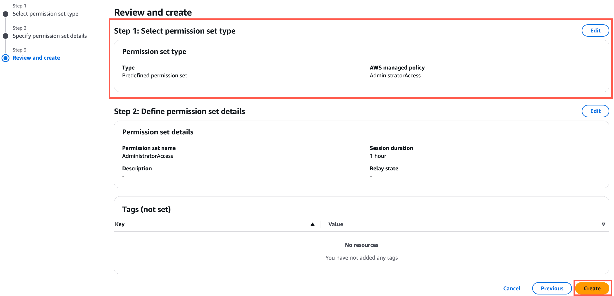 9. Return to assign users page You are returned to the **Permission sets** page. A notification appears at the top of the page informing you that the permission set was successfully created. Select **X** to close the current browser tab, and navigate back to the **IAM Identity Center Assign Users** page to continue the previous workflow. 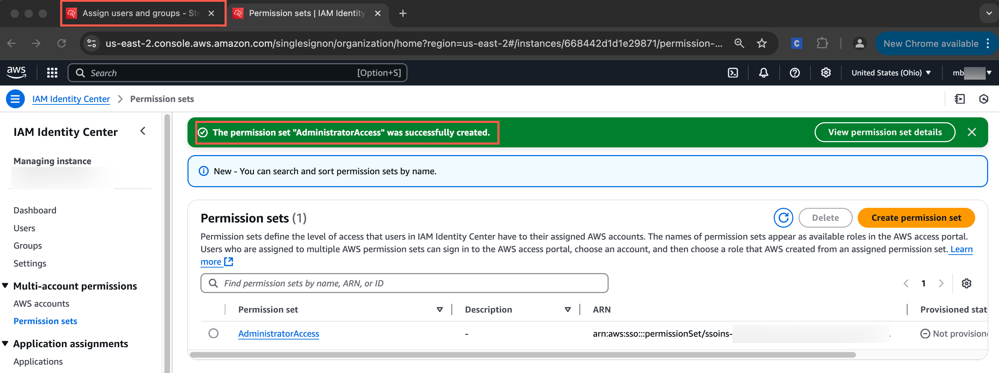 10. Select permission set On the **Assign users and groups browser** tab, for **Step 2: Select permission sets**, in the **Permission sets** section, select **Refresh**.  • The \*\***AdministratorAccess\***\* permission set you created appears in the list. Select the **checkbox** for the AdminstratorAccess permission set, and choose **Next**. 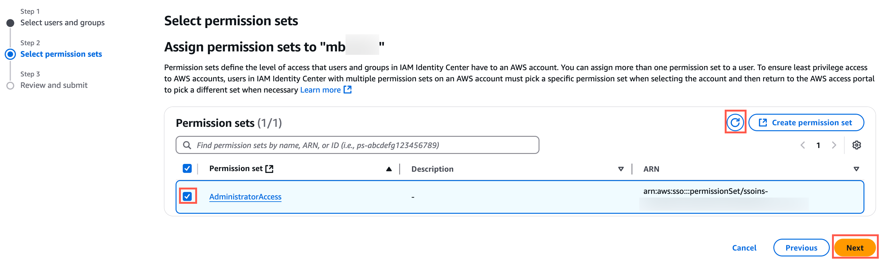 11. Submit assignment For **Step 3: Review and submit**, review the selected users and groups and permission set, then choose **Submit**. 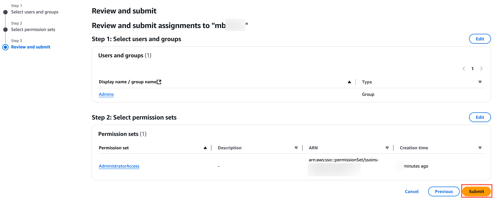 12. Verify configuration completion The page updates with a message that your AWS account is being configured. **Wait** until the process completes. You are returned to the AWS accounts page in **IAM Identity Center**. A notification message informs you that your AWS account has been reprovisioned and the updated permission set applied. 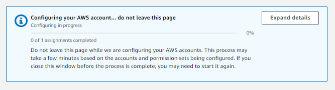 13. Verify configuration Choose the **AWS Organizations: AWS accounts** breadcrumb. You can see in the Organization structure section that your AWS account is now the management account under the root of the AWS organization.  • **Reminder:** In this tutorial, we are using a placeholder AWS account name. You will see the name of **your AWS account** instead. Congratulations, your user can now sign in to your AWS access portal and access resources in your AWS account. 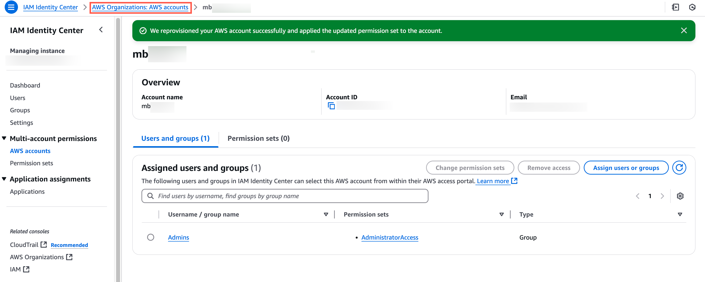 Your new user exists but does not have access to any resources, services, or applications, so the user can't replace your root user for daily administrative tasks yet. Let’s give your new user access to your AWS account. Since we put the user into a group, we will assign the group to an account and then we will add a permission set that defines what the members of the group can access. ###### Note We will still be using the **root user** credentials for this step. Now you are ready to sign in using your new administrative user. If you tried to sign in previously you would have only been able to establish your password and enable up multi-factor authentication (MFA) for your user, because no other permissions had been granted to the user. Now, the user will have full permissions to your AWS resources, but they will still need to configure a password and set up MFA. 1. Select the **Show QR code** link to show a unique QR code.  • If you can't scan the QR code, choose the **Show secret key** link to display a text key that you can enter into the Authenticator app to identify your organization. Either scan the QR code with your authenticator app or enter the code in your authenticator app to link your authenticator device to your organization.  • Once your authenticator has established the link to your organization, it will start generating secret codes that are good for a limited number of seconds. 2. In **Authenticator code box**, type the code you see in the app, and choose **Assign MFA**. ###### Note When registering an MFA device with IAM identity Center, only one authenticator code is required for registration. 3. Your authenticator app is successfully registered, select **Done**. You can register another device, rename or delete your existing MFA device or from the MFA devices page. 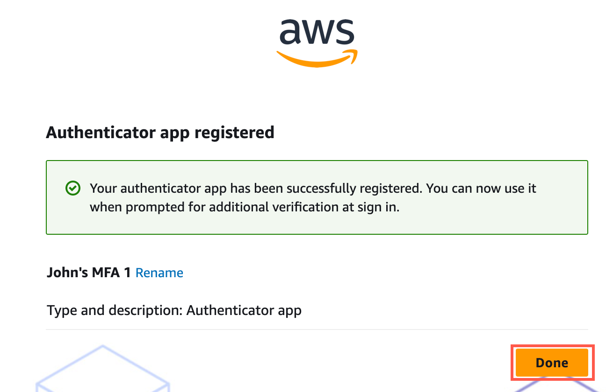 4. From the access portal, select **AWS Account**, select your **<account name>**. Then, select **Management console.**  • The AWS management console opens. As a user with administrative access, you can add services, add additional users, and configure policies and permissions. You no longer need to use your root user to accomplish these tasks. 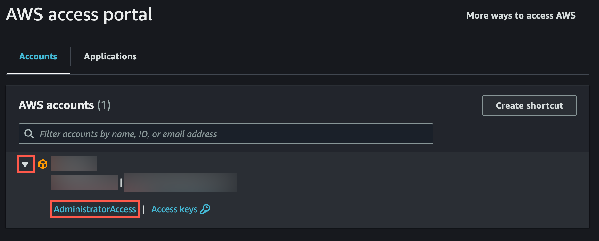 5. Open IAM Identity Center An email was sent to the email address you specified when you created the user. The email contains three important items:  • A link to accept the invitation to join  • The URL of your AWS access portal  • Your username that you will use to sign in Open the email and **record the AWS access portal URL** and the **Your Username.** You will need this information later in this tutorial. Select the **Accept invitation** button in the email. **Tip:** If you don't see the Invitation to join IAM Identity Center email in your inbox folder, check your spam, junk, and deleted items (or trash) folders. All emails sent by the IAM Identity Center service will come from either the address no-reply@signin.aws or no-reply@login.awsapps.com. If you can’t find the email, **sign in** as the root user and **reset** the Identity Center user’s password. For instructions, see [Reset an IAM Identity Center user password](../../../singlesignon/latest/userguide/resetuserpwd.md "../../../singlesignon/latest/userguide/resetuserpwd.md"). If you still don’t receive the email, reset the password again and choose the option to **Generate a one-time password** that you can share with the user instead. 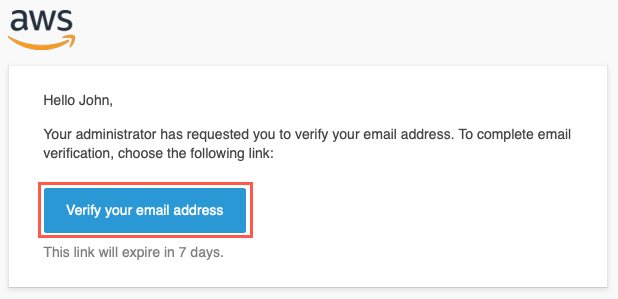 6. Sign in to AWS The link opens a browser window and displays a **Sign in** page. In the **Sign in**page, enter the password used for creating the IAM user sign in earlier in this tutorial. 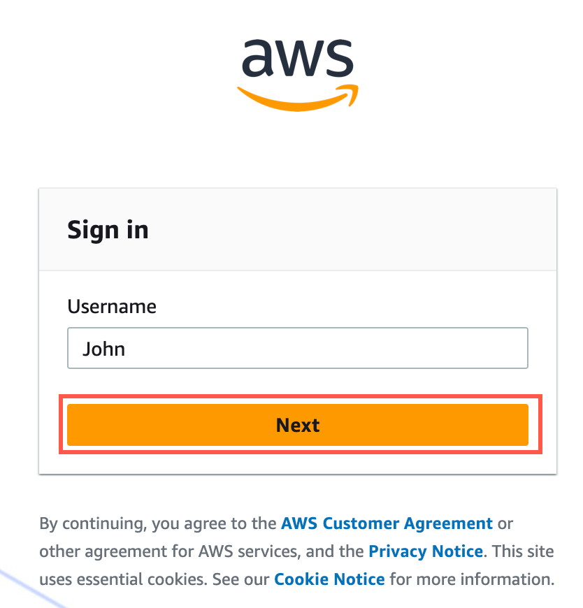 7. Enter your password Enter your password, and choose **Sign in**. 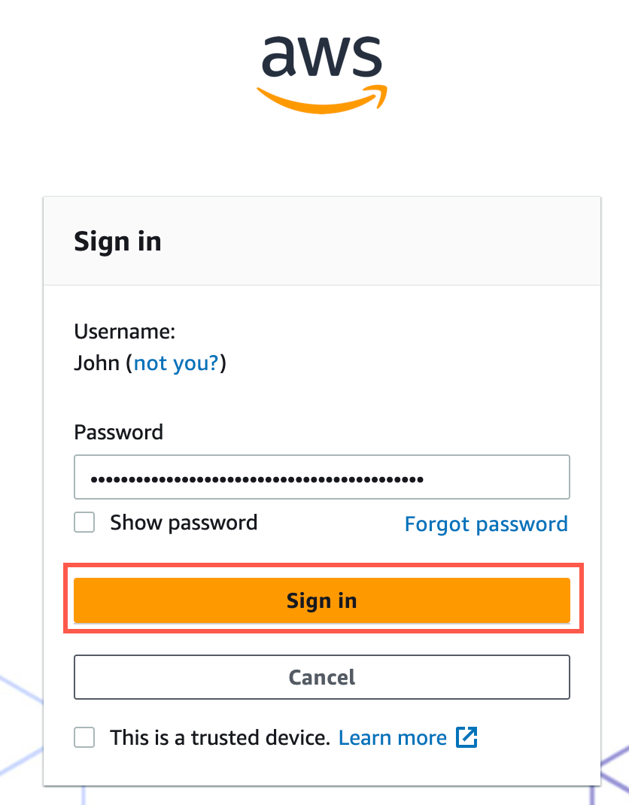 8. Set up MFA The AWS console opens. You will be automatically prompted to **Register MFA device**. Choose one of the options to get started. For this tutorial, we have selected **Authenticator app**. **Notes:**  • Options not supported by your browser or platform are dimmed and can’t be selected.  • This is similar to the process you followed when you **set up the MFA device for your root user in Module 2**. The difference is that this MFA device is being registered with IAM Identity Center instead of IAM.  • If you select a different MFA device, follow the instructions for the device you selected. 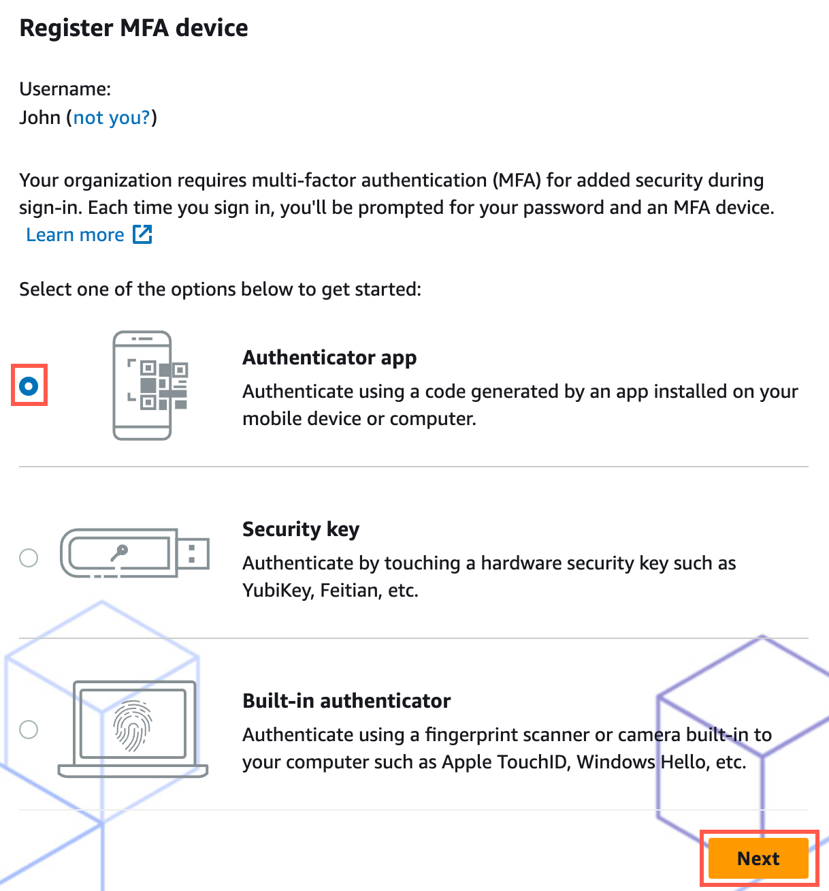 9. Configure MFA device Select the **Show QR code** link to show a unique QR code.  • If you can't scan the QR code, choose the **Show secret key** link to display a text key that you can enter into the Authenticator app to identify your organization. Either scan the QR code with your authenticator app or enter the code in your authenticator app to link your authenticator device to your organization.  • Once your authenticator has established the link to your organization, it will start generating secret codes that are good for a limited number of seconds. In **Authenticator code box**, type the code you see in the app, and choose **Assign MFA**. ###### Note When registering an MFA device with IAM identity Center, only one authenticator code is required for registration. 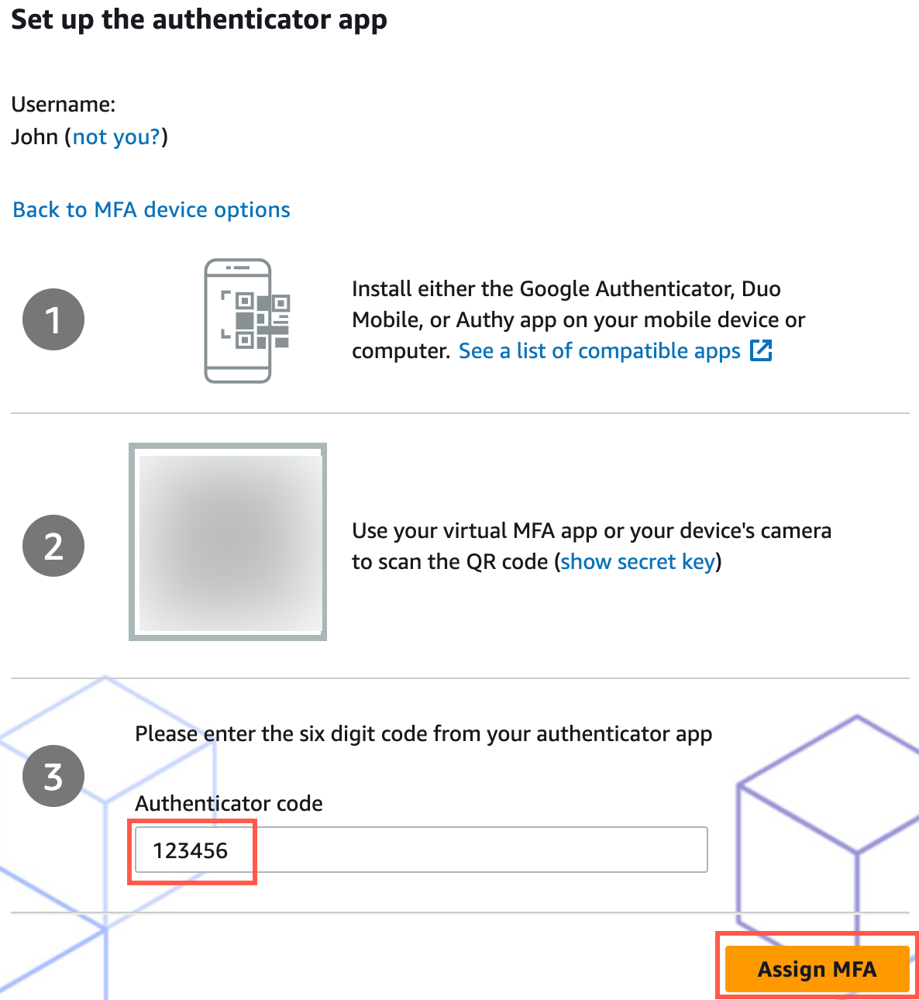 10. Complete MFA setup Your authenticator app is successfully registered, select **Done**. You can register another device, rename or delete your existing MFA device or from the MFA devices page.  11. Open the AWS Management Console From the access portal, select **AWS Account**, select your **<account name>**. Then, select **Management console.\*\*  • The AWS Management Console opens. As a user with administrative access, you can add services, add additional users, and configure policies and permissions. You no longer need to use your root user to accomplish these tasks.  ## Conclusion Congratulations! You have now completed the sign-in process, created an administrative user in IAM Identity Center, added enhanced security for both your root user and your administrative user, and are ready to start working with AWS services and applications. Remember, when you sign in using your Identity Center administrative user, you will use the access portal URL you received in your invitation email. ###### Important Each AWS Organization has a unique access portal URL. Make sure you keep a record of it with your user sign-in information. |
