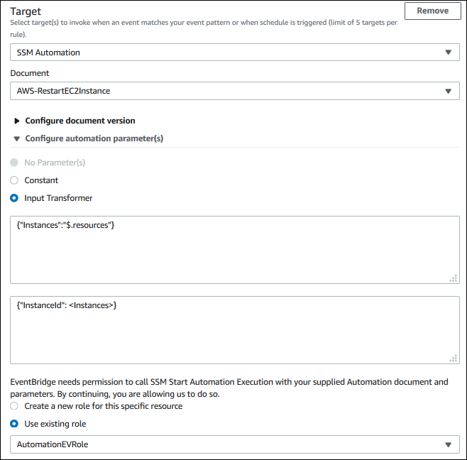

# Running operations on EC2 instances

automatically in response to events in AWS Health

You can automate actions that respond to scheduled events for your Amazon EC2 instances. When
AWS Health sends an event to your AWS account, your EventBridge rule can then invoke targets, such
as AWS Systems Manager Automation documents, to automate actions on your behalf.

For example, when an Amazon EC2 instance retirement event is scheduled for an Amazon Elastic Block Store
(Amazon EBS)-backed EC2 instance, AWS Health will send the
`AWS_EC2_PERSISTENT_INSTANCE_RETIREMENT_SCHEDULED` event type to your AWS Health Dashboard. When
your rule detects this event type, you can automate the stop and start of the instance. This
way, you don't have to perform these actions manually.

###### Note

To automate actions for your Amazon EC2 instances, the instances must be managed by
Systems Manager.

For more information, see [Automating Amazon EC2 with
EventBridge](../../../AWSEC2/latest/UserGuide/automating_with_cloudwatch_events.md "../../../AWSEC2/latest/UserGuide/automating_with_cloudwatch_events.md") in the _Amazon EC2 User Guide_.

## Prerequisites

You must create an AWS Identity and Access Management (IAM) policy, create an IAM role, and update the role's
trust policy before you can create a rule.

Follow this procedure to create a customer managed policy for your role. This policy
gives the role permission to perform actions on your behalf. This procedure uses the
JSON policy editor in the IAM console.

###### To create an IAM policy

1. Sign in to the AWS Management Console and open the IAM console at [https://console.aws.amazon.com/iam/](https://console.aws.amazon.com/iam/ "https://console.aws.amazon.com/iam/").
2. In the navigation pane, choose **Policies**.
3. Choose **Create policy**.
4. Choose the **JSON** tab.
5. Copy the following JSON and then replace the default JSON in the editor.

JSON

```
`{
 "Version":"2012-10-17",
 "Statement": [
 {
 "Effect": "Allow",
 "Action": [
 "ec2:StartInstances",
 "ec2:StopInstances",
 "ec2:DescribeInstanceStatus"
 ],
 "Resource": [
 "*"
 ]
 },
 {
 "Effect": "Allow",
 "Action": [
 "ssm:*"
 ],
 "Resource": [
 "*"
 ]
 },
 {
 "Effect": "Allow",
 "Action": [
 "sns:Publish"
 ],
 "Resource": [
 "arn:aws:sns:*:*:Automation*"
 ]
 },
 {
 "Effect": "Allow",
 "Action": [
 "iam:PassRole"
 ],
 "Resource": "arn:aws:iam::`123456789012`:role/`AutomationEVRole`"
 }
 ]
}`

```

    1. In the `Resource` parameter, for the Amazon Resource Name (ARN),
     enter your AWS account ID.
    2. You can also replace the role name or use the default. This example uses
     `AutomationEVRole`.

6. Choose **Next: Tags**.
7. (Optional) You can use tags as key–value pairs to add metadata to the
   policy.
8. Choose **Next: Review**.
9. On the **Review policy** page, enter a
   **Name**, such as
   `AutomationEVRolePolicy` and an optional
   **Description**.
10. Review the **Summary** page to see the permissions that the
    policy allows. If you're satisfied with your policy, choose **Create
    policy**.
    This policy defines the actions that the role can take. For more information, see
    [Creating IAM policies (console)](../../../IAM/latest/UserGuide/access_policies_create-console.md "../../../IAM/latest/UserGuide/access_policies_create-console.md") in the
    _IAM User Guide_.

After you create the policy, you must create an IAM role, and then attach the
policy to that role.

###### To create a role for an AWS service

1. Sign in to the AWS Management Console and open the IAM console at [https://console.aws.amazon.com/iam/](https://console.aws.amazon.com/iam/ "https://console.aws.amazon.com/iam/").
2. In the navigation pane, choose **Roles**, and then choose
   **Create role**.
3. For **Select type of trusted entity**, choose **AWS
   service**.
4. Choose **EC2** for the service that you want to allow to assume
   this role.
5. Choose **Next: Permissions**.
6. Enter the policy name that you created, such as
   `AutomationEVRolePolicy`, and then select the check box
   next to the policy.
7. Choose **Next: Tags**.
8. (Optional) You can use tags as key–value pairs to add metadata to the
   role.
9. Choose **Next: Review**.
10. For **Role name**, enter
    `AutomationEVRole`. This name must be the same name that
    appears in the ARN of the IAM policy that you created.
11. (Optional) For **Role description**, enter a description for
    the role.
12. Review the role and then choose **Create role**.
    For more information, see [Creating a role for an AWS service](../../../IAM/latest/UserGuide/id_roles_create_for-service.md#roles-creatingrole-service-console "../../../IAM/latest/UserGuide/id_roles_create_for-service.md#roles-creatingrole-service-console") in the
    _IAM User Guide_.

Finally, you can update the trust policy for the role that you created. You must
complete this procedure so that you can choose this role in the EventBridge console.

###### To update the trust policy for the role

1. Sign in to the AWS Management Console and open the IAM console at [https://console.aws.amazon.com/iam/](https://console.aws.amazon.com/iam/ "https://console.aws.amazon.com/iam/").
2. In the navigation pane, choose **Roles**.
3. In the list of roles in your AWS account, choose the name of the role that you
   created, such as `AutomationEVRole`.
4. Choose the **Trust relationships** tab, and then choose
   **Edit trust relationship**.
5. For **Policy Document**, copy the following JSON, remove the
   default policy, and paste the copied JSON in its place.

JSON

```
`{
 "Version":"2012-10-17",
 "Statement": [
 {
 "Effect": "Allow",
 "Principal": {
 "Service": [
 "ssm.amazonaws.com",
 "events.amazonaws.com"
 ]
 },
 "Action": "sts:AssumeRole"
 }
 ]
}`

```

6. Choose **Update Trust Policy**.
   For more information, see [Modifying a role trust policy (console)](../../../IAM/latest/UserGuide/roles-managingrole-editing-console.md#roles-managingrole_edit-trust-policy "../../../IAM/latest/UserGuide/roles-managingrole-editing-console.md#roles-managingrole_edit-trust-policy") in the
   _IAM User Guide_.

## Create a rule for EventBridge

Follow this procedure to create a rule in the EventBridge console so that you can automate the
stop and start of EC2 instances that are scheduled for retirement.

###### To create a rule for EventBridge for Systems Manager automated actions

1. Open the Amazon EventBridge console at [https://console.aws.amazon.com/events/](https://console.aws.amazon.com/events/ "https://console.aws.amazon.com/events/").
2. In the navigation pane, under **Events**, choose
   **Rules**.
3. On the **Create rule** page, enter a **Name** and
   **Description** for your rule.
4. Under **Define pattern**, choose **Event
   pattern**, and then choose **Pre-defined pattern by
   service**.
5. For **Service provider**, choose **AWS**.
6. For **Service name**, choose **Health**.
7. For **Event type**, choose **Specific Health
   events**.
8. Choose **Specific service(s)** and then choose
   **EC2**.
9. Choose **Specific event type category(s)** and then choose
   **scheduledChange**.
10. Choose **Specific event types code(s)** and then choose the event
    type code.

For example, for Amazon EC2 EBS-backed instances, choose
`AWS_EC2_PERSISTENT_INSTANCE_RETIREMENT_SCHEDULED`.
For Amazon EC2 instance store-backed instances, choose
`AWS_EC2_INSTANCE_RETIREMENT_SCHEDULED`. 11. Choose **Any resource**.

Your **Event pattern** will look similar to the following
example.

###### Example

```
{
  "source": [
    "aws.health"
  ],
  "detail-type": [
    "AWS Health Event"
  ],
  "detail": {
    "service": [
      "EC2"
    ],
    "eventTypeCategory": [
      "scheduledChange"
    ],
    "eventTypeCode": [
      "AWS_EC2_PERSISTENT_INSTANCE_RETIREMENT_SCHEDULED"
    ]
  }
}
```

12. Add the Systems Manager Automation document target. Under **Select targets**,
    for **Target**, choose **SSM Automation**.
13. For **Document**, choose
    `AWS-RestartEC2Instance`.
14. Expand the **Configure automation parameters(s)** and then choose
    **Input Transformer**.
15. For the **Input Path** field, enter
    `{"Instances":"$.resources"}`.
16. For the second field, enter `{"InstanceId":
<Instances>}`.
17. Choose **Use existing role**, and then choose the IAM role that
    you created, such as `AutomationEVRole`.

Your target should look like the following example.



###### Note

If you don't have an existing IAM role with the required EC2 and Systems Manager
permissions and trusted relationship, your role won't appear in the list. For more
information, see [Prerequisites](#prerequisites-automation-ec2-instances "#prerequisites-automation-ec2-instances"). 18. Choose **Create**.

If an event occurs in your account that matches your rule, EventBridge will send the event
to your specified target.
