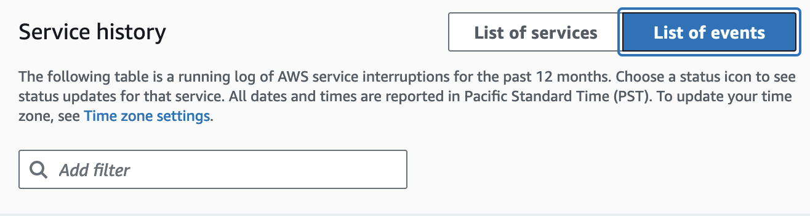

# AWS Health Dashboard

You can use the AWS Health Dashboard – Service health to view the health of all AWS services. This page shows reported
service events for services across AWS Regions. You don't need to sign in or have an
AWS account to access the AWS Health Dashboard – Service health page.

###### Tip

This website only shows _public_ events, which are not specific to
an AWS account. If you already have an account, we recommend that you sign in to view
your AWS Health Dashboard and stay informed about events that can affect your account and services. For
more information, see [Getting started with your
AWS Health Dashboard](getting-started-health-dashboard.md "getting-started-health-dashboard.md").

###### To view the AWS Health Dashboard – Service health

1. Navigate to the [https://health.aws.com/health/status](https://health.aws.com/health/status "https://health.aws.com/health/status") page.

###### Note

If you are already signed in to your AWS account, page, you will be
redirected to the **AWS Health Dashboard – Your account health**
page. 2. Under **Service health**, choose **Open and recent
issues** to view recently reported events. You can view the following
information about the event:

    * The event name and affected Region. For example, **Operational
     issue – Amazon Elastic Compute Cloud (N. Virginia)**
    * The service name
    * The event's severity, such as **Impacted** or
     **Degraded**
    * A timeline of recent updates for the event
    * A list of AWS services that are also affected by this event

###### Note

You can view the events in your local time zone or in UTC. For more
information, see [Time zone settings](getting-started-health-dashboard.md#update-time-zone "getting-started-health-dashboard.md#update-time-zone"). 3. Choose **Service history** to view the **Service
history** table. This table shows all AWS service interruptions for
the last 12 months.

###### Tip

You can filter by **Service**,
**AWS Region**, and date. 4. Next to an ongoing service event, choose the status icon (

) to view more information about the event. 5. (Optional)
To
view this as a list of historical events,
choose
the list of events button.
Choose
any
event in the event column to view more information about that specific event in the
pop-up side-panel.

###### Note

Selecting any public event after September 2023 will populate the URL in the
browser with a link to that public
AWS Health
event.
After you select this link, you

navigate to the list of events view with that event pop-up. 6. (Optional) You can view the events in your local time zone or UTC. For more
information, see [Time zone settings](aws-health-account-views.md#update-time-zone "aws-health-account-views.md#update-time-zone"). 7. (Optional) If you have an account, choose **Open your account
health** to sign in. After you sign in, you can view events that are
specific to your account. For more information, see [Getting started with your
AWS Health Dashboard](getting-started-health-dashboard.md "getting-started-health-dashboard.md").

###### Note

Although an RSS feed is available for health events, the format is subject to changes. So, scraping the RSS feed might not provide all the relevant data. To programmatically ingest health event data, we recommend integrating with Amazon EventBridge. For more information, see [Monitoring events in AWS Health with
Amazon EventBridge](cloudwatch-events-health.md "cloudwatch-events-health.md").
