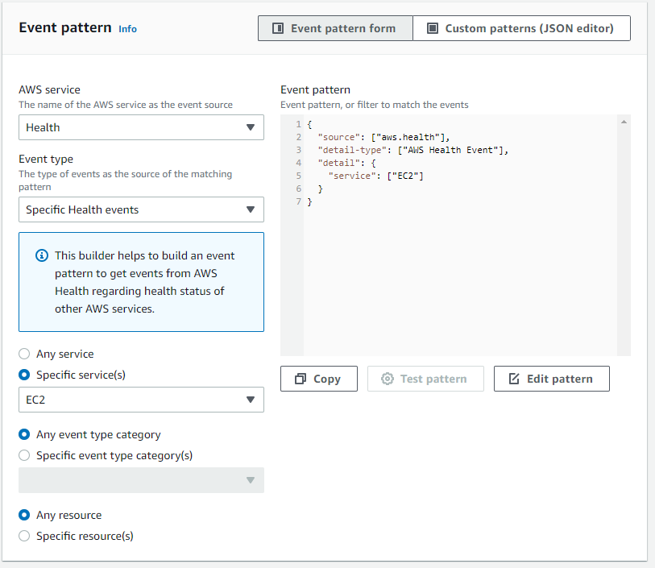
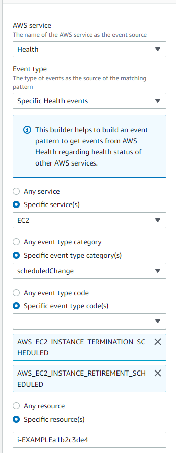

# Configuring an EventBridge rule to

send notifications about events in AWS Health

You can create an EventBridge rule to get notified for AWS Health events in your account. Before
you create event rules for AWS Health, do the following:

- Familiarize yourself with events, rules, and targets in EventBridge. For more information,
  see [What
  is Amazon EventBridge?](../../../eventbridge/latest/userguide/eb-what-is.md "../../../eventbridge/latest/userguide/eb-what-is.md") in the _Amazon EventBridge User Guide_ and [New EventBridge – Track and Respond to Changes to Your AWS Resources](https://aws.amazon.com/blogs/aws/new-cloudwatch-events-track-and-respond-to-changes-to-your-aws-resources/ "https://aws.amazon.com/blogs/aws/new-cloudwatch-events-track-and-respond-to-changes-to-your-aws-resources/") .
- Create the target or targets to use in your event rules.

###### To create an EventBridge rule for AWS Health

1. Open the Amazon EventBridge console at [https://console.aws.amazon.com/events/](https://console.aws.amazon.com/events/ "https://console.aws.amazon.com/events/").
2. To change the AWS Region, use the **Region selector** in the
   upper-right corner of the page. Choose the Region in which you want to track AWS Health
   events.
3. In the navigation pane, choose **Rules**.
4. Choose **Create rule**.
5. On the **Define rule detail** page, enter a name and description for
   your rule.
6. Keep the default values for **Event bus** and **Rule
   type**, and then choose **Next**.
7. On the **Build event pattern** page, for **Event
   source**, choose **AWS events and EventBridge partner
   events**.
8. Under **Event pattern**, for **Event source**,
   choose **AWS services**.
9. Under **Event pattern**, for **AWS service**,
   choose **Health**.
10. For **Event type**, choose one of the following options.
    - **Specific Health Abuse Events** – Create a rule for
      AWS Health events that have the word `Abuse` in the event type
      name.
    - **Specific Health events** – Create a rule for events for
      a specific AWS service, such as Amazon EC2.

11. You can choose **Any service** or **Specific
    service(s)**. If you chose a specific service, choose one of the following
    options:
    - Choose **Any event type category** to create a rule that applies
      to all event type categories.
    - Choose **Specific event type category(s)** and then choose a
      value from the list, such as **issue**,
      **accountNotification**, or
      **scheduledChange**.###### Tip

    - To monitor all AWS Health events for a specific service, we recommend that you
      choose **Any event type category** and **Any
      resource**. This ensures that your rule monitors for any AWS Health
      events, including any new event type codes, for your specified service. For an
      example rule, see [all Amazon EC2
      events](#all-ec2-events-rule "#all-ec2-events-rule").
    - You can create a rule to monitor for more than one service or event type
      category. To do so, you must manually update the event pattern for the rule. For
      more information, see [Creating a rule for multiple
      services and categories](#create-rule-multiple-services-categories "#create-rule-multiple-services-categories").

12. If you chose a specific service and event type category, choose one of the following
    options for event type codes.
    - Choose **Any event type code** to create a rule that applies to
      all event type codes.
    - Choose **Specific event type code(s)** and then choose one or
      more values from the list. This creates a rule that applies only to specific event
      type codes. For example, if you choose
      **`AWS_EC2_INSTANCE_STOP_SCHEDULED`** and
      **`AWS_EC2_INSTANCE_RETIREMENT_SCHEDULED`**, your rule
      applies only to these events when they occur in your account.

13. Choose one of the following options for affected resources.
    - Choose **Any resource** to create a rule that applies to all
      resources.
    - Choose **Specific resource(s)** and enter the IDs of one or more
      resources. For example, you might specify an Amazon EC2 instance ID, such as
      `i-EXAMPLEa1b2c3de4`, to monitor for events that affect
      only this resource.

14. Review your rule setup so that it meets
    your event-monitoring requirements.
15. Choose **Next**.
16. On the **Select target(s)** page, choose
    the target type that you created for this rule, and then configure any additional options
    that are required for that type. For example, you might send the event to an Amazon SQS queue
    or an Amazon SNS topic.
17. Choose **Next**.
18. (Optional) On the **Configure tags** page, add any tags and then
    choose **Next**.
    - Note: Tags are currently not sent by the aws.health source in EventBridge.

19. On the **Review and create** page, review your rule setup and ensure
    that it meets your event monitoring requirements.
20. Choose **Create rule**.

###### Example : Rule for all Amazon EC2 events

The following example creates a rule so that EventBridge monitors for all Amazon EC2 events,
including the event type categories, event codes, and resources.



###### Example : Rule for specific Amazon EC2 events

The following example creates a rule so that EventBridge monitors the following:

- The Amazon EC2 service
- The **scheduledChange** event type category
- The event type codes for `AWS_EC2_INSTANCE_TERMINATION_SCHEDULED` and
  `AWS_EC2_INSTANCE_RETIREMENT_SCHEDULED`
- The instance with the ID `i-EXAMPLEa1b2c3de4`



## Creating a rule for multiple

services and categories

The examples in the previous procedure show you how to create a rule for a single
service and event type category. You can also create a rule for multiple services and event
type categories. This means that you don't have to create a separate rule for each service
and category that you want to monitor. To do so, you must edit the event pattern and then
enter your changes manually.

You can use one of the following options.

###### To add services and categories for an existing rule

1. In the EventBridge console, on the **Rules** page, choose the rule
   name.
2. In the upper-right corner, choose **Edit**.
3. Choose **Next**.
4. For **Event pattern**, choose **Edit pattern**,
   and then enter your changes into the text field.
5. Choose **Next** until you reach the **Review and
   update** page.
6. Choose **Update rule** to save your changes.

###### To add services and categories for a new rule

1. Follow the procedure in [Configuring an EventBridge rule to
   send notifications about events in AWS Health](creating-event-bridge-events-rule-for-aws-health.md "creating-event-bridge-events-rule-for-aws-health.md") to [step 9](#choose-service-category "#choose-service-category").
2. Instead of choosing a single service or category from the lists, for **Event
   pattern**, choose **Edit pattern**.
3. Enter your changes into the text field. See the following [example pattern](#example-multiple-services-categories "#example-multiple-services-categories") as a model for
   creating your own event pattern.
4. Review your event pattern, and then follow the rest of the procedure in [Configuring an EventBridge rule to
   send notifications about events in AWS Health](creating-event-bridge-events-rule-for-aws-health.md "creating-event-bridge-events-rule-for-aws-health.md") to create your
   rule.

###### Use the API or AWS Command Line Interface (AWS CLI)

For a new or existing rule, use the [PutRule](../../../eventbridge/latest/APIReference/API_PutRule.md "../../../eventbridge/latest/APIReference/API_PutRule.md") API operation or the `aws events put-rule` command to update
the event pattern. For an example AWS CLI command, see [put-rule](../../../cli/latest/reference/events/put-rule.md "../../../cli/latest/reference/events/put-rule.md")
in the _AWS CLI Command Reference_.

###### Example: Multiple services and event type categories

The following event pattern creates a rule to monitor events for the
`issue`, `accountNotification`, and `scheduledChange`
event type categories for three AWS services: Amazon EC2, Amazon EC2 Auto Scaling, and Amazon VPC.

```
{
  "detail": {
    "eventTypeCategory": [
      "issue",
      "accountNotification",
      "scheduledChange"
    ],
    "service": [
      "AUTOSCALING",
      "VPC",
      "EC2"
    ]
  },
  "detail-type": [
    "AWS Health Event"
  ],
  "source": [
    "aws.health"
  ]
}
```
