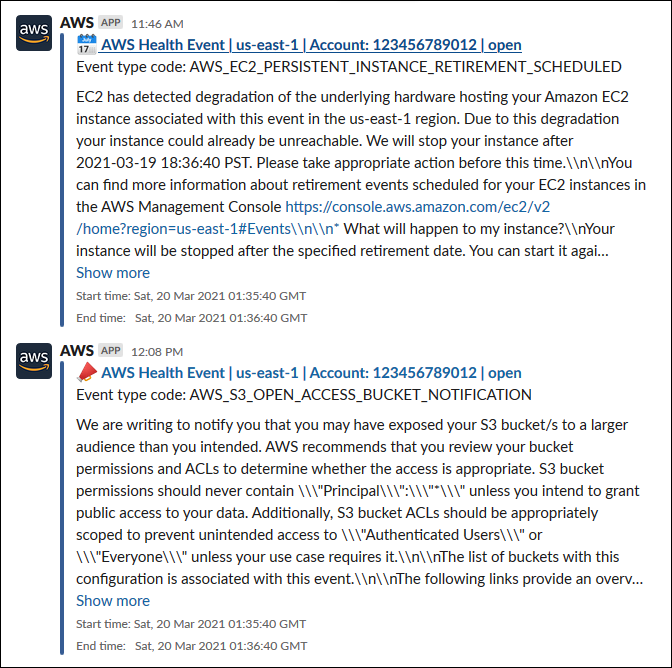

# Configuring Amazon Q Developer in chat applications to

send notifications about events in AWS Health

You can receive AWS Health events directly in your chat clients, such as Slack and Amazon Chime.
You can use this event to identify recent AWS service issues that might affect your AWS
applications and infrastructure. Then, you can sign in to your [AWS Health Dashboard](https://health.aws.com/health/home "https://health.aws.com/health/home") to learn more about
the update. For example, if you're monitoring for the
`AWS_EC2_INSTANCE_STOP_SCHEDULED` event type in your AWS account, the
AWS Health event can appear directly to your Slack channel.

## Prerequisites

Before you get started, you must have the following:

- A chat client configured with Amazon Q Developer in chat applications. You can configure Amazon Chime and Slack. For more
  information, see [Getting started with Amazon Q Developer in chat applications](../../../chatbot/latest/adminguide/getting-started.md "../../../chatbot/latest/adminguide/getting-started.md") in the _Amazon Q Developer in chat applications
  Administrator Guide_.
- An Amazon SNS topic that you created and to which you're subscribed. If you already have
  an SNS topic, you can use an existing one. For more information, see [Getting started with
  Amazon SNS](../../../sns/latest/dg/sns-getting-started.md "../../../sns/latest/dg/sns-getting-started.md") in the _Amazon Simple Notification Service Developer Guide_.

###### To receive AWS Health events with Amazon Q Developer in chat applications

1. Follow the procedure in [Configuring an EventBridge rule to
   send notifications about events in AWS Health](creating-event-bridge-events-rule-for-aws-health.md "creating-event-bridge-events-rule-for-aws-health.md") through step 13.
   1. When you finish setting up the event pattern in step 13, add a comma to the last
      line of the pattern, and add the following line to remove unnecessary chat messages
      from paginated AWS Health events. See [Viewing paginated lists of AWS Health events on
      EventBridge](pagnation-of-health-events.md "pagnation-of-health-events.md").

   `"detail.page": ["1"]` 2. When you choose the target in [step 14](creating-event-bridge-events-rule-for-aws-health.md#choose-target "creating-event-bridge-events-rule-for-aws-health.md#choose-target"), choose
   an SNS topic. You will use this same SNS topic in the Amazon Q Developer in chat applications console. 3. Complete the rest of the procedure to create the rule.

2. Navigate to the [Amazon Q Developer in chat applications console](https://console.aws.amazon.com/chatbot "https://console.aws.amazon.com/chatbot").
3. Choose your chat client, such as your Slack channel name, and then choose
   **Edit**.
4. In the **Notifications - optional** section, for
   **Topics**, choose the same SNS topic that you specified in step
5.
6. Choose **Save**.

When AWS Health sends an event to EventBridge that matches your rule, the AWS Health event
will appear in your chat client. 6. Choose the event name to see more information in your AWS Health Dashboard.

###### Example : AWS Health events sent to Slack

The following is an example of two AWS Health events for Amazon EC2 and Amazon Simple Storage Service (Amazon S3) in
the US East (N. Virginia) Region that appear in the Slack channel.

