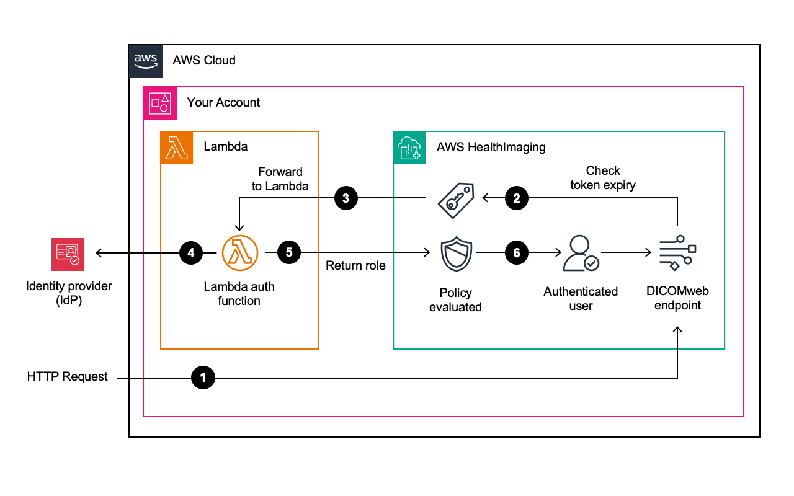

# Custom Token Verification with Lambda Authorizers

HealthImaging implements OIDC support through an architecture that uses Lambda authorizers, allowing customers
to implement their own token verification logic. This design gives you flexible control over how tokens are
validated and how access decisions are enforced, accommodating for a diverse landscape of OIDC-compatible
Identity Providers (IdPs) and varying token verification methods.

## Authentication Flow

Here's how the authentication works at a high level:

1. **Client calls the DICOMweb API:** Your application authenticates with your chosen OIDC
   identity provider and receives a signed ID token (JWT). For each DICOMweb HTTP request, the
   client must include the OIDC access token in the Authorization header (typically a Bearer token).
   Before the request reaches your data, HealthImaging extracts this token from the incoming request and
   calls a Lambda authorizer that you configure.
   1. The header typically follows the format: `Authorization: Bearer <token>`.

2. **Initial verification:** HealthImaging verifies access token claims in order to quickly reject any
   obviously invalid or expired tokens without invoking the Lambda function unnecessarily. HealthImaging performs an initial verification
   of certain standard claims in the access token before invoking the Lambda authorizer:
   1. `iat` (Issued At): HealthImaging checks if the token's issue time is within acceptable limits.
   2. `exp` (Expiration Time): HealthImaging verifies that the token has not expired.
   3. `nbf` (Not Before Time): If present, HealthImaging ensures the token is not being used before its valid start time.

3. **HealthImaging invokes a Lambda authorizer:** If the initial claim verification passes, HealthImaging then delegates further token verification to the customer-configured Lambda authorizer function. HealthImaging passes the extracted token and other relevant request information to the Lambda function. The Lambda function verifies the token's signature and claims.
4. **Verify with an identity provider:** The Lambda contains custom code that checks the ID token signature, performs more extensive token verification (e.g., issuer, audience, custom claims), and validates those claims against the IdP when necessary.
5. **Authorizer returns an access policy:** After successful verification, the Lambda function determines the appropriate permissions for the authenticated use. The Lambda authorizer then returns the amazon resource name (ARN) of an IAM role that represents the set of permissions to be granted.
6. **Request execution:** If the assumed IAM role has the necessary permissions, HealthImaging proceeds with returning the requested DICOMWeb resource. If the permissions are insufficient, HealthImaging denies the request and returns an appropriate error response error (i.e., 403 Forbidden).

###### Note

The authorizer lambda function it not managed by AWS HealthImaging service. It executes in your AWS account. Customers are charged for the function invocation and execution time separately then their HealthImaging charges.

## Architecture Overview

OIDC authentication workflow with Lambda authorizer

## Prerequisites

### Access Token Requirements

HealthImaging requires the access token to be in JSON Web Token (JWT) format. Many Identity Providers (IDPs) offer this token format natively, while others allow you to select or configure the access token form. Ensure your chosen IDP can issue JWT tokens before proceeding with the integration.

Token Format

The access token must be in JWT (JSON Web Token) format

Required Claims

`exp` (Expiration Time)

Required claim that specifies when the token becomes invalid.

- Must be after the current time in UTC
- Represents when the token becomes invalid

`iat` (Issued At)

Required claim that specifies when the token was issued.

- Must be before the current time in UTC
- Must NOT be earlier than 12 hours before the current time in UTC
- This effectively enforces a maximum token lifetime of 12 hours

`nbf` (Not Before Time)

Optional claim that specifies the earliest time the token can be used.

- If present, will be evaluated by HealthImaging
- Specifies the time before which the token must not be accepted

### Lambda authorizer response time requirements

HealthImaging enforces strict timing requirements for Lambda authorizer responses to ensure optimal API performance. Your Lambda function **must** return within 1 second.

## Best practices

### Optimize Token Verification

- Cache JWKS (JSON Web Key Sets) when possible
- Cache valid access tokens when possible
- Minimize network calls to your Identity Provider
- Implement efficient token validation logic

### Lambda Configuration

- Python and Node.js based functions typically initialize faster
- Reduce the amount of external libraries to load
- Configure appropriate memory allocation to ensure consistent performance
- Monitor execution times using CloudWatch metrics

## OIDC Authentication Enablement

- OIDC authentication can **only** be enabled when creating a **new** datastore
- Enabling OIDC for existing datastores is not supported through the API
- To enable OIDC on an existing datastore, customers must contact AWS Support
