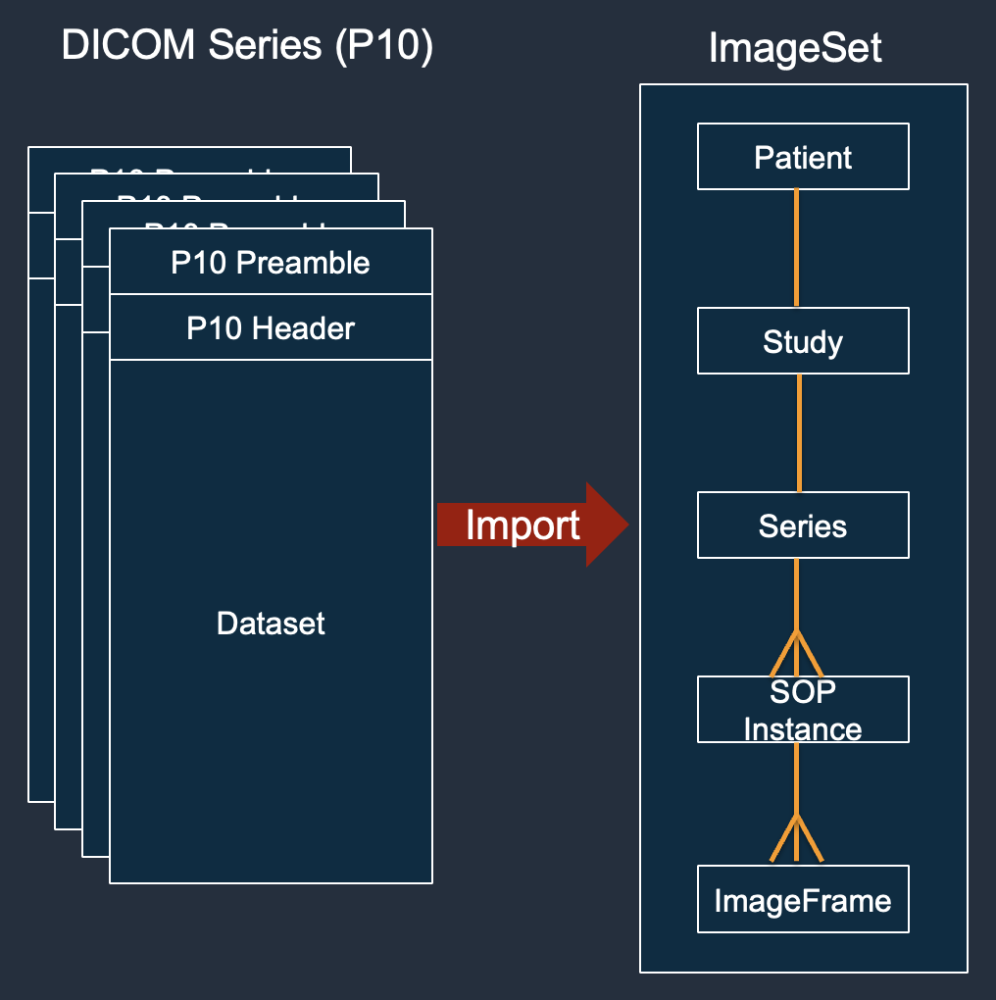
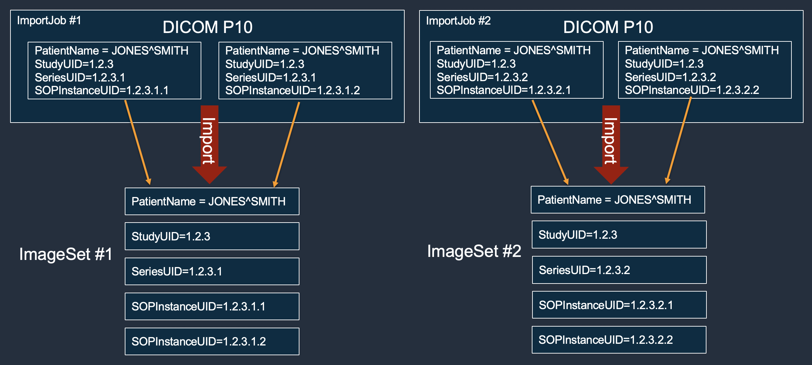
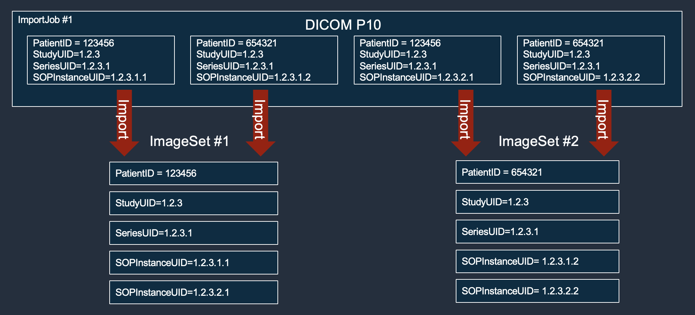
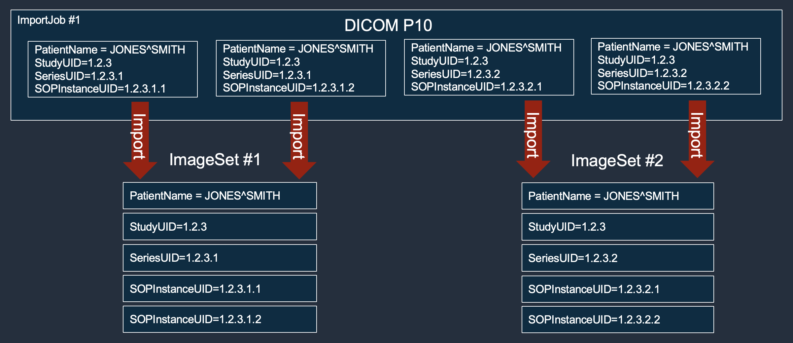

# Understanding image sets

Image sets are an AWS that resemble a DICOM Series, and serve as the
foundation for AWS HealthImaging. Image sets are created when you import your
DICOM data into HealthImaging. The service attempts to organize imported P10
data according to the DICOM hierarchy of Study, Series, and Instance.

Image sets were introduced for the following reasons:

- Support a wide variety of medical imaging workflows (clinical and nonclinical) through
  flexible APIs.
- Provide a mechanism for durably storing and reconciling duplicate and inconsistent data.
  Imported P10 data that conflicts with primary image sets already in the a store will be persisted
  as non-primary. After resolving metadata conflicts that data can be made primary.
- Maximize patient safety by grouping only related data.
- Encourage data to be cleaned to help increase the visibility of inconsistencies. For more
  information, see [Modifying image sets](modifying-image-sets.md "modifying-image-sets.md").

###### Important

Clinical use of DICOM data before it has been cleaned can result in patient harm.
The following menus describe image sets in further detail and provide examples and diagrams
to help you comprehend their functionality and purpose in HealthImaging.

An image set is an AWS concept that defines an abstract grouping mechanism for optimizing
related medical imaging data that closely resembles a DICOM Series. When you import your DICOM P10
imaging data into an AWS HealthImaging data store, it is transformed into image sets comprised of [metadata](getting-started-concepts.md#concept-metadata "getting-started-concepts.md#concept-metadata") and [image frames](getting-started-concepts.md#concept-image-frame "getting-started-concepts.md#concept-image-frame") (pixel data).

###### Note

Image set metadata is [normalized](metadata-normalization.md "metadata-normalization.md"). In other
words, one common set of attributes and values maps to Patient, Study, and Series level
elements listed in the [Registry of
DICOM Data Elements](https://dicom.nema.org/medical/dicom/2022b/output/html/part06.html#table_6-1 "https://dicom.nema.org/medical/dicom/2022b/output/html/part06.html#table_6-1"). HealthImaging uses the following DICOM elements when grouping incoming
DICOM P10 objects into image sets.

| DICOM elements used for image set creation | Element name  | Element tag |
| ------------------------------------------ | ------------- | ----------- |
| **Study level elements**                   |
| `Study Date`                               | `(0008,0020)` |
| `Accession Number`                         | `(0008,0050)` |
| `Patient ID`                               | `(0010,0020)` |
| `Study Instance UID`                       | `(0020,000D)` |
| `Study ID`                                 | `(0020,0010)` |
| **Series level elements**                  |
| `Series Instance UID`                      | `(0020,000E)` |
| `Series Number`                            | `(0020,0011)` |

During import, some image sets retain their original transfer syntax encoding, while
others are transcoded to High-Throughput JPEG 2000 (HTJ2K) lossless by default. If an image set
is encoded in HTJ2K, it must be decoded prior to viewing. For more information, see [Supported transfer syntaxes](supported-transfer-syntaxes.md "supported-transfer-syntaxes.md") and [HTJ2K decoding libraries](reference-htj2k.md "reference-htj2k.md").

Image frames (pixel data) are encoded in High-Throughput JPEG 2000 (HTJ2K) and must be
[decoded](reference-htj2k.md "reference-htj2k.md") prior to viewing.

Image sets are AWS resources, so they are assigned [Amazon Resource Names (ARNs)](../../../IAM/latest/UserGuide/reference-arns.md "../../../IAM/latest/UserGuide/reference-arns.md"). They can
be tagged with up to 50 key-value pairs and granted [role-based access control (RBAC)](../../../IAM/latest/UserGuide/id_roles.md "../../../IAM/latest/UserGuide/id_roles.md") and [attribute-based access
control (ABAC)](../../../IAM/latest/UserGuide/access_tags.md "../../../IAM/latest/UserGuide/access_tags.md") through IAM. In addition, image sets are [versioned](list-image-set-versions.md "list-image-set-versions.md"), so all changes are preserved and prior
versions can be accessed.

Importing DICOM P10 data results in image sets that contain DICOM metadata and image frames
for one or more Service-Object Pair (SOP) instances in the same DICOM Series.



###### Note

DICOM import jobs:

- Always create new image sets or increment the version of existing image sets.
- Do not deduplicate SOP Instance storage. Each import of the same SOP Instance uses additional storage as a new non-primary image set, or incremented version of an existing primary image set.
- Automatically organize SOP instances with consistent, non-conflicting metadata as primary image sets, which contain instances with consistent Patient, Study, and Series metadata elements.
  - If the instances comprising a DICOM series are imported in two or more import jobs, and the instances do not conflict with instances already in the data store, then all instances will be organized in one Primary image set.

- Create non-primary image sets containing DICOM P10 data that conflicts with primary image sets already in the data store.
- Persist the most recently received data as the latest version of a primary image set.

      + If the instances comprising a DICOM series are primary image sets, and one instance is imported again, the new copy will be inserted into the primary image set, and the version will be incremented.

  Use the `GetImageSetMetadata` action to retrieve image set metadata. The
  returned metadata is compressed with `gzip`, so you must unzip it before viewing. For
  more information, see [Getting image set metadata](get-image-set-metadata.md "get-image-set-metadata.md").

The following example shows the structure of image set [metadata](getting-started-concepts.md#concept-metadata "getting-started-concepts.md#concept-metadata") in JSON format.

```
{
	"SchemaVersion": "1.1",
	"DatastoreID": "2aa75d103f7f45ab977b0e93f00e6fe9",
	"ImageSetID": "46923b66d5522e4241615ecd64637584",
	"Patient": {
		"DICOM": {
			"PatientBirthDate": null,
			"PatientSex": null,
			"PatientID": "2178309",
			"PatientName": "MISTER^CT"
		}
	},
	"Study": {
		"DICOM": {
			"StudyTime": "083501",
			"PatientWeight": null
		},
		"Series": {
			"1.2.840.113619.2.30.1.1762295590.1623.978668949.887": {
				"DICOM": {
				    "Modality": "CT",
					"PatientPosition": "FFS"
				},
				"Instances": {
					"1.2.840.113619.2.30.1.1762295590.1623.978668949.888": {
						"DICOM": {
							"SourceApplicationEntityTitle": null,
							"SOPClassUID": "1.2.840.10008.5.1.4.1.1.2",
							"HighBit": 15,
							"PixelData": null,
							"Exposure": "40",
							"RescaleSlope": "1",
						"ImageFrames": [
							{
								"ID": "0d1c97c51b773198a3df44383a5fd306",
								"PixelDataChecksumFromBaseToFullResolution": [
									{
										"Width": 256,
										"Height": 188,
										"Checksum": 2598394845
									},
									{
										"Width": 512,
										"Height": 375,
										"Checksum": 1227709180
									}
								],
								"MinPixelValue": 451,
								"MaxPixelValue": 1466,
								"FrameSizeInBytes": 384000
							}
						]
					}
				}
			}
		}
	}
}

```

The following example shows how multiple import jobs always create new image sets and _never_ add to existing ones.


The following example shows a single import job that would fail to merge into a single
image set because instances 1 and 3 have different Patient IDs than instances 2 and 4. To resolve
this, you can use the `UpdateImageSetMetadata` action to resolve Patient ID conflict
with the existing Primary image set. After the conflicts are resolved, you can use the `CopyImageSet`
action with the argument `--promoteToPrimary` to add the image set to the Primary image set.


The following example shows a single import job creating two image sets to improve
throughput, even though the patient names match.


