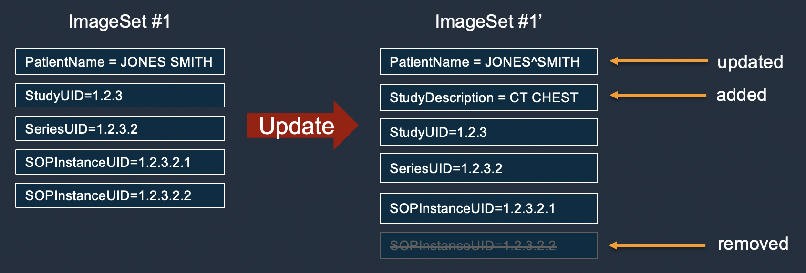

# Updating image set metadata

Use the `UpdateImageSetMetadata` action to update image set [metadata](getting-started-concepts.md#concept-metadata "getting-started-concepts.md#concept-metadata") in AWS HealthImaging. You can use this asynchronous process
to add, update, and remove image set metadata attributes, which are manifestations of [DICOM normalization elements](metadata-normalization.md "metadata-normalization.md") that are created during
import. Using the `UpdateImageSetMetadata` action, you can also remove Series and SOP
Instances to keep image sets in sync with external systems and to de-identify image set
metadata. For more information, see [`UpdateImageSetMetadata`](../APIReference/API_UpdateImageSetMetadata.md "../APIReference/API_UpdateImageSetMetadata.md") in the _AWS HealthImaging API
Reference_.

###### Note

Real-world DICOM imports require updating, adding, and removing attributes from the image
set metadata. Keep the following points in mind when updating image set metadata:

- Updating image set metadata creates a new version in the image set history. For more
  information, see [Listing image set versions](list-image-set-versions.md "list-image-set-versions.md"). To revert to a previous image set version ID,
  use the optional [`revertToVersionId`](../APIReference/API_UpdateImageSetMetadata.md#healthimaging-UpdateImageSetMetadata-request-revertToVersionId "../APIReference/API_UpdateImageSetMetadata.md#healthimaging-UpdateImageSetMetadata-request-revertToVersionId") parameter.
- Updating image set metadata is an asynchronous process. Therefore, [`imageSetState`](../APIReference/API_UpdateImageSetMetadata.md#healthimaging-UpdateImageSetMetadata-response-imageSetState "../APIReference/API_UpdateImageSetMetadata.md#healthimaging-UpdateImageSetMetadata-response-imageSetState") and [`imageSetWorkflowStatus`](../APIReference/API_UpdateImageSetMetadata.md#healthimaging-UpdateImageSetMetadata-response-imageSetWorkflowStatus "../APIReference/API_UpdateImageSetMetadata.md#healthimaging-UpdateImageSetMetadata-response-imageSetWorkflowStatus") response elements are available to provide the respective state and status of an
  image set undergoing update. You cannot perform other write operations on a
  `LOCKED` image set.
- If the `UpdateImageSetMetadata` action is not successful, call and review
  the [`message`](../APIReference/API_UpdateImageSetMetadata.md#healthimaging-UpdateImageSetMetadata-response-message "../APIReference/API_UpdateImageSetMetadata.md#healthimaging-UpdateImageSetMetadata-response-message") response element to see [`common errors`.](../APIReference/CommonErrors.md "../APIReference/CommonErrors.md")
- DICOM element constraints are applied to metadata updates. The [`force`](../APIReference/API_UpdateImageSetMetadata.md#API_UpdateImageSetMetadata_RequestParameters "../APIReference/API_UpdateImageSetMetadata.md#API_UpdateImageSetMetadata_RequestParameters") request parameter allows you to update elements of non-primary [image sets](getting-started-concepts.md#concept-image-set "getting-started-concepts.md#concept-image-set") in cases
  where you want to override [DICOM metadata constraints](dicom-metadata-constraints.md "dicom-metadata-constraints.md").
- The Patient and Series level metadata elements can not be updated for primary [image sets](getting-started-concepts.md#concept-image-set "getting-started-concepts.md#concept-image-set").
  The UpdateImageSet will not support --`force` to update StudyInstanceUID, SeriesInstanceUID, and
  SOPInstanceUID for primary [image sets](getting-started-concepts.md#concept-image-set "getting-started-concepts.md#concept-image-set").
- Set the [`force`](../APIReference/API_UpdateImageSetMetadata.md#API_UpdateImageSetMetadata_RequestParameters "../APIReference/API_UpdateImageSetMetadata.md#API_UpdateImageSetMetadata_RequestParameters") request parameter to force completion of the
  `UpdateImageSetMetadata` action on non-primary [image sets](getting-started-concepts.md#concept-image-set "getting-started-concepts.md#concept-image-set"). Setting this parameter allows the following
  updates to an image set:
  - Updating the `Tag.StudyInstanceUID`,
    `Tag.SeriesInstanceUID`, `Tag.SOPInstanceUID`, and
    `Tag.StudyID` attributes
  - Adding, removing, or updating instance level private DICOM data elements

- The action of promoting an image set to primary will change the image set ID.
  The following diagram represents image set metadata being updated in HealthImaging.



###### To update image set metadata

Choose a tab based on your access preference to AWS HealthImaging.

CLI

**AWS CLI**

**Example 1: To insert or update an attribute in image set metadata**

The following `update-image-set-metadata` example inserts or updates an attribute in image set metadata.

```
`aws medical-imaging update-image-set-metadata \
 --datastore-id `12345678901234567890123456789012` \
 --image-set-id `ea92b0d8838c72a3f25d00d13616f87e` \
 --latest-version-id `1` \
 --cli-binary-format `raw-in-base64-out` \
 --update-image-set-metadata-updates `file://metadata-updates.json``

```

Contents of `metadata-updates.json`

```
{
    "DICOMUpdates": {
        "updatableAttributes": "{\"SchemaVersion\":1.1,\"Patient\":{\"DICOM\":{\"PatientName\":\"MX^MX\"}}}"
    }
}
```

Output:

```
{
    "latestVersionId": "2",
    "imageSetWorkflowStatus": "UPDATING",
    "updatedAt": 1680042257.908,
    "imageSetId": "ea92b0d8838c72a3f25d00d13616f87e",
    "imageSetState": "LOCKED",
    "createdAt": 1680027126.436,
    "datastoreId": "12345678901234567890123456789012"
}
```

**Example 2: To remove an attribute from image set metadata**

The following `update-image-set-metadata` example removes an attribute from image set metadata.

```
`aws medical-imaging update-image-set-metadata \
 --datastore-id `12345678901234567890123456789012` \
 --image-set-id `ea92b0d8838c72a3f25d00d13616f87e` \
 --latest-version-id `1` \
 --cli-binary-format `raw-in-base64-out` \
 --update-image-set-metadata-updates `file://metadata-updates.json``

```

Contents of `metadata-updates.json`

```
{
    "DICOMUpdates": {
        "removableAttributes": "{\"SchemaVersion\":1.1,\"Study\":{\"DICOM\":{\"StudyDescription\":\"CHEST\"}}}"
    }
}
```

Output:

```
{
    "latestVersionId": "2",
    "imageSetWorkflowStatus": "UPDATING",
    "updatedAt": 1680042257.908,
    "imageSetId": "ea92b0d8838c72a3f25d00d13616f87e",
    "imageSetState": "LOCKED",
    "createdAt": 1680027126.436,
    "datastoreId": "12345678901234567890123456789012"
}
```

**Example 3: To remove an instance from image set metadata**

The following `update-image-set-metadata` example removes an instance from image set metadata.

```
`aws medical-imaging update-image-set-metadata \
 --datastore-id `12345678901234567890123456789012` \
 --image-set-id `ea92b0d8838c72a3f25d00d13616f87e` \
 --latest-version-id `1` \
 --cli-binary-format `raw-in-base64-out` \
 --update-image-set-metadata-updates `file://metadata-updates.json``

```

Contents of `metadata-updates.json`

```
{
    "DICOMUpdates": {
        "removableAttributes": "{\"SchemaVersion\": 1.1,\"Study\": {\"Series\": {\"1.1.1.1.1.1.12345.123456789012.123.12345678901234.1\": {\"Instances\": {\"1.1.1.1.1.1.12345.123456789012.123.12345678901234.1\": {}}}}}}"
    }
}
```

Output:

```
{
    "latestVersionId": "2",
    "imageSetWorkflowStatus": "UPDATING",
    "updatedAt": 1680042257.908,
    "imageSetId": "ea92b0d8838c72a3f25d00d13616f87e",
    "imageSetState": "LOCKED",
    "createdAt": 1680027126.436,
    "datastoreId": "12345678901234567890123456789012"
}
```

**Example 4: To revert an image set to a previous version**

The following `update-image-set-metadata` example shows how to revert an image set to a prior version. CopyImageSet and UpdateImageSetMetadata actions create new versions of image sets.

```
`aws medical-imaging update-image-set-metadata \
 --datastore-id `12345678901234567890123456789012` \
 --image-set-id `53d5fdb05ca4d46ac7ca64b06545c66e` \
 --latest-version-id `3` \
 --cli-binary-format `raw-in-base64-out` \
 --update-image-set-metadata-updates '`{"revertToVersionId": "1"}`'`

```

Output:

```
{
    "datastoreId": "12345678901234567890123456789012",
    "imageSetId": "53d5fdb05ca4d46ac7ca64b06545c66e",
    "latestVersionId": "4",
    "imageSetState": "LOCKED",
    "imageSetWorkflowStatus": "UPDATING",
    "createdAt": 1680027126.436,
    "updatedAt": 1680042257.908
}
```

**Example 5: To add a private DICOM data element to an instance**

The following `update-image-set-metadata` example shows how to add a private element to a specified instance within an image set. The DICOM standard permits private data elements for communication of information that cannot be contained in standard data elements. You can create, update, and delete private data elements with the
UpdateImageSetMetadata action.

```
`aws medical-imaging update-image-set-metadata \
 --datastore-id `12345678901234567890123456789012` \
 --image-set-id `53d5fdb05ca4d46ac7ca64b06545c66e` \
 --latest-version-id `1` \
 --cli-binary-format `raw-in-base64-out` \
 --force \
 --update-image-set-metadata-updates `file://metadata-updates.json``

```

Contents of `metadata-updates.json`

```
{
    "DICOMUpdates": {
        "updatableAttributes": "{\"SchemaVersion\": 1.1,\"Study\": {\"Series\": {\"1.1.1.1.1.1.12345.123456789012.123.12345678901234.1\": {\"Instances\": {\"1.1.1.1.1.1.12345.123456789012.123.12345678901234.1\": {\"DICOM\": {\"001910F9\": \"97\"},\"DICOMVRs\": {\"001910F9\": \"DS\"}}}}}}}"
    }
}
```

Output:

```
{
    "latestVersionId": "2",
    "imageSetWorkflowStatus": "UPDATING",
    "updatedAt": 1680042257.908,
    "imageSetId": "53d5fdb05ca4d46ac7ca64b06545c66e",
    "imageSetState": "LOCKED",
    "createdAt": 1680027126.436,
    "datastoreId": "12345678901234567890123456789012"
}
```

**Example 6: To update a private DICOM data element to an instance**

The following `update-image-set-metadata` example shows how to update the value of a private data element belonging to an instance within an image set.

```
`aws medical-imaging update-image-set-metadata \
 --datastore-id `12345678901234567890123456789012` \
 --image-set-id `53d5fdb05ca4d46ac7ca64b06545c66e` \
 --latest-version-id `1` \
 --cli-binary-format `raw-in-base64-out` \
 --force \
 --update-image-set-metadata-updates `file://metadata-updates.json``

```

Contents of `metadata-updates.json`

```
{
    "DICOMUpdates": {
        "updatableAttributes": "{\"SchemaVersion\": 1.1,\"Study\": {\"Series\": {\"1.1.1.1.1.1.12345.123456789012.123.12345678901234.1\": {\"Instances\": {\"1.1.1.1.1.1.12345.123456789012.123.12345678901234.1\": {\"DICOM\": {\"00091001\": \"GE_GENESIS_DD\"}}}}}}}"
    }
}
```

Output:

```
{
    "latestVersionId": "2",
    "imageSetWorkflowStatus": "UPDATING",
    "updatedAt": 1680042257.908,
    "imageSetId": "53d5fdb05ca4d46ac7ca64b06545c66e",
    "imageSetState": "LOCKED",
    "createdAt": 1680027126.436,
    "datastoreId": "12345678901234567890123456789012"
}
```

**Example 7: To update a SOPInstanceUID with the force parameter**

The following `update-image-set-metadata` example shows how to update a SOPInstanceUID, using the force parameter to override the DICOM metadata constraints.

```
`aws medical-imaging update-image-set-metadata \
 --datastore-id `12345678901234567890123456789012` \
 --image-set-id `53d5fdb05ca4d46ac7ca64b06545c66e` \
 --latest-version-id `1` \
 --cli-binary-format `raw-in-base64-out` \
 --force \
 --update-image-set-metadata-updates `file://metadata-updates.json``

```

Contents of `metadata-updates.json`

```
{
    "DICOMUpdates": {
        "updatableAttributes": "{\"SchemaVersion\":1.1,\"Study\":{\"Series\":{\"1.3.6.1.4.1.5962.99.1.3633258862.2104868982.1369432891697.3656.0\":{\"Instances\":{\"1.3.6.1.4.1.5962.99.1.3633258862.2104868982.1369432891697.3659.0\":{\"DICOM\":{\"SOPInstanceUID\":\"1.3.6.1.4.1.5962.99.1.3633258862.2104868982.1369432891697.3659.9\"}}}}}}}"
    }
}
```

Output:

```
{
    "latestVersionId": "2",
    "imageSetWorkflowStatus": "UPDATING",
    "updatedAt": 1680042257.908,
    "imageSetId": "53d5fdb05ca4d46ac7ca64b06545c66e",
    "imageSetState": "LOCKED",
    "createdAt": 1680027126.436,
    "datastoreId": "12345678901234567890123456789012"
}
```

- For API details, see
  [UpdateImageSetMetadata](https://awscli.amazonaws.com/v2/documentation/api/latest/reference/medical-imaging/update-image-set-metadata.html "https://awscli.amazonaws.com/v2/documentation/api/latest/reference/medical-imaging/update-image-set-metadata.html")
  in _AWS CLI Command Reference_.

Java

**SDK for Java 2.x**

```

    /**
     * Update the metadata of an AWS HealthImaging image set.
     *
     * @param medicalImagingClient - The AWS HealthImaging client object.
     * @param datastoreId          - The datastore ID.
     * @param imageSetId           - The image set ID.
     * @param versionId            - The version ID.
     * @param metadataUpdates      - A MetadataUpdates object containing the updates.
     * @param force                - The force flag.
     * @throws MedicalImagingException - Base exception for all service exceptions thrown by AWS HealthImaging.
     */
    public static void updateMedicalImageSetMetadata(MedicalImagingClient medicalImagingClient,
                                                     String datastoreId,
                                                     String imageSetId,
                                                     String versionId,
                                                     MetadataUpdates metadataUpdates,
                                                     boolean force) {
        try {
            UpdateImageSetMetadataRequest updateImageSetMetadataRequest = UpdateImageSetMetadataRequest
                    .builder()
                    .datastoreId(datastoreId)
                    .imageSetId(imageSetId)
                    .latestVersionId(versionId)
                    .updateImageSetMetadataUpdates(metadataUpdates)
                    .force(force)
                    .build();

            UpdateImageSetMetadataResponse response = medicalImagingClient.updateImageSetMetadata(updateImageSetMetadataRequest);

            System.out.println("The image set metadata was updated" + response);
        } catch (MedicalImagingException e) {
            System.err.println(e.awsErrorDetails().errorMessage());
            throw e;
        }
    }


```

Use case #1: Insert or update an attribute.

```
                final String insertAttributes = """
                        {
                          "SchemaVersion": 1.1,
                          "Study": {
                            "DICOM": {
                              "StudyDescription": "CT CHEST"
                            }
                          }
                        }
                        """;
                MetadataUpdates metadataInsertUpdates = MetadataUpdates.builder()
                        .dicomUpdates(DICOMUpdates.builder()
                                .updatableAttributes(SdkBytes.fromByteBuffer(
                                        ByteBuffer.wrap(insertAttributes
                                                .getBytes(StandardCharsets.UTF_8))))
                                .build())
                        .build();

                updateMedicalImageSetMetadata(medicalImagingClient, datastoreId, imagesetId,
                        versionid, metadataInsertUpdates, force);


```

Use case #2: Remove an attribute.

```
                final String removeAttributes = """
                        {
                          "SchemaVersion": 1.1,
                          "Study": {
                            "DICOM": {
                              "StudyDescription": "CT CHEST"
                            }
                          }
                        }
                        """;
                MetadataUpdates metadataRemoveUpdates = MetadataUpdates.builder()
                        .dicomUpdates(DICOMUpdates.builder()
                                .removableAttributes(SdkBytes.fromByteBuffer(
                                        ByteBuffer.wrap(removeAttributes
                                                .getBytes(StandardCharsets.UTF_8))))
                                .build())
                        .build();

                updateMedicalImageSetMetadata(medicalImagingClient, datastoreId, imagesetId,
                        versionid, metadataRemoveUpdates, force);


```

Use case #3: Remove an instance.

```
                final String removeInstance = """
                        {
                          "SchemaVersion": 1.1,
                          "Study": {
                            "Series": {
                              "1.1.1.1.1.1.12345.123456789012.123.12345678901234.1": {
                                "Instances": {
                                  "1.1.1.1.1.1.12345.123456789012.123.12345678901234.1": {}
                                }
                              }
                            }
                          }
                        }
                        """;
                MetadataUpdates metadataRemoveUpdates = MetadataUpdates.builder()
                        .dicomUpdates(DICOMUpdates.builder()
                                .removableAttributes(SdkBytes.fromByteBuffer(
                                        ByteBuffer.wrap(removeInstance
                                                .getBytes(StandardCharsets.UTF_8))))
                                .build())
                        .build();

                updateMedicalImageSetMetadata(medicalImagingClient, datastoreId, imagesetId,
                        versionid, metadataRemoveUpdates, force);


```

Use case #4: Revert to a previous version.

```
                // In this case, revert to previous version.
                String revertVersionId = Integer.toString(Integer.parseInt(versionid) - 1);
                MetadataUpdates metadataRemoveUpdates = MetadataUpdates.builder()
                        .revertToVersionId(revertVersionId)
                        .build();
                updateMedicalImageSetMetadata(medicalImagingClient, datastoreId, imagesetId,
                        versionid, metadataRemoveUpdates, force);


```

- For API details, see
  [UpdateImageSetMetadata](../../../goto/SdkForJavaV2/medical-imaging-2023-07-19/UpdateImageSetMetadata.md "../../../goto/SdkForJavaV2/medical-imaging-2023-07-19/UpdateImageSetMetadata.md")
  in _AWS SDK for Java 2.x API Reference_.

###### Note

There's more on GitHub. Find the complete example and learn how to set up and run in the
[AWS Code
Examples Repository](https://github.com/awsdocs/aws-doc-sdk-examples/tree/main/javav2/example_code/medicalimaging#code-examples "https://github.com/awsdocs/aws-doc-sdk-examples/tree/main/javav2/example_code/medicalimaging#code-examples").

JavaScript

**SDK for JavaScript (v3)**

```
import { UpdateImageSetMetadataCommand } from "@aws-sdk/client-medical-imaging";
import { medicalImagingClient } from "../libs/medicalImagingClient.js";

/**
 * @param {string} datastoreId - The ID of the HealthImaging data store.
 * @param {string} imageSetId - The ID of the HealthImaging image set.
 * @param {string} latestVersionId - The ID of the HealthImaging image set version.
 * @param {{}} updateMetadata - The metadata to update.
 * @param {boolean} force - Force the update.
 */
export const updateImageSetMetadata = async (
  datastoreId = "xxxxxxxxxx",
  imageSetId = "xxxxxxxxxx",
  latestVersionId = "1",
  updateMetadata = "{}",
  force = false,
) => {
  try {
    const response = await medicalImagingClient.send(
      new UpdateImageSetMetadataCommand({
        datastoreId: datastoreId,
        imageSetId: imageSetId,
        latestVersionId: latestVersionId,
        updateImageSetMetadataUpdates: updateMetadata,
        force: force,
      }),
    );
    console.log(response);
    // {
    //     '$metadata': {
    //     httpStatusCode: 200,
    //         requestId: '7966e869-e311-4bff-92ec-56a61d3003ea',
    //         extendedRequestId: undefined,
    //         cfId: undefined,
    //         attempts: 1,
    //         totalRetryDelay: 0
    // },
    //     createdAt: 2023-09-22T14:49:26.427Z,
    //     datastoreId: 'xxxxxxxxxxxxxxxxxxxxxxxxxxxxxxx',
    //     imageSetId: 'xxxxxxxxxxxxxxxxxxxxxxxxxxxxxxx',
    //     imageSetState: 'LOCKED',
    //     imageSetWorkflowStatus: 'UPDATING',
    //     latestVersionId: '4',
    //     updatedAt: 2023-09-27T19:41:43.494Z
    // }
    return response;
  } catch (err) {
    console.error(err);
  }
};


```

Use case #1: Insert or update an attribute and force the update.

```
    const insertAttributes = JSON.stringify({
      SchemaVersion: 1.1,
      Study: {
        DICOM: {
          StudyDescription: "CT CHEST",
        },
      },
    });

    const updateMetadata = {
      DICOMUpdates: {
        updatableAttributes: new TextEncoder().encode(insertAttributes),
      },
    };

    await updateImageSetMetadata(
      datastoreID,
      imageSetID,
      versionID,
      updateMetadata,
      true,
    );


```

Use case #2: Remove an attribute.

```
    // Attribute key and value must match the existing attribute.
    const remove_attribute = JSON.stringify({
      SchemaVersion: 1.1,
      Study: {
        DICOM: {
          StudyDescription: "CT CHEST",
        },
      },
    });

    const updateMetadata = {
      DICOMUpdates: {
        removableAttributes: new TextEncoder().encode(remove_attribute),
      },
    };

    await updateImageSetMetadata(
      datastoreID,
      imageSetID,
      versionID,
      updateMetadata,
    );


```

Use case #3: Remove an instance.

```
    const remove_instance = JSON.stringify({
      SchemaVersion: 1.1,
      Study: {
        Series: {
          "1.1.1.1.1.1.12345.123456789012.123.12345678901234.1": {
            Instances: {
              "1.1.1.1.1.1.12345.123456789012.123.12345678901234.1": {},
            },
          },
        },
      },
    });

    const updateMetadata = {
      DICOMUpdates: {
        removableAttributes: new TextEncoder().encode(remove_instance),
      },
    };

    await updateImageSetMetadata(
      datastoreID,
      imageSetID,
      versionID,
      updateMetadata,
    );


```

Use case #4: Revert to an earlier version.

```
    const updateMetadata = {
      revertToVersionId: "1",
    };

    await updateImageSetMetadata(
      datastoreID,
      imageSetID,
      versionID,
      updateMetadata,
    );


```

- For API details, see
  [UpdateImageSetMetadata](../../../AWSJavaScriptSDK/v3/latest/client/medical-imaging/command/UpdateImageSetMetadataCommand.md "../../../AWSJavaScriptSDK/v3/latest/client/medical-imaging/command/UpdateImageSetMetadataCommand.md")
  in _AWS SDK for JavaScript API Reference_.

###### Note

There's more on GitHub. Find the complete example and learn how to set up and run in the
[AWS Code
Examples Repository](https://github.com/awsdocs/aws-doc-sdk-examples/tree/main/javascriptv3/example_code/medical-imaging#code-examples "https://github.com/awsdocs/aws-doc-sdk-examples/tree/main/javascriptv3/example_code/medical-imaging#code-examples").

Python

**SDK for Python (Boto3)**

```
class MedicalImagingWrapper:
    def __init__(self, health_imaging_client):
        self.health_imaging_client = health_imaging_client


    def update_image_set_metadata(
        self, datastore_id, image_set_id, version_id, metadata, force=False
    ):
        """
        Update the metadata of an image set.

        :param datastore_id: The ID of the data store.
        :param image_set_id: The ID of the image set.
        :param version_id: The ID of the image set version.
        :param metadata: The image set metadata as a dictionary.
            For example {"DICOMUpdates": {"updatableAttributes":
            "{\"SchemaVersion\":1.1,\"Patient\":{\"DICOM\":{\"PatientName\":\"Garcia^Gloria\"}}}"}}
        :param: force: Force the update.
        :return: The updated image set metadata.
        """
        try:
            updated_metadata = self.health_imaging_client.update_image_set_metadata(
                imageSetId=image_set_id,
                datastoreId=datastore_id,
                latestVersionId=version_id,
                updateImageSetMetadataUpdates=metadata,
                force=force,
            )
        except ClientError as err:
            logger.error(
                "Couldn't update image set metadata. Here's why: %s: %s",
                err.response["Error"]["Code"],
                err.response["Error"]["Message"],
            )
            raise
        else:
            return updated_metadata


```

The following code instantiates the MedicalImagingWrapper object.

```
    client = boto3.client("medical-imaging")
    medical_imaging_wrapper = MedicalImagingWrapper(client)


```

Use case #1: Insert or update an attribute.

```
            attributes = """{
                    "SchemaVersion": 1.1,
                    "Study": {
                        "DICOM": {
                            "StudyDescription": "CT CHEST"
                        }
                    }
                }"""
            metadata = {"DICOMUpdates": {"updatableAttributes": attributes}}

            self.update_image_set_metadata(
                data_store_id, image_set_id, version_id, metadata, force
            )


```

Use case #2: Remove an attribute.

```
            # Attribute key and value must match the existing attribute.
            attributes = """{
                    "SchemaVersion": 1.1,
                    "Study": {
                        "DICOM": {
                            "StudyDescription": "CT CHEST"
                        }
                    }
                }"""
            metadata = {"DICOMUpdates": {"removableAttributes": attributes}}

            self.update_image_set_metadata(
                data_store_id, image_set_id, version_id, metadata, force
            )


```

Use case #3: Remove an instance.

```
            attributes = """{
                    "SchemaVersion": 1.1,
                    "Study": {
                        "Series": {
                            "1.1.1.1.1.1.12345.123456789012.123.12345678901234.1": {
                                "Instances": {
                                    "1.1.1.1.1.1.12345.123456789012.123.12345678901234.1": {}
                                }
                            }
                        }
                    }
                }"""
            metadata = {"DICOMUpdates": {"removableAttributes": attributes}}

            self.update_image_set_metadata(
                data_store_id, image_set_id, version_id, metadata, force
            )


```

Use case #4: Revert to an earlier version.

```
            metadata = {"revertToVersionId": "1"}

            self.update_image_set_metadata(
                data_store_id, image_set_id, version_id, metadata, force
            )


```

- For API details, see
  [UpdateImageSetMetadata](../../../goto/boto3/medical-imaging-2023-07-19/UpdateImageSetMetadata.md "../../../goto/boto3/medical-imaging-2023-07-19/UpdateImageSetMetadata.md")
  in _AWS SDK for Python (Boto3) API Reference_.

###### Note

There's more on GitHub. Find the complete example and learn how to set up and run in the
[AWS Code
Examples Repository](https://github.com/awsdocs/aws-doc-sdk-examples/tree/main/python/example_code/medical-imaging#code-examples "https://github.com/awsdocs/aws-doc-sdk-examples/tree/main/python/example_code/medical-imaging#code-examples").

###### Example availability

Can't find what you need? Request a code example using the **Provide
feedback** link on the right sidebar of this page.

You can move SOP Instances between image sets, resolve metadata element conflicts, and
add or remove instances from the primary image sets using the `CopyImageSet`, `UpdateImageSetMetadata`,
and `DeleteImageSet` APIs.

You can remove an image set from the primary collection with the `DeleteImageSet` action.

## To update the metadata of a primary image set

1. Use the CopyImageSet action to create a non-primary image set that is a copy of the primary image set you want to modify. Let's say this returns `103785414bc2c89330f7ce51bbd13f7a` as the non-primary image set ID.

```

          aws medical-imaging copy-image-set --datastore-id
          a8d19e7875e1532d9b5652f6b25e12c9 --source-image-set-id
          0778b83b36eced0b76752bfe32192fb7 --copy-image-set-information
          '{"sourceImageSet": {"latestVersionId": "1" }}' --region us-west-2

```

2. Use the UpdateImageSetMetadata action to make changes on the non-primary image set `(103785414bc2c89330f7ce51bbd13f7a)`. For example, changing the PatientID.

```
aws medical-imaging update-image-set-metadata \
    --region us-west-2 \
    --datastore-id a8d19e7875e1532d9b5652f6b25e12c9 \
    --image-set-id 103785414bc2c89330f7ce51bbd13f7a \
    --latest-version-id 1 \
    --cli-binary-format raw-in-base64-out \
    --update-image-set-metadata-updates '{
    "DICOMUpdates": {
      "updatableAttributes": "{\"SchemaVersion\":1.1,\"Patient\":
      {\"DICOM\":{\"PatientID\":\"1234\"}}}"
    }
  }'
```

3. Delete the primary image set that you are modifying.

```
aws medical-imaging delete-image-set --datastore-
          id a8d19e7875e1532d9b5652f6b25e12c9 --image-set-
          id 0778b83b36eced0b76752bfe32192fb7
```

4. Use the CopyImageSet action with the argument `--promoteToPrimary` to add the updated image set to the primary collection.

```
aws medical-imaging copy-image-set --datastore-
          id a8d19e7875e1532d9b5652f6b25e12c9 --source-image-set-
          id 103785414bc2c89330f7ce51bbd13f7a --copy-image-set-information
          '{"sourceImageSet": {"latestVersionId": "2" }}' --region us-west-2 --
          promote-to-primary
```

5. Delete the non-primary image set.

```
aws medical-imaging delete-image-set --datastore-
          id a8d19e7875e1532d9b5652f6b25e12c9 --image-set-
          id 103785414bc2c89330f7ce51bbd13f7a
```

## To make a non-primary image set primary

1. Use the UpdateImageSetMetadata action to resolve conflicts with existing Primary image sets.

```
aws medical-imaging update-image-set-metadata \
    --region us-west-2 \
    --datastore-id a8d19e7875e1532d9b5652f6b25e12c9 \
    --image-set-id 103785414bc2c89330f7ce51bbd13f7a \
    --latest-version-id 1 \
    --cli-binary-format raw-in-base64-out \
    --update-image-set-metadata-updates '{
    "DICOMUpdates": {
      "updatableAttributes": "{\"SchemaVersion\":1.1,\"Patient\":{\"DICOM\":
      {\"PatientID\":\"1234\"}}}"
    }
  }'
```

2. When the conflicts are resolved, use the CopyImageSet action with the argument `--promoteToPrimary` to add the image set to the primary image set collection.

```
aws medical-imaging copy-image-set --datastore-
          id a8d19e7875e1532d9b5652f6b25e12c9 --source-image-set-
          id 103785414bc2c89330f7ce51bbd13f7a --copy-image-set-information
          '{"sourceImageSet": {"latestVersionId": "2" }}' --region us-west-2 --
          promote-to-primary
```

3. After confirming that the CopyImageSet action was successful, delete the source non-primary image set.

```
aws medical-imaging delete-image-set --datastore-
          id a8d19e7875e1532d9b5652f6b25e12c9 --image-set-
          id 103785414bc2c89330f7ce51bbd13f7a
```
