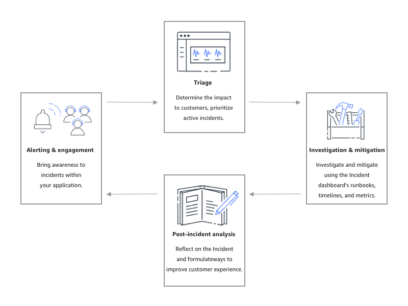

AWS Systems Manager Incident Manager will no longer be open to new customers starting November 7, 2025. If you would like to use Incident Manager,
sign up prior to that date. Existing customers can continue to use the service as normal. For more information, see
[AWS Systems Manager Incident Manager availability change](incident-manager-availability-change.md "incident-manager-availability-change.md").

# Incident lifecycle in Incident Manager

AWS Systems Manager Incident Manager provides a step-by-step framework based on best practices to identify and
react to incidents, such as service outages or security threats. The primary focus of
Incident Manager is to help restore affected services or applications to normal as quickly as
possible through a complete incident lifecycle management solution.

As depicted in the following illustration, Incident Manager provides tools and best practices
for every phase of the incident lifecycle:

- [Alerting and engagement](#alerting-engagement "#alerting-engagement")
- [Triage](#triage "#triage")
- [Investigation and mitigation](#investigation-mitigation "#investigation-mitigation")
- [Post-incident analysis](#lifecycle-post-incident-analysis "#lifecycle-post-incident-analysis")

## Alerting and engagement

The alerting and engagement phase of the incident lifecycle focuses on bringing
awareness to incidents within your applications and services. This phase begins before
an incident is ever detected and requires a deep understanding of your applications. You
can use [Amazon CloudWatch
metrics](../../../AmazonCloudWatch/latest/monitoring/working_with_metrics.md "../../../AmazonCloudWatch/latest/monitoring/working_with_metrics.md") to monitor data about the performance of your applications, or use
[Amazon EventBridge](../../../eventbridge/latest/userguide.md "../../../eventbridge/latest/userguide.md") to
aggregate alerts from different sources, applications and services. After you've set up
monitoring for your applications, you can begin alerting on metrics that stray outside
the historical norm. To learn more about monitoring best practices, see [Monitoring](incident-response.md#incident-response-monitoring "incident-response.md#incident-response-monitoring").

To support responders' incident diagnosis, you can enable the Findings feature in
Incident Manager. Findings are information about AWS CodeDeploy deployments and AWS CloudFormation stack
updates that occurred around the time of an incident. Having this information reduces
the time needed to evaluate potential causes, which can reduce the mean time to recover
(MTTR) from an incident.

Now that you are monitoring for incidents in your applications, you can define an
incident _response plan_ to use during an incident. To learn more
about creating response plans, see [Creating and configuring response plans in
Incident Manager](response-plans.md "response-plans.md"). Amazon EventBridge events or CloudWatch Alarms can automatically
create an incident using with response plans as the template. To learn more about
incident creation, see [Creating incidents automatically or manually in
Incident Manager](incident-creation.md "incident-creation.md").

Response plans launch related _escalation plans_ and
_engagement plans_ to bring first responders into the incident.
For more information about setting up escalation plans, see [Create an escalation plan](escalation.md#escalation-create "escalation.md#escalation-create"). Simultaneously,
Amazon Q Developer in chat applications notifies responders using a _chat channel_ directing them
to the incident detail page. Using the chat channel and _incident
details_, the team can communicate and triage an incident. For more
information about setting up chat channels in Incident Manager, see [Task 2: Create a chat channel in Amazon Q Developer in chat applications](chat.md#chat-create "chat.md#chat-create").

## Triage

Triage is when first responders attempt to determine the impact to customers. The
incident details view in the Incident Manager console provides the responders with timelines
and metrics to help them assess the incident. Assessing the impact of an incident also
lays the groundwork for response time, resolution, and communication for the incident.
Responders prioritize incidents by using impact ratings from 1 (Critical) to 5 (No
Impact).

Your organization can define the exact scope of each impact rating however you choose.
The following table provides examples of how each impact level might typically be
defined.

| Impact code | Impact name | Sample defined scope                                                             |
| ----------- | ----------- | -------------------------------------------------------------------------------- | ------------------------------------------------------------------------------------------------------------------------------------------------------------------------------------------------------------------------------------------------------------------------------------------------------------------------------------------------------------------------------------------------------------------------------------------------------------------------------------------------------------------------------------------------------------------------------------------------------------------------------------------------------------------------------------------------------------------------------------------------------------------------------------------------------------------------------------------------------------------------------------------------------------------------------------------------------------------------------------------------------------------------------------------------------------------------------------------------------------------------------------------------------------------------------------------------------------------------------------------------------------------------------------------------------------------------------------------------------------------------------------------------------------------------------------------------------------------------------------------------------------------------------------------------------------------------------------------------------------------------------------------------------------------------------------------------------------------------------------------------------------------------------------------------------------------------------------------------------------------------------------------------------------------------------------------------------------------------------------------------------------------------------------------------------------------------------------------------------------------------------------------------------------------------------------------------------------------------------------------------------------------------------------------------------------------------------------------------------------------------------------------------------------------------------------------------------------------------------------------------------------------------------------------------------------------------------------------------------------------------------------------------------------------------------------------------------------------------------------------------------------------------------------------------------------------------------------------------------------------------------------------------------------------------------------------------------------------------------------------------------------------------------------------------------------------------------------------------------------------------------------------------------------------------------------------------------------------------------------------------------------------------------------------------------------------------------------------------------------------------------------------------------------------------------------------------------------------------------------------------------------------------------------------------------------------------------------------- |
| `1`         | `Critical`  | Full application failure that impacts most customers.                            |
| `2`         | `High`      | Full application failure that impacts a subset of customers.                     |
| `3`         | `Medium`    | Partial application failure that is customer-impacting.                          |
| `4`         | `Low`       | Intermittent failures that have limited impact on customers.                     |
| `5`         | `No Impact` | Customers aren't currently impacted but urgent action is needed to avoid impact. | ## Investigation and mitigation The _incident_ details view provides your team with runbooks, timelines, and metrics. To see how you can work with an incident, see the [Viewing incident details in the console](tracking.md#tracking-details "tracking.md#tracking-details"). _Runbooks_ commonly provide investigation steps and can automatically pull data or attempt commonly used solutions. Runbooks also provide clear, repeatable steps that your team has found to be useful in mitigating incidents. The runbook tab focuses on the current runbook step and shows past and future steps. Incident Manager integrates with Systems Manager Automation to build runbooks. Use runbooks to do any of the following:  • Manage instances and AWS resources  • Automatically run scripts  • Manage AWS CloudFormation resources For more information about the supported action types, see [Systems Manager Automation actions reference](../../../systems-manager/latest/userguide/automation-actions.md "../../../systems-manager/latest/userguide/automation-actions.md") in the _AWS Systems Manager User Guide_. The **Timeline** tab shows what actions have been taken. The timeline records each with a timestamp and automatically created details. To add custom events to the timeline, see the [Timeline](tracking.md#tracking-details-timeline "tracking.md#tracking-details-timeline") section in the _Incident details_ page of this user guide. The **Diagnosis** tab shows automatically populated metrics and manually added metrics. This view provides valuable information into the activities of your application during an incident. The **Engagements** tab allows you to add additional contacts to the incident and helps provide the resources for the engaged contact to get up to speed quickly once involved in the incident. Contacts are engaged through defined escalation plans or personal engagement plans. Using a _chat channel_, you can directly interact with your incident and other responders on your team. Using Amazon Q Developer in chat applications, you can configure chat channels in. Slack, Microsoft Teams, and Amazon Chime. In Slack and Microsoft Teams channels, responders can interact with incidents directly from the chat channel using a number of `ssm-incidents` commands. For more information, see [Interacting through the chat channel](chat.md#chat-interact "chat.md#chat-interact"). ## Post-incident analysis Incident Manager provides a framework for reflecting on an incident, taking steps needed to prevent the incident from occurring again in the future, and to improve incident response activities overall. Improvements can include:  • Changes to the applications involved in an incident. Your team can use this time to improve the system and make it more fault tolerant.  • Changes to an incident response plan. Take the time to incorporate learned lessons.  • Changes to runbooks. Your team can dive deep into steps needed for resolution and the steps that you can automate.  • Changes to alerting. After an incident, your team might have noticed critical points in the metrics you can use to alert the team sooner about an incident. Incident Manager facilitates these potential improvements by using a set of post-incident analysis questions and action items alongside the incident timeline. To learn more about improvement through analysis, see [Performing a post-incident analysis in Incident Manager](analysis.md "analysis.md"). |
