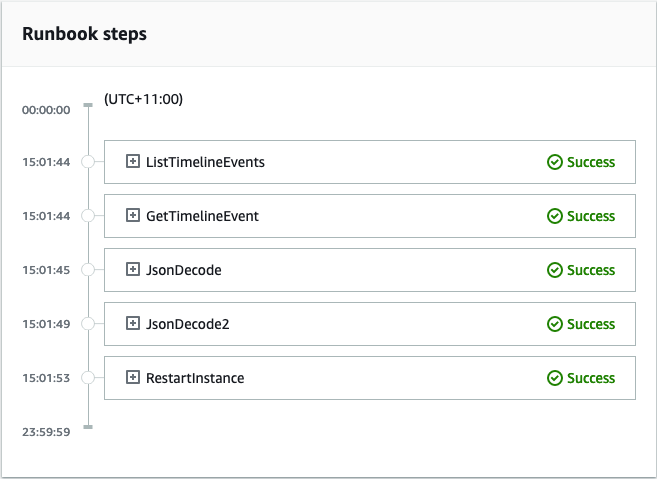

AWS Systems Manager Incident Manager will no longer be open to new customers starting November 7, 2025. If you would like to use Incident Manager,
sign up prior to that date. Existing customers can continue to use the service as normal. For more information, see
[AWS Systems Manager Incident Manager availability change](incident-manager-availability-change.md "incident-manager-availability-change.md").

# Tutorial: Using Systems Manager Automation runbooks with

Incident Manager

You can use [AWS Systems Manager
Automation](../../../systems-manager/latest/userguide/systems-manager-automation.md "../../../systems-manager/latest/userguide/systems-manager-automation.md") runbooks to simplify common maintenance, deployment, and
remediation tasks for AWS services. In this tutorial, you'll create a custom runbook
to automate an incident response in Incident Manager. The scenario for this tutorial involves
an Amazon CloudWatch alarm assigned to an Amazon EC2 metric. When the instance enters a state that
triggers the alarm, Incident Manager automatically performs the following tasks:

1. Creates an incident in Incident Manager.
2. Initiates a runbook that attempts to remediate the issue.
3. Publishes the runbook results to the incident details page in
   Incident Manager.
   The process described in this tutorial can also be used with Amazon EventBridge events and other
   types of AWS resources. By automating your remediation response to alarms and events
   you can reduce the impact of an incident on your organization and its resources.

This tutorial describes how to edit a CloudWatch alarm assigned to an Amazon EC2 instance for an
Incident Manager response plan. If you don't have an alarm, an instance, or a response plan
configured, we recommend you configure those resources before you begin. For more
information, see the following topics:

- [Using
  Amazon CloudWatch alarms](../../../AmazonCloudWatch/latest/monitoring/AlarmThatSendsEmail.md "../../../AmazonCloudWatch/latest/monitoring/AlarmThatSendsEmail.md") in the _Amazon CloudWatch User Guide_
- [Amazon EC2 instances](../../../AWSEC2/latest/WindowsGuide/Instances.md "../../../AWSEC2/latest/WindowsGuide/Instances.md") in the
  _Amazon EC2 User Guide_
- [Amazon EC2
  instances](../../../AWSEC2/latest/UserGuide/Instances.md "../../../AWSEC2/latest/UserGuide/Instances.md") in the _Amazon EC2 User Guide_
- [Creating and configuring response plans in
  Incident Manager](response-plans.md "response-plans.md")

###### Important

You will incur costs by creating AWS resources and using runbook automation
steps. For more information, see [AWS
pricing](https://aws.amazon.com/pricing "https://aws.amazon.com/pricing").

###### Topics

- [Task 1: Creating the runbook](#tutorials-runbook-create "#tutorials-runbook-create")
- [Task 2: Creating an IAM role](#tutorials-runbook-IAM-role "#tutorials-runbook-IAM-role")
- [Task 3: Connecting the runbook to
  your response plan](#tutorials-runbook-response-plan "#tutorials-runbook-response-plan")
- [Task 4: Assigning a CloudWatch alarm to your
  response plan](#tutorials-runbook-alarm "#tutorials-runbook-alarm")
- [Task 5: Verifying the results](#tutorials-runbook-verify "#tutorials-runbook-verify")

## Task 1: Creating the runbook

Use the following procedure to create a runbook in the Systems Manager console. When invoked
from an Incident Manager incident, the runbook restarts an Amazon EC2 instance and updates the
incident with information about the runbook execution. Before you begin, verify that
you have permission to create a runbook. For more information, see [Setting up
Automation](../../../systems-manager/latest/userguide/automation-setup.md "../../../systems-manager/latest/userguide/automation-setup.md") in the _AWS Systems Manager User Guide_.

###### Important

Review the following important details about creating this tutorial's
runbook:

- The runbook is intended for an incident created from a CloudWatch alarm
  source. If you use this runbook for other types of incidents, for
  example manually created incidents, then the timeline event in the first
  runbook step won't be found and the system returns an error.
- The runbook requires the CloudWatch alarm include a dimension called
  `InstanceId`. Alarms for Amazon EC2 instance metrics have this
  dimension. If you use this runbook with other metrics (or with other
  incident sources, such as EventBridge), then you have to change the
  `JsonDecode2` step to match the data captured in your
  scenario.
- The runbook attempts to remediate the issue that triggered the alarm
  by restarting the Amazon EC2 instance. For a real incident, you might not
  want to restart the instance. Update the runbook with the specific
  remediation actions that you want the system to take.

For more information about creating runbooks, see [Working with
runbooks](../../../systems-manager/latest/userguide/automation-documents.md "../../../systems-manager/latest/userguide/automation-documents.md") in the _AWS Systems Manager User Guide_.

###### To create a runbook

1. Open the AWS Systems Manager console at [https://console.aws.amazon.com/systems-manager/](https://console.aws.amazon.com/systems-manager/ "https://console.aws.amazon.com/systems-manager/").
2. In the navigation pane, choose **Documents**.
3. Choose **Automation**.
4. For **Name**, enter a descriptive name for the runbook,
   such as `IncidentResponseRunbook`.
5. Choose the **Editor** tab, and then choose
   **Edit**.
6. Paste the following content into the editor:

```
description: This runbook attempts to restart an Amazon EC2 instance that caused an incident.
schemaVersion: '0.3'
parameters:
  IncidentRecordArn:
    type: String
    description: The incident
mainSteps:
  - name: ListTimelineEvents
    action: 'aws:executeAwsApi'
    outputs:
      - Selector: '$.eventSummaries[0].eventId'
        Name: eventId
        Type: String
    inputs:
      Service: ssm-incidents
      Api: ListTimelineEvents
      incidentRecordArn: '{{IncidentRecordArn}}'
      filters:
        - key: eventType
          condition:
            equals:
              stringValues:
                - SSM Incident Trigger
    description: This step retrieves the ID of the first timeline event with the CloudWatch alarm details.
  - name: GetTimelineEvent
    action: 'aws:executeAwsApi'
    inputs:
      Service: ssm-incidents
      Api: GetTimelineEvent
      incidentRecordArn: '{{IncidentRecordArn}}'
      eventId: '{{ListTimelineEvents.eventId}}'
    outputs:
      - Name: eventData
        Selector: $.event.eventData
        Type: String
    description: This step retrieves the timeline event itself.
  - name: JsonDecode
    action: 'aws:executeScript'
    inputs:
      Runtime: python3.8
      Handler: script_handler
      Script: |-
        import json

        def script_handler(events, context):
          data = json.loads(events["eventData"])
          return data
      InputPayload:
        eventData: '{{GetTimelineEvent.eventData}}'
    outputs:
      - Name: rawData
        Selector: $.Payload.rawData
        Type: String
    description: This step parses the timeline event data.
  - name: JsonDecode2
    action: 'aws:executeScript'
    inputs:
      Runtime: python3.8
      Handler: script_handler
      Script: |-
        import json

        def script_handler(events, context):
          data = json.loads(events["rawData"])
          return data
      InputPayload:
        rawData: '{{JsonDecode.rawData}}'
    outputs:
      - Name: InstanceId
        Selector: '$.Payload.detail.configuration.metrics[0].metricStat.metric.dimensions.InstanceId'
        Type: String
    description: This step parses the CloudWatch event data.
  - name: RestartInstance
    action: 'aws:executeAutomation'
    inputs:
      DocumentName: AWS-RestartEC2Instance
      DocumentVersion: $DEFAULT
      RuntimeParameters:
        InstanceId: '{{JsonDecode2.InstanceId}}'
    description: This step restarts the Amazon EC2 instance
```

7. Choose **Create automation**.

## Task 2: Creating an IAM role

Use the following tutorial to create an AWS Identity and Access Management (IAM) role that gives
Incident Manager permission to intitiate a runbook specified in a response plan. The
runbook in this tutorial restarts an Amazon EC2 instance. You will specify this IAM
role in the next task when you connect the runbook to your response plan.

###### Create an IAM role that intitiates a runbook from a response plan

1. Open the IAM console at
   [https://console.aws.amazon.com/iam/](https://console.aws.amazon.com/iam/ "https://console.aws.amazon.com/iam/").
2. In the navigation pane, choose **Roles**, and then choose
   **Create role**.
3. Under **Trusted entity type**, verify that
   **AWS service** is selected.
4. Under **Use case**, in the **Use cases for other
   AWS services** field, enter
   `Incident Manager`.
5. Choose **Incident Manager**, and then choose
   **Next**.
6. On the **Add permissions** page, choose **Create
   policy**. The permissions editor will open in a new browser
   window or tab.
7. In the editor, choose the **JSON** tab.
8. Copy and paste the following permission policy into the JSON editor.
   Replace `account_ID` with your AWS account
   ID.

JSON

```
`{
 "Version":"2012-10-17",
 "Statement": [
 {
 "Effect": "Allow",
 "Resource": [
 "arn:aws:ssm:*:`111122223333`:automation-definition/IncidentResponseRunbook:*",
 "arn:aws:ssm:*::automation-definition/AWS-RestartEC2Instance:*"
 ],
 "Action": "ssm:StartAutomationExecution"
 },
 {
 "Effect": "Allow",
 "Resource": "arn:aws:ssm:*:*:automation-execution/*",
 "Action": "ssm:GetAutomationExecution"
 },
 {
 "Effect": "Allow",
 "Resource": "arn:aws:ssm-incidents:*:*:*",
 "Action": "ssm-incidents:*"
 },
 {
 "Effect": "Allow",
 "Resource": "arn:aws:iam::*:role/AWS-SystemsManager-AutomationExecutionRole",
 "Action": "sts:AssumeRole"
 },
 {
 "Effect": "Allow",
 "Resource": "*",
 "Action": [
 "ec2:StopInstances",
 "ec2:DescribeInstanceStatus",
 "ec2:StartInstances"
 ]
 }
 ]
}`

```

9. Choose **Next: Tags**.
10. (Optional) If needed, add tags to your policy.
11. Choose **Next: Review**.
12. In the **Name** field, enter a name that helps you
    identify this role as being used for this tutorial.
13. (Optional) Enter a description in the **Description**
    field.
14. Choose **Create policy**.
15. Navigate back to the browser window or tab for the role you are creating.
    The **Add permissions** page is displayed.
16. Choose the refresh button (located next to the **Create
    Policy** button), and then enter the name of the perimssions
    policy you created into the filter box.
17. Choose the permission policy you created, and then choose
    **Next**.
18. On the **Name, review, and create** page, for
    **Role name**, enter a name that helps you identify
    this role as being used for this tutorial.
19. (Optional) Enter a description in the **Description**
    field.
20. Review the role details, add tags if needed, and choose **Create
    role**.

## Task 3: Connecting the runbook to

your response plan

By connecting the runbook to your Incident Manager response plan, you ensure a
consistent, repeatable, and timely mitigation process. The runbook also serves as a
starting point for resolvers to determine their next course of action.

###### To assign the runbook to your response plan

1. Open the [Incident Manager console](https://console.aws.amazon.com/systems-manager/incidents/home "https://console.aws.amazon.com/systems-manager/incidents/home").
2. Choose **Response plans**.
3. For **Response plan**, choose an existing
   response plan and choose **Edit**. If you do not have an
   existing response plan, choose **Create response plan** to
   create a new plan.

Complete the following fields:

    1. In the **Runbook** section, choose
     **Select existing runbook**.
    2. For **Owner**, verify that **Owned by
     me** is selected.
    3. For **Runbook**, choose the runbook you created
     in [Task 1: Creating the runbook](#tutorials-runbook-create "#tutorials-runbook-create").
    4. For **Version**, choose **Default at the
     time of execution**.
    5. In the **Inputs** section, for the
     **IncidentRecordArn** parameter, choose
     **Incident ARN**.
    6. In the **Execution permissions** section, choose
     the IAM role you created in [Task 2: Creating an IAM role](#tutorials-runbook-IAM-role "#tutorials-runbook-IAM-role").

4. Save your changes.

## Task 4: Assigning a CloudWatch alarm to your

response plan

Use the following procedure to assign a CloudWatch alarm for an Amazon EC2 instance to your
response plan.

###### To assign a CloudWatch alarm to your response plan

1. Open the CloudWatch console at
   [https://console.aws.amazon.com/cloudwatch/](https://console.aws.amazon.com/cloudwatch/ "https://console.aws.amazon.com/cloudwatch/").
2. In the navigation pane, under **Alarms**, choose
   **All alarms**.
3. Choose an alarm for an Amazon EC2 instance that you want to connect to your
   response plan.
4. Choose **Actions**, and then choose
   **Edit**. Verify that the metric has a dimension called
   `InstanceId`.
5. Choose **Next**.
6. For **Configure actions wizard**, choose **Add
   Systems Manager action**.
7. Choose **Create incident**.
8. Choose the response plan you created in [Task 3: Connecting the runbook to
   your response plan](#tutorials-runbook-response-plan "#tutorials-runbook-response-plan").
9. Choose **Update alarm**.

## Task 5: Verifying the results

To verify that the CloudWatch alarm creates an incident and then processes the runbook
specified in your response plan, you must trigger the alarm. After you trigger the
alarm and the runbook finishes processing, you can verify the results of the runbook
by using the following procedure. For information about triggering an alarm, see
[set-alarm-state](../../../cli/latest/reference/cloudwatch/set-alarm-state.md "../../../cli/latest/reference/cloudwatch/set-alarm-state.md") in the _AWS CLI Command Reference_.

1. Open the [Incident Manager console](https://console.aws.amazon.com/systems-manager/incidents/home "https://console.aws.amazon.com/systems-manager/incidents/home").
2. Choose the incident created by the CloudWatch alarm.
3. Choose the **Runbooks** tab.
4. View the actions performed on your Amazon EC2 instance in the **Runbook
   steps** section.

The following image demonstrates how the steps taken by the runbook you
created in this tutorial are reported in the console. Each step is listed
with a timestamp and a status message.



To view all of the details in the CloudWatch alarm, expand the
**JsonDecode2** step, and then expand
**Output**.

###### Important

You must clean up any resource changes you implemented during this tutorial
that you don't want to keep. This includes changes to Incident Manager resources such
as resource plans and incidents, changes to CloudWatch alarms, and the IAM role you
created for this tutorial.
