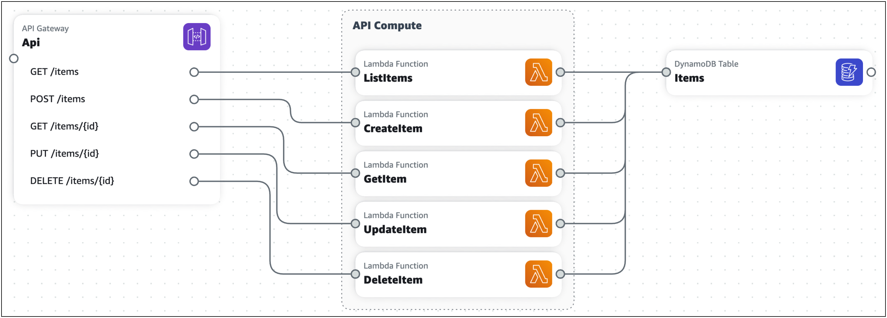
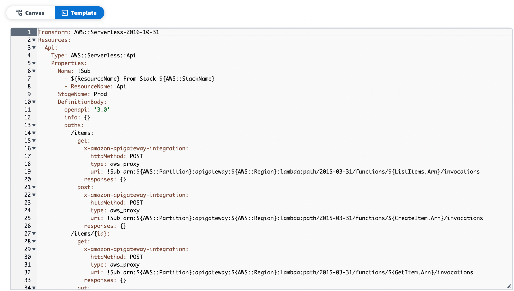
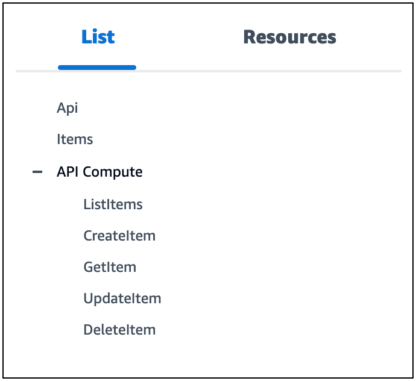
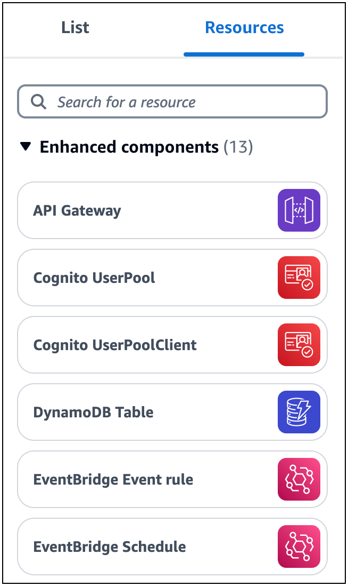
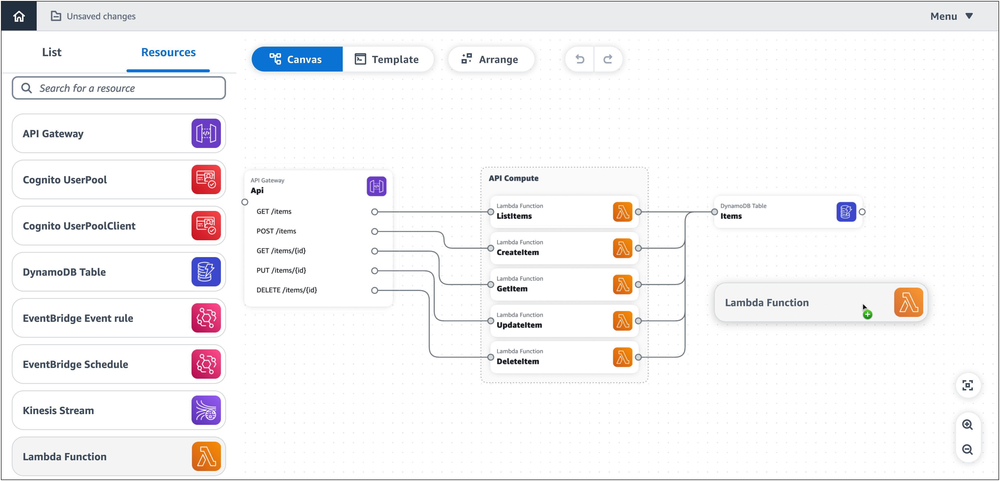
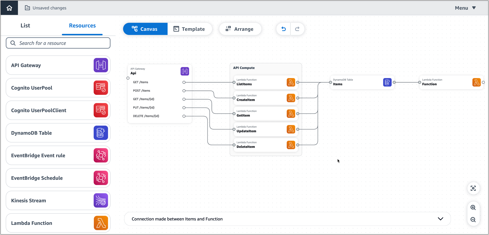

# Load and modify the Infrastructure Composer demo

project

Use this tutorial to become familier with Infrastructure Composer's user interface and learn how to load, modify, and save the Infrastructure Composer demo project.

This tutorial is done in the Infrastructure Composer console. Once completed, you'll be ready to start [Build your first application with
Infrastructure Composer](getting-started-build.md "getting-started-build.md").

###### Topics

- [Step 1: Open the demo](#getting-started-demo-open "#getting-started-demo-open")
- [Step 2: Explore the visual canvas of
  Infrastructure Composer](#getting-started-demo-navigate "#getting-started-demo-navigate")
- [Step 3: Expand your application
  architecture](#getting-started-demo-expand "#getting-started-demo-expand")
- [Step 4: Save your application](#getting-started-demo-save "#getting-started-demo-save")
- [Next steps](#getting-started-demo-next "#getting-started-demo-next")

## Step 1: Open the demo

Start using Infrastructure Composer by creating a demo project.

###### To create a demo project

1. Sign in to the [Infrastructure Composer
   console](https://console.aws.amazon.com/composer "https://console.aws.amazon.com/composer").
2. On the **Home** page, choose **Open demo**.

The demo application is a basic create, read, delete, and update (CRUD) serverless application that includes:

- An Amazon API Gateway resource with five routes.
- Five AWS Lambda functions.
- An Amazon DynamoDB table.

The following image is of the demo:

## Step 2: Explore the visual canvas of

Infrastructure Composer

Learn the features of the visual canvas to build out your Infrastructure Composer demo project. For an
overview of the visual canvas layout, see [Visual overview](reference-visual.md "reference-visual.md").

###### To explore the features of the visual canvas

1. When you open a new or existing application project, Infrastructure Composer loads the canvas
   view, as indicated above the main view area.

To show your application's infrastructure code in the main view area, choose
**Template**. For example, here is the AWS Serverless Application Model (AWS SAM) template
view of the Infrastructure Composer demo project.

 2. To show the canvas view of your application again, choose
**Canvas**. 3. To show your application's resources organized in a tree view, choose
**List**.

 4. To show the resource palette, choose **Resources**. This palette
features cards that you can use to expand your application architecture. You can
search for cards or scroll through the list.

 5. To move around the visual canvas, use basic gestures. For more information, see
[Place cards on the canvas](reference-navigation.md "reference-navigation.md").

## Step 3: Expand your application

architecture

In this step, you will expand your application architecture by adding a Lambda function
to your DynamoDB table.

###### To add a Lambda function to your DynamoDB table

1. From the resource palette (**Resources**), drag the **Lambda
   Function** enhanced component card onto the canvas, to the right of the **DynamoDB
   Table** card.

 2. Connect the DynamoDB table to the Lambda function. To connect them, click the right port
of the **DynamoDB Table** card and drag it onto the left port of
the **Lambda Function** card. 3. Choose **Arrange** to organize the cards in the canvas
view.

 4. Configure your Lambda function. To configure it, do either of the following:

    * In the canvas view, modify the function's properties on the **Resource
     properties** panel. To open the panel, double-click the **Lambda
     Function** card. Or, select the card, and then choose
     **Details**. For more information about the configurable Lambda
     function properties listed in the **Resource properties** panel,
     see the [AWS Lambda Developer Guide](../../../lambda/latest/dg/index.md "../../../lambda/latest/dg/index.md").
    * In the template view, modify the code for your function
     (`AWS::Serverless::Function`). Infrastructure Composer automatically syncs your
     changes to the canvas. For more information about the function resource in an AWS SAM
     template, see [AWS::Serverless::Function](../../../serverless-application-model/latest/developerguide/sam-resource-function.md "../../../serverless-application-model/latest/developerguide/sam-resource-function.md") in the *AWS SAM resource
     and property reference*.

## Step 4: Save your application

Save your application by manually saving your application template to your local machine
or by activating **local sync**.

###### To manually save your application template

1. From the **menu**, select **Save** > **Save template file**.
2. Provide a name for your template and choose a location on your local machine to save
   your template. Press **Save**.

For instructions on activating **local sync**, see [Locally sync and save your
project in the Infrastructure Composer console](using-composer-project-local-sync.md "using-composer-project-local-sync.md").

## Next steps

To get started with building your first application, see [Build your first application with
Infrastructure Composer](getting-started-build.md "getting-started-build.md").
