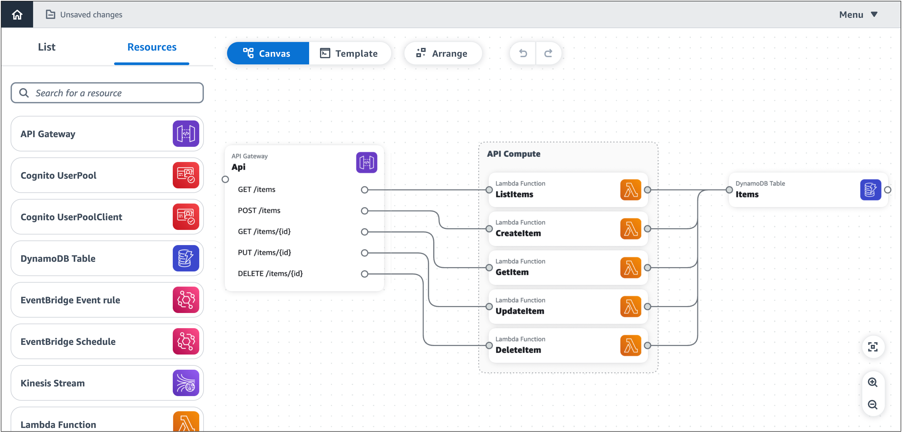

# Use Infrastructure Composer with AWS SAM to build and deploy

Now that you have completed [Set up for deploying with the AWS SAM CLI and Infrastructure Composer](other-services-cfn-sam-using.md "other-services-cfn-sam-using.md"), you can deploy your application with AWS SAM and Infrastructure Composer. This section provides an example detailing how you can do this. You can also refer to
[Deploy your application and resources with AWS SAM](../../../serverless-application-model/latest/developerguide/serverless-deploying.md "../../../serverless-application-model/latest/developerguide/serverless-deploying.md") in the _AWS Serverless Application Model Developer Guide_
for instructions on deploying your application with AWS SAM.

This example shows you how to build and deploy the Infrastructure Composer demo application. The demo application has the following resources:



###### Note

- To learn more about the demo application, see [Load and modify the Infrastructure Composer demo
  project](getting-started-demo.md "getting-started-demo.md").
- For this example, we use Infrastructure Composer with **local sync**
  activated.

1. Use the **sam build** command to build the application.

```
`$` `sam build`
...
Build Succeeded

Built Artifacts  : .aws-sam/build
Built Template   : .aws-sam/build/template.yaml

Commands you can use next
=========================
[*] Validate SAM template: sam validate
[*] Invoke Function: sam local invoke
[*] Test Function in the Cloud: sam sync --stack-name {{stack-name}} --watch
[*] Deploy: sam deploy --guided
```

The AWS SAM CLI creates the `./aws-sam` directory in the project folder. This directory
contains build artifacts for the application’s Lambda functions. Here is an output of the project
directory:

```
.
├── README.md
├── samconfig.toml
├── src
│   ├── CreateItem
│   │   ├── index.js
│   │   └── package.json
│   ├── DeleteItem
│   │   ├── index.js
│   │   └── package.json
│   ├── GetItem
│   │   ├── index.js
│   │   └── package.json
│   ├── ListItems
│   │   ├── index.js
│   │   └── package.json
│   └── UpdateItem
│       ├── index.js
│       └── package.json
└── template.yaml
```

2. Now, the application is ready to be deployed. We will use **sam deploy --guided**. This
   prepares your application for deployment through a series of prompts.

```
`$` `sam deploy --guided`
...
Configuring SAM deploy
======================

    Looking for config file [samconfig.toml] :  Found
    Reading default arguments  :  Success

    Setting default arguments for 'sam deploy'
    =========================================
    Stack Name [aws-app-composer-basic-api]:
    AWS Region [us-west-2]:
    #Shows you resources changes to be deployed and require a 'Y' to initiate deploy
    Confirm changes before deploy [y/N]:
    #SAM needs permission to be able to create roles to connect to the resources in your template
    Allow SAM CLI IAM role creation [Y/n]:
    #Preserves the state of previously provisioned resources when an operation fails
    Disable rollback [y/N]:
    ListItems may not have authorization defined, Is this okay? [y/N]: `y`
    CreateItem may not have authorization defined, Is this okay? [y/N]: `y`
    GetItem may not have authorization defined, Is this okay? [y/N]: `y`
    UpdateItem may not have authorization defined, Is this okay? [y/N]: `y`
    DeleteItem may not have authorization defined, Is this okay? [y/N]: `y`
    Save arguments to configuration file [Y/n]:
    SAM configuration file [samconfig.toml]:
    SAM configuration environment [default]:
```

The AWS SAM CLI displays a summary of what will be deployed:

```
Deploying with following values
    ===============================
    Stack name                   : aws-app-composer-basic-api
    Region                       : us-west-2
    Confirm changeset            : False
    Disable rollback             : False
    Deployment s3 bucket         : aws-sam-cli-managed-default-samclisam-s3-demo-1b3x26zbcdkqr
    Capabilities                 : ["CAPABILITY_IAM"]
    Parameter overrides          : {}
    Signing Profiles             : {}
```

The AWS SAM CLI deploys the application, first by creating an AWS CloudFormation changeset:

```
Initiating deployment
=====================
Uploading to aws-app-composer-basic-api/4181c909ee2440a728a7a129dafb83d4.template  7087 / 7087  (100.00%)

Waiting for changeset to be created..
CloudFormation stack changeset
---------------------------------------------------------------------------------------------------------------------------------------------
Operation                           LogicalResourceId                   ResourceType                        Replacement
---------------------------------------------------------------------------------------------------------------------------------------------
+ Add                               ApiDeploymentcc153d135b             AWS::ApiGateway::Deployment         N/A
+ Add                               ApiProdStage                        AWS::ApiGateway::Stage              N/A
+ Add                               Api                                 AWS::ApiGateway::RestApi            N/A
+ Add                               CreateItemApiPOSTitemsPermissionP   AWS::Lambda::Permission             N/A
                                    rod
+ Add                               CreateItemRole                      AWS::IAM::Role                      N/A
+ Add                               CreateItem                          AWS::Lambda::Function               N/A
+ Add                               DeleteItemApiDELETEitemsidPermiss   AWS::Lambda::Permission             N/A
                                    ionProd
+ Add                               DeleteItemRole                      AWS::IAM::Role                      N/A
+ Add                               DeleteItem                          AWS::Lambda::Function               N/A
+ Add                               GetItemApiGETitemsidPermissionPro   AWS::Lambda::Permission             N/A
                                    d
+ Add                               GetItemRole                         AWS::IAM::Role                      N/A
+ Add                               GetItem                             AWS::Lambda::Function               N/A
+ Add                               Items                               AWS::DynamoDB::Table                N/A
+ Add                               ListItemsApiGETitemsPermissionPro   AWS::Lambda::Permission             N/A
                                    d
+ Add                               ListItemsRole                       AWS::IAM::Role                      N/A
+ Add                               ListItems                           AWS::Lambda::Function               N/A
+ Add                               UpdateItemApiPUTitemsidPermission   AWS::Lambda::Permission             N/A
                                    Prod
+ Add                               UpdateItemRole                      AWS::IAM::Role                      N/A
+ Add                               UpdateItem                          AWS::Lambda::Function               N/A
---------------------------------------------------------------------------------------------------------------------------------------------

Changeset created successfully. arn:aws:cloudformation:us-west-2:513423067560:changeSet/samcli-deploy1677472539/967ab543-f916-4170-b97d-c11a6f9308ea
```

Then, the AWS SAM CLI deploys the application:

```
CloudFormation events from stack operations (refresh every 0.5 seconds)
---------------------------------------------------------------------------------------------------------------------------------------------
ResourceStatus                      ResourceType                        LogicalResourceId                   ResourceStatusReason
---------------------------------------------------------------------------------------------------------------------------------------------
CREATE_IN_PROGRESS                  AWS::DynamoDB::Table                Items                               -
CREATE_IN_PROGRESS                  AWS::DynamoDB::Table                Items                               Resource creation Initiated
CREATE_COMPLETE                     AWS::DynamoDB::Table                Items                               -
CREATE_IN_PROGRESS                  AWS::IAM::Role                      DeleteItemRole                      -
CREATE_IN_PROGRESS                  AWS::IAM::Role                      ListItemsRole                       -
CREATE_IN_PROGRESS                  AWS::IAM::Role                      UpdateItemRole                      -
CREATE_IN_PROGRESS                  AWS::IAM::Role                      GetItemRole                         -
CREATE_IN_PROGRESS                  AWS::IAM::Role                      CreateItemRole                      -
CREATE_IN_PROGRESS                  AWS::IAM::Role                      DeleteItemRole                      Resource creation Initiated
CREATE_IN_PROGRESS                  AWS::IAM::Role                      ListItemsRole                       Resource creation Initiated
CREATE_IN_PROGRESS                  AWS::IAM::Role                      GetItemRole                         Resource creation Initiated
CREATE_IN_PROGRESS                  AWS::IAM::Role                      UpdateItemRole                      Resource creation Initiated
CREATE_IN_PROGRESS                  AWS::IAM::Role                      CreateItemRole                      Resource creation Initiated
CREATE_COMPLETE                     AWS::IAM::Role                      DeleteItemRole                      -
CREATE_COMPLETE                     AWS::IAM::Role                      ListItemsRole                       -
CREATE_COMPLETE                     AWS::IAM::Role                      GetItemRole                         -
CREATE_COMPLETE                     AWS::IAM::Role                      UpdateItemRole                      -
CREATE_COMPLETE                     AWS::IAM::Role                      CreateItemRole                      -
CREATE_IN_PROGRESS                  AWS::Lambda::Function               DeleteItem                          -
CREATE_IN_PROGRESS                  AWS::Lambda::Function               CreateItem                          -
CREATE_IN_PROGRESS                  AWS::Lambda::Function               ListItems                           -
CREATE_IN_PROGRESS                  AWS::Lambda::Function               UpdateItem                          -
CREATE_IN_PROGRESS                  AWS::Lambda::Function               DeleteItem                          Resource creation Initiated
CREATE_IN_PROGRESS                  AWS::Lambda::Function               GetItem                             -
CREATE_IN_PROGRESS                  AWS::Lambda::Function               ListItems                           Resource creation Initiated
CREATE_IN_PROGRESS                  AWS::Lambda::Function               CreateItem                          Resource creation Initiated
CREATE_IN_PROGRESS                  AWS::Lambda::Function               UpdateItem                          Resource creation Initiated
CREATE_IN_PROGRESS                  AWS::Lambda::Function               GetItem                             Resource creation Initiated
CREATE_COMPLETE                     AWS::Lambda::Function               DeleteItem                          -
CREATE_COMPLETE                     AWS::Lambda::Function               ListItems                           -
CREATE_COMPLETE                     AWS::Lambda::Function               CreateItem                          -
CREATE_COMPLETE                     AWS::Lambda::Function               UpdateItem                          -
CREATE_COMPLETE                     AWS::Lambda::Function               GetItem                             -
CREATE_IN_PROGRESS                  AWS::ApiGateway::RestApi            Api                                 -
CREATE_IN_PROGRESS                  AWS::ApiGateway::RestApi            Api                                 Resource creation Initiated
CREATE_COMPLETE                     AWS::ApiGateway::RestApi            Api                                 -
CREATE_IN_PROGRESS                  AWS::Lambda::Permission             GetItemApiGETitemsidPermissionPro   -
                                                                        d
CREATE_IN_PROGRESS                  AWS::Lambda::Permission             ListItemsApiGETitemsPermissionPro   -
                                                                        d
CREATE_IN_PROGRESS                  AWS::Lambda::Permission             DeleteItemApiDELETEitemsidPermiss   -
                                                                        ionProd
CREATE_IN_PROGRESS                  AWS::ApiGateway::Deployment         ApiDeploymentcc153d135b             -
CREATE_IN_PROGRESS                  AWS::Lambda::Permission             UpdateItemApiPUTitemsidPermission   -
                                                                        Prod
CREATE_IN_PROGRESS                  AWS::Lambda::Permission             CreateItemApiPOSTitemsPermissionP   -
                                                                        rod
CREATE_IN_PROGRESS                  AWS::Lambda::Permission             GetItemApiGETitemsidPermissionPro   Resource creation Initiated
                                                                        d
CREATE_IN_PROGRESS                  AWS::Lambda::Permission             UpdateItemApiPUTitemsidPermission   Resource creation Initiated
                                                                        Prod
CREATE_IN_PROGRESS                  AWS::Lambda::Permission             CreateItemApiPOSTitemsPermissionP   Resource creation Initiated
                                                                        rod
CREATE_IN_PROGRESS                  AWS::Lambda::Permission             ListItemsApiGETitemsPermissionPro   Resource creation Initiated
                                                                        d
CREATE_IN_PROGRESS                  AWS::Lambda::Permission             DeleteItemApiDELETEitemsidPermiss   Resource creation Initiated
                                                                        ionProd
CREATE_IN_PROGRESS                  AWS::ApiGateway::Deployment         ApiDeploymentcc153d135b             Resource creation Initiated
CREATE_COMPLETE                     AWS::ApiGateway::Deployment         ApiDeploymentcc153d135b             -
CREATE_IN_PROGRESS                  AWS::ApiGateway::Stage              ApiProdStage                        -
CREATE_IN_PROGRESS                  AWS::ApiGateway::Stage              ApiProdStage                        Resource creation Initiated
CREATE_COMPLETE                     AWS::ApiGateway::Stage              ApiProdStage                        -
CREATE_COMPLETE                     AWS::Lambda::Permission             CreateItemApiPOSTitemsPermissionP   -
                                                                        rod
CREATE_COMPLETE                     AWS::Lambda::Permission             UpdateItemApiPUTitemsidPermission   -
                                                                        Prod
CREATE_COMPLETE                     AWS::Lambda::Permission             ListItemsApiGETitemsPermissionPro   -
                                                                        d
CREATE_COMPLETE                     AWS::Lambda::Permission             DeleteItemApiDELETEitemsidPermiss   -
                                                                        ionProd
CREATE_COMPLETE                     AWS::Lambda::Permission             GetItemApiGETitemsidPermissionPro   -
                                                                        d
CREATE_COMPLETE                     AWS::CloudFormation::Stack          aws-app-composer-basic-api          -
---------------------------------------------------------------------------------------------------------------------------------------------
```

Finally, a message is displayed, informing you that deployment was successful:

```
Successfully created/updated stack - aws-app-composer-basic-api in us-west-2
```
