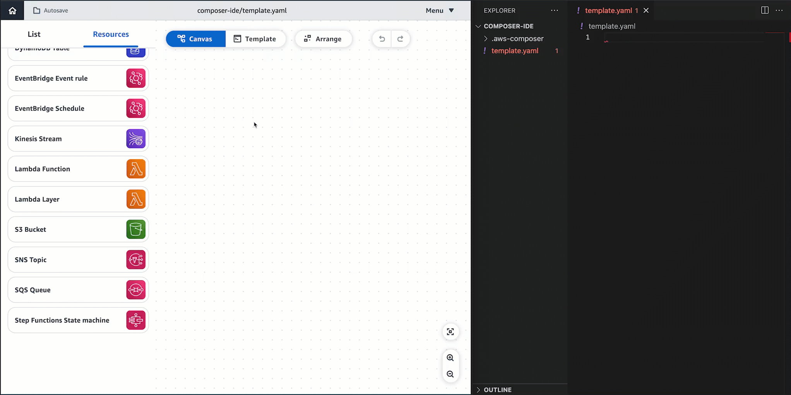
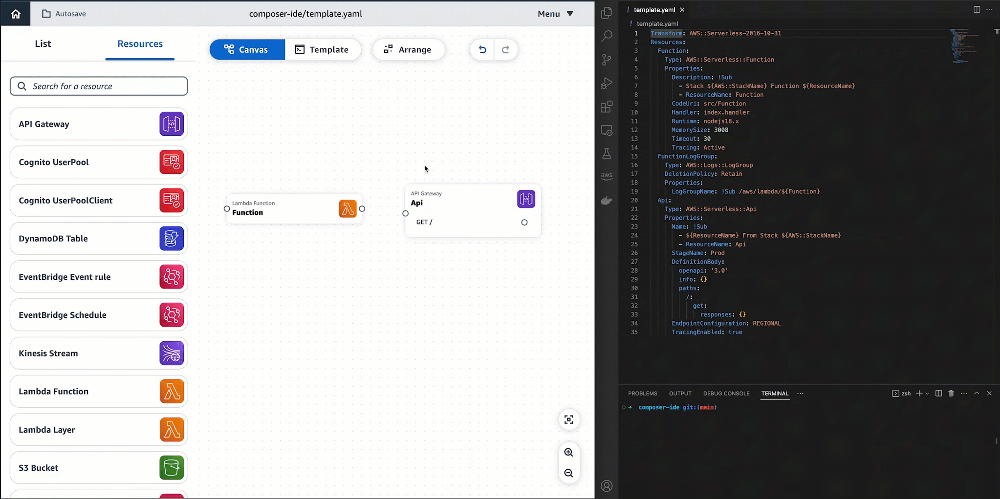
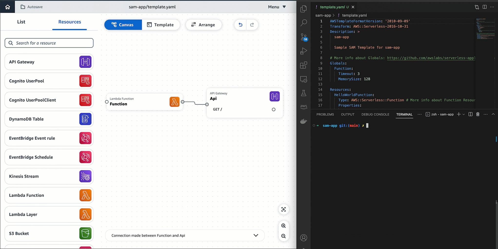

# Connect the Infrastructure Composer console with your local IDE

To connect the Infrastructure Composer console with your local integrated development environment (IDE), use local sync mode. This mode automatically syncs and saves data to your local machine.
For more information about local sync mode, see [Locally sync and save your
project in the Infrastructure Composer console](using-composer-project-local-sync.md "using-composer-project-local-sync.md"). For instructions
on using local sync mode, see [Locally sync and save your
project in the Infrastructure Composer console](using-composer-project-local-sync.md "using-composer-project-local-sync.md").

###### Note

The **Activate local sync** option is not available in every browser. It is available in Google Chrome and Microsoft Edge.

## Benefits of using Infrastructure Composer with your local

IDE

As you design in Infrastructure Composer, your local template and project directory are automatically
synced and saved.

You can use your local IDE to view changes and modify your templates. Changes that you
make locally are automatically synced to Infrastructure Composer.

You can use local tools such as the AWS Serverless Application Model Command Line Interface (AWS SAM CLI) to build,
test, deploy your application, and more. The following example shows how you can drag and drop resources onto Infrastructure Composer's visual canvas which, in turn, creates markup in your AWS SAM template in your local IDE.

## Integrate Infrastructure Composer with your local IDE

###### To integrate Infrastructure Composer with your local IDE

1. In Infrastructure Composer, create or load a project, and activate local sync by selecting the **Menu** button
   at the top-right side of the screen and choosing **Activate local sync**.

###### Note

The **Activate local sync** option is not available in every browser. It is available in Google Chrome and Microsoft Edge. 2. In your local IDE, open the same project folder as Infrastructure Composer. 3. Use Infrastructure Composer with your local IDE. Updates made in Infrastructure Composer will automatically sync
with your local machine. Here are some examples of what you can do:

    1. Use your version control system of choice to track updates being performed by
     Infrastructure Composer.

    
    2. Use the AWS SAM CLI locally to build, test, deploy your application, and more. To
     learn more, see [Deploy your Infrastructure Composer serverless application to the AWS Cloud](other-services-cfn.md "other-services-cfn.md").

    
