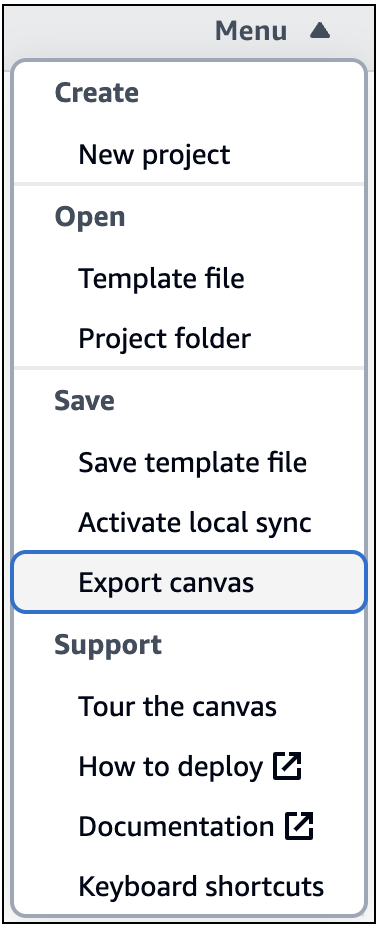

# Export an image of Infrastructure Composer's visual canvas

This topic describes the AWS Infrastructure Composer console **export canvas**
feature.

For a visual overview of all Infrastructure Composer features, see [AWS Infrastructure Composer console visual overview](reference-visual.md "reference-visual.md").

## About export canvas

The **export canvas** feature exports your application’s
canvas as an image to your local machine.

- Infrastructure Composer removes the visual designer UI elements and exports only your application’s
  diagram.
- The default image file format is `png`.
- The file is exported to your local machine’s default download location.

You can access the **export canvas** feature from the
**Menu**.

## Exporting canvas

When you export your canvas, Infrastructure Composer displays a status message.

If the export is successful, you will see the following message:

If the export was unsuccessful, you will see an error message. If you receive an error, try
exporting again.

