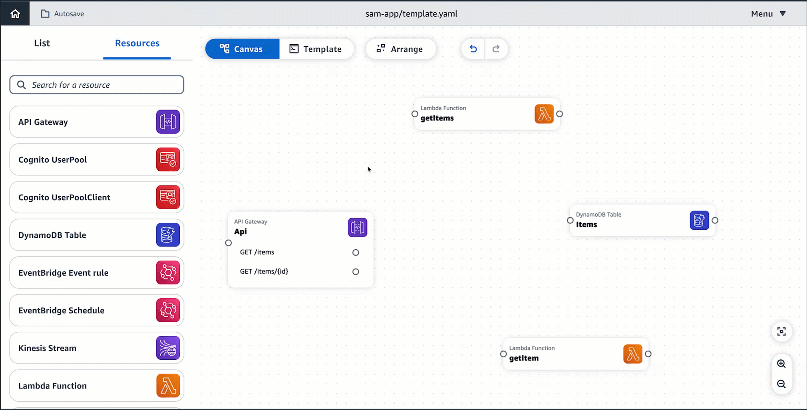

# Arrange cards on Infrastructure Composer's visual canvas

Select **Arrange** to visually arrange and organize cards on the
canvas. Using the **Arrange** button is particularly useful when there many cards and connections on the canvas.

