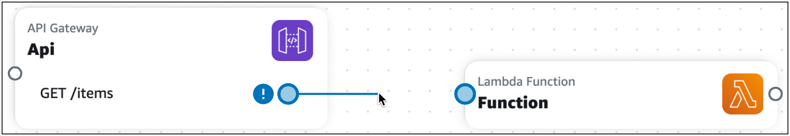
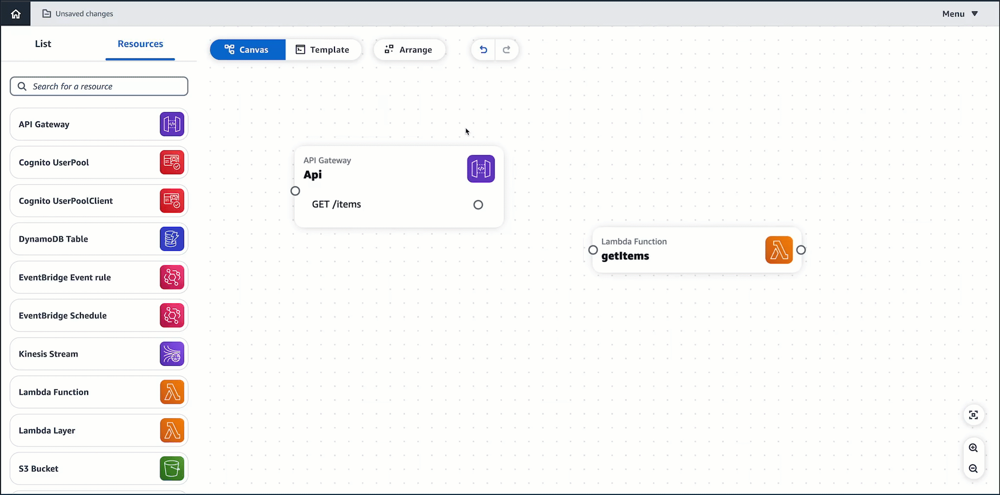
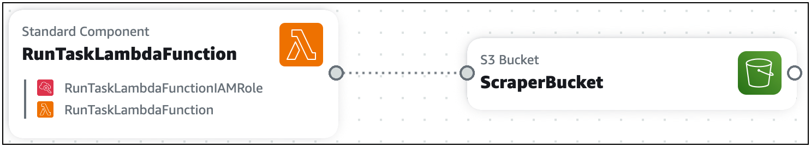

# Connect cards on Infrastructure Composer's visual canvas

Use this topic to understand how to connect cards in Infrastructure Composer. This section includes details on connecting enhanced component cards and standard component cards. It also provides a few examples that illustrate the different ways cards can be connected.

## Connecting enhanced component cards

On enhanced component cards, ports visually identify where connections can be made.

- A port on the right side of a card indicates an opportunity for the
  card to invoke another card.
- A port on the left side of a card indicates an opportunity for the card
  to be invoked by another card.

Connect cards together by clicking on a the right port of one card and
dragging it onto a left port on another card.



When you create a connection, a message will display, letting you know if the connection
was successfully made. Select the message to see what Infrastructure Composer changed to provision a connection.
If the connection was unsuccessful, you can select **Template view** to manually update your infrastructure code to provision the connection.

- When successful, click on the message to view the **Change
  inspector**. Here, you can see what Infrastructure Composer modified to provision your
  connection.
- When unsuccessful, a message will display. You can select the **Template view** and manually update your infrastructure code to provision the
  connection.



When you connect enhanced component cards together, Infrastructure Composer automatically creates the infrastructure code in your template to provision the event-driven relationship
between your resources.

## Connecting standard component cards (Standard IaC resource cards)

Standard IaC resource cards do not include ports to create connections with other resources. During [card configuration](using-composer-standard-cards.md "using-composer-standard-cards.md"), you specify event-driven relationships in the
template of your application, Infrastructure Composer will automatically detect these connections and visualize them with a dotted line between your cards. The following is an example of a
connection between a standard component card and an enhanced component card:



The following example shows how a Lambda function can be connected with an Amazon API Gateway rest API:

```
AWSTemplateFormatVersion: '2010-09-09'
Resources:
  MyApi:
    Type: 'AWS::ApiGateway::RestApi'
    Properties:
      Name: MyApi

  ApiGatewayMethod:
    Type: 'AWS::ApiGateway::Method'
    Properties:
      HttpMethod: POST  # Specify the HTTP method you want to use (e.g., GET, POST, PUT, DELETE)
      ResourceId: !GetAtt MyApi.RootResourceId
      RestApiId: !Ref MyApi
      AuthorizationType: NONE
      Integration:
        Type: AWS_PROXY
        IntegrationHttpMethod: POST
        Uri: !Sub
          - arn:aws:apigateway:${AWS::Region}:lambda:path/2015-03-31/functions/${LambdaFunctionArn}/invocations
          - { LambdaFunctionArn: !GetAtt MyLambdaFunction.Arn }
      MethodResponses:
        - StatusCode: 200

  MyLambdaFunction:
    Type: 'AWS::Lambda::Function'
    Properties:
      Handler: index.handler
      Role: !GetAtt LambdaExecutionRole.Arn
      Runtime: nodejs14.x
      Code:
        S3Bucket: your-bucket-name
        S3Key: your-lambda-zip-file.zip

  LambdaExecutionRole:
    Type: 'AWS::IAM::Role'
    Properties:
      AssumeRolePolicyDocument:
        Version: '2012-10-17'
        Statement:
          - Effect: Allow
            Principal:
              Service: lambda.amazonaws.com
            Action: 'sts:AssumeRole'
      Policies:
        - PolicyName: LambdaExecutionPolicy
          PolicyDocument:
            Version: '2012-10-17'
            Statement:
              - Effect: Allow
                Action:
                  - 'logs:CreateLogGroup'
                  - 'logs:CreateLogStream'
                  - 'logs:PutLogEvents'
                Resource: 'arn:aws:logs:*:*:*'
              - Effect: Allow
                Action:
                  - 'lambda:InvokeFunction'
                Resource: !GetAtt MyLambdaFunction.Arn
```

In the above example, the snippet of code listed in `ApiGatewayMethod:` under `Integration:` specifies the event-driven relationship that connects the two cards.
