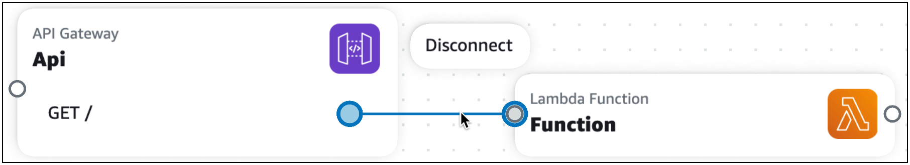

# Disconnect cards in Infrastructure Composer

In Infrastructure Composer, you connect and disconnect AWS resources using _enhanced component cards_ and _standard component cards_. This section describes how to disconnect both types of cards.

## Enhanced component cards

To disconnect enhanced component cards, select the line and choose **Disconnect**.



Infrastructure Composer will automatically modify your template to remove the event-driven relationship from your application.

## Standard component cards

Standard component cards do not include ports to create connections with other resources. During [card configuration](using-composer-standard-cards.md "using-composer-standard-cards.md"), you specify event-driven relationships in the
template of your application, Infrastructure Composer will automatically detect these connections and visualize them with a dotted line between your cards. To disconnect a standard component card, remove the event-driven relationship in the template of your application.

The following example shows a Lambda function that is connected with an Amazon API Gateway rest API:

```
AWSTemplateFormatVersion: '2010-09-09'
Resources:
  MyApi:
    Type: 'AWS::ApiGateway::RestApi'
    Properties:
      Name: MyApi

  ApiGatewayMethod:
    Type: 'AWS::ApiGateway::Method'
    Properties:
      HttpMethod: POST  # Specify the HTTP method you want to use (e.g., GET, POST, PUT, DELETE)
      ResourceId: !GetAtt MyApi.RootResourceId
      RestApiId: !Ref MyApi
      AuthorizationType: NONE
      Integration:
        Type: AWS_PROXY
        IntegrationHttpMethod: POST
        Uri: !Sub
          - arn:aws:apigateway:${AWS::Region}:lambda:path/2015-03-31/functions/${LambdaFunctionArn}/invocations
          - { LambdaFunctionArn: !GetAtt MyLambdaFunction.Arn }
      MethodResponses:
        - StatusCode: 200

  MyLambdaFunction:
    Type: 'AWS::Lambda::Function'
    Properties:
      Handler: index.handler
      Role: !GetAtt LambdaExecutionRole.Arn
      Runtime: nodejs14.x
      Code:
        S3Bucket: your-bucket-name
        S3Key: your-lambda-zip-file.zip

  LambdaExecutionRole:
    Type: 'AWS::IAM::Role'
    Properties:
      AssumeRolePolicyDocument:
        Version: '2012-10-17'
        Statement:
          - Effect: Allow
            Principal:
              Service: lambda.amazonaws.com
            Action: 'sts:AssumeRole'
      Policies:
        - PolicyName: LambdaExecutionPolicy
          PolicyDocument:
            Version: '2012-10-17'
            Statement:
              - Effect: Allow
                Action:
                  - 'logs:CreateLogGroup'
                  - 'logs:CreateLogStream'
                  - 'logs:PutLogEvents'
                Resource: 'arn:aws:logs:*:*:*'
              - Effect: Allow
                Action:
                  - 'lambda:InvokeFunction'
                Resource: !GetAtt MyLambdaFunction.Arn
```

To remove the connection betweent the two cards, remove references to `MyLambdaFunction` listed in `ApiGatewayMethod:` under `Integration`.
