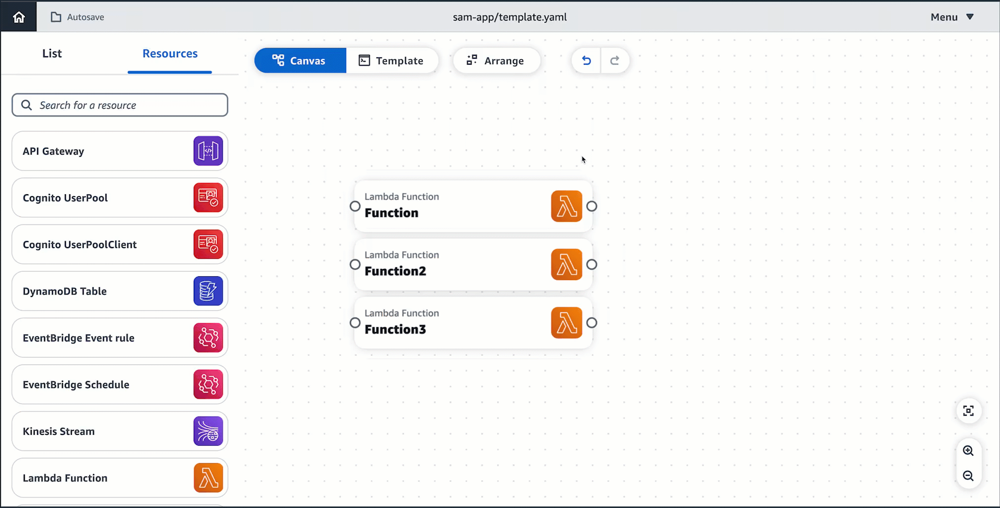
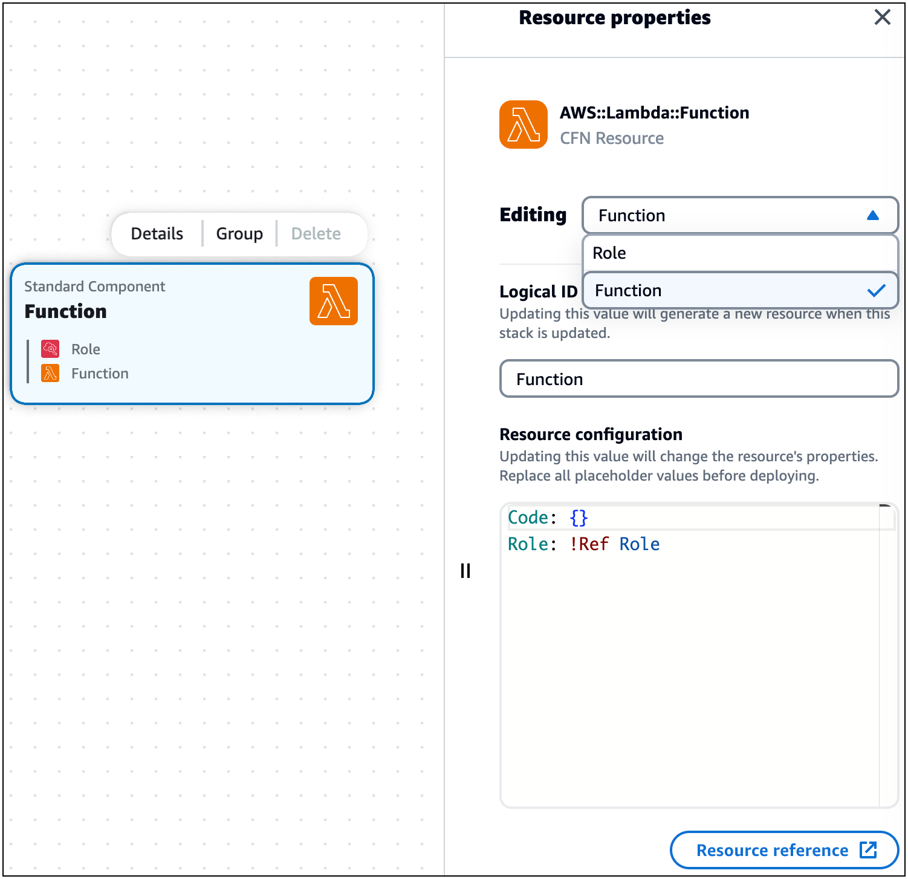

# Group cards together on Infrastructure Composer's visual canvas

This topic contains details on grouping enhanced component cards and standard component cards.
Grouping cards helps you categorize and organize your resources without needing to think about the code or markup you need write.

## Grouping enhanced component cards

There are two ways to group enhanced component cards together:

- While pressing **Shift**, select cards to group. Then,
  choose **Group** from the resource actions menu.
- select a card you want in a group. From the menu that appears, select **Group**.
  This will create a group that you can drag and drop other cards into.

## Grouping a standard component card into another

The following example shows one way a standard component card can be grouped into another card from the **Resource properties** panel:

In the **Resource configuration** field on the **Resource properties** panel, the `Role` has been referenced in the Lambda function.
This results in the **Role** card being grouped into the **Function** card on the canvas.
