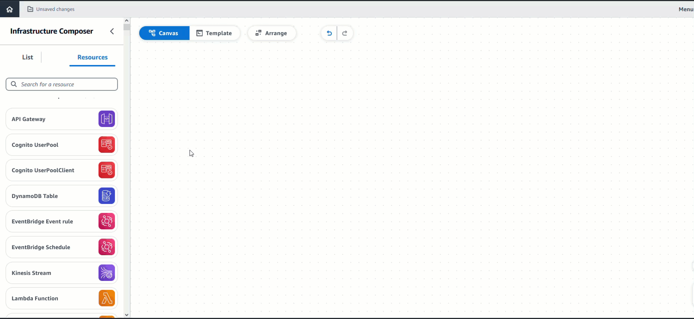

# Place cards on Infrastructure Composer's visual canvas

This section describes how you select and drag Infrastructure Composer [cards](using-composer-connecting.md "using-composer-connecting.md") in its visual canvas.
Before starting, identify what resources your application needs and how they need to interact. For tips on doing this, see [Build your first application with
Infrastructure Composer](getting-started-build.md "getting-started-build.md").

To add a card to your application, drag it from the resource palette and drop it onto
the visual canvas.

You can choose from two types of cards: [Enhanced component cards](using-composer-cards-component-intro-enhanced.md "using-composer-cards-component-intro-enhanced.md") and [Standard IaC resource cards](using-composer-cards-resource-intro.md "using-composer-cards-resource-intro.md").

After placing your cards on the visual canvas, you'll be ready to group, connect, arrange, and configure your cards. See the following topics for information on doing this:

- [Group cards together on Infrastructure Composer's visual canvas](reference-navigation-gestures-group.md "reference-navigation-gestures-group.md")
- [Connect cards on Infrastructure Composer's visual canvas](reference-navigation-gestures-connect.md "reference-navigation-gestures-connect.md")
- [Arrange cards on Infrastructure Composer's visual canvas](reference-navigation-gestures-arrange.md "reference-navigation-gestures-arrange.md")
- [Configure and modify cards in Infrastructure Composer](using-composer-cards.md "using-composer-cards.md")
