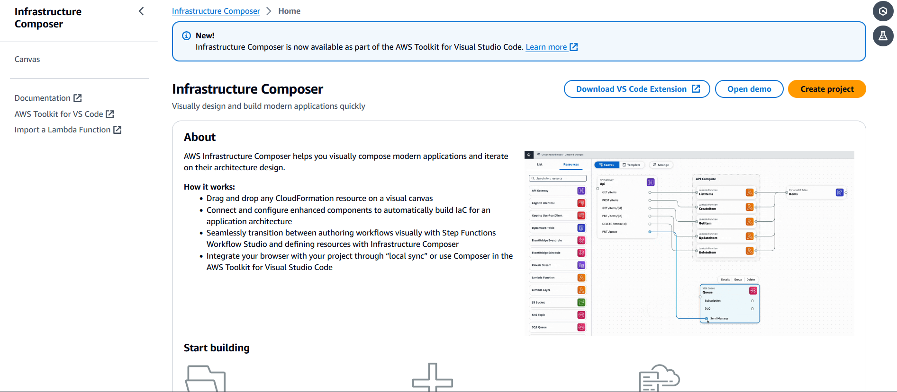
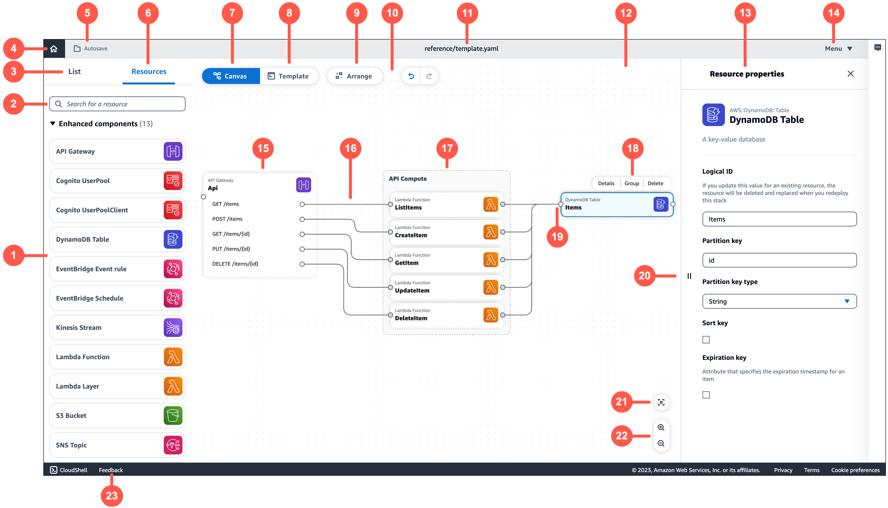

# AWS Infrastructure Composer console visual overview

This section provides a visual overview of the AWS Infrastructure Composer console.

###### Topics

- [Home page](#reference-visual-home "#reference-visual-home")
- [Visual designer and visual canvas](#reference-visual-designer "#reference-visual-designer")

## Home page

The following image is of the home page in the Infrastructure Composer console:

1. **Documentation** – Go to Infrastructure Composer documentation.
2. **Canvas** – Go to the canvas and create or load a project.
3. **Demo** – Open the Infrastructure Composer demo application.
4. **Create project** – Create or load a project.
5. **Start building** – Quick links to start building an application.
6. **Feedback** – Go here to submit feedback.

## Visual designer and visual canvas

The following image is of Infrastructure Composer's visual designer and visual canvas:

1. **Resource palette** – Displays cards
   that you can design with.
2. **Resource search bar** – Search for cards that
   you can add to the canvas.
3. **List** – Displays a tree view of your application
   resources.
4. **Home** – Select here to go to the Infrastructure Composer
   homepage.
5. **Save status** – Indicates whether Infrastructure Composer changes
   are saved to your local machine. States include:
   - **Autosave** – **Local
     sync** is activated and your project is being automatically synced and
     saved.
   - **Changes saved** – Your application template is
     saved to your local machine.
   - **Unsaved changes** – Your application template has
     changes that are not saved to your local machine.

6. **Resources** – Displays the resource palette.
7. **Canvas** – Displays the canvas view of your
   application in the main view area.
8. **Template** – Displays the template view of your
   application in the main view area.
9. **Arrange** – Arranges your application architecture
   in the canvas.
10. **Undo and redo** – Perform **undo** and **redo** actions when supported.
11. **Template name** – Indicates the name of the template
    you are designing.
12. **Main view area** – Displays either the canvas or
    template based on your selection.
13. **Resource properties panel** – Displays relevant
    properties for the card that’s been selected in the canvas. This panel is dynamic.
    Properties displayed will change as you configure your card.
14. **Menu** – Provides general options such as the
    following:
    - **Create a project**
    - **Open a template file or project**
    - **Save a template file**
    - **[Activate local sync](using-composer-project-local-sync.md "using-composer-project-local-sync.md")**
    - **[Export canvas](reference-features-export.md "reference-features-export.md")**
    - **Get support**
    - **Keyboard shortcuts**

15. **Card** – Displays a view of your card
    on the canvas.
16. **Line** – Represents a connection between
    cards.
17. **Group** – Groups selected cards together for
    visual organization.
18. **Card actions** – Provides actions you can take
    on your card.
    1. **Details** – Brings up the resource property
       panel.
    2. **Group** – Group selected cards
       together.
    3. **Delete** – Deletes the card from your
       canvas.

19. **Port** – Connection points to other
    cards.
20. **Resource property fields** – A curated set of
    property fields to configure for your cards.
21. **Re-center** – Re-center your application diagram on
    the visual canvas.
22. **Zoom** – Zoom in and out on your canvas.
23. **Feedback** – Go here to submit feedback.
