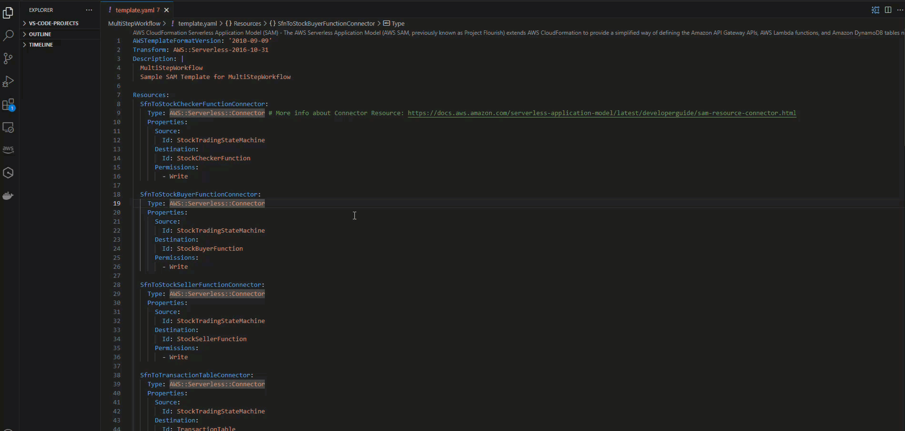

# Access Infrastructure Composer from the AWS Toolkit for Visual Studio Code

Follow the instructions in this topic to access Infrastructure Composer from the AWS Toolkit for Visual Studio Code.

###### Note

Before you can access Infrastructure Composer from the AWS Toolkit for Visual Studio Code, you must first download and install the Toolkit for VS Code. For instructions, see
[Downloading the Toolkit for VS Code](../../../toolkit-for-vscode/latest/userguide/downloads.md "../../../toolkit-for-vscode/latest/userguide/downloads.md").

###### To access Infrastructure Composer from the Toolkit for VS Code

You can access Infrastructure Composer in any of the following ways:

1. By selecting the Infrastructure Composer button from any CloudFormation or AWS SAM template.
2. Through the context menu by right-clicking on your CloudFormation or AWS SAM template.
3. From the VS Code Command Palette.
   The following is an example of accessing Infrastructure Composer from the Infrastructure Composer button:

For more information on accessing Infrastructure Composer, see [Accessing AWS Infrastructure Composer from the Toolkit](../../../toolkit-for-vscode/latest/userguide/appcomposer-overview.md#appcomposer-overview-access "../../../toolkit-for-vscode/latest/userguide/appcomposer-overview.md#appcomposer-overview-access").
