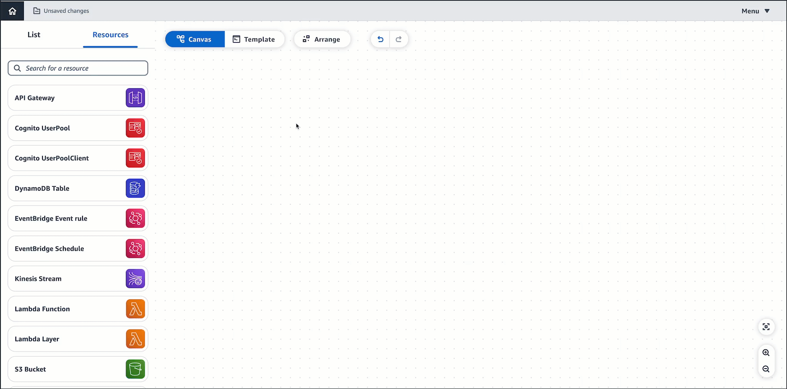
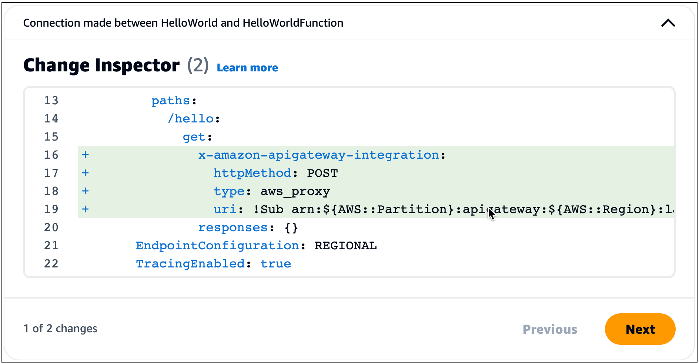
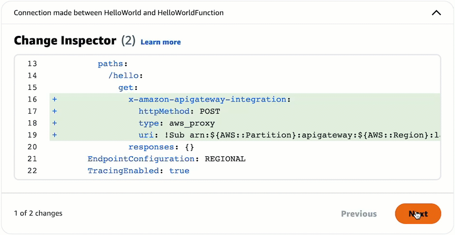

# View code updates with the Change Inspector in Infrastructure Composer

As you design in Infrastructure Composer console, your infrastructure code is automatically created. Use the
**Change Inspector** to view your template code updates and learn what
Infrastructure Composer is creating for you.

This topic covers using Infrastructure Composer from the AWS Management Console or the AWS Toolkit for Visual Studio Code extension.

The **Change Inspector** is a visual tool within Infrastructure Composer that shows you
recent code updates.

- As you design your application, messages display at the bottom of the visual canvas.
  These messages provide commentary on the actions you are performing.
- When supported, you can expand a message to view the **Change
  Inspector**.
- The **Change Inspector** displays code changes from your most recent
  interaction.
  The following example demonstrates how change inspector works:

## Benefits of the Change Inspector

The **Change Inspector** is a great way to view the template
code that Infrastructure Composer creates for you. It is also a great way to learn how to write
infrastructure code. As you design applications in Infrastructure Composer, view code updates in the
**Change Inspector** to learn about the code needed to
provision your design.

## Procedure

###### To use the Change Inspector

1. Expand a message to bring up the **Change Inspector**.

 2. View the code that has been automatically composed for you.

    1. Code highlighted **green** indicate newly added
     code.
    2. Code highlighted **red** indicate newly removed
     code.
    3. **Line numbers** indicate the location within your
     template.

3. When multiple sections of your template have been updated, the **Change
   Inspector** organizes them. Select the **Previous** and
   **Next** buttons to view all changes.

###### Note

For Infrastructure Composer from the console, you can view code changes in the context of your entire template, by using the
**Template View**. You can also sync Infrastructure Composer with a local IDE and view your entire
template on your local machine. To learn more, see [Connect the Infrastructure Composer console with your local IDE](other-services-ide.md "other-services-ide.md").

## Learn more

For more information about the code that Infrastructure Composer creates, see the following:

- [Card connections in Infrastructure Composer](using-composer-connecting.md "using-composer-connecting.md").
