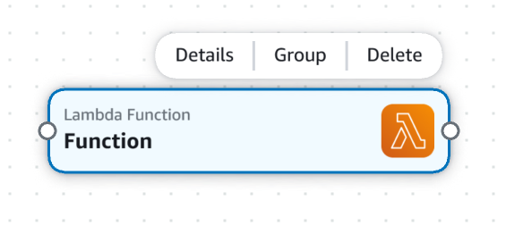

# Delete cards in Infrastructure Composer

This section provides instructions for deleting cards in AWS Infrastructure Composer.

## Enhanced component cards

To delete an enhanced component card, select a card you have place on the visual canvas. From the **Card actions** menu, select **Delete**.

## Standard component cards

To delete standard component cards, you must manually remove the infrastructure code for each AWS CloudFormation resource from your template. The following is a simple way to
accomplish this:

1. Take note of the logical ID for the resource to delete.
2. On your template, locate the resource by its logical ID from the `Resources` or `Outputs` section.
3. Delete the resource from your template. This includes the resource logical ID and its nested values, such as `Type` and `Properties`.
4. Check the **Canvas** view to verify that the resource has been removed from your canvas.
