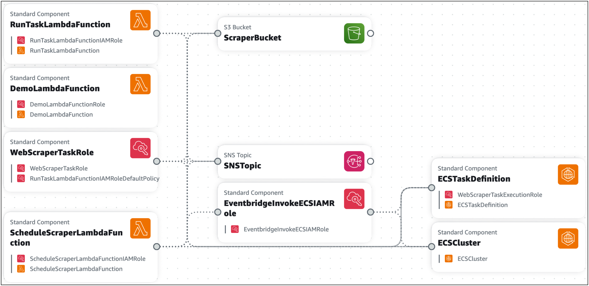

# Infrastructure Composer cards

Infrastructure Composer simplifies the process of writing infrastructure as code (IaC) for AWS CloudFormation resources. To effectively use Infrastructure Composer,
there are two basic concepts you should first understand: Infrastructure Composer cards
and [card connections](using-composer-connecting.md "using-composer-connecting.md").

In Infrastructure Composer, cards represent AWS CloudFormation resources. there are two general categories of cards:

- [Enhanced component card](using-composer-cards-component-intro-enhanced.md "using-composer-cards-component-intro-enhanced.md") – A collection of AWS CloudFormation resources that have been combined into a single curated card that enhances ease of use, functionality,
  and are designed for a wide variety of use cases. Enhanced component cards are the first cards listed in the **Resources** palette in Infrastructure Composer.
- [Standard IaC resource card](using-composer-cards-resource-intro.md "using-composer-cards-resource-intro.md") – A single AWS CloudFormation resource. Each standard IaC resource card,
  once dragged onto the canvas, is labeled **Standard component** and may be combined into multiple resources.

###### Note

Depending on the card, a _Standard IaC resource_ card may be labeled a **Standard component** card after it has been dragged onto the visual canvas.
This simply means the card is a collection of one or more standard IaC resource cards.

While some types of cards are available from the **Resources** palette, cards can also appear on the canvas
when you import an existing AWS CloudFormation or AWS Serverless Application Model (AWS SAM) template into Infrastructure Composer. The following image is an example of an imported application that contains various card types:

###### Topics

- [Enhanced component cards in Infrastructure Composer](using-composer-cards-component-intro-enhanced.md "using-composer-cards-component-intro-enhanced.md")
- [Standard component cards in Infrastructure Composer](using-composer-cards-resource-intro.md "using-composer-cards-resource-intro.md")
- [Card connections in Infrastructure Composer](using-composer-connecting.md "using-composer-connecting.md")
