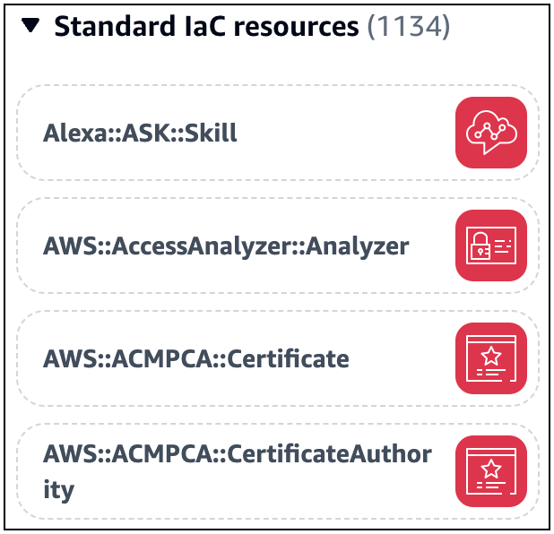
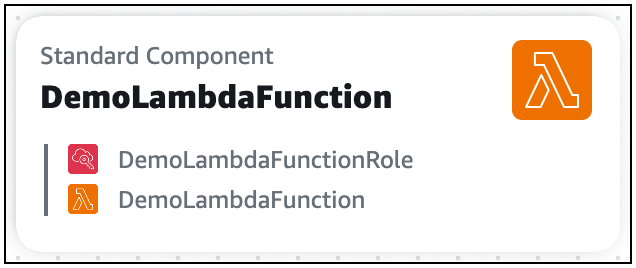
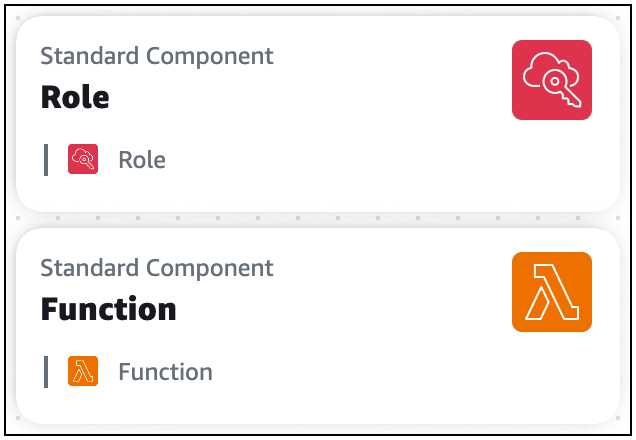
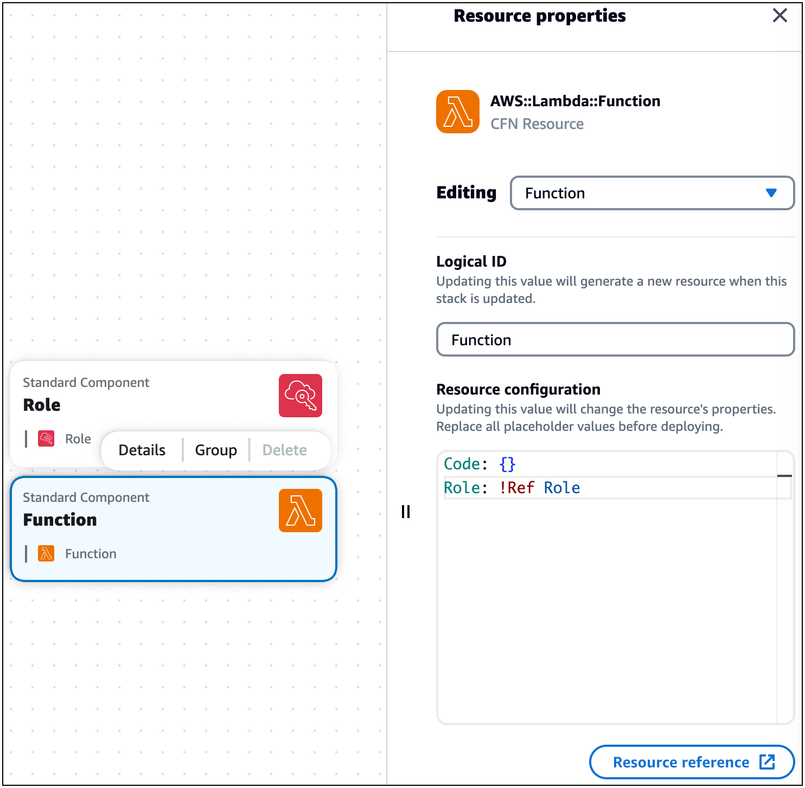
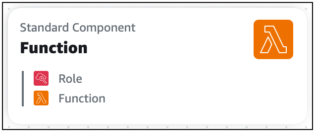

# Standard component cards in Infrastructure Composer

Before a standard component card is placed on Infrastructure Composer's visual canvas, it is listed as a **Standard (IaC) resource** card on the **Resources** palette in Infrastructure Composer.
A standard (IaC) resource card represents a single CloudFormation resource. Each standard IaC resource card, once placed on the visual canvas, becomes a card labeled **Standard component**,
and may be combined to represent multiple CloudFormation resources.

Each standard IaC resource card can be identified by its CloudFormation resource type. The following is an example of a standard IaC resource card that represents an
`AWS::ECS::Cluster` CloudFormation resource type:

Each standard component card visualizes the CloudFormation resources that it contains. The following is an example of a standard
component card that includes two standard IaC resources:

As you configure the properties of your standard component cards, Infrastructure Composer may combine related cards together. For example, here are two standard component cards:

In the **Resource properties** panel of the standard component card representing an `AWS::Lambda::Function` resource,
we reference the AWS Identity and Access Management (IAM) role by its logical ID:

After saving our template, the two standard component cards combine into a single standard component card.

