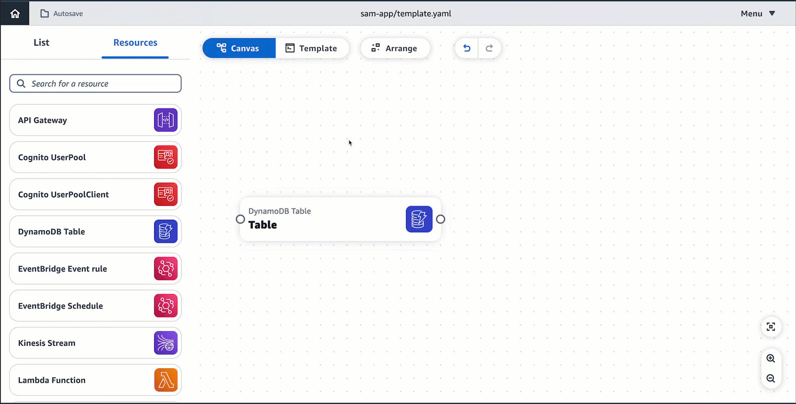

# Enhanced component cards in Infrastructure Composer

To configure enhanced component cards, Infrastructure Composer provides a form in the **Resource properties** panel. This form is curated uniquely to guide you through
configuring each enhanced component card. As you fill out the form, Infrastructure Composer modifies your infrastructure code.

Some enhanced component cards do have additional features. This section reviews the basics of using enhanced component cards and offers details on cards with additional features.

For more information on enhanced component cards, see [Enhanced component cards in Infrastructure Composer](using-composer-cards-component-intro-enhanced.md "using-composer-cards-component-intro-enhanced.md") and
[Enhanced component cards in Infrastructure Composer](using-composer-cards-component-intro-enhanced.md "using-composer-cards-component-intro-enhanced.md")

# Procedure

The **Resource properties** panel streamlines configuration and adds guiderails that simplifies card configuration. To use this panel, perform the following steps:

1. Double-click a card to bring up the **Resource properties** panel.
2. Click on a card and select **Details** to bring up
   the resource properties panel.
3. For Infrastructure Composer from the AWS Management Console, select **Template** to show your application code.
   Configure directly from here.

The following image shows how this can be done:

